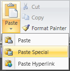
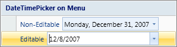

# Menu

The [Menu](xref:@ActiproUIRoot.Controls.Ribbon.Controls.Menu) is a control that presents its items similar to how a standard native popup menu would except with ribbon styling.



*A popup for a SplitButton that contains a Menu with three items on it*

## Menu Architecture

The ribbon [Menu](xref:@ActiproUIRoot.Controls.Ribbon.Controls.Menu) control is an `ItemsControl` that is intended to be used exclusively on popups for other controls.  It presents its items using alternate templates that look like menu items.

For instance, when a ribbon [Button](../interactive/button.md) is added to a `Menu`, the button draws and behaves just like a regular menu item in Office.

## Valid Child Controls

Almost all of the interactive controls can be used in a `Menu`.  These include:

- [Button](../interactive/button.md)
- [CheckBox](../interactive/checkbox.md) (renders like a `Button` when in a `Menu`)
- [ComboBox](../interactive/combobox.md)
- [FontFamilyComboBox](../interactive/fontfamilycombobox.md)
- [FontSizeComboBox](../interactive/fontsizecombobox.md)
- [PopupButton](../interactive/popupbutton.md)
- [RadioButton](../interactive/radiobutton.md) (renders like a `Button` when in a `Menu`)
- [Separator](../interactive/separator.md)
- [SplitButton](../interactive/splitbutton.md)
- [TextBox](../interactive/textbox.md)

The [PopupButton](../interactive/popupbutton.md) and [SplitButton](../interactive/splitbutton.md) controls can be used to provide "sub-menus" since they also have popups that can hold more `Menu` controls with items.

## Using Other Controls in Menus

Due to flexible design of `Menu`, any sort of small non-ribbon control can be added as a menu item to a `Menu` control.

The really neat feature of this is that you can even assign an image and label to any non-ribbon control.  This is accomplished by assigning attached properties from [RibbonControlService](xref:@ActiproUIRoot.Controls.Ribbon.UI.RibbonControlService).



*A Menu containing the DateTimePicker control, which is defined in the Shared Library*

The first property that needs to be assigned is [RibbonControlService](xref:@ActiproUIRoot.Controls.Ribbon.UI.RibbonControlService).[IsExternalContentSupportedProperty](xref:@ActiproUIRoot.Controls.Ribbon.UI.RibbonControlService.IsExternalContentSupportedProperty).  This property should be set to `true` so that the control being added aligns correctly with the text portion of the menu item.  If it is `false` (the default), the control will span the entire width of the `Menu` and will cover the image column.

Second, you may optionally assign the [RibbonControlService](xref:@ActiproUIRoot.Controls.Ribbon.UI.RibbonControlService).[LabelProperty](xref:@ActiproUIRoot.Controls.Ribbon.UI.RibbonControlService.LabelProperty) and [RibbonControlService](xref:@ActiproUIRoot.Controls.Ribbon.UI.RibbonControlService).[ImageSourceSmallProperty](xref:@ActiproUIRoot.Controls.Ribbon.UI.RibbonControlService.ImageSourceSmallProperty) properties.  If you don't assign them, the control will be aligned with the left size of the other menu item labels.  If you assign a label, the label will appear under other menu item labels and the control will appear immediately to the right of it.  If you assign an image, it will appear in the image column.

This code shows how to add a native WPF `TextBox` to a `Menu`:

```xaml
<TextBox MinWidth="100" ribbon:RibbonControlService.IsExternalContentSupported="True" 
	ribbon:RibbonControlService.Label="Native TextBox" />
```

## Child Control Minimum Widths

When certain controls like a [TextBox](../interactive/textbox.md) that can expand width based on content are added to a `Menu`, be sure to set their `MinWidth` property.  This ensures that a minimum width is applied to the control and that the control will expand if there are other longer controls around it.

This concept is not needed for controls like [Button](../interactive/button.md) since those controls automatically fill the width of the `Menu`.

## Adding Access Keys to Menu Items

When any sort of ribbon button ([Button](xref:@ActiproUIRoot.Controls.Ribbon.Controls.Button), [PopupButton](xref:@ActiproUIRoot.Controls.Ribbon.Controls.PopupButton), etc.) is used in a [Menu](xref:@ActiproUIRoot.Controls.Ribbon.Controls.Menu) as a menu item, an underline will appear under a character in the menu item's label if the control's [KeyTipAccessText](xref:@ActiproUIRoot.Controls.Ribbon.Controls.Primitives.ControlBase.KeyTipAccessText) property has been set to a single alpha/numeric character and that character appears within the control's label.  While the menu is displayed the access key can be typed to execute the default action on the control.

For instance, a `Paste`[Button](xref:@ActiproUIRoot.Controls.Ribbon.Controls.Button) that had a label of `Paste` and a `KeyTipAccessText` of `P` would have the `P` in `Paste` underlined.

## Controls with Popups that Can Use Menu

There are several built-in ribbon controls that have popups.  The `Menu` control is most often used as the popup content for the [PopupButton](../interactive/popupbutton.md), [SplitButton](../interactive/splitbutton.md), and [RibbonGallery](../interactive/ribbongallery.md) controls.

Since `Menu` is a regular control, more than one `Menu` can be used on the same popup.  By making the popup content a `Panel` and adding two `Menu` controls to the `Panel` (generally with a [Separator](../interactive/separator.md) in between), you could have a popup with two columns of menu items.
