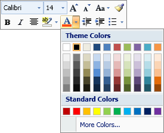
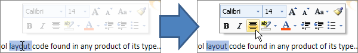
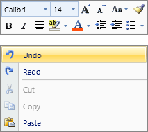

# Mini-ToolBar

The mini-toolbar is a great new concept introduced in Office 2007.  Any controls, including galleries, can be used on the mini-toolbar.



*A mini-toolbar showing the use of a color picker gallery child control*

Mini-toolbars are typically used in two scenarios:  following a mouse selection in a document and for display along with a context menu to provide additional options.

## Adding Controls to the Mini-ToolBar

The [MiniToolBar](xref:@ActiproUIRoot.Controls.Ribbon.Controls.MiniToolBar) control inherits `ItemsControl` and therefore adding controls to it is extremely easy, however we do have some layout tips.  Any control can be added to the mini-toolbar.

### Use a Grid as the ItemsPanel

The [MiniToolBar](xref:@ActiproUIRoot.Controls.Ribbon.Controls.MiniToolBar) will use a `WrapPanel` by default for the items panel however we typically using a more advanced `Grid` control instead.  This yields several benefits, which are apparent in the screenshot above.

First, multiple rows of items are supported by using a `Grid`.

Second, you can add a colum in the `Grid` using `*` layout so that it auto-fills to match the width of another longer row.  In the screenshot above, the first row's [FontFamilyComboBox](../interactive/fontfamilycombobox.md) has a `MinWidth` of `70` and it is in its own `*` layout column.  The items in the second row span two columns and have a length longer than the entire first row.  But since the `FontFamilyComboBox` is in a `*` layout column, it expands the `FontFamilyComboBox` to make up the space.  Therefore both rows end up being the same width and looking great.

Third, the use of a `Grid` lets you place a spacer row in between the two real rows of items.

### Use a ButtonGroup Within the Grid

When using a `Grid`, you can encapsulate a horizontal run of ribbon controls with a [ButtonGroup](../layout/buttongroup.md) to ensure the child controls receive the proper context and variant size.

### Sample Implementation for Screenshot Above

This code sample shows how the mini-toolbar in the screenshot above could be defined, but note that this code sample doesn't show any commands or popup child controls like the gallery.

```xaml
<ribbon:MiniToolBar>
	<ribbon:MiniToolBar.ItemsPanel>
		<ItemsPanelTemplate>
			<Grid>
				<Grid.RowDefinitions>
					<RowDefinition Height="Auto" />
					<RowDefinition Height="2" />
					<RowDefinition Height="Auto" />
				</Grid.RowDefinitions>
				<Grid.ColumnDefinitions>
					<ColumnDefinition Width="*" />
					<ColumnDefinition Width="Auto" />
				</Grid.ColumnDefinitions>
			</Grid>
		</ItemsPanelTemplate>
	</ribbon:MiniToolBar.ItemsPanel>
	
	<ribbon:FontFamilyComboBox MinWidth="70" />
	<ribbon:ButtonGroup Grid.Column="1">
		<ribbon:FontSizeComboBox Width="40" />
		<ribbon:Button ImageSourceSmall="/Resources/Images/GrowFont16.png" />
		<ribbon:Button ImageSourceSmall="/Resources/Images/ShrinkFont16.png" />
		<ribbon:PopupButton ImageSourceSmall="/Resources/Images/ChangeCase16.png" />
		<ribbon:Button ImageSourceSmall="/Resources/Images/FormatPainter16.png" />
	</ribbon:ButtonGroup>

	<ribbon:ButtonGroup Grid.Row="2" Grid.ColumnSpan="2">
		<ribbon:Button ImageSourceSmall="/Resources/Images/Bold16.png" />
		<ribbon:Button ImageSourceSmall="/Resources/Images/Italic16.png" />
		<ribbon:Button ImageSourceSmall="/Resources/Images/AlignTextCenter16.png" />
		<ribbon:SplitButton ImageSourceSmall="/Resources/Images/TextHighlightColor16.png" />
		<ribbon:SplitButton ImageSourceSmall="/Resources/Images/FontColor16.png" />
		<ribbon:Button ImageSourceSmall="/Resources/Images/DecreaseIndent16.png" />
		<ribbon:Button ImageSourceSmall="/Resources/Images/IncreaseIndent16.png" />
		<ribbon:SplitButton ImageSourceSmall="/Resources/Images/Bullets16.png" />
	</ribbon:ButtonGroup>
				
</ribbon:MiniToolBar>
```

## Showing a Mini-ToolBar After a Mouse Selection

When a selection is made in a document, a mini-toolbar can be made to semi-transparently appear above the mouse.  As the end user moves the mouse closer to the mini-toolbar, it becomes more opaque.  Moving the mouse farther away makes the mini-toolbar more transparent until a point where the mini-toolbar disappears completely.  After a certain threshold distance is passed, the mini-toolbar is closed completely and does not reappear until another selection is made.



*A mini-toolbar displayed after a selection showing how it changes from semi-transparent to opaque when the mouse moves over it*

To show a mini-toolbar after a mouse selection in a `RichTextBox` for example, simply attach to the `RichTextBox`'s `PreviewMouseUp` event.  In the handler, if there is a selection, call the [MiniToolBarService](xref:@ActiproUIRoot.Controls.Ribbon.UI.MiniToolBarService).[Show](xref:@ActiproUIRoot.Controls.Ribbon.UI.MiniToolBarService.Show*) method and pass it the [MiniToolBar](xref:@ActiproUIRoot.Controls.Ribbon.Controls.MiniToolBar) to display and the location at which to show it.  It's as easy as that.  Actipro Ribbon handles the rest for you.

## Configuring a Mini-ToolBar for Pairing With a Context Menu

A mini-toolbar can optionally be paired and displayed with any [ContextMenu](contextmenu.md).  Normally the mini-toolbar appears above the context menu.  If a menu item on the context menu is chosen, both the context menu and mini-toolbar close.  Alternatively, if the end user clicks a control on the mini-toolbar, the mini-toolbar remains open but the context menu closes.  After this point the mini-toolbar behaves as if it was opened standalone.



*A mini-toolbar displayed with a context menu*

This code sample shows how to define a simple mini-toolbar for a `RichTextBox`'s context menu:

```xaml
<RichTextBox>
	<RichTextBox.ContextMenu>
		<ribbon:ContextMenu>
			<ribbon:ContextMenu.MiniToolBar>
				<ribbon:MiniToolBar>
					<ribbon:Button ImageSourceSmall="/Resources/Images/Bold16.png" />
					<ribbon:Button ImageSourceSmall="/Resources/Images/Italic16.png" />
					<ribbon:Button ImageSourceSmall="/Resources/Images/Underline16.png" />
				</ribbon:MiniToolBar>						
			</ribbon:ContextMenu.MiniToolBar>
			<ribbon:Menu>
				<ribbon:Button Label="Undo" ImageSourceSmall="/Resources/Images/Undo16.png" />
				<ribbon:Button Label="Redo" ImageSourceSmall="/Resources/Images/Redo16.png" />
				<ribbon:Separator />
				<ribbon:Button Label="Cut" ImageSourceSmall="/Resources/Images/Cut16.png" />
				<ribbon:Button Label="Copy" ImageSourceSmall="/Resources/Images/Copy16.png" />
				<ribbon:Button Label="Paste" ImageSourceSmall="/Resources/Images/Paste16.png" />
			</ribbon:Menu>
		</ribbon:ContextMenu>
	</RichTextBox.ContextMenu>
</RichTextBox>
```

The [ContextMenu](contextmenu.md) control that comes with Actipro Ribbon has a [MiniToolBar](xref:@ActiproUIRoot.Controls.Ribbon.Controls.ContextMenu.MiniToolBar) property on it.  To associate a [MiniToolBar](xref:@ActiproUIRoot.Controls.Ribbon.Controls.MiniToolBar) with a context menu, simply set the mini-toolbar to that property.  After that, Actipro Ribbon handles the display and management of the mini-toolbar for you.  It will show up when the mouse is used to display the context menu and will have all the functionality described above.
