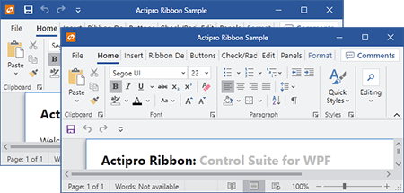

# QuickAccessToolBar (QAT)

The ribbon's quick access toolbar can be displayed either above the ribbon (in the window's title bar) or below the ribbon depending on the end user's preference.  It provides quick access to the most commonly used commands in your application.



*A ribbon quick access toolbar above and below the ribbon*

## Defining a Quick Access Toolbar Items

Quick access toolbar (QAT) items are defined in the [Ribbon](xref:@ActiproUIRoot.Controls.Ribbon.Ribbon).[QuickAccessToolBarItems](xref:@ActiproUIRoot.Controls.Ribbon.Ribbon.QuickAccessToolBarItems) collection.  The quick access toolbar items may be defined in XAML if you like.

This code sample shows how to define the quick access toolbar items for a ribbon.  Note that the buttons listed are tied to commands that express their user interface.

```xaml
<ribbon:Ribbon>
	<ribbon:Ribbon.QuickAccessToolBarItems>
		<ribbon:Button Command="ApplicationCommands.Save" />
		<ribbon:Button Command="ApplicationCommands.Undo" />
		<ribbon:Button Command="ApplicationCommands.Redo" />
	</ribbon:Ribbon.QuickAccessToolBarItems>
</ribbon:Ribbon>
```

## Quick Access Toolbar Location

The QAT can be located either above or below the ribbon. The [Ribbon](xref:@ActiproUIRoot.Controls.Ribbon.Ribbon).[QuickAccessToolBarLocation](xref:@ActiproUIRoot.Controls.Ribbon.Ribbon.QuickAccessToolBarLocation) property gets and sets the location of the QAT.  It takes an enueration of type [QuickAccessToolBarLocation](xref:@ActiproUIRoot.Controls.Ribbon.QuickAccessToolBarLocation).

The [Ribbon](xref:@ActiproUIRoot.Controls.Ribbon.Ribbon).[QuickAccessToolBarLocationChanged](xref:@ActiproUIRoot.Controls.Ribbon.Ribbon.QuickAccessToolBarLocationChanged) event fires when the location changes.

## Hiding the Quick Access Toolbar

The [QuickAccessToolBarLocation](xref:@ActiproUIRoot.Controls.Ribbon.QuickAccessToolBarLocation) property described above also has a `None` option that when used will hide the QAT completely.

## Hiding the QAT Customize Button

The [IsQuickAccessToolBarCustomizeButtonVisible](xref:@ActiproUIRoot.Controls.Ribbon.Ribbon.IsQuickAccessToolBarCustomizeButtonVisible) property can be set to `false` to hide the customize button that appears next to the QAT.

## Customizing the Customize Button's Menu

Ribbon supports dynamic customization of the `Customize` button's menu at run-time.

See the [Customizing Context Menu](../customizing-context-menus.md) topic for a section with information on how to do this.

The Customizing Context Menus QuickStart also shows a sample of this in action.

## Persisting End-User Run-Time Item Customizations

Ribbon includes a very flexible framework for supporting multiple forms of QAT customization.  If you allow this functionality, you generally will wish to persist the end user's customizations (addition/removal of controls to the QAT) so that they can be restored when your application is started again later.

The [Customizing the QAT](../customizing-the-qat.md) topic covers how to persist the state of the QAT to an XML string that can be restored later.
