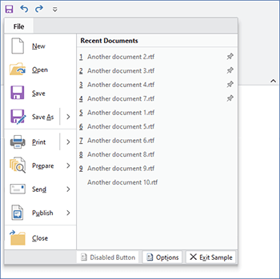

# RecentDocumentMenu

A [RecentDocumentMenu](xref:@ActiproUIRoot.Controls.Ribbon.Controls.RecentDocumentMenu) control is a control that is intended to be used within a [Backstage](applicationmenu.md), or an [ApplicationMenu](applicationmenu.md) as its additional content when recent document tracking is desired.

Recently-opened documents are listed in a sorted order and can be clicked on to open them.  Mouse hovering over a document provides its full path.

Clicking on a document's pin button will toggle the pinned state of the document.  When pinned, the document will not fall of the list if there are other unpinned documents that have been opened more recently.

*A ribbon application menu with a RecentDocumentMenu control on it*

## Adding the RecentDocumentMenu to a Backstage

The `RecentDocumentMenu` can be added to a [Backstage](applicationmenu.md) application menu in a couple places.

The first location is directly as an item of a [Backstage](applicationmenu.md) control.  In this case it is advisable to limit the number of items rendered (via the manager) to a small number such as `3` or `4` since a button will be rendered for each document in the left side of the Backstage, thus pushing down any other tabs or buttons after it.

When a `RecentDocumentMenu` is included in the content of a [BackstageTab](xref:@ActiproUIRoot.Controls.Ribbon.Controls.BackstageTab) it should have its `VariantSize` property set to `Large`.  This will enable it to render similar to Office, showing large icons and descriptions, all of which can be set on the [IDocumentReference](xref:@ActiproUIRoot.DocumentManagement.IDocumentReference) instances.

## Adding the RecentDocumentMenu to an ApplicationMenu

The `RecentDocumentMenu` can be added to a [ApplicationMenu](applicationmenu.md) via the [AdditionalContent](xref:@ActiproUIRoot.Controls.Ribbon.Controls.ApplicationMenu.AdditionalContent) property.

The [ApplicationMenu](applicationmenu.md) topic provides a sample of doing this.

### Changing the Header

By default, the header of the control will read `Recent Documents`.

To change that text globally, change that field before any UI is instantiated.  To change the header text for a specific control instance, set the [RecentDocumentMenu](xref:@ActiproUIRoot.Controls.Ribbon.Controls.RecentDocumentMenu).[Label](xref:@ActiproUIRoot.Controls.Ribbon.Controls.RecentDocumentMenu.Label) property.

## Managing the Recent Document List

The recent document list is managed by the [RecentDocumentManager](xref:@ActiproUIRoot.DocumentManagement.RecentDocumentManager) that is assigned to the [RecentDocumentMenu](xref:@ActiproUIRoot.Controls.Ribbon.Controls.RecentDocumentMenu).[Manager](xref:@ActiproUIRoot.Controls.Ribbon.Controls.RecentDocumentMenu.Manager) property.  This object maintains a list of [IDocumentReference](xref:@ActiproUIRoot.DocumentManagement.IDocumentReference) objects.

See the [Document Management](../../../shared/windows-document-management.md) topic for details on how to manage the list using the [RecentDocumentManager](xref:@ActiproUIRoot.DocumentManagement.RecentDocumentManager), including the ability to limit the number of documents shown.

Since the `RecentDocumentMenu` is bound to the [RecentDocumentManager](xref:@ActiproUIRoot.DocumentManagement.RecentDocumentManager) to which it is assigned, changes to that manager will automatically update the menu.  However certain changes such as updating a document reference's last-opened date/time may not be picked up by the manager as a change.  In these cases you must call [RecentDocumentManager](xref:@ActiproUIRoot.DocumentManagement.RecentDocumentManager).[RebindFilteredDocuments](xref:@ActiproUIRoot.DocumentManagement.RecentDocumentManager.RebindFilteredDocuments*) explicitly.  This in turn updates the menu automatically.

## Processing Clicks on Documents

When the end user clicks on a document listed in the `RecentDocumentMenu`, they are attempting to open the document.  Therefore, we raise the standard WPF `ApplicationCommands.Open` command with its command parameter being the [IDocumentReference](xref:@ActiproUIRoot.DocumentManagement.IDocumentReference) that represents the document.

In your code, handle the `ApplicationCommands.Open` command and use the command parameter (a [IDocumentReference](xref:@ActiproUIRoot.DocumentManagement.IDocumentReference)) to determine which `Uri` to open.  If no command parameter is passed, then you can assume the command was triggered by a menu item like on the application menu's generic `Open` menu item.  In this case, you would want to show an `Open File` dialog.
