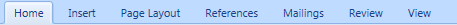

# Tab

The [Tab](xref:@ActiproUIRoot.Controls.Ribbon.Controls.Tab) is a control that represents one of the tabs at the top of the ribbon.

It contains multiple [Group](group.md) controls, each of which contains multiple child controls.



*Several ribbon tabs*

## Tab Types

There are two types of tabs: normal and contextual.

Normal tabs all draw in the same colors and are added to the ribbon via the [Ribbon](xref:@ActiproUIRoot.Controls.Ribbon.Ribbon).[Tabs](xref:@ActiproUIRoot.Controls.Ribbon.Ribbon.Tabs) collection.

Contextual tabs are tabs that contain controls that only should be displayed in certain contexts.  For instance, perhaps when an image selection is made in a document.  Contextual tabs may be grouped together with related contextual tabs in a [ContextualTabGroup](contextualtabgroup.md) and are displayed when that group becomes active.  Unlike regular tabs, contextual tabs are not added to the [Ribbon](xref:@ActiproUIRoot.Controls.Ribbon.Ribbon).[Tabs](xref:@ActiproUIRoot.Controls.Ribbon.Ribbon.Tabs) collection.  Instead, they are added to a parent [ContextualTabGroup](contextualtabgroup.md).  See the [ContextualTabGroup](contextualtabgroup.md) topic for detailed information on how to define and activate contextual tab groups.

## Adding/Removing Groups

[Group](group.md) controls for a `Tab` can be added to or removed from the [Tab](xref:@ActiproUIRoot.Controls.Ribbon.Controls.Tab).[Items](xref:@ActiproUIRoot.Controls.Ribbon.Controls.Tab.Items) collection.

This collection is the markup content property for the `Tab` control too, so [Group](group.md) controls can be added to a `Tab` as direct child elements in XAML.

## Programmatically Selecting a Tab

Only one tab can be selected at any time within a ribbon.

The [Ribbon](xref:@ActiproUIRoot.Controls.Ribbon.Ribbon).[SelectedTab](xref:@ActiproUIRoot.Controls.Ribbon.Ribbon.SelectedTab) property allows you to get or set the [Tab](xref:@ActiproUIRoot.Controls.Ribbon.Controls.Tab) that is currently selected in the ribbon.

## Tab Selection Events

The [Ribbon](xref:@ActiproUIRoot.Controls.Ribbon.Ribbon) control exposes two events related to the selection of a tab.  The [SelectedTabChanging](xref:@ActiproUIRoot.Controls.Ribbon.Ribbon.SelectedTabChanging) event fires before a tab change occurs and the [SelectedTabChanged](xref:@ActiproUIRoot.Controls.Ribbon.Ribbon.SelectedTabChanged) event fires after a tab change occurs.

The event arguments for the changing event allow for the tab change to be cancelled by setting `e.Cancel` to `true`.

## Selecting a Tab with the Keyboard

If you have defined a [KeyTipAccessText](xref:@ActiproUIRoot.Controls.Ribbon.Controls.Primitives.ControlBase.KeyTipAccessText) on a `Tab`, that tab can quickly be accessed by holding <kbd>Alt</kbd> and typing the `KeyTipAccessText` letter.

For instance, if you assigned a `KeyTipAccessText` of `H` to your **Home** tab, pressing <kbd>Alt</kbd>+<kbd>H</kbd> will jump to that tab and start key tip mode for the controls within that tab.

## Disabling Tabs

Tabs can be disabled by setting their [Tab](xref:@ActiproUIRoot.Controls.Ribbon.Controls.Tab).`IsEnabled` property to `false`.  While disabled, they cannot be clicked or selected by the end user.  Their text will be drawn in a disabled color as well.

## Sample XAML

This code sample shows how to easily define `Group` controls within a `Tab` in XAML.

```xaml
<ribbon:Tab Label="Home" KeyTipAccessText="H">
	<ribbon:Group ImageSourceSmall="/Resources/Images/Paste16.png" Label="Clipboard" KeyTipAccessText="ZC" />
	<ribbon:Group ImageSourceSmall="/Resources/Images/FontColor16.png" Label="Font" KeyTipAccessText="ZF" />
	<ribbon:Group ImageSourceSmall="/Resources/Images/ParagraphCenter16.png" Label="Paragraph" KeyTipAccessText="ZP" />
	<ribbon:Group ImageSourceSmall="/Resources/Images/StylesGroup16.png" Label="Styles" KeyTipAccessText="ZS" />
	<ribbon:Group ImageSourceSmall="/Resources/Images/Find16.png" Label="Editing" KeyTipAccessText="ZN" />
</ribbon:Tab>
```
