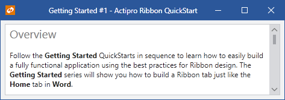

# RibbonWindow

Actipro Ribbon includes a [RibbonWindow](xref:@ActiproUIRoot.Controls.Ribbon.RibbonWindow) class, which is an implementation of the `Window` class that provides a custom window user interface much like that found in Office.

It is always recommended that a [Ribbon](xref:@ActiproUIRoot.Controls.Ribbon.Ribbon) control implementation be hosted within a [RibbonWindow](xref:@ActiproUIRoot.Controls.Ribbon.RibbonWindow).  While a [RibbonWindow](xref:@ActiproUIRoot.Controls.Ribbon.RibbonWindow) can be used without a [Ribbon](xref:@ActiproUIRoot.Controls.Ribbon.Ribbon) control at all, it's best to use [WindowChrome](../../themes/windowchrome.md) directly on normal `Window` objects instead of having your window inherit [RibbonWindow](xref:@ActiproUIRoot.Controls.Ribbon.RibbonWindow) if you don't plan on having a [Ribbon](xref:@ActiproUIRoot.Controls.Ribbon.Ribbon) in the window.



*A simple RibbonWindow*

Note that in the screenshot above, a simple `RichTextBox` is hosted within a [RibbonWindow](xref:@ActiproUIRoot.Controls.Ribbon.RibbonWindow) and there is no [Ribbon](xref:@ActiproUIRoot.Controls.Ribbon.Ribbon) being used.

## Setting the RibbonWindow Title

The title in the [RibbonWindow](xref:@ActiproUIRoot.Controls.Ribbon.RibbonWindow) is drawn in two parts, the application name and the document name.  Each is drawn using a separate color, which provides some distinction between the two.

The [ApplicationName](xref:@ActiproUIRoot.Controls.Ribbon.RibbonWindow.ApplicationName) property should be set to the name of the application.

The [DocumentName](xref:@ActiproUIRoot.Controls.Ribbon.RibbonWindow.DocumentName) property should be set to the name of the currently open document.  If there is no document open, leave this property `null`.

When both properties are specified, a hyphen will be inserted between the two.

## Full-Screen Mode (IsTitleBarVisible)

Say you have an application like PowerPoint where there normally is a [Ribbon](xref:@ActiproUIRoot.Controls.Ribbon.Ribbon) at the top of it however during a slide preview mode, you want to maximize the window, hide the ribbon, and show the content area in full-screen mode.

Normally, setting the `Window.WindowStyle` property to `None` would hide a title bar and allow full-screen mode.  However, [RibbonWindow](xref:@ActiproUIRoot.Controls.Ribbon.RibbonWindow) is often forced to be in `None` style to achieve its custom UI.  Therefore, setting this property doesn't hide the title bar area like it would in a normal `Window`.

To achieve a full-screen mode, set the [RibbonWindow](xref:@ActiproUIRoot.Controls.Ribbon.RibbonWindow).[IsTitleBarVisible](xref:@ActiproUIRoot.Controls.Ribbon.RibbonWindow.IsTitleBarVisible) property to `false`.  This should only be done when the window is maximized and any child [Ribbon](xref:@ActiproUIRoot.Controls.Ribbon.Ribbon) is collapsed (hidden).

## Maximize/Minimize Button Visibility

The visibility of the `RibbonWindow`'s maximize and minimize buttons can be customized using the [IsMaximizeButtonVisible](xref:@ActiproUIRoot.Controls.Ribbon.RibbonWindow.IsMaximizeButtonVisible) and [IsMinimizeButtonVisible](xref:@ActiproUIRoot.Controls.Ribbon.RibbonWindow.IsMinimizeButtonVisible) properties, respectively.

## Focus Moves on Window Deactivation

By default, if a control in the ribbon has focus when the window is deactivated, focus will be moved out of the ribbon and back into the main content area of the window.  The [IsKeyboardFocusBlurredOnWindowDeactivation](xref:@ActiproUIRoot.Controls.Ribbon.Ribbon.IsKeyboardFocusBlurredOnWindowDeactivation) property can be set to `false` to prevent this default behavior.

## WindowChrome Usage

Each `RibbonWindow` already has a pre-installed [WindowChrome](../../themes/windowchrome.md) instance that is configured to support the QAT and other Ribbon features.  The `WindowChrome` is what allows the `RibbonWindow` to have a customized user interface compared to a normal window.

> [!IMPORTANT]
> Do not re-assign the `WindowChrome` pre-installed for a `RibbonWindow` or it will break Ribbon features.  You can get the `WindowChrome` instance for a `RibbonWindow` programmatically and alter its properties as needed via a call to [WindowChrome](xref:@ActiproUIRoot.Themes.WindowChrome).[GetChrome](xref:@ActiproUIRoot.Themes.WindowChrome.GetChrome*) after component initialization is complete.

### Injecting Additional Content in the Title Bar

Since the `WindowChrome` is pre-installed by `RibbonWindow` and cannot be re-assigned, injecting additional content in the title bar requires a slightly different approach compared to that described by the [WindowChrome](../../themes/windowchrome.md) topic.

Properties like [TitleBarRightContentTemplate](xref:@ActiproUIRoot.Themes.WindowChrome.TitleBarRightContentTemplate) can be defined as resources instead of assigned directly to a `WindowChrome` instance. The following XAML demonstrates a custom `DataTemplate` defined as a resource to a `RibbonWindow`:

```xaml
<ribbon:RibbonWindow.Resources>
    <DataTemplate x:Key="TitleBarRightContent">
        <TextBlock>This is the right content</TextBlock>
    </DataTemplate>
</ribbon:RibbonWindow.Resources>
```

This template can then be applied to the `WindowChrome` of the `RibbonWindow` in the code-behind file as shown in the following sample:

```csharp
public MainWindow() {
    ' Allow component initialization to complete first
    InitializeComponent();

    ' Attempt to locate the DataTemplate defined as a resource (make sure the key matches the resource)
    var template = TryFindResource("TitleBarRightContent") as DataTemplate;
    if (template != null) {
        ' Get the WindowChrome pre-installed by this RibbonWindow
        var chrome = WindowChrome.GetChrome(this);
        ' Assign the template
        chrome.TitleBarRightContentTemplate = template;
    }
}
```
