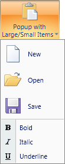

# Working with Popups

Several built-in ribbon controls have popups.  Popups in Actipro Ribbon aren't restricted to having just menu items in them.  While most of the time you will only place menu items in them, you have the option of displaying any sort of content within a popup.



*A popup with two Menu controls in a StackPanel, one with large items and one with small items*

All the popup-related properties illustrated below are implementations of attached properties from [PopupControlService](xref:ActiproSoftware.Windows.Controls.Ribbon.UI.PopupControlService).

## Built-In Controls with Popups

These controls and any controls derived from them have popups:

- [PopupButton](interactive/popupbutton.md)
- [RibbonGallery](interactive/ribbongallery.md)
- [SplitButton](interactive/splitbutton.md)

## Defining Popup Content

The built-in controls have several properties that are used for defining content.

| Member | Description |
|-----|-----|
| [PopupContent](xref:ActiproSoftware.Windows.Controls.Ribbon.Controls.Primitives.PopupButtonBase.PopupContent) Property | Gets or sets the content that is displayed on the popup for the button.  This can be any object, including panels of multiple controls, however it is generally a [Menu](miscellaneous/menu.md). |
| [PopupContentTemplate](xref:ActiproSoftware.Windows.Controls.Ribbon.Controls.Primitives.PopupButtonBase.PopupContentTemplate) Property | Gets or sets the `DataTemplate` to use for the [PopupContent](xref:ActiproSoftware.Windows.Controls.Ribbon.Controls.Primitives.PopupButtonBase.PopupContent).  This property is only really useful if your popup content is a data object and not a UI element. |
| [PopupContentTemplateSelector](xref:ActiproSoftware.Windows.Controls.Ribbon.Controls.Primitives.PopupButtonBase.PopupContentTemplateSelector) Property | Gets or sets the `DataTemplateSelector` to use for the [PopupContent](xref:ActiproSoftware.Windows.Controls.Ribbon.Controls.Primitives.PopupButtonBase.PopupContent).  This property is only really useful if your popup content is a data object and not a UI element. |

## Hiding the Popup Border

By default the popup will display a border around its contents.  However sometimes it is necessary to hide the default border.  This sort of option is used for the [ApplicationMenu](miscellaneous/applicationmenu.md) since it has a custom draw border.

Set the [PopupHasBorder](xref:ActiproSoftware.Windows.Controls.Ribbon.Controls.Primitives.PopupButtonBase.PopupHasBorder) property to `false` to hide the border.

## Popup Content Layout Options

The most common content for a popup is a [Menu](miscellaneous/menu.md) control, which renders its items as menu items:

```xaml
<ribbon:PopupButton ImageSourceLarge="/Resources/Images/Paste32.png" ImageSourceSmall="/Resources/Images/Paste16.png" Label="Paste" KeyTipAccessText="V">
	<ribbon:Menu>
		<ribbon:Button ImageSourceSmall="/Resources/Images/Paste16.png" Label="Paste" KeyTipAccessText="P" />
		<ribbon:Button ImageSourceSmall="/Resources/Images/PasteSpecial16.png" Label="Paste Special" KeyTipAccessText="S" />
		<ribbon:Button ImageSourceSmall="/Resources/Images/PasteHyperlink16.png" Label="Paste Hyperlink" KeyTipAccessText="H" />
	</ribbon:Menu>
</ribbon:PopupButton>
```

However there are probably times when you wish to create more complex layouts of controls on a popup.  In these scenarios, use a `Panel` as the [PopupContent](xref:ActiproSoftware.Windows.Controls.Ribbon.Controls.Primitives.PopupButtonBase.PopupContent).

For instance, use a native WPF `StackPanel` to stack a popup header banner image or a [PopupGallery](interactive/popupgallery.md) on top of a [Menu](miscellaneous/menu.md) of items.  This sort of layout is very often used in popups that contain a [PopupGallery](interactive/popupgallery.md) because you can place menu items above and below the [PopupGallery](interactive/popupgallery.md) as needed.

Or use a native WPF `StackPanel` with horizontal orientation to create a popup with two [Menu](miscellaneous/menu.md) controls, one on the left of the other with a [Separator](interactive/separator.md) in between (two columns of menu items).

By using techniques like this (also illustrated throughout the sample project), you can create complex layouts of popup content.

## Popup Location

The built-in controls have several properties that can be used to determine where the popup will be displayed in relation to the parent anchor control.  These properties correspond in functionality with the similar properties (without Popup in the name) found on the native WPF `Popup` class.

| Member | Description |
|-----|-----|
| [CustomPopupPlacementCallback](xref:ActiproSoftware.Windows.Controls.Ribbon.Controls.Primitives.PopupButtonBase.CustomPopupPlacementCallback) Property | Gets or sets a delegate handler method that positions the popup control. |
| [PopupHorizontalOffset](xref:ActiproSoftware.Windows.Controls.Ribbon.Controls.Primitives.PopupButtonBase.PopupHorizontalOffset) Property | Gets or sets the offset from the left of the area that is specified for the popup control content by a combination of the `PopupPlacement`, `PopupPlacementTarget`, and `PopupPlacementRectangle` properties. |
| [PopupPlacementRectangle](xref:ActiproSoftware.Windows.Controls.Ribbon.Controls.Primitives.PopupButtonBase.PopupPlacementRectangle) Property | Gets or sets the orientation of the popup when the it opens, and specifies the behavior of the popup when it overlaps screen boundaries. |
| [PopupPlacementRectangle](xref:ActiproSoftware.Windows.Controls.Ribbon.Controls.Primitives.PopupButtonBase.PopupPlacementRectangle) Property | Gets or sets the rectangle relative to which the popup control is positioned when it opens. |
| [PopupPlacementTarget](xref:ActiproSoftware.Windows.Controls.Ribbon.Controls.Primitives.PopupButtonBase.PopupPlacementTarget) Property | Gets or sets the element relative to which the popup is positioned when it opens. |
| [PopupVerticalOffset](xref:ActiproSoftware.Windows.Controls.Ribbon.Controls.Primitives.PopupButtonBase.PopupVerticalOffset) Property | Gets or sets the offset from the top of the area that is specified for the popup control content by a combination of the `PopupPlacement`, `PopupPlacementTarget`, and `PopupPlacementRectangle` properties. |

## Making Popups Resizable

### With a Contained PopupGallery

The popup has a special gripper that can be used by assigning a value to the [PopupResizeMode](xref:ActiproSoftware.Windows.Controls.Ribbon.Controls.Primitives.PopupButtonBase.PopupResizeMode) property.  However the gripper is only intended to work if there is a [PopupGallery](interactive/popupgallery.md) control contained somewhere in the popup content since there is special resizing logic needed to handle that scenario.

### Without a Contained PopupGallery

There may be other scenarios where your popup content doesn't include a [PopupGallery](interactive/popupgallery.md) control but you still want the popup to be resizable.  In this case, leave the [PopupResizeMode](xref:ActiproSoftware.Windows.Controls.Ribbon.Controls.Primitives.PopupButtonBase.PopupResizeMode) property its default value of `None` and wrap your popup content with a [ResizableContentControl](xref:ActiproSoftware.Windows.Controls.ResizableContentControl) (located in the Shared Library).  This will add a gripper to the content allowing for resizing of the popup.

This is very useful if you want to have a control like a native WPF `TextBox` be resizable in a [SplitButton](xref:ActiproSoftware.Windows.Controls.Ribbon.Controls.SplitButton)'s popup.

Here is some XAML code showing a sample implementation:

```xaml
<ribbon:SplitButton ImageSourceLarge="/Resources/Images/Paste32.png" Label="Popup with Resizable Content">
	<shared:ResizableContentControl MinWidth="250" MinHeight="50" MaxWidth="600" MaxHeight="400">
		<TextBox Text="This popup can be resized." AcceptsReturn="True" 
			BorderThickness="0" HorizontalScrollBarVisibility="Visible" VerticalScrollBarVisibility="Visible" />
	</shared:ResizableContentControl>
</ribbon:SplitButton>
```

## Dynamically Generating Popup Content

Actipro Ribbon makes it easy to dynamically create/change a popup's content before the popup is displayed.  This feature is most commonly used to customize menu items for a popup that contains a menu.

All the ribbon controls that display popups raise a [PopupOpening](xref:ActiproSoftware.Windows.Controls.Ribbon.Controls.Primitives.PopupButtonBase.PopupOpening) event that fires right before a popup is displayed.  You can attach to this event and in that handler, alter the popup content however you require.

Here is some code showing how to dynamically create a [Menu](miscellaneous/menu.md) for a popup before it is displayed.

```csharp
private void OnPopupButtonPopupOpening(object sender, RoutedEventArgs e) {
	RibbonControls.PopupButton popupOwner = (RibbonControls.PopupButton)sender;
						
	// Create a menu with some items
	RibbonControls.Menu menu = new RibbonControls.Menu();
	for (int index = 0; index < 3; index++) {
		RibbonControls.Button button = new RibbonControls.Button();
		button.Label = String.Format("Dynamically created menu item #{0}, created at {1}", index + 1, DateTime.Now);
		menu.Items.Add(button);	
	}
	popupOwner.PopupContent = menu;
}
```

See the Dynamic Popup Content QuickStart for a live sample of dynamically generating popup content.
