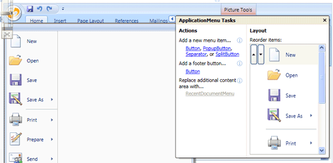
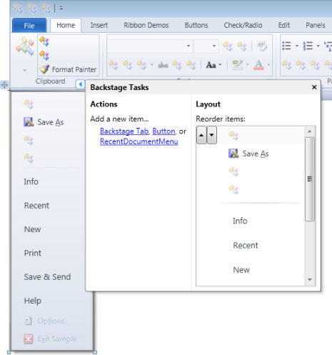

# Designer Interaction

Ribbon has designer support for Visual Studio when using the .NET Framework version of the assemblies This enhanced functionality makes it much easier to quickly create your ribbon user interfaces and adjust the layout of ribbon controls.

*The Visual Studio designer with a SplitButton selected, using the image picker on the SplitButton's task pane*

## Property Categorization / Descriptions

All public properties on classes used in this product are categorized for use in the Visual Studio Properties window.

## Task Pane Introduction

Whenever you select a [Ribbon](xref:ActiproSoftware.Windows.Controls.Ribbon.Ribbon) or one of several types of ribbon controls in the designer, a task pane adorner may appear in the upper right area of the control.

*The task pane adorner in the Visual Studio designer*

When you click this adorner, a task pane for the control appears, giving you access to many configuration features.

These control types currently have task panes available when they are selected in the Visual Studio designer:

- [Ribbon](xref:ActiproSoftware.Windows.Controls.Ribbon.Ribbon)
- [ApplicationMenu](xref:ActiproSoftware.Windows.Controls.Ribbon.Controls.ApplicationMenu)
- [Button](xref:ActiproSoftware.Windows.Controls.Ribbon.Controls.Button)
- [ButtonGroup](xref:ActiproSoftware.Windows.Controls.Ribbon.Controls.ButtonGroup)
- [CheckBox](xref:ActiproSoftware.Windows.Controls.Ribbon.Controls.CheckBox)
- [ComboBox](xref:ActiproSoftware.Windows.Controls.Ribbon.Controls.ComboBox)
- [ContextualTabGroup](xref:ActiproSoftware.Windows.Controls.Ribbon.Controls.ContextualTabGroup)
- [Group](xref:ActiproSoftware.Windows.Controls.Ribbon.Controls.Group)
- [Menu](xref:ActiproSoftware.Windows.Controls.Ribbon.Controls.Menu)
- [PopupButton](xref:ActiproSoftware.Windows.Controls.Ribbon.Controls.PopupButton)
- [RadioButton](xref:ActiproSoftware.Windows.Controls.Ribbon.Controls.RadioButton)
- [RibbonGallery](xref:ActiproSoftware.Windows.Controls.Ribbon.Controls.RibbonGallery)
- [RowPanel](xref:ActiproSoftware.Windows.Controls.Ribbon.Controls.RowPanel)
- [SplitButton](xref:ActiproSoftware.Windows.Controls.Ribbon.Controls.SplitButton)
- [StackPanel](xref:ActiproSoftware.Windows.Controls.Ribbon.Controls.StackPanel)
- [Tab](xref:ActiproSoftware.Windows.Controls.Ribbon.Controls.Tab)
- [TextBox](xref:ActiproSoftware.Windows.Controls.Ribbon.Controls.TextBox)

Nearly all of the task panes have links for quickly adding new child controls to the selected control.  Ribbon is very intelligent and adds additional controls as appropriate to increase your productivity.  For instance, when adding a contextual tab group, a tab will also be added to that contextual tab group with a single group already in the tab, ready for design.  This saves on several clicks for tasks you would have performed anyhow.

One of the nicest features of the task panes are the listboxes that allow you to reorder items.  Where appropriate, these listboxes render a visual of the actual items as opposed to giving them text descriptions only.

Almost all of the task panes have little "i" characters with a circle around them (see the screenshot below within the red circle).  If you hover over these information icons with your mouse, helpful tooltips appear that explain more about the controls next to them.

*The mouse hovering and showing the info tooltip for the Tab's Label property*

## Using Image Pickers

Many controls support entry of `ImageSource` objects (like for button images), which is typically done via a relative `Uri` to a project resource.  With Actipro's innovative task pane design, we've made it extremely simple to select images.  Clicking an image picker button shows a popup containing a list of open projects and root folders within those projects.  You can click down folders to navigate further into the folder tree.  The list of links at the top of the popup show you where you currently are in the project hierarchy and also allow you to navigate back up to a specific project/folder level.

*An image picker for the SplitButton's small image source property*

When a selected folder in a project contains images, they will be displayed along with their name and size.  Hover over items to see their full relative `Uri` path and full-size preview.  Click on an image to select it and insert its relative `Uri` path into the related image source TextBox on the task pane.  Selecting images has never been easier!

## Ribbon Task Pane

The Ribbon task pane provides quick access for adding new child controls to the [Tabs](xref:ActiproSoftware.Windows.Controls.Ribbon.Ribbon.Tabs), [ContextualTabGroups](xref:ActiproSoftware.Windows.Controls.Ribbon.Ribbon.ContextualTabGroups), [TabPanelItems](xref:ActiproSoftware.Windows.Controls.Ribbon.Ribbon.TabPanelItems), and [QuickAccessToolBarItems](xref:ActiproSoftware.Windows.Controls.Ribbon.Ribbon.QuickAccessToolBarItems) collections.  It also allows for the reordering of items in all those collections, along with the configuration of several common options.

*The task pane for the Ribbon control in the Visual Studio designer*

Click a tab in the tabs list to select it in the ribbon and make its contents visible.  Alternatively, click on a tab in the designer itself to select it.

In addition, the [Ribbon](xref:ActiproSoftware.Windows.Controls.Ribbon.Ribbon).[ApplicationMenu](xref:ActiproSoftware.Windows.Controls.Ribbon.Ribbon.ApplicationMenu) property can be quickly set to a new instance of [Backstage](xref:ActiproSoftware.Windows.Controls.Ribbon.Controls.Backstage) (Office 2010) or [ApplicationMenu](xref:ActiproSoftware.Windows.Controls.Ribbon.Controls.ApplicationMenu) (Office 2007).

## Button, CheckBox, ComboBox, PopupButton, RadioButton, SplitButton, and TextBox Task Panes

The task pane used for Button, CheckBox, ComboBox, PopupButton, RadioButton, SplitButton, and TextBox controls makes it simple to quickly configure everything from labels and images to key tips and screen tips for a control.

*The task pane for the SplitButton control in the Visual Studio designer*

Button-based controls have a couple more items on their task panes than TextBox and ComboBox task panes do, such as menu item description and checked state.

> [!NOTE]
> To display the popup for a PopupButton or SplitButton, first select it in the designer and then click it again.

## ComboBox and TextBox Task Panes

The task pane used for Button, CheckBox, PopupButton, RadioButton, and SplitButton controls makes it simple to quickly configure everything from labels and images to key tips and screen tips for a control.

*The task pane for the SplitButton control in the Visual Studio designer*

> [!NOTE]
> To display the popup for a PopupButton or SplitButton, first select it in the designer and then click it again.

## ApplicationMenu Task Pane

The ApplicationMenu task pane provides quick access for adding new child controls and reordering those items.

*The task pane for the ApplicationMenu control in the Visual Studio designer*

> [!NOTE]
> To display the application menu in the designer, first select the ribbon and then click on the application button/tab.

## Backstage Task Pane

The Backstage task pane provides quick access for adding new child controls and tabs, and reordering those items.

*The task pane for the Backstage control in the Visual Studio designer*

> [!NOTE]
> To display the backstage in the designer, first select the ribbon and then click on the application button/tab.

## BackstageTab Task Pane

The BackstageTab task pane allows the header and key tip to be quickly set.

*The task pane for the BackstageTab control in the Visual Studio designer*

> [!NOTE]
> The BackstageTab Header property can be set to any content, but the task pane only supports setting it to a string value.

## ButtonGroup Task Pane

The ButtonGroup task pane provides quick access for adding new child controls, reordering those items, and controlling whether the border is visible for the group.

*The task pane for the ButtonGroup control in the Visual Studio designer*

## ContextualTabGroup Task Pane

The ContextualTabGroup task pane provides quick access for adding new child tabs, reordering those tabs, and controlling whether the contextual tab group is active.

*The task pane for the ContextualTabGroup control in the Visual Studio designer*

It also supports entry of the label for the tab group and selection of the base color used to render the tab group and its content.

## Group Task Pane

The Group task pane provides quick access for adding new child controls, reordering those items, and controlling whether the group is collapsible.

*The task pane for the Group control in the Visual Studio designer*

It also supports entry of the group's label, key tips, and small image (displayed when collapsed).

## Menu Task Pane

The Menu task pane provides quick access for adding new child controls and reordering those items.

*The task pane for the Menu control in the Visual Studio designer*

## RibbonGallery Task Pane

The RibbonGallery task pane provides quick access for modifying the control's most common properties.

*The task pane for the RibbonGallery control in the Visual Studio designer*

## RowPanel Task Pane

The RowPanel task pane provides quick access for adding new child controls, reordering those items in both the two- and three-row variants of the panel, and determining when the switch to a three-row variant occurs.

*The task pane for the RowPanel control in the Visual Studio designer*

## StackPanel Task Pane

The StackPanel task pane provides quick access for adding new child controls, reordering those items, and setting the item variant behavior and row alignment for the panel.

*The task pane for the StackPanel control in the Visual Studio designer*

The bottom of the task pane can expand out to show you a preview of how typical controls collapse based on parent group variant sizes.  This is extremely valuable to display while you are choosing layout options.

## Tab Task Pane

The Tab task pane provides quick access for adding new child groups and reordering those groups.  You can also configure the tab's label and key tip.

*The task pane for the Tab control in the Visual Studio designer*

The Group Variants expander section on the task pane gives you advanced control over the order in which Groups transition to other variant sizes as available Ribbon width decreases.

When the Ribbon's ideal width can be achieved, each Group starts in a Large variant.  As available width decreases, Group variant sizes will change in the order from those at the top of the list first, down towards the bottom of the list, until all Groups fit within the available space.

As an example, say this ribbon is at full ideal width.  Then the available width decreases.  Based on the screenshot above, the Clipboard Group will first transition to a Small variant.  If that doesn't make the ribbon small enough to fit in the available width, the Styles Group will then transition to a Medium variant, and so on.

Creating variants is easy by using this task pane.  To add a new Group variant, at the bottom fo the task pane, select the Group (label is displayed in a ComboBox) and the variant size to transition to.  Then click the Add button.  The variant will be added to the list.

You can remove specific variants by selecting them and clicking Remove.  You can clear the entire list by clicking Clear.

Please note that changes are NOT applied until you actually click Apply.  This will write out the Group variant data for all the groups in the Tab.  If you make a mistake before clicking Apply, use the Reset button to reset the list back to what is currently in the XAML.

If you choose not to define specific Group variants, the make sure you leave the list completely blank (press Clear, then Apply).  This will allow Ribbon to automatically generate variants for you.  But keep in mind that the best end user experience can be created by you explicitly defining variants so lesser-used Groups collapse first.

## Changing the Selected Tab

The [Ribbon](xref:ActiproSoftware.Windows.Controls.Ribbon.Ribbon).[SelectedTab](xref:ActiproSoftware.Windows.Controls.Ribbon.Ribbon.SelectedTab) property in the Properties window has a special drop-down list that allows for selection of a tab within the Ribbon.  This allows you to jump directly to a specific tab clicking on it in the list.

But actually the easier way to change the currently selected tab is to simply click on another tab in the designer.  The tab you click on will become selected both in the ribbon and in the designer.

## Configuring Group Variants

The Tab's task pane (see details above) has all the functionality needed to allow you to easily configure the order in which Groups transition to various variant sizes based on decreases in available Ribbon width.

Actipro Ribbon has one of the most sophisticated Ribbon layout engines available today, and by using the Tab task pane to set up Group variants, you can utilize its capabilities to the fullest and fully control your Ribbon's layout.

If you choose not to configure Group variants, that's ok too but make sure you don't have any Group variants defined within the Tab.  When no Group variants are explicitly defined, Ribbon will use its default algorithms to intelligently auto-create Group variants.  For the best end user experience though, it is ideal to define the Group variants yourself since you can make sure that lesser used Groups collapse to smaller sizes first.

## Moving Controls Within the Ribbon

Many ribbon controls have a four way arrow adorner that appears near their upper left corner when they are selected in the designer.

*Visual Studio showing a drag/move adorner for a button*

By clicking on this adorner and dragging it, you can move the control around within the ribbon.  If there is a Group on another Tab, you can even hover over the Tab for a brief period of time and then the selected Tab will switch and the control will be dropped in the new Tab.

Groups can be moved to any Tab by hovering over the target Tab for a brief period of time.

Tabs can be reordered via dragging them to a new location as well.

## Modifying the Ribbon UI Using the Property Grid

The property grid is very flexible and we've engineered Ribbon so that a lot of the Ribbon can be designed via the property grid.

*Visual Studio displaying the collection editor for ribbon tabs*

For instance, to edit the tabs in a ribbon, use the collection editor for the [Tabs](xref:ActiproSoftware.Windows.Controls.Ribbon.Ribbon.Tabs) property.  From that collection editor you can select a [Tab](controls/miscellaneous/tab.md), edit its `Items` collection and add groups.

Although a lot of the ribbon UI can be configured using the property grid and its dialogs, there are some limits on how far you can traverse, thus requiring you to code in XAML for certain UI features.

## Toolbox Icons

This product's installer automatically adds appropriate control icons into the Visual Studio toolbox under a toolbox group for the product.
