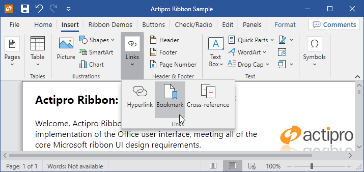

# Overview

> [!IMPORTANT]
> This older Ribbon product will be deprecated in the future in favor of the new ribbon implementation in the [Bars product](../bars/index.md), which has a much-improved design and appearance, and many of the latest features currently found in Office.  It is recommended to implement new ribbons using the Bars product instead, and to [migrate away from this older Ribbon product](../conversion/converting-to-v23-1.md) to the newer Bars ribbon when possible.

Actipro Ribbon is a control suite that implements an Office-like user interface for WPF applications.  It meets the required and optional Microsoft licensing requirements for implementation of a ribbon user interface, and is the most feature-rich WPF ribbon available today.

*A Ribbon demo showing exact reproduction of Word's Insert tab resizing behavior*

The ribbon user interface was designed to replace the standard types of menus and toolbars that have been used in applications for the past 10+ years.  Ribbons consolidate all user interface commands into a single location, which is easy to use and scales up and down well, thereby providing fast access to all commands regardless of window size.

To get started using the control, read through this documentation and study the sample project.  The sample includes live demos of many of Ribbon's features.

## What is a Ribbon?

A ribbon is the term for the great new user interface that Microsoft originally developed for the Office 2007 release.  The ribbon user interface was designed to replace the standard types of menus and toolbars that have been used in applications for the past 10+ years.

Ribbons consolidate all user interface commands into a single location, which is easy to use and scales up and down well, thereby providing fast access to all commands regardless of window size.

## Features at a Glance

### Dynamic Control Layouts

Actipro Ribbon has the most robust control layout code found in any product of its type... and it's fast too!  As you resize the Ribbon, you designate how groups and their child controls move through a sequence of progressively smaller variants.  All the controls included with Ribbon support multiple variant styles and several panel controls are provided that support variant changes from large to smaller items, along with managing multiple rows of items.  Unlike our competition, Actipro's Ribbon's layout features allow you to exactly mimic the layout behavior found in Office.

### Integrates with WPF Command Model

All of the controls included with Ribbon are designed specifically for use with the WPF command model (routed commands, ICommandSource, etc).  Commands can manage live previews, assign values (font families, sizes, etc.), and can even globally assign user interface elements such as images, labels, and screen tip data to controls that use them.

### Numerous Built-In Controls

Actipro Ribbon is bundled with numerous advanced controls that can be both inside and outside of the Ribbon.  Controls range from simple buttons, checkboxes, and radio buttons, to popup and split buttons.  There are galleries, comboboxes (regular, font family, and font size variations), textboxes, several layout controls and more.

### In-Ribbon and Popup Galleries

Galleries are controls that are designed to present a choice to the end user visually.  Galleries are often used to render things like styles, colors, underlines, etc. that may be applied to a document.  Both in-ribbon and popup galleries are included with Ribbon.  In-ribbon galleries always show items within a parent Group, and can optionally scale their width to show items based on the available width.  Any control that has a popup (such as a popup button, split button, or in-ribbon gallery) can have a popup gallery on it.  Popup galleries support categorization, filtering, zoomed-in items on mouse over, and popup resizing.  Any gallery item can be rendered via templates or custom drawn via code.  Gallery items support selection tracking and live preview as well.

### Color Picker Galleries

Color picker galleries are generally used in popups and present a defined list of colors to the end user.  The gallery can optionally auto-generate groups of lighter/darker shades for base colors you specify.  Multiple categories of colors may be added to a single gallery, and optional filtering can be applied.  These galleries have all the features found in popup galleries, such as color item screen tips, selection tracking and live preview.

### Advanced Popups Supporting Any Content, Resizing, Multiple Menu Columns, and More

The popups used in Ribbon allow for complete flexibility for your design.  You can place any sort of content within a popup, not just menu items.  Any sort of complex panel layouts are possible, including popup headers, multiple columns of menu items, etc.  A common use of this is to place popup galleries on a popup with menu items above and/or below the gallery.  Ribbon also includes a ContextMenu-based control that supports all of these advanced features and may be used anywhere that a regular ContextMenu can be used.

### Backstage / Application Menu / Recent Documents Management

The application menu is where application-level buttons and menu items are generally located.  Complete support for the Office 2010-like Backstage menu with tabs and buttons is included.  Alternatively Ribbon supports the more traditional Office 2007-like applicaiton menu with large menu items, footer buttons, and additional content display on its right side.  Generally recent documents are listed in the additional content area, and Ribbon even comes packed with a control for managing and displaying recent documents, along with pinning capabilities.

### Quick Access ToolBar

The Quick Access ToolBar (QAT) may be located above the Ribbon, below the Ribbon or hidden completely.  It is always visible no matter which Tab is selected.  The QAT has a customize menu that you may add custom items to, and will overflow items to a popup when space is limited.  Ribbon has a cloning framework for supporting run-time QAT customizations and persisting changes between application sessions.  The complete source code for a fully-functional Customize QAT dialog page is included.

### Mini-ToolBar

The mini-toolbar semi-transparently appears near the mouse when a selection is made, offering controls related to the selection.  It becomes more opaque as the mouse moves closer to it and becomes less opaque as the mouse moves away from it.  Mini-toolbars can also be paired with context menus so that they display above or below the context menu, providing additional options that aren't normally on the context menu.  Any controls, including galleries, can be used on the mini-toolbar.

### Ribbon Minimization

The Ribbon may be minimized to increase the screen real estate.  When in mimized mode, only the Ribbon's Tabs are visible.  A Tab may be clicked to display its groups in a popup.

### Key Tips and Screen Tips

Ribbon implements key tips provide easy keyboard access to any control on the Ribbon or in its popups.  Ribbon also implements screen tips, which are similar to tool tips except that they support some automated layout features, along with contextual help.

### Contextual Tab Groups

Contextual tab groups may be displayed when the context of the selection is appropriate for them to be visible.  For instance a Picture Tools contextual tab group's Tabs may become active when a picture is selected in a document.  Each group may be assigned a separate base tab/background color for visual differentiation.

### RibbonWindow (Office-like Window)

The RibbonWindow class mimics the window user interface found in Office, with its rounded corners and custom title bar.  RibbonWindow may be used with or without an embedded Ribbon control.

### Office Styles for Native WPF Controls

Since Actipro recognizes the need for developers to have a consistent look and feel throughout their application, we have included many Office-like styles for native WPF controls.  You can easily apply these themes to scrollbars, statusbars, etc.

### Theming

Multiple built-in themes that mimic Office's blue, black and silver themes, as well as all system themes are included.  However, you can also generate a completely custom theme with a single line of code.  Individual theme colors may also be altered as needed.  For advanced developers who want even more customization possibilities, we've made all our controls so that they can be styled and templated and all primitive elements that are used in our built-in control templates are public.

### Right-to-left, Localization, and Scaling

All Ribbon UI supports right-to-left layouts and all text in the user interface may be localized to other languages.  The Ribbon and RibbonWindow may be scaled up so that the UI appears larger to the end user while still retaining precise vector-based clarity.

*This product is written in 100% pure C#, and includes detailed documentation and samples.*

## Feature Detail

### Control Features

- 100% implementation of the required and most optional Microsoft ribbon user interface requirements.
- Ribbon bar that has tabs containing groups capable of hosting child controls.
- Built-in control types include buttons, checkable buttons, popup buttons, split buttons, checkable split buttons, checkboxes, radio buttons, textboxes, comboboxes, font family comboboxes, font size comboboxes, separators, labeled separators, in-ribbon galleries, popup galleries, and color picker galleries.
- Animated hint text for textboxes and comboboxes.
- Gallery controls that can be used in-ribbon or on popups and support data binding to any source, rendering via templates or custom draw, animated scrolling, multiple resizing options, selection tracking, categories, filtering, and zooming-in on item mouse over.
- Color picker gallery control supports multiple categories of colors and optionally auto-generates lighter/darker shades of colors.
- Use any built-in ribbon control standalone anywhere outside of the ribbon.
- Ability to add any control, including UserControls, anywhere into the ribbon, popups, menus, or the application menu.
- Multiple ways to lay out controls on the ribbon via the use of various panels.
- Full support for Backstage or more traditional application menu with menu items and footer buttons.
- Ability to place any control on the right side of the application menu, such as the included recent documents menu control that supports management and pinning of documents.
- Quick access toolbar that can be displayed above or below the ribbon.
- Powerful cloning framework for customizing the QAT and persisting changes between application sessions.  Full source for a Customize QAT dialog page is included.
- Mini-toolbar with support for both standalone usage and 'pairing' with a context menu.
- Contextual tab groups whose visibility can be toggled on and off.
- RibbonWindow class that can be used to provide a Office-like window appearance, even without the use of a ribbon control.

### Appearance Features

- Over 10 built-in color schemes, and the ability to generate an entire custom color scheme based on a single color.
- Any of the brushes in a color scheme may be individually modified as needed.
- Reuse stock brushes on external controls such as ListBoxes to keep a consistent UI.
- Styles for StatusBars and their items, ScrollViewers, ScrollBars, and numerous other native WPF controls.
- Fade and other color animations throughout the user interface.
- Aero glass support.

### Layout, Globalization, and Accessibility Features

- Automated ribbon control resizing that can be fully customized so that less important controls scale down or collapse sooner.
- Ability to save on screen real estate by minimizing the ribbon.
- Ribbon can collapse when it becomes smaller than a certain width or height.
- Key tips that provide quick keyboard access to any control.
- Screen tips that can be assigned to any control and support on-the-fly content creation.
- Right-to-left support is fully integrated for languages such as Hebrew or Arabic.
- Scale the ribbon up or down to any size

### Command Model

- Takes full advantage of the WPF command model.
- Commands can provide various UI elements such as labels and images so that controls with the same command can automatically get the same user interface.

*This product is written in 100% pure C#, and includes detailed documentation and samples.*
