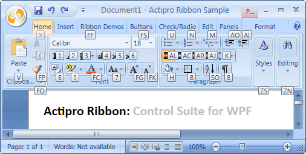

# Key Tips

Actipro Ribbon supports key tips, which are small decorations that pop up over each control indicating a key or series of keys that may be typed to access each control via the keyboard.



*Key tips displayed for the Home tab*

## Key Tip Access Text

Key tip access text must be defined for each control that is used throughout the ribbon, generally via a `KeyTipAccessText` property.  By doing so, the end user doesn't require a mouse to access functionality.  Key tips also allow for very fast execution of common commands via 2-3 keystrokes.

So what is key tip access text?  It is generally a one or two character string that indicates text that can be typed to access the control when its parent key tip scope is active.  For instance, on the Home tab in the screenshot above, the current key tip scope is the Home tab.  It is currently displaying the key tips of all controls that are accessible via key tips.  Actually, controls that are hidden by collapsed groups are available for access at this point too.  Note that the `Paste` item has a key tip access text of `V` and the font family combobox has a key tip access text of `FF`.

## Navigating Key Tip Scopes

Pressing and releasing either the `Alt` or `F10` keys will activate key tip mode.  This initially places the key tip scope on the ribbon itself, allowing access to the application menu, quick access toolbar items, tabs, or tab panel items.  Note that when not in key tip mode, you can also jump right to a tab's key tip scope by pressing `Alt` and its key tip access text.  For instance, to jump directly to the Home tab's key tip scope, you can press `Alt+H`.

The default key tip access text for the application button (in the upper-left of the ribbon) is `F`.  It can be set via the [ApplicationMenu](xref:@ActiproUIRoot.Controls.Ribbon.Controls.ApplicationMenu).[KeyTipAccessText](xref:@ActiproUIRoot.Controls.Ribbon.Controls.Primitives.ItemsControlBase.KeyTipAccessText) property.  When the application menu becomes the active key tip scope, you can access its menu items or its footer buttons.

When a [Tab](../controls/miscellaneous/tab.md) becomes the active key tip scope, you can access all of its child controls.  Collapsed groups can be displayed by typing the group's key tip access text.  An interesting note is that controls hidden in collapsed groups can be directly accessed from the tab key tip scope, even though they are not currently visible.  By typing a group's dialog launcher key tip access text, you can access the groups dialog launcher.

When a control with a popup becomes the active key tip scope, you can access any of its items.

To return to any parent key tip scope, press the `Esc` key.  Once back at the root ribbon key tip scope, presss the `Esc` key to quit key tip mode.

Pressing any non-letter/digit key or clicking the mouse will also quit key tip mode.

## General Implementation

All ribbon controls have a [KeyTipAccessText](xref:@ActiproUIRoot.Controls.Ribbon.Controls.Primitives.ControlBase.KeyTipAccessText) property that sets the key tip access text for the control.  So for most controls, setting up key tip access for them is as simple as setting a unique value for that property.

This code sample shows how to assign key tip access text for a [Button](../controls/interactive/button.md).

```xaml
<ribbon:Button KeyTipAccessText="P" Command="ApplicationCommands.Paste" />
```

All ribbon controls have a [OnKeyTipAccessed](xref:@ActiproUIRoot.Controls.Ribbon.Controls.Primitives.ControlBase.OnKeyTipAccessed*) method that is called when the key tip for the control is typed.  This method is implemented in each control to execute certain functionality upon activation, such as clicking a button, etc.

## KeyTipService

The [KeyTipService](xref:@ActiproUIRoot.Controls.Ribbon.UI.KeyTipService) provides numerous attached properties for working with key tips and manages key tip display and behavior.

It has these important properties:

| Member | Description |
|-----|-----|
| [CustomKeyTipPlacementCallbackProperty](xref:@ActiproUIRoot.Controls.Ribbon.UI.KeyTipService.CustomKeyTipPlacementCallbackProperty) Attached Property | Gets or sets an optional delegate that can be called to position key tips differently than the default location. |
| [IsKeyTipScopeProperty](xref:@ActiproUIRoot.Controls.Ribbon.UI.KeyTipService.IsKeyTipScopeProperty) Attached Property | Gets or sets whether the element to which it is applied is a key tip scope.  When an element is a key tip scope, upon navigating to it, it will show key tips for all its children.  Tabs are a good example of a control that is a key tip scope. |
| [KeyTipAccessTextProperty](xref:@ActiproUIRoot.Controls.Ribbon.UI.KeyTipService.KeyTipAccessTextProperty) Attached Property | Gets or sets the key tip access text for the element to which it is applied.  All ribbon controls that support key tips wrap this attached property with a `KeyTipAccessText` property. |

## Key Tip Mode Shortcuts

By default, pressing an `Alt` or `F10` key will toggle key tip mode on or off.  Sometimes keys like `F10` may be assigned as keyboard shortcuts for other features in an application.  In this case, it is useful to be able to prevent the key tip service from watching for `F10`.

The [Ribbon](xref:@ActiproUIRoot.Controls.Ribbon.Ribbon).[KeyTipModeShortcuts](xref:@ActiproUIRoot.Controls.Ribbon.Ribbon.KeyTipModeShortcuts) property can be set to a flags [KeyTipModeShortcuts](xref:@ActiproUIRoot.Controls.Ribbon.KeyTipModeShortcuts) value indicating which keys can toggle key tip mode.
