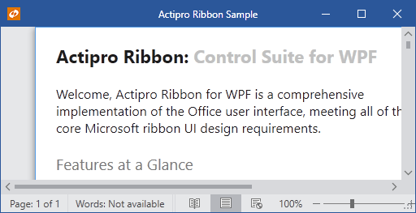

# Ribbon Collapsing

The ribbon is capable of collapsing when it becomes smaller than a threshold size.  When in a collapsed state, the ribbon (including its application button and QAT) hides since there is not enough space for its interface.

*The ribbon in an expanded normal state*

*The ribbon in a collapsed state*

The automatic collapsing behavior can be disabled and the threshold size can be configured.

## Related Members

The [Ribbon](xref:ActiproSoftware.Windows.Controls.Ribbon.Ribbon) defines several members that relate to collapsing.

| Member | Description |
|-----|-----|
| [CollapseThresholdSize](xref:ActiproSoftware.Windows.Controls.Ribbon.Ribbon.CollapseThresholdSize) Property | Gets or sets the threshold `Size` that triggers a ribbon collapse if the ribbon is sized smaller than the threshold.  The default threshold size is `300, 250`. |
| [IsCollapsed](xref:ActiproSoftware.Windows.Controls.Ribbon.Ribbon.IsCollapsed) Property | Gets or sets whether the ribbon is currently collapsed.  This property should not need to be called by your code under normal circumstances. |
| [IsCollapsedChanged](xref:ActiproSoftware.Windows.Controls.Ribbon.Ribbon.IsCollapsedChanged) Event | Occurs when the [IsCollapsed](xref:ActiproSoftware.Windows.Controls.Ribbon.Ribbon.IsCollapsed) property value has changed. |
| [IsCollapsible](xref:ActiproSoftware.Windows.Controls.Ribbon.Ribbon.IsCollapsible) Property | Gets or sets whether the ribbon collapses when it becomes smaller than a minimum threshold width/height as specified by the [CollapseThresholdSize](xref:ActiproSoftware.Windows.Controls.Ribbon.Ribbon.CollapseThresholdSize) property. |
