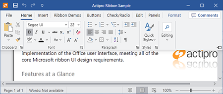

# Ribbon Minimization

Actipro Ribbon supports minimization, which means that the ribbon may be hidden so that only its tabs appear.  In this state, more screen real estate is available to the client area of the window.  By clicking a tab, the ribbon appears in a popup over the window client area and all of its controls are accessible.

*The ribbon in a minimized state... note that only the tabs are visible*

*After clicking a tab, a ribbon popup appears over the window client area*

## Ways to Minimize the Ribbon

There are four ways the end user can toggle minimization of the ribbon:

- Double-clicking the selected tab
- Choosing `Minimize the Ribbon` from a context menu
- Pressing `Ctrl+F1`
- Adding a [ToggleMinimizationButton](xref:ActiproSoftware.Windows.Controls.Ribbon.Controls.ToggleMinimizationButton) control to the ribbon's [TabPanelItems](xref:ActiproSoftware.Windows.Controls.Ribbon.Ribbon.TabPanelItems) collection and clicking it

> [!NOTE]
> See the [Button](../controls/interactive/button.md) topic for more information on the [ToggleMinimizationButton](xref:ActiproSoftware.Windows.Controls.Ribbon.Controls.ToggleMinimizationButton) control.

## Related Members

The [Ribbon](xref:ActiproSoftware.Windows.Controls.Ribbon.Ribbon) class defines several members that relate to ribbon minimization.

| Member | Description |
|-----|-----|
| [IsMinimizable](xref:ActiproSoftware.Windows.Controls.Ribbon.Ribbon.IsMinimizable) Property | Gets or sets whether the ribbon is capable of being minimized by the end user.  If this property is `true`, UI will be added to context menus allowing for the toggling of the [IsMinimized](xref:ActiproSoftware.Windows.Controls.Ribbon.Ribbon.IsMinimized) property.  Additionally, double-clicking a [Tab](../controls/miscellaneous/tab.md) will toggle the [IsMinimized](xref:ActiproSoftware.Windows.Controls.Ribbon.Ribbon.IsMinimized) property. |
| [IsMinimized](xref:ActiproSoftware.Windows.Controls.Ribbon.Ribbon.IsMinimized) Property | Gets or sets whether the ribbon is currently minimized.  When minimized, the ribbon's groups are not visible until the end user clicks on a tab, at which point they display in a popup.  This saves screen real estate. |
| [IsMinimizedChanged](xref:ActiproSoftware.Windows.Controls.Ribbon.Ribbon.IsMinimizedChanged) Event | Occurs when the [IsMinimized](xref:ActiproSoftware.Windows.Controls.Ribbon.Ribbon.IsMinimized) property value has changed. |
| [IsMinimizedPopupOpen](xref:ActiproSoftware.Windows.Controls.Ribbon.Ribbon.IsMinimizedPopupOpen) Property | Gets whether the ribbon is currently minimized and its minimized popup is open. |
| [IsToggleMinimizationButtonVisible](xref:ActiproSoftware.Windows.Controls.Ribbon.Ribbon.IsToggleMinimizationButtonVisible) Property | Gets or sets whether the toggle minimization button should be visible in the ribbon when [IsMinimizable](xref:ActiproSoftware.Windows.Controls.Ribbon.Ribbon.IsMinimizable) is `true`. |
