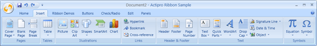
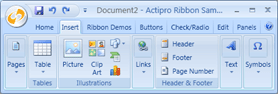

# Ribbon Resizing

Actipro Ribbon has the most powerful and flexible ribbon resizing model of any ribbon control out there.  In fact it's capabilities match what Office can do!  To prove this, we've modeled the first two tabs of our sample application after the Home and Insert tabs found in Microsoft Word 2007.

By default, Actipro Ribbon has code built-in to dynamically resize your ribbon.  However, for those who want more control over what groups change how and in what order, Actipro Ribbon offers full control over those items as well.

## Defining Group Size Scaling (Optional)

Each [Group](xref:@ActiproUIRoot.Controls.Ribbon.Controls.Group) on a [Tab](xref:@ActiproUIRoot.Controls.Ribbon.Controls.Tab) has a collection of [GroupVariant](xref:@ActiproUIRoot.Controls.Ribbon.Controls.GroupVariant) objects that control its [VariantSize](xref:@ActiproUIRoot.Controls.Ribbon.Controls.VariantSize).  The currently active group size is always indicated by the [Group](xref:@ActiproUIRoot.Controls.Ribbon.Controls.Group).[VariantSize](xref:@ActiproUIRoot.Controls.Ribbon.Controls.Primitives.ItemsControlBase.VariantSize) property.

The [VariantSize](xref:@ActiproUIRoot.Controls.Ribbon.Controls.VariantSize) enumeration has these values:

| Value | Description |
|-----|-----|
| `Collapsed` | A collapsed size. |
| `Small` | A small size. |
| `Medium` | A medium size. |
| `Large` | A large size (the default). |

Therefore, each group can have up to four different variants for how it appears within the ribbon.  Considering each tab generally has multiple groups, the end result is that there are many scaling down stages for a tab that can be defined.

So how exactly does scaling work?  Well, a number of layout controls such as [StackPanel](xref:@ActiproUIRoot.Controls.Ribbon.Controls.StackPanel) and [RowPanel](xref:@ActiproUIRoot.Controls.Ribbon.Controls.RowPanel) have the ability to alter their layouts based on the currently active parent group variant size.  Groups start with a `Large` size.  As the width of the ribbon decreases, they will slowly transition by default in sequence to the next smaller group size until all groups are collapsed.  This sequential behavior can be overridden by using priorities as described below.

Group variant sizes are controlled via a set of [GroupVariant](xref:@ActiproUIRoot.Controls.Ribbon.Controls.GroupVariant) objects.  These are stored in the [Group](xref:@ActiproUIRoot.Controls.Ribbon.Controls.Group).[Variants](xref:@ActiproUIRoot.Controls.Ribbon.Controls.Group.Variants) collection.  The defining of group variants is completely optional because as described above, a default sequence will be used if no group variants are defined.  However, if you do define variants, you have total control over the order of collapsing behavior.  It is how we made the Insert tab scale down the same as Word in the case study demonstration below.

> [!NOTE]
> It is good application design to define a prioritized set of group variants so that the least used group controls shrink and collapse before the more-often used group controls do.  For instance, `Clipboard` groups are most often the last thing to collapse on a tab since they are highly-used.

Each [GroupVariant](xref:@ActiproUIRoot.Controls.Ribbon.Controls.GroupVariant) has two properties: [Size](xref:@ActiproUIRoot.Controls.Ribbon.Controls.GroupVariant.Size) and [Priority](xref:@ActiproUIRoot.Controls.Ribbon.Controls.GroupVariant.Priority).  The [Size](xref:@ActiproUIRoot.Controls.Ribbon.Controls.GroupVariant.Size) property indicates the [VariantSize](xref:@ActiproUIRoot.Controls.Ribbon.Controls.VariantSize) that is applied when variant becomes active.  The [Priority](xref:@ActiproUIRoot.Controls.Ribbon.Controls.GroupVariant.Priority) property is the integer priority in which the variant takes effect in relation to other variants for the group and for other groups in the same tab.  A lower priority means that the variant will be applied sooner (large controls) and a larger priority means that the variant will be applied later (small controls).

The following XAML code defined the `Illustrations` group in the case study demonstration below.  Note that the `Large` size is assumed by default.  The `Medium` size kicks in at a priority of `60` in relation to other groups on the tab.  And so on for the other group variants.

```xaml
<ribbon:Group ImageSourceSmall="/Images/Picture16.png" Label="Illustrations" KeyTipAccessText="ZI">
	<ribbon:Group.Variants>
		<ribbon:GroupVariant Priority="60" Size="Medium" />
		<ribbon:GroupVariant Priority="110" Size="Small" />
		<ribbon:GroupVariant Priority="140" Size="Collapsed" />
	</ribbon:Group.Variants>					
	<ribbon:Button ImageSourceLarge="/Images/Picture32.png" 
		ImageSourceSmall="/Images/Picture16.png" Label="Picture" KeyTipAccessText="P" />
	<ribbon:Button ImageSourceLarge="/Images/ClipArt32.png" Label="Clip Art" KeyTipAccessText="F" />
	<ribbon:StackPanel>
		<ribbon:MenuButton ImageSourceLarge="/Images/Shapes32.png" 
			ImageSourceSmall="/Images/Shapes16.png" Label="Shapes" KeyTipAccessText="SH" />
		<ribbon:Button ImageSourceLarge="/Images/SmartArt32.png" 
			ImageSourceSmall="/Images/SmartArt16.png" Label="SmartArt" KeyTipAccessText="M" />
		<ribbon:Button ImageSourceLarge="/Images/Chart32.png" 
			ImageSourceSmall="/Images/Chart16.png" Label="Chart" KeyTipAccessText="C" />
	</ribbon:StackPanel>					
</ribbon:Group>
```

> [!NOTE]
> The declaration of group variants is an all or nothing process.  If you are going to define even one group variant, then you must define them for all groups on the same tab.  Otherwise don't define any variants to use the defaults.

When using the default variants, you may set the [Group](xref:@ActiproUIRoot.Controls.Ribbon.Controls.Group).[IsCollapsible](xref:@ActiproUIRoot.Controls.Ribbon.Controls.Group.IsCollapsible) property to `false` to ensure that it never collapses.  This is useful for groups that only have one item in them such as the Table group in the case study demonstration below.

## StackPanel, RowPanel, and RibbonGallery Variants

Both the [StackPanel](xref:@ActiproUIRoot.Controls.Ribbon.Controls.StackPanel) and [RowPanel](xref:@ActiproUIRoot.Controls.Ribbon.Controls.RowPanel) layout controls, along with the [RibbonGallery](xref:@ActiproUIRoot.Controls.Ribbon.Controls.RibbonGallery) (in-ribbon gallery) control are able to alter their layouts based on the active group variant.

### StackPanel

By default, a [StackPanel](xref:@ActiproUIRoot.Controls.Ribbon.Controls.StackPanel) will start by displaying its items horizontally using their tall variants when the parent group's [VariantSize](xref:@ActiproUIRoot.Controls.Ribbon.Controls.VariantSize) is `Large`.  As the parent group's [VariantSize](xref:@ActiproUIRoot.Controls.Ribbon.Controls.VariantSize) changes to `Medium`, the panel changes its items to use a `Medium` variant size and stacks them vertically.  When the parent group's [VariantSize](xref:@ActiproUIRoot.Controls.Ribbon.Controls.VariantSize) becomes `Small`, the panel changes its items to use a `Small` variant size (usually removes labels) and keeps them stacked vertically.

See the [StackPanel](../controls/layout/stackpanel.md) topic for more details on the default variant behavior and how to change it however you like.  For instance, you can tell the panel to always show items in the vertical stack.

### RowPanel

[RowPanel](xref:@ActiproUIRoot.Controls.Ribbon.Controls.RowPanel) controls lay out their child controls in two or three rows.  They automatically determine where to wrap items to a new row to obtain the minimal total width necessary for child item display.  You can define distinct orders in which child controls appear in both two and three row variants.

See the [RowPanel](../controls/layout/rowpanel.md) topic for more details on how to define variant behavior.

### RibbonGallery

The [RibbonGallery](xref:@ActiproUIRoot.Controls.Ribbon.Controls.RibbonGallery) control will by default collapse to a popup button when the parent group's [VariantSize](xref:@ActiproUIRoot.Controls.Ribbon.Controls.VariantSize) is `Small`.  It will expand to show a range of items depending on space when the parent group's [VariantSize](xref:@ActiproUIRoot.Controls.Ribbon.Controls.VariantSize) is `Medium`.  Finally, when the parent group's [VariantSize](xref:@ActiproUIRoot.Controls.Ribbon.Controls.VariantSize) is `Large`, it will expand to fill all remaining space in the tab.  All of this behavior is completely configurable.

See the [RibbonGallery](../controls/interactive/ribbongallery.md) topic for more details on how to define variant behavior.

## Case Study: Insert Tab Resizing (Comparison to Office)

The next series of screenshots show our sample application's Insert tab as the width of the ribbon decreases.  We encourage you to compare this to the series of screenshots in the Microsoft Ribbon UI Design Guidelines document under its "Defining Group Combinations for Ribbon Resizing" section.  You won't see a difference between that sample (which is Word's Insert tab) and ours because Actipro Ribbon's resizing model can handle any set of prioritized scaling operations you throw at it.








