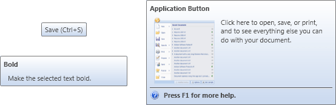

# Screen Tips

Actipro Ribbon fully implements screen tips for controls, which are advanced variations of standard tooltips.  They not only display a normal tooltip header but also can contain shortcut keys, an image, and a longer description explaining more about what the control does or its current state.



*Several varieties of screen tips*

Screen tips are displayed in three ways depending on the content that is available.  If only a label/header is availble, the screen tip will display as a standard tooltip.  If an image is available (generally representing a thumbnail screenshot of a dialog or preview of the action that takes place when the control's command is executed), a larger screen tip is used.  If a description of the control is available it also uses a larger style screen tip, although it will not be as wide as if an image is used.  Note that images and descriptions can both be used in a screen tip at the same time.  Large screen tips display the label/tooltip header in bold.

## General Implementation

All ribbon controls have several properties for configuring screen tips: [ScreenTipHeader](xref:@ActiproUIRoot.Controls.Ribbon.Controls.Primitives.ControlBase.ScreenTipHeader), [ScreenTipImageSource](xref:@ActiproUIRoot.Controls.Ribbon.Controls.Primitives.ControlBase.ScreenTipImageSource), [ScreenTipDescription](xref:@ActiproUIRoot.Controls.Ribbon.Controls.Primitives.ControlBase.ScreenTipDescription), [ScreenTipFooter](xref:@ActiproUIRoot.Controls.Ribbon.Controls.Primitives.ControlBase.ScreenTipFooter), and [ScreenTipHelpUri](xref:@ActiproUIRoot.Controls.Ribbon.Controls.Primitives.ControlBase.ScreenTipHelpUri).

These properties are all implementations of the [ScreenTipService](xref:@ActiproUIRoot.Controls.Ribbon.UI.ScreenTipService) attached properties described in greater detail in the ScreenTipService section below.

This code sample shows how to set a screen tip description for a [Button](../controls/interactive/button.md).  When the screen tip is displayed, the button's `Label` will be used as the bold header (since no `ScreenTipHeader` was specified) and the description will appear under the header.

```xaml
<ribbon:Button Label="Bold" ScreenTipDescription="Toggles the bold state of the text." />
```

Ribbon control also have the [ScreenTipOpening](xref:@ActiproUIRoot.Controls.Ribbon.Controls.Primitives.ControlBase.ScreenTipOpening) and [ScreenTipClosing](xref:@ActiproUIRoot.Controls.Ribbon.Controls.Primitives.ControlBase.ScreenTipClosing) events that can be used to programmatically generate screen tip content.

## ScreenTipService

The [ScreenTipService](xref:@ActiproUIRoot.Controls.Ribbon.UI.ScreenTipService) provides numerous attached properties and events for working with screen tips and manages screen tip display and behavior.

It has these important properties:

| Member | Description |
|-----|-----|
| [AllowScreenTipsOnContextMenus](xref:@ActiproUIRoot.Controls.Ribbon.UI.ScreenTipService.AllowScreenTipsOnContextMenus) Property | Gets or sets whether screen tips are allowed to display on context menus.  The default value is `false`.  If this property is set to `false`, no screen tips will appear on context menu items. |
| [AllowScreenTipsOnInactiveWindows](xref:@ActiproUIRoot.Controls.Ribbon.UI.ScreenTipService.AllowScreenTipsOnInactiveWindows) Property | Gets or sets whether screen tips are allowed to display on inactive windows.  The default value is `false`.  If this property is set to `false`, no screen tips will appear when the containing window is inactive. |
| [CurrentScreenTip](xref:@ActiproUIRoot.Controls.Ribbon.UI.ScreenTipService.CurrentScreenTip) Property | Gets the [ScreenTip](xref:@ActiproUIRoot.Controls.Ribbon.Controls.ScreenTip) that is currently visible, if any. |
| [ScreenTipClosingEvent](xref:@ActiproUIRoot.Controls.Ribbon.UI.ScreenTipService.ScreenTipClosingEvent) Event | Fires after a screen tip is closed. |
| [ScreenTipDescriptionProperty](xref:@ActiproUIRoot.Controls.Ribbon.UI.ScreenTipService.ScreenTipDescriptionProperty) Attached Property | When specified, displays its content under the label/header in the screen tip.  It can provide an extended description of the control for which the screen tip is displayed.  It is of type object meaning that you can specify plain text or can insert any type of control. |
| [ScreenTipFooterProperty](xref:@ActiproUIRoot.Controls.Ribbon.UI.ScreenTipService.ScreenTipFooterProperty) Attached Property | When specified, displays its content under a horizontal separator at the bottom of the screen tip.  Footers are most often used to provide extended state information about a control.  It is of type object meaning that you can specify plain text or can insert any type of control. |
| [ScreenTipHeaderProperty](xref:@ActiproUIRoot.Controls.Ribbon.UI.ScreenTipService.ScreenTipHeaderProperty) Attached Property | When specified, displays its content in bold above the rest of the screen tip content.  It is of type object meaning that you can specify plain text or can insert any type of control. |
| [ScreenTipHelpUriProperty](xref:@ActiproUIRoot.Controls.Ribbon.UI.ScreenTipService.ScreenTipHelpUriProperty) Attached Property | When specified, adds a "Press F1 for help" message at the bottom of the screen tip.  This indicates to the end user that contextual help is available.  When handling the `ApplicationCommands.Help` command, you can look at the [ScreenTipService](xref:@ActiproUIRoot.Controls.Ribbon.UI.ScreenTipService).[CurrentScreenTip](xref:@ActiproUIRoot.Controls.Ribbon.UI.ScreenTipService.CurrentScreenTip) property to see which screen tip, if any is currently displayed and jump to its help `Uri`. |
| [ScreenTipImageSourceProperty](xref:@ActiproUIRoot.Controls.Ribbon.UI.ScreenTipService.ScreenTipImageSourceProperty) Attached Property | When specified, displays an image on the left side of the screen tip.  The image can be used to display a thumnail of a dialog that will be launched from the control, or can be used to indicate the type of action that will occur when the control's command is executed. |
| [ScreenTipIsEnabledProperty](xref:@ActiproUIRoot.Controls.Ribbon.UI.ScreenTipService.ScreenTipIsEnabledProperty) Attached Property | Determines whether screen tips are enabled for the control.  When set to `false`, no screen tip will be displayed for the control. |
| [ScreenTipOpeningEvent](xref:@ActiproUIRoot.Controls.Ribbon.UI.ScreenTipService.ScreenTipOpeningEvent) Event | Fires before the screen tip is displayed, allowing you to customize the screen tip properties. |

> [!NOTE]
> When no screen tip header is specified and the screen tip's owner control has a `Label` property, it will be used as the header.

Most of the screen tip content properties are of type object, allowing you to pass a string of text or any control.  This allows for great flexibility in what you can display on the screen tip.

## Use Screen Tips on Anything

Yes that's right.  Our implementation of screen tips is so flexible that you can even assign them to non-ribbon controls!

Simply assign the appropriate [ScreenTipService](xref:@ActiproUIRoot.Controls.Ribbon.UI.ScreenTipService) attached properties to the controls that should have screen tips.

This code sample shows how to set a screen tip header and description for a native WPF `Button`:

```xaml
<Button Text="Regular Button" 
	ribbon:ScreenTipService.ScreenTipHeader="Regular Button."
	ribbon:ScreenTipService.ScreenTipDescription="This is a native WPF Button."/>
```

## Dynamically Generating Screen Tip Content

Screen tip content can be dynamically generated.  This allows you to modify the screen tip data on demand to best reflect the current state of the control.

To do this, process the [ScreenTipOpening](xref:@ActiproUIRoot.Controls.Ribbon.Controls.Primitives.ControlBase.ScreenTipOpening) event for the desired control.  That event fires before a screen tip is about to display for a control.  In the event handler, you may change any screen tip properties before they are rendered to the end user.

Note that at least one screentip-related attached property, such as [ScreenTipService](xref:@ActiproUIRoot.Controls.Ribbon.UI.ScreenTipService).`ScreenTipHeader` must be set on the desired target object for the event to fire.

## Context Sensitive Help Implementation

Whenever the [ScreenTipHelpUri](xref:@ActiproUIRoot.Controls.Ribbon.Controls.Primitives.ControlBase.ScreenTipHelpUri) property is set to a non-null value, a help icon and text will appear near the bottom of the screen tip that indicates that the user may press <kbd>F1</kbd> to access context sensitive help for that control.

To handle this, simply process an `Execute` handler for the standard `ApplicationCommands.Help` command.  Then in that code, check the [CurrentScreenTip](xref:@ActiproUIRoot.Controls.Ribbon.UI.ScreenTipService.CurrentScreenTip) property to see if there is a [ScreenTip](xref:@ActiproUIRoot.Controls.Ribbon.Controls.ScreenTip) currently visible.  If there is, and a help URI is specified, show the appropriate topic in your help file.

This is demonstrated in the screen tip QuickStart in the sample project.
