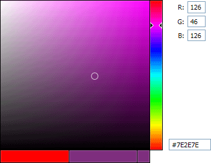
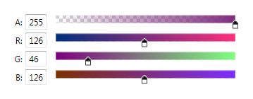

# Color Selection

The [ActiproSoftware.Windows.Controls.ColorSelection](xref:@ActiproUIRoot.Controls.ColorSelection) namespace contains several controls for performing color selection similar to that found in Adobe Photoshop or Microsoft Expression Blend.

## The SpectrumColorPicker Control

The [SpectrumColorPicker](xref:@ActiproUIRoot.Controls.ColorSelection.SpectrumColorPicker) is a control that allows for visual color selection.  It uses the [SpectrumSlice](xref:@ActiproUIRoot.Controls.ColorSelection.SpectrumSlice) and [SpectrumSlider](xref:@ActiproUIRoot.Controls.ColorSelection.SpectrumSlider) controls that are also included in the Shared libary.



*The SpectrumColorPicker control with some TextBoxes bound to its selected color*

This control has these important properties:

| Member | Description |
|-----|-----|
| [A](xref:@ActiproUIRoot.Controls.ColorSelection.SpectrumColorPicker.A) Property | Gets or sets the ARGB alpha component of the [SelectedColor](xref:@ActiproUIRoot.Controls.ColorSelection.SpectrumColorPicker.SelectedColor). |
| [B](xref:@ActiproUIRoot.Controls.ColorSelection.SpectrumColorPicker.B) Property | Gets or sets the RGB blue component of the [SelectedColor](xref:@ActiproUIRoot.Controls.ColorSelection.SpectrumColorPicker.SelectedColor). |
| [DisabledOpacity](xref:@ActiproUIRoot.Controls.ColorSelection.SpectrumColorPicker.DisabledOpacity) Property | Gets or sets the opacity used when the control is disabled. |
| [G](xref:@ActiproUIRoot.Controls.ColorSelection.SpectrumColorPicker.G) Property | Gets or sets the RGB green component of the [SelectedColor](xref:@ActiproUIRoot.Controls.ColorSelection.SpectrumColorPicker.SelectedColor). |
| [InitialColor](xref:@ActiproUIRoot.Controls.ColorSelection.SpectrumColorPicker.InitialColor) Property | Gets or sets the `Color` that was initially selected in the picker and is displayed in the lower left box. |
| [IsInitialColorVisible](xref:@ActiproUIRoot.Controls.ColorSelection.SpectrumColorPicker.IsInitialColorVisible) Property | Gets or sets whether the initial color swatch is visible in the color picker. |
| [R](xref:@ActiproUIRoot.Controls.ColorSelection.SpectrumColorPicker.R) Property | Gets or sets the RGB red component of the [SelectedColor](xref:@ActiproUIRoot.Controls.ColorSelection.SpectrumColorPicker.SelectedColor). |
| [SelectedColor](xref:@ActiproUIRoot.Controls.ColorSelection.SpectrumColorPicker.SelectedColor) Property | Gets or sets the `Color` that is selected in the picker and is displayed in the lower right box.  The lower middle box also generally displays the selected color, except when the mouse is being used to select a new color.  In that case, the color under the mouse is displayed in the lower middle box instead. |

`TextBox` controls can be bound to the [SpectrumColorPicker](xref:@ActiproUIRoot.Controls.ColorSelection.SpectrumColorPicker) to provide text entry of the various color values.  For web color entry (e.g., `"#FF0000"`), we have supplied a [ColorToStringConverter](xref:@ActiproUIRoot.Controls.ColorSelection.ColorToStringConverter) class that can be used in a binding.

This XAML code shows how to create the color picker displayed above with all the bounds `TextBox` controls:

```xaml
<Window x:Class="Sample.Application.Window"
        xmlns="http://schemas.microsoft.com/winfx/2006/xaml/presentation"
        xmlns:x="http://schemas.microsoft.com/winfx/2006/xaml"
        xmlns:shared="http://schemas.actiprosoftware.com/winfx/xaml/shared"
        >
	<Grid>
		<Grid.Resources>
			<shared:ColorToStringConverter x:Key="ColorToStringConverter" />
		</Grid.Resources>
		<Grid.RowDefinitions>
			<RowDefinition Height="Auto" />
			<RowDefinition Height="Auto" />
			<RowDefinition Height="Auto" />
			<RowDefinition Height="*" />
			<RowDefinition Height="Auto" />
		</Grid.RowDefinitions>
		<Grid.ColumnDefinitions>
			<ColumnDefinition Width="Auto" />
			<ColumnDefinition Width="Auto" />
			<ColumnDefinition Width="Auto" />
		</Grid.ColumnDefinitions>

		<shared:SpectrumColorPicker x:Name="spectrumColorPicker" Grid.RowSpan="5" Margin="0,0,10,0" InitialColor="Red" SelectedColor="Purple" />

		<Label Grid.Row="0" Grid.Column="1" HorizontalAlignment="Right" VerticalAlignment="Center">R:</Label>
		<TextBox Grid.Row="0" Grid.Column="2" HorizontalAlignment="Left" VerticalAlignment="Center" MinWidth="30" MaxLength="3"
		         Text="{Binding ElementName=spectrumColorPicker, Path=R}" />
		<Label Grid.Row="1" Grid.Column="1" HorizontalAlignment="Right" VerticalAlignment="Center">G:</Label>
		<TextBox Grid.Row="1" Grid.Column="2" HorizontalAlignment="Left" VerticalAlignment="Center" MinWidth="30" MaxLength="3"
		         Text="{Binding ElementName=spectrumColorPicker, Path=G}" />
		<Label Grid.Row="2" Grid.Column="1" HorizontalAlignment="Right" VerticalAlignment="Center">B:</Label>
		<TextBox Grid.Row="2" Grid.Column="2" HorizontalAlignment="Left" VerticalAlignment="Center" MinWidth="30" MaxLength="3"
		         Text="{Binding ElementName=spectrumColorPicker, Path=B}"></TextBox>
		<TextBox Grid.Row="4" Grid.Column="1" Grid.ColumnSpan="2" HorizontalAlignment="Left" VerticalAlignment="Center"
		         Margin="0,0,0,21" MinWidth="70" MaxLength="9"
		         Text="{Binding ElementName=spectrumColorPicker, Path=SelectedColor, Converter={StaticResource ColorToStringConverter}, ConverterParameter=False}" />

	</Grid>
</Window>
```

## The SpectrumSlice Control

The [SpectrumSlice](xref:@ActiproUIRoot.Controls.ColorSelection.SpectrumSlice) control is part of the [SpectrumColorPicker](xref:@ActiproUIRoot.Controls.ColorSelection.SpectrumColorPicker) control and is used to display a slice of saturation/brightness colors for a particular hue on the left side of the color picker.  However, this control may be used on its own.

This control has these important properties:

| Member | Description |
|-----|-----|
| [BaseColor](xref:@ActiproUIRoot.Controls.ColorSelection.SpectrumSlice.BaseColor) Property | Gets or sets the `Color` that is used to construct the slice.  Only the HSB hue component is used from this color. |
| [MarkedColor](xref:@ActiproUIRoot.Controls.ColorSelection.SpectrumSlice.MarkedColor) Property | Gets or sets the `Color` that the marker is over in the slice.  When the mouse is used to drag the marker, this color is set to the [SelectedColor](xref:@ActiproUIRoot.Controls.ColorSelection.SpectrumSlice.SelectedColor) property upon the release of the mouse button. |
| [SelectedColor](xref:@ActiproUIRoot.Controls.ColorSelection.SpectrumSlice.SelectedColor) Property | Gets or sets the `Color` that is selected in the slice. |

## The SpectrumSlider Control

The [SpectrumSlider](xref:@ActiproUIRoot.Controls.ColorSelection.SpectrumSlider) control is part of the [SpectrumColorPicker](xref:@ActiproUIRoot.Controls.ColorSelection.SpectrumColorPicker) control and is used to display a hue spectrum on the right side of the color picker.  However this control may be used on its own.

The `Value` of the control may be in the range of `0` to `360` and specifies the hue component in the HSB color space.

## The ColorComponentSlider Control

The [ColorComponentSlider](xref:@ActiproUIRoot.Controls.ColorSelection.ColorComponentSlider) control can be used in conjunction with or independently of the [SpectrumColorPicker](xref:@ActiproUIRoot.Controls.ColorSelection.SpectrumColorPicker) control to modify a single component of the ARGB color.



*Four instances of ColorComponentSlider each bound to a different component of the same color*

The `Value` of the control may be in the range of `0` to `255` and specifies the component value based on the [ColorComponentSlider](xref:@ActiproUIRoot.Controls.ColorSelection.ColorComponentSlider).[Component](xref:@ActiproUIRoot.Controls.ColorSelection.ColorComponentSlider.Component) property.  The [ColorComponentSlider](xref:@ActiproUIRoot.Controls.ColorSelection.ColorComponentSlider).[SelectedColor](xref:@ActiproUIRoot.Controls.ColorSelection.ColorComponentSlider.SelectedColor) property can be used to set or get the selected color of the slider.

## The GradientBrushSlider Control

The [GradientBrushSlider](xref:@ActiproUIRoot.Controls.ColorSelection.GradientBrushSlider) control can be used to modify the offsets of the gradient stops of a `LinearGradientBrush` or `RadialGradientBrush`.  Each gradient stop is represented by a **Thumb**, which can be selected by the user.  The selected gradient stop is represented by the [SelectedStop](xref:@ActiproUIRoot.Controls.ColorSelection.GradientBrushSlider.SelectedStop) property can allows it's color to be bound to an editor, such as the [SpectrumColorPicker](xref:@ActiproUIRoot.Controls.ColorSelection.SpectrumColorPicker).

This control has these important members:

| Member | Description |
|-----|-----|
| [AddStop](xref:@ActiproUIRoot.Controls.ColorSelection.GradientBrushSlider.AddStop*) Method | Adds a gradient stop to the selected brush.  The first overload will add a stop between the first two stops, if any.  The second overload will add a stop at a specified offset.  The color of the stop will be automatically calculated based on the specified offset. |
| [CanAddStops](xref:@ActiproUIRoot.Controls.ColorSelection.GradientBrushSlider.CanAddStops) Property | Gets or sets whether stops can be added. |
| [CanRemoveStops](xref:@ActiproUIRoot.Controls.ColorSelection.GradientBrushSlider.CanRemoveStops) Property | Gets or sets whether stops can be removed. |
| [Orientation](xref:@ActiproUIRoot.Controls.ColorSelection.GradientBrushSlider.Orientation) Property | Gets or sets the orientation of the slider, which can be either horizontal or vertical. |
| [RemoveSelectedStop](xref:@ActiproUIRoot.Controls.ColorSelection.GradientBrushSlider.RemoveSelectedStop*) Method | Removes the selected gradient stop from the selected brush. |
| [ReverseStops](xref:@ActiproUIRoot.Controls.ColorSelection.GradientBrushSlider.ReverseStops*) Method | Reverses the stops of the selected brush.  Gradient stops at offset `1.0` will be moved to offset `0.0`, and gradient stops at offset `0.0` will be moved to offset `1.0`.  Gradient stops at offset `0.5` will not be changed. |
| [SelectedBrush](xref:@ActiproUIRoot.Controls.ColorSelection.GradientBrushSlider.SelectedBrush) Property | Gets or sets the selected brush presented and modified by the slider. |
| [SelectedStop](xref:@ActiproUIRoot.Controls.ColorSelection.GradientBrushSlider.SelectedStop) Property | Gets the selected gradient stop in the slider. |

### Mouse Interaction

The offsets of the gradient stops can be adjusted by dragging the associated **Thumb** along the slider.  New gradient stops can be added by clicking on the slider background.  Finally, gradient stops can be removed by dragging the **Thumb** below (horizontal) or to the right (vertical) the slider.

### Commands

The [GradientBrushSlider](xref:@ActiproUIRoot.Controls.ColorSelection.GradientBrushSlider).[AddStopCommand](xref:@ActiproUIRoot.Controls.ColorSelection.GradientBrushSlider.AddStopCommand) routed command can be executed on the [GradientBrushSlider](xref:@ActiproUIRoot.Controls.ColorSelection.GradientBrushSlider) to add a gradient stop.  Similarly, the [GradientBrushSlider](xref:@ActiproUIRoot.Controls.ColorSelection.GradientBrushSlider).[RemoveStopCommand](xref:@ActiproUIRoot.Controls.ColorSelection.GradientBrushSlider.RemoveStopCommand) routed command can be used to remove the selected stop.
