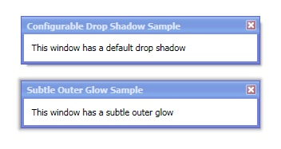

# DropShadowChrome

The [DropShadowChrome](xref:@ActiproUIRoot.Controls.DropShadowChrome) decorator draws a drop-shadow or outer glow around its content.

The shadow is rendered purely via WPF and does not use shader effects.  The child element must be rectangular, but a corner radius can be specified.  The X, Y, and Z offsets can all be configured to create drop shadow or outer glow effects.

For a modern drop shadow that appears more realistic and can also apply the shadow to non-rectangular shapes, use the [ShadowChrome](shadowchrome.md) control instead, which makes use of shader effects.

*Two examples of the use of DropShadowChrome*

## Important Members

The [DropShadowChrome](xref:@ActiproUIRoot.Controls.DropShadowChrome) class has these important members:

<table>
<thead>

<tr>
<th>Member</th>
<th>Description</th>
</tr>

</thead>
<tbody>

<tr>
<td>

[BorderThickness](xref:@ActiproUIRoot.Controls.DropShadowChrome.BorderThickness) Property

</td>
<td>

Gets or sets the `Thickness` of the drop shadow borders.  The default value is `5`.

</td>
</tr>

<tr>
<td>

[Color](xref:@ActiproUIRoot.Controls.DropShadowChrome.Color) Property

</td>
<td>

Gets or sets the color of the drop shadow.  The default value is `#71000000`.

</td>
</tr>

<tr>
<td>

[CornerRadius](xref:@ActiproUIRoot.Controls.DropShadowChrome.CornerRadius) Property

</td>
<td>

Gets or sets the `CornerRadius` of the drop shadow borders.  The default value is `0`.

When setting a non-zero corner radius, please use a uniform value and also use a uniform [BorderThickness](xref:@ActiproUIRoot.Controls.DropShadowChrome.BorderThickness) value as well.

</td>
</tr>

<tr>
<td>

[XOffset](xref:@ActiproUIRoot.Controls.DropShadowChrome.XOffset) Property

</td>
<td>

Gets or sets the horizontal offset of the drop shadow behind its content.  The default value is `5`.

</td>
</tr>

<tr>
<td>

[YOffset](xref:@ActiproUIRoot.Controls.DropShadowChrome.YOffset) Property

</td>
<td>

Gets or sets the vertical offset of the drop shadow behind its content.  The default value is `5`.

</td>
</tr>

<tr>
<td>

[ZOffset](xref:@ActiproUIRoot.Controls.DropShadowChrome.ZOffset) Property

</td>
<td>

Gets or sets the z-offset of the drop shadow behind its content.  The default value is `0`.

</td>
</tr>

</tbody>
</table>

## Creating an Offset Drop Shadow

The standard type of drop shadow is an offset shadow.  This effect is shown in the top screenshot above.

To accomplish this, use the [XOffset](xref:@ActiproUIRoot.Controls.DropShadowChrome.XOffset) and [YOffset](xref:@ActiproUIRoot.Controls.DropShadowChrome.YOffset) properties, and keep [ZOffset](xref:@ActiproUIRoot.Controls.DropShadowChrome.ZOffset) = `0`.

## Creating an Outer Glow

An alternate type of drop shadow is an outer glow.  This effect is shown in the bottom screenshot above.

To accomplish this, keep both [XOffset](xref:@ActiproUIRoot.Controls.DropShadowChrome.XOffset) and [YOffset](xref:@ActiproUIRoot.Controls.DropShadowChrome.YOffset) properties = `0`.  Then set the [ZOffset](xref:@ActiproUIRoot.Controls.DropShadowChrome.ZOffset) to a value greater than `0`.
