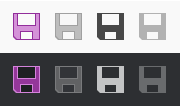

# DynamicImage

The [DynamicImage](xref:@ActiproUIRoot.Controls.DynamicImage) control is a drop-in replacement for `Image` that is the primary UI mechanism for interfacing with [ImageProvider](../../themes/image-provider.md) and its features, supporting:

- Chromatic adaptation (color shifting) for images, which allows images designed for light themes to be automatically adjusted for use in dark themes.
- Conversion of a monochrome vector image to render in the current foreground color.
- Dynamic loading of pre-defined high-DPI and/or theme-specific image variations for raster images.
- Automatic conversion of an image to grayscale and optional transparency when the control is disabled.
- Conversion of monochrome images to use the current foreground color.



*A single BitmapImage that is altered to show normal, disabled, monochrome, and monochrome disabled states in both light and dark themes*

## Relationship with ImageProvider

The [DynamicImage](xref:@ActiproUIRoot.Controls.DynamicImage) control makes heavy use of [ImageProvider](../../themes/image-provider.md) and its functionality to adapt vector and raster images for use in various scenarios.

> [!NOTE]
> Please see the [Image Provider](../../themes/image-provider.md) topic for more detail on how image providers work and how [DynamicImage](xref:@ActiproUIRoot.Controls.DynamicImage) ties into image provider features.

## Important Members

The [DynamicImage](xref:@ActiproUIRoot.Controls.DynamicImage) class has these important members:

| Member | Description |
|-----|-----|
| [BackgroundHint](xref:@ActiproUIRoot.Controls.DynamicImage.BackgroundHint) Property | A `Brush` that can be specified to indicate the control's background color so that chromatic adaptation can occur when appropriate.  This property is only used when the [ImageProvider](xref:@ActiproUIRoot.Media.ImageProvider).[ChromaticAdaptationMode](xref:@ActiproUIRoot.Media.ImageProvider.ChromaticAdaptationMode) property is set to `ImageChromaticAdaptationMode.Always`, and can be left `null` to use the current theme's default background color for chromatic adaptation logic instead. |
| [DisabledOpacity](xref:@ActiproUIRoot.Controls.DynamicImage.DisabledOpacity) Property | The opacity at which to render the image when the control is disabled.  The default value is `1.0`, meaning don't change opacity when disabled. |
| [Foreground](xref:@ActiproUIRoot.Controls.DynamicImage.Foreground) Property | The current foreground `Brush` for the control, inherited down from ancestor controls.  A foreground color is derived from the `Brush` and is used as the target color for monochrome adaptation. |
| `Height` Property | The height of the image control in device independent units.  It's always a good idea to set this property to ensure the image is displayed at its intended size and must be set if your [Image Provider](../../themes/image-provider.md) can swap in high-DPI images.  Inherited from `Image`. |
| `IsEnabled` Property | When set to `false`, the image content will render in grayscale.  Inherited from `Image`. |
| `Source` Property | The `ImageSource` for the image content.  Inherited from `Image`. |
| [UseMonochrome](xref:@ActiproUIRoot.Controls.DynamicImage.UseMonochrome) Property | Whether the `ImageSource` value in the `Source` property should be rendered as monochrome.  The default value is `false`.  When this property is `true`, the resulting monochrome image will be in the control's current foreground color (gathered from the [Foreground](xref:@ActiproUIRoot.Controls.DynamicImage.Foreground) property). |
| `Width` Property | The height of the image control in device independent units.  It's always a good idea to set this property to ensure the image is displayed at its intended size, and must be set if your [Image Provider](../../themes/image-provider.md) can swap in high-DPI images.  Inherited from `Image`. |

## Using ImageConverter

The [ImageConverter](xref:@ActiproUIRoot.Controls.ImageConverter) is a [value converter](../value-converters.md) that makes it easy to convert a `Uri` or `String` value to a [DynamicImage](xref:@ActiproUIRoot.Controls.DynamicImage).  It can prepend a URI prefix so that the bound value is shorter and reduces repetitive entry.

This sample XAML shows usage of an [ImageConverter](xref:@ActiproUIRoot.Controls.ImageConverter) with a `MenuItem`.

```xaml
<Window xmlns:shared="http://schemas.actiprosoftware.com/winfx/xaml/shared"
	...
	<Window.Resources>
		<shared:ImageConverter x:Key="ImageConverter" Width="16" Height="16" UriPrefix="pack://application:,,,/SampleBrowser;component/Images/" />
	</Window.Resources>
	...
	<MenuItem Header="New" Command="ApplicationCommands.New" Icon="{Binding Source='New16.png', Converter={StaticResource ImageConverter}}" />
	...
</Window>
```

## Handling FileNotFoundException or DirectoryNotFoundException

If you use relative paths for your bitmap image sources, you might encounter a `FileNotFoundException` or `DirectoryNotFoundException` in some cases when using [DynamicImage](xref:@ActiproUIRoot.Controls.DynamicImage), or any control that uses [DynamicImage](xref:@ActiproUIRoot.Controls.DynamicImage) in its template, such as the Ribbon button controls.  This exception can occur behind the scenes where the image is being reloaded outside of its original XAML context and thus can lose its contextual information for determining a relative path.  Using an absolute path via standard WPF pack syntax allows the image to be loaded properly in any scenario.

The full exception message would be something like one of these:

- `"Could not find file 'C:\Paste16.png'."` when the original image source was `"/Paste16.png"` (a `FileNotFoundException`).

- `"Could not find a part of the path 'C:\Resources\Images\Paste16.png'."` when the original image source was `"/Resources/Images/Paste16.png"` (a `DirectoryNotFoundException`).

To resolve this exception, use the [Pack syntax for specifying URIs](https://docs.microsoft.com/en-us/dotnet/framework/wpf/app-development/pack-uris-in-wpf) (MSDN).

This example shows how to use an absolute URI to fully specify an image that is located in the `"/Resources/Images"` subfolder of a `"SampleBrowser"` project:

`pack://application:,,,/SampleBrowser;component/Resources/Images/Paste16.png`
