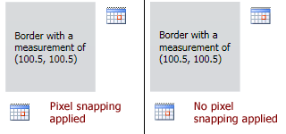

# PixelSnapper

The [PixelSnapper](xref:ActiproSoftware.Windows.Controls.PixelSnapper) decorator snaps the measurement of its child content to integer values, thereby helping to prevent blurry images and borders that may appear after it.

## The Issue: Blurry Images and Lines in WPF

A problem in WPF is that images and borders can become very blurry when they are positioned on non-pixel boundaries.  This makes the application appear to be poorly designed to end users even though technically, the developer did nothing wrong.

How does this scenario occur?  Very easily in fact.  Say you have a standard WPF `Menu` at the top of your `Window`.  The text in the menu items may measure to `12.5` pixels high.  Then lets assume that we have `2` pixels of padding.  Now we have a `Menu` that is `16.5` pixels high and the problem has been introduced.

The control directly under the `Menu` will start at vertical location `16.5`.  If this control is an `Image`, all the pixels in the image will appear blurry in the vertical direction since each lies half on one pixel and half on the one below it.  Even setting `SnapsToDevicePixels` to `true` does nothing to correct the issue.

## A Visual Sample

In the screenshot below, we have a `Border` with a [PixelSnapper](xref:ActiproSoftware.Windows.Controls.PixelSnapper) surrounding it.  In the left sample, the `PixelSnapper` has snapped its contents to integers, the default behavior.  In the right sample, the `PixelSnapper` functionality has been disabled.

*A demonstration of the differences between using and not using PixelSnapper*

Note how the images, which are laid out after the `Border`, are blurry when not using `PixelSnapper` functionality due to the decimal size of the `Border`.

## Effective Use of PixelSnapper

Where should you use `PixelSnapper`?  Generally, text elements like `TextBlock` controls are the only ones that will measure to decimal values.  So any time you have a text control in your UI and that control will affect the layout of other controls, we recommend you surround it with a `PixelSnapper`.  This will keep everything in your UI on pixel boundaries, enabling images and lines to remain crisp and clear.

## Important Members

The [PixelSnapper](xref:ActiproSoftware.Windows.Controls.PixelSnapper) class has these important members:

| Member | Description |
|-----|-----|
| [HorizontalRoundMode](xref:ActiproSoftware.Windows.Controls.PixelSnapper.HorizontalRoundMode) Property | Gets or sets a [RoundMode](xref:ActiproSoftware.Windows.Controls.RoundMode) indicating how to round the horizontal measurement of the child content.  The default value is `RoundMode.Ceiling`. |
| [VerticalRoundMode](xref:ActiproSoftware.Windows.Controls.PixelSnapper.VerticalRoundMode) Property | Gets or sets a [RoundMode](xref:ActiproSoftware.Windows.Controls.RoundMode) indicating how to round the vertical measurement of the child content.  The default value is `RoundMode.Ceiling`. |

## RoundMode Enumeration

The [RoundMode](xref:ActiproSoftware.Windows.Controls.RoundMode) enumeration has these values:

| Value | Description |
|-----|-----|
| `None` | No rounding is applied. |
| `Floor` | The largest integer less than or equal to the value is returned. |
| `FloorToEven` | The largest even integer less than or equal to the value is returned. |
| `FloorToOdd` | The largest odd integer less than or equal to the value is returned. |
| `Ceiling` | The smallest integer greater than or equal to the value is returned. |
| `CeilingToEven` | The smallest even integer greater than or equal to the value is returned. |
| `CeilingToOdd` | The smallest odd integer greater than or equal to the value is returned. |
| `Round` | The closest integer to the value is returned. |
| `RoundToEven` | The closest even integer to the value is returned. |
| `RoundToOdd` | The closest odd integer to the value is returned. |

## Centering Within a Parent

Say that you are trying to horizontally center an `Image` that is `32x32` pixels within a parent `StackPanel` that also has a `TextBlock` in it.  The `TextBlock` could lead to a fractional width.  By wrapping the `TextBlock` with a `PixelSnapper` and using a `CeilingToEven` horizontal round mode, you ensure that the entire contents of the `TextBlock` is visible, and that it forces the `StackPanel`'s width to an even number, allowing the `Image` to be centered horizontally directly on integer boundaries within the `StackPanel`.
