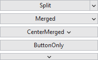
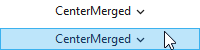

# PopupButton

The [PopupButton](xref:@ActiproUIRoot.Controls.PopupButton) control supports display of popups or context menus, and can render in multiple display modes.

*The various PopupButton display modes.*

## Display Mode

The [PopupButton](xref:@ActiproUIRoot.Controls.PopupButton).[DisplayMode](xref:@ActiproUIRoot.Controls.PopupButton.DisplayMode) property supports these display modes, which alter the appearance of the control:

| DisplayMode | Description |
|-----|-----|
| [Merged](xref:@ActiproUIRoot.Controls.PopupButtonDisplayMode.Merged) | The control will show the content as a normal button, with a popup indicator on the right side.  This display mode is also known as a drop-down button, and opens a popup/menu when clicked. |
| [CenterMerged](xref:@ActiproUIRoot.Controls.PopupButtonDisplayMode.CenterMerged) | The control will show the content as a normal button, with a popup indicator right next to the content.  This display mode is also known as a drop-down button, and opens a popup/menu when clicked. |
| [Split](xref:@ActiproUIRoot.Controls.PopupButtonDisplayMode.Split) | The control will show the content in a normal button area and a popup indicator in a separate clickable area.  This display mode is also known as a split button.  It performs a standard button click when clicking the button's content area, and opens a popup/menu when the popup indicator area is clicked. |
| [ButtonOnly](xref:@ActiproUIRoot.Controls.PopupButtonDisplayMode.ButtonOnly) | The control will show the content as a normal button, and with no popup indicator.  This display mode renders the same as a normal `Button`, while still retaining popup display functionality when clicked.  If no popup content or menu is assigned to the control, clicks on the control will behave like a standard `Button`. |
| [PopupOnly](xref:@ActiproUIRoot.Controls.PopupButtonDisplayMode.PopupOnly) | The control will show the popup indicator, but not the content.  This display mode opens a popup/menu when clicked. |

## Popup Content or Context Menu

The [PopupMenu](xref:@ActiproUIRoot.Controls.PopupButton.PopupMenu) can be set to a `ContextMenu` that you'd like to display when the button is clicked.

Alternatively the [PopupContent](xref:@ActiproUIRoot.Controls.PopupButton.PopupContent), [PopupContentTemplate](xref:@ActiproUIRoot.Controls.PopupButton.PopupContentTemplate), and/or [PopupContentTemplateSelector](xref:@ActiproUIRoot.Controls.PopupButton.PopupContentTemplateSelector) properties can be used to specify content for a popup to show instead.

Note that setting the [PopupMenu](xref:@ActiproUIRoot.Controls.PopupButton.PopupMenu) property will trigger its `ContextMenu` to display, even of any of the popup content properties are set.  The [PopupMenu](xref:@ActiproUIRoot.Controls.PopupButton.PopupMenu) property takes priority.

The popup content can be automatically focused when opened by setting the [IsAutoFocusOnOpenEnabled](xref:@ActiproUIRoot.Controls.PopupButton.IsAutoFocusOnOpenEnabled) property to `true`, which is the default.

## Events

The [PopupButton](xref:@ActiproUIRoot.Controls.PopupButton).[PopupOpened](xref:@ActiproUIRoot.Controls.PopupButton.PopupOpened) and [PopupClosed](xref:@ActiproUIRoot.Controls.PopupButton.PopupClosed) events are raised when the associated `ContextMenu`/`Popup` is opened and closed, respectively.

In addition, the [PopupOpening](xref:@ActiproUIRoot.Controls.PopupButton.PopupOpening) event will be raised before the associated `ContextMenu`/`Popup` is opened.  Handlers for this event can customize the popup menu or content before it is displayed, or can choose to cancel the open altogether.

## Transparency Mode

The [PopupButton](xref:@ActiproUIRoot.Controls.PopupButton) also supports a transparency mode, which indicates that the background, borders, and/or shades should not be rendered when the button is inactive.  A button is considered inactive when it is not defaulted, does not have the keyboard focus, does not have the mouse over it, and is not pressed.

*Two identical [PopupButton](xref:@ActiproUIRoot.Controls.PopupButton) controls with the transparency mode enabled, with the mouse hovered over the bottom one.*

## DataContext for Popup ContextMenu

Because `ContextMenu` elements are not part of the same visual tree as the associated `PopupButton`, they do not inherit the `DataContext`.  The `PopupButton` has been designed to pass it's `DataContext` on to the `ContextMenu` specified by the [PopupMenu](xref:@ActiproUIRoot.Controls.PopupButton.PopupMenu).  This allows data binding to be used without having to add any additional work-arounds.

The data context passed to the context menu is specified by the [PopupMenuDataContext](xref:@ActiproUIRoot.Controls.PopupButton.PopupMenuDataContext) property, which is bound to the `DataContext` by default.  This in effect, extends the current data context to the context menu, while still allowing it to be customzied easily as needed.

## Placement Target

The placement of the popup is set to the `PopupButton` itself.

## Interop Content

If you wish to display interop content like WinForms controls in the popup content, you must set the [PopupAllowsTransparency](xref:@ActiproUIRoot.Controls.PopupButton.PopupAllowsTransparency) property to `false`.  When popups allow transparency, WPF cannot render interop content in them.

## Important Members

The [PopupButton](xref:@ActiproUIRoot.Controls.PopupButton) class has these important members:

<table>
<thead>

<tr>
<th>Member</th>
<th>Description</th>
</tr>

</thead>
<tbody>

<tr>
<td>

[DisplayMode](xref:@ActiproUIRoot.Controls.PopupButton.DisplayMode) Property

</td>
<td>

Gets or sets the [PopupButtonDisplayMode](xref:@ActiproUIRoot.Controls.PopupButtonDisplayMode).  The default value is [Merged](xref:@ActiproUIRoot.Controls.PopupButtonDisplayMode.Merged).

</td>
</tr>

<tr>
<td>

[HasDropShadow](xref:@ActiproUIRoot.Controls.PopupButton.HasDropShadow) Property

</td>
<td>

Gets or sets whether the popup will display a drop-shadow effect.  The default value is `true`.

> [!NOTE]
> Setting this property to `true` has no effect if the `SystemParameters.DropShadow` property is `false`.

</td>
</tr>

<tr>
<td>

[IsAutoFocusOnOpenEnabled](xref:@ActiproUIRoot.Controls.PopupButton.IsAutoFocusOnOpenEnabled) Property

</td>
<td>

Gets or sets a value indicating whether the popup content will be automatically focused when the popup is opened.  The default value is `true`.

</td>
</tr>

<tr>
<td>

[IsPopupOpen](xref:@ActiproUIRoot.Controls.PopupButton.IsPopupOpen) Property

</td>
<td>

Gets or sets whether the popup is currently displayed.  The default value is `false`.

</td>
</tr>

<tr>
<td>

[IsTransparencyModeEnabled](xref:@ActiproUIRoot.Controls.PopupButton.IsTransparencyModeEnabled) Property

</td>
<td>

Gets or sets a value indicating whether transparency mode is enabled.  The default value is `false`.

</td>
</tr>

<tr>
<td>

[PopupAllowsTransparency](xref:@ActiproUIRoot.Controls.PopupButton.PopupAllowsTransparency) Property

</td>
<td>

Gets or sets the value assigned to the popup's `AllowsTransparency` property.  The default value is `true`.

When this property is set to `false`, interop content will be able to render on the popup.

</td>
</tr>

<tr>
<td>

[PopupBackground](xref:@ActiproUIRoot.Controls.PopupButton.PopupBackground) Property

</td>
<td>

Gets or sets the `Brush` for the popup's background.

</td>
</tr>

<tr>
<td>

[PopupBorderBrush](xref:@ActiproUIRoot.Controls.PopupButton.PopupBorderBrush) Property

</td>
<td>

Gets or sets the `Brush` for the popup's border.

</td>
</tr>

<tr>
<td>

[PopupBorderThickness](xref:@ActiproUIRoot.Controls.PopupButton.PopupBorderThickness) Property

</td>
<td>

Gets or sets the `Thickness` for the popup's border.

</td>
</tr>

<tr>
<td>

[PopupContent](xref:@ActiproUIRoot.Controls.PopupButton.PopupContent) Property

</td>
<td>

Gets or sets the content that is displayed on the popup for the button.  The default value is `null`.

The [PopupMenu](xref:@ActiproUIRoot.Controls.PopupButton.PopupMenu) property takes precedence over this property.  Therefore, if [PopupMenu](xref:@ActiproUIRoot.Controls.PopupButton.PopupMenu) is set, this property is ignored.

</td>
</tr>

<tr>
<td>

[PopupContentTemplate](xref:@ActiproUIRoot.Controls.PopupButton.PopupContentTemplate) Property

</td>
<td>

Gets or sets the `DataTemplate` to use for the [PopupContent](xref:@ActiproUIRoot.Controls.PopupButton.PopupContent).  The default value is `null`.  This property is only useful if your popup content is a data object and not a UI element.

The [PopupMenu](xref:@ActiproUIRoot.Controls.PopupButton.PopupMenu) property takes precedence over this property.  Therefore, if [PopupMenu](xref:@ActiproUIRoot.Controls.PopupButton.PopupMenu) is set, this property is ignored.

</td>
</tr>

<tr>
<td>

[PopupContentTemplateSelector](xref:@ActiproUIRoot.Controls.PopupButton.PopupContentTemplateSelector) Property

</td>
<td>

Gets or sets the `DataTemplateSelector` to use for the [PopupContent](xref:@ActiproUIRoot.Controls.PopupButton.PopupContent).  The default value is `null`.  This property is only useful if your popup content is a data object and not a UI element.

The [PopupMenu](xref:@ActiproUIRoot.Controls.PopupButton.PopupMenu) property takes precedence over this property.  Therefore, if [PopupMenu](xref:@ActiproUIRoot.Controls.PopupButton.PopupMenu) is set, this property is ignored.

</td>
</tr>

<tr>
<td>

[PopupCornerRadius](xref:@ActiproUIRoot.Controls.PopupButton.PopupCornerRadius) Property

</td>
<td>

Gets or sets the `CornerRadius` for the popup's border.

</td>
</tr>

<tr>
<td>

[PopupHorizontalOffset](xref:@ActiproUIRoot.Controls.PopupButton.PopupHorizontalOffset) Property

</td>
<td>

Gets or sets the horizontal distance between the target origin and the popup alignment point.  The default value is `0`.

</td>
</tr>

<tr>
<td>

[PopupIndicator](xref:@ActiproUIRoot.Controls.PopupButton.PopupIndicator) Property

</td>
<td>

Gets or sets the `UIElement` used in the indicator portion of the button.

</td>
</tr>

<tr>
<td>

[PopupIndicatorTemplate](xref:@ActiproUIRoot.Controls.PopupButton.PopupIndicatorTemplate) Property

</td>
<td>

Gets or sets the `DataTemplate` used to present the indicator portion of the button.

</td>
</tr>

<tr>
<td>

[PopupIndicatorToolTip](xref:@ActiproUIRoot.Controls.PopupButton.PopupIndicatorToolTip) Property

</td>
<td>

Gets or sets the tool-tip object that is displayed for the popup indicator element.  The default value is `null`, which indicates that the standard `ToolTip` object will be used for the entire button.

</td>
</tr>

<tr>
<td>

[PopupMenu](xref:@ActiproUIRoot.Controls.PopupButton.PopupMenu) Property

</td>
<td>

Gets or sets the `ContextMenu` that is displayed as the popup for the button.  The default value is `null`.

This property takes precedence over the [PopupContent](xref:@ActiproUIRoot.Controls.PopupButton.PopupContent)-related properties.  Therefore, if this property is set, the [PopupContent](xref:@ActiproUIRoot.Controls.PopupButton.PopupContent)-related properties are ignored.

</td>
</tr>

<tr>
<td>

[PopupPadding](xref:@ActiproUIRoot.Controls.PopupButton.PopupPadding) Property

</td>
<td>

Gets or sets the `Thickness` for the popup's padding.

</td>
</tr>

<tr>
<td>

[PopupVerticalOffset](xref:@ActiproUIRoot.Controls.PopupButton.PopupVerticalOffset) Property

</td>
<td>

Gets or sets the vertical distance between the target origin and the popup alignment point.  The default value is `0`.

</td>
</tr>

<tr>
<td>

[StaysOpen](xref:@ActiproUIRoot.Controls.PopupButton.StaysOpen) Property

</td>
<td>

Gets or sets a value that indicates whether the Popup closes when the control is no longer in focus.  The default value is `false`.

> [!NOTE]
> This property has no effect when using [PopupMenu](xref:@ActiproUIRoot.Controls.PopupButton.PopupMenu).

</td>
</tr>

</tbody>
</table>
