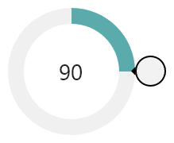
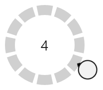
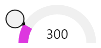
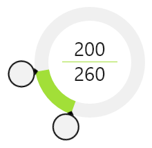

# RadialSlider

The [RadialSlider](xref:@ActiproUIRoot.Controls.RadialSlider) control is a circular slider that allows for quick selection of a degree value, which can easily be converted to some form of scalar value.

Radial sliders function just like normal linear sliders however instead of moving the slider thumb in a straight line, the thumb can move in a circular fashion around the slider's center point.  This sort of UI allows for additional precision when compared to linear sliders, especially with touch interaction.

Radial sliders are often paired with [RingSlice](ringslice.md) controls, which are designed to render the main UI for radial slider tracks and values.



*A RadialSlider that uses RingSlice controls for rendering of the track and value.*

[RadialSlider](xref:@ActiproUIRoot.Controls.RadialSlider) supports minimum/maximum ranges, infinite wrapping mode, customizable thumb styles, and more.  While the control is ideal for touch-based input, it also fully accepts mouse and keyboard input.  Combine two RadialSlider controls on top of each other to enable range-based selection.

## Values

Values in the [RadialSlider](xref:@ActiproUIRoot.Controls.RadialSlider) are expressed in terms of degrees, where `0` is upward and the degree values increase as they go clockwise, meaning `90` degrees is to the right.

There are two value properties exposed by this control.  The first is the `Value` property, which inherits from `RangeBase`.  This property contains the final 'snapped' degree value as the radial slider is interacted with by the end user.  The second is [IntermediateValue](xref:@ActiproUIRoot.Controls.RadialSlider.IntermediateValue), which is the exact degree value as the radial slider is interacted with by the end user.  They generally will be the same value however they can be different in cases where the user is dragging the slider's thumb off of a snap point (see below).

## Input and Value Snapping

The slider is designed to accept all forms of input (touch, mouse, and keyboard).  The `SmallChange` and `LargeChange` properties (inherited from `RangeBase`) specify degree values and dictate the interaction behavior with the slider.



*A RadialSlider that has snapping enabled and makes use of multiple RingSlice controls to render the snap points.*

### Dragging

When dragging the slider's thumb via touch or mouse, the `Value` property will snap to the closest `SmallChange` interval, while the [IntermediateValue](xref:@ActiproUIRoot.Controls.RadialSlider.IntermediateValue) will be directly under the drag location.  When the thumb is released, it will animate [IntermediateValue](xref:@ActiproUIRoot.Controls.RadialSlider.IntermediateValue) over to the `Value` property.

### Mouse Wheel

When turning the mouse wheel, the slider's value will increment/decrement by the `LargeChange` value.

### Keyboard

These keys are supported for keyboard input:

- **Up** - Increment by `SmallChange`.
- **Down** - Decrement by `SmallChange`.
- **PageUp** - Increment by `LargeChange`.
- **PageDown** - Decrement by `LargeChange`.
- **Home** - Change directly to `Minimum`.
- **End** - Change directly to `Maximum`.

## Conversion to Scalar Values

While the slider's value are always represented in degrees, they can easily be converted to any scalar value via the use of a value converter.

In this example, a slider is set to snap at `30` degree increments and a `TextBlock` in the middle of it is bound to the value.  But instead of displaying a degree value, the value converter divides the degree value by the degree increment (`30`) and displays the result, which is a value in the range of `0` to `11`.

```xaml
<controls:RadialSlider x:Name="snappingSlider2" Radius="100" Value="120" LargeChange="30" SmallChange="30" />
<TextBlock FontSize="28" HorizontalAlignment="Center" VerticalAlignment="Center" 
	Text="{Binding ElementName=snappingSlider2, Path=Value, Converter={StaticResource DegreeToScalarConverter}, ConverterParameter=30.0}" />
```

While the converter above is a simple example, the degree value could be converted to a percentage or even a text label instead.

## Range Constraints and Wrapping

The `Minimum` and `Maximum` properties (inherited from `RangeBase`) can be used to designate a degree range that can contain the `Value`.  For instance, to achieve a semi-circle range that bows upward, you would specify a `Minimum` of `270` (leftward) and a `Maximum` of `450` (rightward).  The slider values will not be allowed to pass outside of that range.

The default `Minimum` is `0` and `Maximum` is `360`.  These settings enable a special mode where the slider's value can wrap infinitely.



*A RadialSlider that is constrained to a semi-circle.*

Other ranges can allow for creative input scenarios too.  A `Minimum` of `-360` and a `Maximum` of `360` allow for a full circle rotation negative or positive.  A `Minimum` of `0` and a `Maximum` of `1080` allow for three full circle rotations positive.

## Radius

The [RadialSlider](xref:@ActiproUIRoot.Controls.RadialSlider).[Radius](xref:@ActiproUIRoot.Controls.RadialSlider.Radius) property indicates the radius of the invisible track over which the thumb will rotate.  A radius of `40` means the circle will be `80x80` in size.

## Customizing the Thumb

The thumb, represented by the [CircularThumb](xref:@ActiproUIRoot.Controls.Primitives.CircularThumb) primitive control, is the only visible portion of the slider.  It is what the end user interacts with and drags to change the slider's value.

These members on [RadialSlider](xref:@ActiproUIRoot.Controls.RadialSlider) are related to altering the appearance of the thumb:

| Member | Description |
|-----|-----|
| [ThumbArrowAngle](xref:@ActiproUIRoot.Controls.RadialSlider.ThumbArrowAngle) Property | Gets or sets the thumb's arrow angle.  The default value is `180`, meaning it will face down when up at `0` degrees in the slider. |
| [ThumbBackground](xref:@ActiproUIRoot.Controls.RadialSlider.ThumbBackground) Property | Gets or sets the background `Brush` to render when the thumb is in a normal state. |
| [ThumbPressedBackground](xref:@ActiproUIRoot.Controls.RadialSlider.ThumbPressedBackground) Property | Gets or sets the background `Brush` to render when the thumb is pressed. |
| [ThumbStyle](xref:@ActiproUIRoot.Controls.RadialSlider.ThumbStyle) Property | Gets or sets the `Style` to use for the thumb.  Use this property if a custom thumb `Style` is desired. |

## Combining Multiple Sliders



*Two RadialSlider controls that overlay each other.*

Multiple sliders can be overlayed on top of each other.  The sliders themselves are transparent and only their thumbs allow for interaction.  This means that two sliders would render two separate thumbs, each of which can be interacted with separately, and can therefore be used to specify a range of values by the end user.
