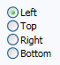

# RadioButtonList

The [RadioButtonList](xref:@ActiproUIRoot.Controls.RadioButtonList) control directly inherits `ListBox` and changes the template of items to look like radio buttons.

*The RadioButtonList control bounds to the `Dock` enumeration*

The selected item in the list will appear as a checked radio button.

## Orientation

By default, radio button items are displayed vertically.  The [Orientation](xref:@ActiproUIRoot.Controls.RadioButtonList.Orientation) property can be set to `Orientation.Horizontal` to allow the items to be displayed horizontally instead.

When adding items horizontally, it's best to ensure there is some margin space at the tail end of the item content so that the radio button items appear visually separated.

## Bullet Layout

There are two properties that allow you to control the location of the bullet relative to the content.

The [BulletVerticalAlignment](xref:@ActiproUIRoot.Controls.RadioButtonList.BulletVerticalAlignment) property is a `VerticalAlignment` that indicates how the bullet is vertically aligned.  By default, it is set to `Center`.

The [BulletMargin](xref:@ActiproUIRoot.Controls.RadioButtonList.BulletMargin) property is a `Thickness` that specifies the margin around the bullet.

By using these two properties you can alter now the bullet is positioned relative to the content.

## Auto-Disable Non-Selected Item Content

If your items have child controls in them, sometimes it's ideal to disable the child controls for all but the selected radio button item.

Set the [AutoDisableNonSelectedItemContent](xref:@ActiproUIRoot.Controls.RadioButtonList.AutoDisableNonSelectedItemContent) property to `true` to activate this behavior.
