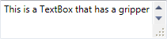

# ResizableContentControl

The [ResizableContentControl](xref:@ActiproUIRoot.Controls.ResizableContentControl) is a regular `ContentControl` that contains a gripper on one of its sides or corners.  When it is dragged by the mouse, the content is resized.  The gripper may be double-clicked to reset its size back to the content's desired size.

*The ResizableContentControl control adding a gripper that allows for horizontal and vertical resizing*

Resizing direction options are `None`, `Horizontal`, `Vertical`, or `Both`.  The functionality provided by this control is especially useful within popups.

> [!TIP]
> You can provide a custom template for the [ResizableContentControl](xref:@ActiproUIRoot.Controls.ResizableContentControl) to position the gripper in a custom location if the default options don't meet your needs.  You also can make a custom `Style` for the `Thumb` control (gripper) that it contains to draw the gripper however you like.

The resize gripper is shown on top of the content associated with the `ResizableContentControl`. Problems can arise when the content uses a `ScrollViewer`, that is displaying a vertical scrollbar but not a horizontal scrollbar. The gripper will overlap the vertical scrollbar, which prevents the down button from being clicked (as well as an undesireable look).

*The ResizableContentControl with a ScrollViewer using the native WPF Style*

There are two methods for working around this issue. The first method requires that the `Padding` property be set on the `ResizableContentControl` so that the content is pushed up a sufficent amount. The height of the gripper is determined by the `SystemParameters.HorizontalScrollBarHeight` property.

Alternatively, the [UseAlternateScrollViewerStyleProperty](xref:@ActiproUIRoot.Controls.ResizableContentControl.UseAlternateScrollViewerStyleProperty) attached property can be set to `true` on the `ResizableContentControl`, the parent element of the `ResizableContentControl`, or any child elements of the `ResizableContentControl`. This applies a Style to the `ScrollViewer` elements that reserves sufficent space for the gripper.

*The ResizableContentControl with UseAlternateScrollViewerStyleProperty set to true on the TextBox*

The [ResizableContentControl](xref:@ActiproUIRoot.Controls.ResizableContentControl) class has these important members:

| Member | Description |
|-----|-----|
| [AutoSize](xref:@ActiproUIRoot.Controls.ResizableContentControl.AutoSize*) Method | Auto-sizes the content control to the desired size of its content. |
| [CanAutoSize](xref:@ActiproUIRoot.Controls.ResizableContentControl.CanAutoSize) Property | Gets or sets whether the gripper auto-sizes to its content when it is double-clicked.  The default value is `true`. |
| [GripperBackground](xref:@ActiproUIRoot.Controls.ResizableContentControl.GripperBackground) Property | Gets or sets the `Brush` to use for the gripper background. |
| [GripperForeground](xref:@ActiproUIRoot.Controls.ResizableContentControl.GripperForeground) Property | Gets or sets the `Brush` to use for the gripper foreground. |
| `Padding` Property | Gets or sets the distance between the `ResizableContentControl` and its content. |
| [ResizeMode](xref:@ActiproUIRoot.Controls.ResizableContentControl.ResizeMode) Property | Gets or sets a [ControlResizeMode](xref:@ActiproUIRoot.Controls.ControlResizeMode) indicating the resizing capabilities of the gripper.  The default value is `ControlResizeMode.Both`.  Use the `ControlResizeMode.None` value to hide the gripper. |
