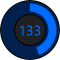
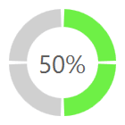

# RingSlice

The [RingSlice](xref:@ActiproUIRoot.Controls.RingSlice) control renders a portion (or the entire circle) of a ring shape.  Its start/end angles, radius, thickness, and other stroke properties can be set.

*Several RingSlice controls combined to create an appealing radial graph*

Ring slice controls can be combined in many interesting ways within UI, including being used to represent the 'track' or value of a [RadialSlider](xref:@ActiproUIRoot.Controls.RadialSlider), used to create segmented progress indicators, etc.

## Angles, Radius, and Thickness

The control renders a ring slice between two angles, specified in degrees, where `0` is upward and the degree values increase as they go clockwise, meaning `90` degrees is to the right.  To render a quarter circle ring from the top to the right, use a [StartAngle](xref:@ActiproUIRoot.Controls.RingSlice.StartAngle) of `0` and an [EndAngle](xref:@ActiproUIRoot.Controls.RingSlice.EndAngle) of `90`.

*Several RingSlice controls used to render a four-step circular progress indicator*

The control also has two properties that control its radius and thickness.  The [Radius](xref:@ActiproUIRoot.Controls.RingSlice.Radius) property specifies the outer radius of the ring.  The `StrokeThickness` property specifies the thickness of the ring, extending inward from the outer radius.

> [!TIP]
> Use a `StrokeThickness` value that is the same as the [Radius](xref:@ActiproUIRoot.Controls.RingSlice.Radius) to render a pie slice.

## Other Stroke Properties

[RingSlice](xref:@ActiproUIRoot.Controls.RingSlice) also supports all of the standard stroke properties found on a shape control.  This includes setting start/end/dash caps to achieve circular, triangle, etc. line ends, or setting properties to renders dashed lines.

## Entire Circle

When the [StartAngle](xref:@ActiproUIRoot.Controls.RingSlice.StartAngle) and [EndAngle](xref:@ActiproUIRoot.Controls.RingSlice.EndAngle) are the same value, the ring slice will by default render a full circular ring.  the [IsRenderedWhenFullCircle](xref:@ActiproUIRoot.Controls.RingSlice.IsRenderedWhenFullCircle) property can be set to `false` to disable this behavior.  When set to `false` and the angles are the same, nothing will be rendered.
