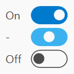

# ToggleSwitch

The [ToggleSwitch](xref:@ActiproUIRoot.Controls.ToggleSwitch) is a control that is typically toggled between two states (**On** and **Off**) and optionally supports a third state (**Indeterminate**).



The control is composed of a **Knob** element whose position indicates the state of the control, a **Track** which defines the bounds for the **Knob**, and one or more **Content** elements which display content associated with the current state.

## Toggle States

Two states are supported by default: **On** and **Off**. An optional **Indeterminate** state may also be enabled by setting the `IsThreeState` property to `true`.

The current state is defined by the `IsChecked` property. The type is a `Nullable<Boolean>` where the following defines which states are represented by each value:

| Value | Toggle State |
|-----|-----|
| `false` | The switch state is **Off**. |
| `true` | The switch state is **On**. |
| `null` | The switch state is **Indeterminate**. |

To change the current state, set the `IsChecked` property to the desired value.  Handle the `Checked` event to respond to changes in state.

> [!WARNING]
> The `IsThreeState` property only defines the behavior of the control.  The value of `IsChecked` can be programmatically set to `null` even when `IsThreeState` is `false`.

## Animation

The [ToggleSwitch](xref:@ActiproUIRoot.Controls.ToggleSwitch) has several animations which are applied to elements of the control to improve the visualization. When the current state changes, the **Knob** element will move smoothly to the new position while transitioning the state-based `System.Windows.Media.Brush` properties for the **Track** and **Knob**. Changes in the **Knob** element size are also animated and can be observed when moving the pointer over the control.

Animations are automatically disabled, as appropriate, based on system settings. To manually turn off animations, set the [IsAnimationEnabled](xref:@ActiproUIRoot.Controls.ToggleSwitch.IsAnimationEnabled) property to `false`.

> [!IMPORTANT]
> The **Track** element's background and border properties will only support smooth animations when using `System.Windows.Media.SolidColorBrush`. Other brushes can be used, but the values will be applied immediately when state changes. The **Knob** element fully supports animated transitions for all brushes.

## Knob Shadow

While not enabled by default, the [ToggleSwitch](xref:@ActiproUIRoot.Controls.ToggleSwitch) uses [ShadowChrome](xref:@ActiproUIRoot.Controls.Primitives.ShadowChrome) to support a drop shadow for the **Knob** element with the following important members:

| Member | Description |
|-----|-----|
| [IsKnobShadowEnabled](xref:@ActiproUIRoot.Controls.ToggleSwitch.IsKnobShadowEnabled) Property | Gets or sets whether the shadow is enabled for the knob element. The default value is `false`. |
| [KnobShadowElevation](xref:@ActiproUIRoot.Controls.ToggleSwitch.KnobShadowElevation) Property | Gets or sets the elevation of the shadow for the knob element, a value from `0` to `24`. Higher elevations render larger shadows. The default value is `0`, which means the shadow will not be rendered. |
| [KnobShadowDirection](xref:@ActiproUIRoot.Controls.ToggleSwitch.KnobShadowDirection) Property | Gets or sets the direction (in degrees) of the shadow for the knob element where `270` is down, `315` is lower-right, etc.  The default value is `270`. |
| [KnobShadowOpacity](xref:@ActiproUIRoot.Controls.ToggleSwitch.KnobShadowOpacity) Property | Gets or sets the opacity of the shadow for the knob element as a value from `0.0` to `1.0`. The default value is `0.3`. |

The following example demonstrates adding a shadow:

```xaml
xmlns:shared="http://schemas.actiprosoftware.com/winfx/xaml/shared"
...
<shared:ToggleSwitch IsKnobShadowEnabled="True" KnobShadowElevation="2" />
```

## Customize Layout

Several options are available to customize the layout of the control.

### Orientation

The [Orientation](xref:@ActiproUIRoot.Controls.ToggleSwitch.Orientation) can be set to `Horizontal` (default) or `Vertical`.

When set to `Horizontal`, the switch moves from left (**Off**) to right (**On**). Labels for current state are commonly displayed to the left and/or right of the switch, based on [ContentPlacement](xref:@ActiproUIRoot.Controls.ToggleSwitch.ContentPlacement).

When set to `Vertical`, the switch moves from bottom (**Off**) to top (**On**). Labels for current state are commonly displayed above and/or below the switch, based on [ContentPlacement](xref:@ActiproUIRoot.Controls.ToggleSwitch.ContentPlacement).

### Content Placement

The current state of the switch is typically complemented by a label on one side whose value corresponds to the state. Use the [ContentPlacement](xref:@ActiproUIRoot.Controls.ToggleSwitch.ContentPlacement) property to control the position of the content or hide it completely. The following values are available:

| Content Placement | Description |
|-----|-----|
| [None](xref:@ActiproUIRoot.Controls.ToggleSwitchContentPlacement.None) | No content will be displayed. |
| [Near](xref:@ActiproUIRoot.Controls.ToggleSwitchContentPlacement.Near) | Content is only positioned on the left (horizontal) or top (vertical), based on orientation and current state. |
| [Far](xref:@ActiproUIRoot.Controls.ToggleSwitchContentPlacement.Far) | Content is only positioned on the right (horizontal) or bottom (vertical), based on orientation and current state. |
| [NearAndFar](xref:@ActiproUIRoot.Controls.ToggleSwitchContentPlacement.NearAndFar) | The **Off** and **On** content is always positioned on the left and right (horizontal) or bottom and top (vertical), based on orientation. No content is displayed for **Indeterminate**. |
| [Track](xref:@ActiproUIRoot.Controls.ToggleSwitchContentPlacement.Track) | Content is positioned within the **Track** portion of the control. The **Off** and **On** content is aligned to be positioned opposite of the **Knob** element. The **Indeterminate** content is centered behind the **Knob** element is not recommended for use. See important note below regarding use of [ToggleSwitchContentPlacement](xref:@ActiproUIRoot.Controls.ToggleSwitchContentPlacement).[Track](xref:@ActiproUIRoot.Controls.ToggleSwitchContentPlacement.Track). |

> [!IMPORTANT]
> When using [ToggleSwitchContentPlacement](xref:@ActiproUIRoot.Controls.ToggleSwitchContentPlacement).[Track](xref:@ActiproUIRoot.Controls.ToggleSwitchContentPlacement.Track), it may be necessary to customize the `FontSize`, `Foreground`, [OffContent](xref:@ActiproUIRoot.Controls.ToggleSwitch.OffContent), [OnContent](xref:@ActiproUIRoot.Controls.ToggleSwitch.OnContent), and/or [TrackContentMargin](xref:@ActiproUIRoot.Controls.ToggleSwitch.TrackContentMargin) properties to ensure the content is properly displayed since the default style is intended for use with [Near](xref:@ActiproUIRoot.Controls.ToggleSwitchContentPlacement.Near) and/or [Far](xref:@ActiproUIRoot.Controls.ToggleSwitchContentPlacement.Far) content placement.

## Customize Appearance

Several options are available to customize the appearance of the control.

### Understanding Extent and Ascent

Instead of `Width` and `Height`, the [ToggleSwitch](xref:@ActiproUIRoot.Controls.ToggleSwitch) control uses `Extent`- and `Ascent`-related properties which work for any [Orientation](xref:@ActiproUIRoot.Controls.ToggleSwitch.Orientation). The `Extent`-related properties are associated with the primary axis of the control (e.g., x-axis for `Horizontal` orientation, and y-axis for `Vertical` orientation). The `Ascent`-related properties are associated with the axis which is perpendicular to the primary axis (e.g., y-axis for `Horizontal` orientation, and x-axis for `Vertical` orientation).

For `Horizontal` orientation, the primary axis is the x-axis (left-to-right):

- `Extent` = `Width`
- `Ascent` = `Height`

For `Vertical` orientation, the primary axis is the y-axis (bottom-to-top):

- `Extent` = `Height`
- `Ascent` = `Width`

By using these `Extent`- and `Ascent`-related properties instead of `Width` and `Height`, values can be assigned which will be appropriate for the control at either orientation.

### Track and Knob Size

Use the [TrackExtent](xref:@ActiproUIRoot.Controls.ToggleSwitch.TrackExtent) and [TrackAscent](xref:@ActiproUIRoot.Controls.ToggleSwitch.TrackAscent) properties to define the size of the **Track** element.

Use the [KnobExtent](xref:@ActiproUIRoot.Controls.ToggleSwitch.KnobExtent) and [KnobAscent](xref:@ActiproUIRoot.Controls.ToggleSwitch.KnobAscent) properties to define the size of the **Knob** element.

> [!WARNING]
> 
> When customizing the size of the **Knob** element, it may also be necessary to set the values for the [MaxKnobExtent](xref:@ActiproUIRoot.Controls.ToggleSwitch.MaxKnobExtent) and [MaxKnobAscent](xref:@ActiproUIRoot.Controls.ToggleSwitch.MaxKnobAscent) properties.  These values are used to properly reserve space for the **Knob** element in the event the size changes in response to user interaction (e.g., moving the pointer over the control).
> 
> Note that even if your configuration does not increase the size of the **Knob** element during interaction, the default `Style` of the control defines values for [MaxKnobExtent](xref:@ActiproUIRoot.Controls.ToggleSwitch.MaxKnobExtent) and [MaxKnobAscent](xref:@ActiproUIRoot.Controls.ToggleSwitch.MaxKnobAscent) which are appropriate for the default `Style`. If you are using default `Style` (or one that is based on it) you may still need to define the maximum values, especially if you are making the `Knob` smaller than the default size.

The following example for a horizontal [ToggleSwitch](xref:@ActiproUIRoot.Controls.ToggleSwitch) demonstrates how to set the **Knob** element to a custom 30x30 size which grows to 32x32 on mouse over and then 34x32 when pressed:

```xaml
xmlns:shared="http://schemas.actiprosoftware.com/winfx/xaml/shared"
...
<shared:ToggleSwitch Orientation="Horizontal">
	<shared:ToggleSwitch.Style>
		<Style TargetType="shared:ToggleSwitch">
			<Setter Property="KnobExtent" Value="30" /><!-- Width (for Horizontal) -->
			<Setter Property="KnobAscent" Value="30" /><!-- Height (for Horizontal) -->
			<Setter Property="MaxKnobExtent" Value="34" />
			<Setter Property="MaxKnobAcent" Value="32" />
			<Style.Triggers>
				<MultiTrigger>
					<MultiTrigger.Conditions>
						<Condition Property="IsMouseOver" Value="True" />
						<Condition Property="IsPressed" Value="False" />
					</MultiTrigger.Conditions>
					<Setter Property="KnobExtent" Value="32" /><!-- Width (for Horizontal) -->
					<Setter Property="KnobAscent" Value="32" /><!-- Height (for Horizontal) -->
				</MultiTrigger>
				<Trigger Property="IsPressed" Value="True">
					<Setter Property="KnobExtent" Value="34" /><!-- Width (for Horizontal) -->
					<Setter Property="KnobAscent" Value="32" /><!-- Height (for Horizontal) -->
				</Trigger>
			</Style.Triggers>
		</Style>
	</shared:ToggleSwitch.Style>
</shared:ToggleSwitch>
```

### Brushes

The **Knob** and **Track** elements have several `System.Windows.Media.Brush` properties available to customize the appearance of each element.  These properties are defined with explicit values corresponding to **Off**, **On**, and **Indeterminate** state to simplify state-specific appearance without the need for defining an explicit `Style`.

For example, use the [OffTrackBackground](xref:@ActiproUIRoot.Controls.ToggleSwitch.OffTrackBackground) and [OffKnobBackground](xref:@ActiproUIRoot.Controls.ToggleSwitch.OffKnobBackground) properties to customize the **Track** and **Knob** elements when in the **Off** state.

## Customize Content

The [OffContent](xref:@ActiproUIRoot.Controls.ToggleSwitch.OffContent), [OnContent](xref:@ActiproUIRoot.Controls.ToggleSwitch.OnContent), and [IndeterminateContent](xref:@ActiproUIRoot.Controls.ToggleSwitch.IndeterminateContent) properties are available to customize the content displayed for each state.

By default, each content property is initialized to a localizable `String` resource value. The following resources are configured:

| Resource key | Description |
|-----|-----|
| `UIToggleSwitchOffText` | The text displayed for [OffContent](xref:@ActiproUIRoot.Controls.ToggleSwitch.OffContent). The default value is `"Off"`. |
| `UIToggleSwitchOnText` | The text displayed for [OnContent](xref:@ActiproUIRoot.Controls.ToggleSwitch.OnContent). The default value is `"On"`. |
| `UIToggleSwitchIndeterminateText` | The text displayed for [IndeterminateContent](xref:@ActiproUIRoot.Controls.ToggleSwitch.IndeterminateContent). The default value is `"-"`. |

This code shows how to set custom values for the string resources.

```csharp
ActiproSoftware.Products.Shared.SR.SetCustomString(ActiproSoftware.Products.Shared.SRName.UIToggleSwitchOffText.ToString(), "No");
ActiproSoftware.Products.Shared.SR.SetCustomString(ActiproSoftware.Products.Shared.SRName.UIToggleSwitchOnText.ToString(), "Yes");
```

 See the [Customizing String Resources](../../customizing-string-resources.md) topic for additional details.

> [!TIP]
> For more advanced layouts, any `Object` which is supported by `ContentPresenter` can be assigned as content.

> [!IMPORTANT]
> While [ToggleSwitch](xref:@ActiproUIRoot.Controls.ToggleSwitch) derives from `System.Windows.Controls.ContentControl`, it does not support direct content using the `Content` property.

## Theme Assets

See the [Theme Reusable Assets](../../themes/reusable-assets.md) topic for more details on using and customizing theme assets.  The following reusable assets are used by [ToggleSwitch](xref:@ActiproUIRoot.Controls.ToggleSwitch):

| Asset Resource Key | Description |
|-----|-----|
| [ContainerForegroundLowerDisabledBrushKey](xref:@ActiproUIRoot.Themes.AssetResourceKeys.ContainerForegroundLowerDisabledBrushKey) | Assigned to the following properties when the control is disabled: `Foreground`, [IndeterminateTrackBackground](xref:@ActiproUIRoot.Controls.ToggleSwitch.IndeterminateTrackBackground), [IndeterminateTrackBorderBrush](xref:@ActiproUIRoot.Controls.ToggleSwitch.IndeterminateTrackBorderBrush), [OffKnobBackground](xref:@ActiproUIRoot.Controls.ToggleSwitch.OffKnobBackground), [OffKnobBorderBrush](xref:@ActiproUIRoot.Controls.ToggleSwitch.OffKnobBorderBrush), [OffTrackBorderBrush](xref:@ActiproUIRoot.Controls.ToggleSwitch.OffTrackBorderBrush), [OnTrackBackground](xref:@ActiproUIRoot.Controls.ToggleSwitch.OnTrackBackground), and [OnTrackBorderBrush](xref:@ActiproUIRoot.Controls.ToggleSwitch.OnTrackBorderBrush). |
| [ToggleSwitchKnobOffBrushKey](xref:@ActiproUIRoot.Themes.AssetResourceKeys.ToggleSwitchKnobOffBrushKey) | Assigned to the following properties when in the **Off** state: [OffKnobBackground](xref:@ActiproUIRoot.Controls.ToggleSwitch.OffKnobBackground), [OffKnobBorderBrush](xref:@ActiproUIRoot.Controls.ToggleSwitch.OffKnobBorderBrush), and [OffTrackBorderBrush](xref:@ActiproUIRoot.Controls.ToggleSwitch.OffTrackBorderBrush). |
| [ToggleSwitchKnobOnBrushKey](xref:@ActiproUIRoot.Themes.AssetResourceKeys.ToggleSwitchKnobOnBrushKey) | Assigned to the following properties when in the **On** or **Indeterminate** states: [OnKnobBackground](xref:@ActiproUIRoot.Controls.ToggleSwitch.OnKnobBackground), [OnKnobBorderBrush](xref:@ActiproUIRoot.Controls.ToggleSwitch.OnKnobBorderBrush), [IndeterminateKnobBackground](xref:@ActiproUIRoot.Controls.ToggleSwitch.IndeterminateKnobBackground), and [IndeterminateKnobBorderBrush](xref:@ActiproUIRoot.Controls.ToggleSwitch.IndeterminateKnobBorderBrush). |
| [ToggleSwitchTrackOffNormalBrushKey](xref:@ActiproUIRoot.Themes.AssetResourceKeys.ToggleSwitchTrackOffNormalBrushKey) | Assigned to the following properties when in the **Off** state: [OffTrackBackground](xref:@ActiproUIRoot.Controls.ToggleSwitch.OffTrackBackground). |
| [ToggleSwitchTrackOffHoverBrushKey](xref:@ActiproUIRoot.Themes.AssetResourceKeys.ToggleSwitchTrackOffHoverBrushKey) | Assigned to the following properties when in the **Off** state and the mouse is over the control: [OffTrackBackground](xref:@ActiproUIRoot.Controls.ToggleSwitch.OffTrackBackground). |
| [ToggleSwitchTrackOffPressedBrushKey](xref:@ActiproUIRoot.Themes.AssetResourceKeys.ToggleSwitchTrackOffPressedBrushKey) | Assigned to the following properties when in the **Off** state and the switch is pressed: [OffTrackBackground](xref:@ActiproUIRoot.Controls.ToggleSwitch.OffTrackBackground). |
| [ToggleSwitchTrackOnNormalBrushKey](xref:@ActiproUIRoot.Themes.AssetResourceKeys.ToggleSwitchTrackOnNormalBrushKey) | Assigned to the following properties when in the **On** state: [OnTrackBackground](xref:@ActiproUIRoot.Controls.ToggleSwitch.OnTrackBackground). |
| [ToggleSwitchTrackOnHoverBrushKey](xref:@ActiproUIRoot.Themes.AssetResourceKeys.ToggleSwitchTrackOnHoverBrushKey) | Assigned to the following properties when in the **On** state and the mouse is over the control: [OnTrackBackground](xref:@ActiproUIRoot.Controls.ToggleSwitch.OnTrackBackground). |
| [ToggleSwitchTrackOnPressedBrushKey](xref:@ActiproUIRoot.Themes.AssetResourceKeys.ToggleSwitchTrackOnPressedBrushKey) | Assigned to the following properties when in the **On** state and the switch is pressed: [OnTrackBackground](xref:@ActiproUIRoot.Controls.ToggleSwitch.OnTrackBackground). |
| [ToggleSwitchTrackIndeterminateNormalBrushKey](xref:@ActiproUIRoot.Themes.AssetResourceKeys.ToggleSwitchTrackIndeterminateNormalBrushKey) | Assigned to the following properties when in the **Indeterminate** state: [IndeterminateTrackBackground](xref:@ActiproUIRoot.Controls.ToggleSwitch.IndeterminateTrackBackground). |
| [ToggleSwitchTrackIndeterminateHoverBrushKey](xref:@ActiproUIRoot.Themes.AssetResourceKeys.ToggleSwitchTrackIndeterminateHoverBrushKey) | Assigned to the following properties when in the **Indeterminate** state and the mouse is over the control: [IndeterminateTrackBackground](xref:@ActiproUIRoot.Controls.ToggleSwitch.IndeterminateTrackBackground). |
| [ToggleSwitchTrackIndeterminatePressedBrushKey](xref:@ActiproUIRoot.Themes.AssetResourceKeys.ToggleSwitchTrackIndeterminatePressedBrushKey) | Assigned to the following properties when in the **Indeterminate** state and the switch is pressed: [IndeterminateTrackBackground](xref:@ActiproUIRoot.Controls.ToggleSwitch.IndeterminateTrackBackground). |
