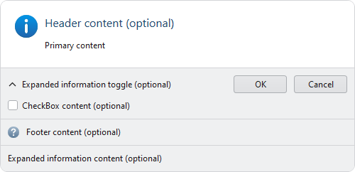

# User Prompt

**User Prompt** provides a modern replacement for traditional **MessageBox** or **Task Dialog** functionality with full support for [Actipro Themes](../../themes/index.md).



*UserPromptControl with optional content areas labeled, OK/Cancel buttons, Information status image, and optional footer image.*

User Prompt functionality is enabled by the [UserPromptControl](xref:ActiproSoftware.Windows.Controls.UserPromptControl) (pictured above) and [UserPromptWindow](xref:ActiproSoftware.Windows.Controls.UserPromptWindow) that is used to host the control as a modal dialog. [ThemedMessageBox](xref:ActiproSoftware.Windows.Controls.ThemedMessageBox) is a drop-in replacement for `MessageBox` that uses the same API as `MessageBox.Show` to make it easy to convert any application.

## Replace MessageBox with ThemedMessageBox

The native WPF `MessageBox` is a convenient and effective component for prompting the user of an application, but the lack of theme support creates an inconsistent experience. This is especially true with applications utilizing a dark theme only to have a `MessageBox` dialog appear as a bright, white box on top of an otherwise dark canvas.

[ThemedMessageBox](xref:ActiproSoftware.Windows.Controls.ThemedMessageBox) is a fully themed drop-in replacement for `MessageBox` that intentionally uses the same arguments for the [ThemedMessageBox](xref:ActiproSoftware.Windows.Controls.ThemedMessageBox).[Show](xref:ActiproSoftware.Windows.Controls.ThemedMessageBox.Show*) method. This allows most applications to convert to fully themed prompts by replacing `MessageBox` with `ThemedMessageBox` in their existing code.

> [!NOTE]
> The `MessageBox.Show` overloads which accept `MessageBoxOptions` are not implemented by [ThemedMessageBox](xref:ActiproSoftware.Windows.Controls.ThemedMessageBox) since the functionality enabled by those options is not necessary for WPF windows. When converting, exclude any arguments for `MessageBoxOptions` and test your application for expected behavior.

### Alias-based Conversion

Since the API is the same between `MessageBox` and [ThemedMessageBox](xref:ActiproSoftware.Windows.Controls.ThemedMessageBox), an application can easily redirect all `MessageBox` usage to [ThemedMessageBox](xref:ActiproSoftware.Windows.Controls.ThemedMessageBox) by using an alias.

> [!TIP]
> Using an alias to convert an application to [ThemedMessageBox](xref:ActiproSoftware.Windows.Controls.ThemedMessageBox) will help ensure the native `MessageBox` is not accidentally used out of habit or by unknowing contributors.

The following code demonstrates using an alias in the same file:

```csharp
using MessageBox = ActiproSoftware.Windows.Controls.ThemedMessageBox;
...
MessageBox.Show("This message will be displayed by ThemedMessageBox without any other code change.");
```

Starting with C# v10, a global alias can be used to affect all files:

```csharp
global using MessageBox = ActiproSoftware.Windows.Controls.ThemedMessageBox;
```

> [!WARNING]
> The alias will not apply to any usage of `MessageBox` written with a fully- or partially-qualified domain name; e.g., `System.Windows.MessageBox.Show`.

### Limitations

Since [ThemedMessageBox](xref:ActiproSoftware.Windows.Controls.ThemedMessageBox) is designed for API compatibility with the native `MessageBox`, many of the advanced features of [UserPromptControl](xref:ActiproSoftware.Windows.Controls.UserPromptControl) are not available using the [ThemedMessageBox](xref:ActiproSoftware.Windows.Controls.ThemedMessageBox).[Show](xref:ActiproSoftware.Windows.Controls.ThemedMessageBox.Show*) method overloads. See the **Building a User Prompt** section below for details on how to use the [UserPromptControl](xref:ActiproSoftware.Windows.Controls.UserPromptControl) to compose more advanced prompts.

## Building a User Prompt

While [ThemedMessageBox](xref:ActiproSoftware.Windows.Controls.ThemedMessageBox).[Show](xref:ActiproSoftware.Windows.Controls.ThemedMessageBox.Show*) satisfies most prompting needs, [UserPromptControl](xref:ActiproSoftware.Windows.Controls.UserPromptControl) provides additional layout and customization options to meet more advanced needs. To build a user prompt, create a new instance of [UserPromptControl](xref:ActiproSoftware.Windows.Controls.UserPromptControl) and set the appropriate properties to achieve the desired result.

The following code demonstrates creating a [UserPromptControl](xref:ActiproSoftware.Windows.Controls.UserPromptControl) with a header, content, **Yes** & **No** buttons, and a **Question** status image:

```csharp
using ActiproSoftware.Windows.Controls;
...
var userPromptControl = new UserPromptControl() {
	Header = "Overwrite existing file?",
	Content = "The specified file already exists. Do you want to overwrite the file?",
	StandardButtons = UserPromptStandardButtons.YesNo,
	StandardStatusImage = UserPromptStandardImage.Question,
};
```

### Content

The `Content` property defines the primary message of the prompt. While typically set to a string-based value that is converted to a `TextBlock`, the `Content` property can support any content allowed by `ContentPresenter`.  Use `Content` to add progress bars, radio buttons, or richly formatted text to your prompts the same way you would define `Content` for any WPF control.

The [UserPromptControl](xref:ActiproSoftware.Windows.Controls.UserPromptControl) defines `Content` within a `ScrollViewer`. Use the [HorizontalScrollBarVisibility](xref:ActiproSoftware.Windows.Controls.UserPromptControl.HorizontalScrollBarVisibility) and [VerticalScrollBarVisibility](xref:ActiproSoftware.Windows.Controls.UserPromptControl.VerticalScrollBarVisibility) properties to manage scroll bar visibility.

Any `TextBlock` controls used within `Content` will wrap text by default.

### Buttons

A user typically responds to a prompt by invoking a button that corresponds to the desired response.  The available buttons are defined by the [ButtonItems](xref:ActiproSoftware.Windows.Controls.UserPromptControl.ButtonItems) property that can be set to any `IEnumerable`. Each available object will displayed as a `Button` by the [UserPromptButtonItemsControl](xref:ActiproSoftware.Windows.Controls.Primitives.UserPromptButtonItemsControl).

While the [ButtonItems](xref:ActiproSoftware.Windows.Controls.UserPromptControl.ButtonItems) property allows for any button to be defined, most prompts can be built using several commonly-used buttons defined by the [UserPromptStandardButtons](xref:ActiproSoftware.Windows.Controls.UserPromptStandardButtons) enumeration.  These flags can be easily combined to display a fixed set of buttons to the user. Instead of populating the [ButtonItems](xref:ActiproSoftware.Windows.Controls.UserPromptControl.ButtonItems) property, set the [StandardButtons](xref:ActiproSoftware.Windows.Controls.UserPromptControl.StandardButtons) property to the desired combination of commonly-used buttons.

A special [Help](xref:ActiproSoftware.Windows.Controls.UserPromptStandardButtons.Help) button can be included in [StandardButtons](xref:ActiproSoftware.Windows.Controls.UserPromptControl.StandardButtons).  Invoking the `Help` button will execute the command designated by the [HelpCommand](xref:ActiproSoftware.Windows.Controls.UserPromptControl.HelpCommand) property.  An additional [HelpCommandParameter](xref:ActiproSoftware.Windows.Controls.UserPromptControl.HelpCommandParameter) can also be populated that will be passed to the [HelpCommand](xref:ActiproSoftware.Windows.Controls.UserPromptControl.HelpCommand) when invoked.

> [!TIP]
> Several popular combinations of buttons are predefined for convenience. For instance, the value [UserPromptStandardButtons](xref:ActiproSoftware.Windows.Controls.UserPromptStandardButtons).[YesNoCancel](xref:ActiproSoftware.Windows.Controls.UserPromptStandardButtons.YesNoCancel) can be used to display [UserPromptStandardButtons](xref:ActiproSoftware.Windows.Controls.UserPromptStandardButtons).[Yes](xref:ActiproSoftware.Windows.Controls.UserPromptStandardButtons.Yes), [UserPromptStandardButtons](xref:ActiproSoftware.Windows.Controls.UserPromptStandardButtons).[No](xref:ActiproSoftware.Windows.Controls.UserPromptStandardButtons.No), and [UserPromptStandardButtons](xref:ActiproSoftware.Windows.Controls.UserPromptStandardButtons).[Cancel](xref:ActiproSoftware.Windows.Controls.UserPromptStandardButtons.Cancel) buttons on the prompt.

The following demonstrates creating a [UserPromptControl](xref:ActiproSoftware.Windows.Controls.UserPromptControl) with standard [Retry](xref:ActiproSoftware.Windows.Controls.UserPromptStandardButtons.Retry) and [Ignore](xref:ActiproSoftware.Windows.Controls.UserPromptStandardButtons.Ignore) buttons:

```csharp
using ActiproSoftware.Windows.Controls;
...
var userPromptControl = new UserPromptControl() {
	Content = "Error processing file. How do you want to proceed?",
	StandardButtons = UserPromptStandardButtons.Retry | UserPromptStandardButtons.Ignore,
};
```

> [!WARNING]
> The [StandardButtons](xref:ActiproSoftware.Windows.Controls.UserPromptControl.StandardButtons) property is ignored if the [ButtonItems](xref:ActiproSoftware.Windows.Controls.UserPromptControl.ButtonItems) property is explicitly populated.

> [!TIP]
> See the **Configuring and Evaluating Results** section below for more detail on how to associate [ButtonItems](xref:ActiproSoftware.Windows.Controls.UserPromptControl.ButtonItems) objects with a [UserPromptStandardResult](xref:ActiproSoftware.Windows.Controls.UserPromptStandardResult).

### Status Image

An image can be used to visually communicate the status or classification of the prompt displayed. Users can quickly differentiate an error from a warning based on the image displayed with the prompt.

The [StatusImageSource](xref:ActiproSoftware.Windows.Controls.UserPromptControl.StatusImageSource) property can be set to any 32x32 `ImageSource`.  The following demonstrates creating a [UserPromptControl](xref:ActiproSoftware.Windows.Controls.UserPromptControl) with a status image from an `ImageSource`:

```csharp
using ActiproSoftware.Windows.Controls;
using System;
using System.Windows.Media.Imaging;
...
var userPromptControl = new UserPromptControl() {
	Content = "The file has been saved.",
	StatusImageSource = new BitmapImage(new Uri("pack://application:,,,/SampleBrowser;component/Images/Icons/Save32.png")),
};
```

Several common images like those for an **Error** or **Warning** are defined by the [UserPromptStandardImage](xref:ActiproSoftware.Windows.Controls.UserPromptStandardImage) enumeration.  Instead of populating the [StatusImageSource](xref:ActiproSoftware.Windows.Controls.UserPromptControl.StatusImageSource) property, set the [StandardStatusImage](xref:ActiproSoftware.Windows.Controls.UserPromptControl.StandardStatusImage) property to one of the [UserPromptStandardImage](xref:ActiproSoftware.Windows.Controls.UserPromptStandardImage) values. The following demonstrates creating a [UserPromptControl](xref:ActiproSoftware.Windows.Controls.UserPromptControl) with a standard [Information](xref:ActiproSoftware.Windows.Controls.UserPromptStandardImage.Information) image:

```csharp
using ActiproSoftware.Windows.Controls;
...
var userPromptControl = new UserPromptControl() {
	Content = "The file has been saved.",
	StandardStatusImage = UserPromptStandardImage.Information,
};
```

> [!WARNING]
> The [StandardStatusImage](xref:ActiproSoftware.Windows.Controls.UserPromptControl.StandardStatusImage) property is ignored if the [StatusImageSource](xref:ActiproSoftware.Windows.Controls.UserPromptControl.StatusImageSource) property is explicitly populated.

### Header

The `Header` property can be defined to prominently display content at the top of the prompt. Any object supported by `ContentPresenter` can be used for the header, but it is typically a string-based value represented by a `TextBlock`.

Any `TextBlock` controls used within `Header` will wrap text by default. Any `TextElement` will also have the `FontSize` and `Foreground` properties default to the [HeaderFontSize](xref:ActiproSoftware.Windows.Controls.UserPromptControl.HeaderFontSize) and [HeaderForeground](xref:ActiproSoftware.Windows.Controls.UserPromptControl.HeaderForeground) property values, respectively.

> [!TIP]
> Consider using `Header` as an alternative to a dialog window title when captioning a prompt since it is more prominently displayed to the user.

The following code demonstrates creating a [UserPromptControl](xref:ActiproSoftware.Windows.Controls.UserPromptControl) with a `Header`:

```csharp
using ActiproSoftware.Windows.Controls;
...
var userPromptControl = new UserPromptControl() {
	Header = "Export complete",
	Content = "Your project has been successfully exported.",
};
```

### Footer

The `Footer` property can be defined to display content at the bottom of the prompt. Any object supported by `ContentPresenter` can be used for the footer, but it is typically a string-based value represented by a `TextBlock`. Adding a `Hyperlink` to a footer that links to more information is also a common practice.

Any `TextBlock` controls used within `Footer` will wrap text by default.

Use the [FooterImageSource](xref:ActiproSoftware.Windows.Controls.UserPromptControl.FooterImageSource) property to optionally display a 16x16 image next to the `Footer` content.

The following code demonstrates creating a [UserPromptControl](xref:ActiproSoftware.Windows.Controls.UserPromptControl) with a `Footer` that contains a hyperlink and an image:

```csharp
using ActiproSoftware.Windows.Controls;
using System;
using System.Windows.Controls;
using System.Windows.Documents;
using System.Windows.Media.Imaging;
...

// Initialize a hyperlink with a click handler
var hyperlink = new Hyperlink(new Run("here"));
hyperlink.Click += OnShowMoreInformationHyperlinkClick;
						
// Build the prompt
var userPromptControl = new UserPromptControl() {
	Content = "This operation is not currently supported.",
	FooterImageSource = new BitmapImage(new Uri("pack://application:,,,/SampleBrowser;component/Images/Icons/Help16.png")),
	Footer = new TextBlock() {
		Inlines = {
			new Run("Click "),
			hyperlink,
			new Run(" for more information")
		}
	}
};
```

### CheckBox

The [CheckBoxContent](xref:ActiproSoftware.Windows.Controls.UserPromptControl.CheckBoxContent) property can be defined to display a `CheckBox` control near the bottom of the prompt. Any object supported by `ContentPresenter` can be used for `CheckBoxContent`, but it is typically a string-based value represented by a `TextBlock` with full support for `AccessText`. This `CheckBox` is commonly used to allow users to indicate they no longer want to receive prompts.

The [IsChecked](xref:ActiproSoftware.Windows.Controls.UserPromptControl.IsChecked) property indicates the checked state of the `CheckBox` control.

The following code demonstrates creating a [UserPromptControl](xref:ActiproSoftware.Windows.Controls.UserPromptControl) with a `CheckBox` for a user to indicate they do not want to see the prompt again:

```csharp
using ActiproSoftware.Windows.Controls;
...
var userPromptControl = new UserPromptControl() {
	Content = "File saved successfully.",
	CheckBoxContent = "_Do not show this message again"
};
```

> [!NOTE]
> The [UserPromptControl](xref:ActiproSoftware.Windows.Controls.UserPromptControl) only displays the `CheckBox` and manages the state. The developer is responsible for persisting settings and suppress any prompts the user has requested not to be displayed.

### Expanded Information

The [ExpandedInformationContent](xref:ActiproSoftware.Windows.Controls.UserPromptControl.ExpandedInformationContent) property can be defined to enable the user to toggle the display of additional content that might not be ideal to display all the time.  Any object supported by `ContentPresenter` can be used for the content.

Any `TextBlock` controls used within `ExpandedInformationContent` will wrap text by default.

When [ExpandedInformationContent](xref:ActiproSoftware.Windows.Controls.UserPromptControl.ExpandedInformationContent) is defined, a toggle control will appear at the bottom of the prompt that the user can invoke to display the additional information.  Use the [ExpandedInformationCollapsedHeaderText](xref:ActiproSoftware.Windows.Controls.UserPromptControl.ExpandedInformationCollapsedHeaderText) property to specify the header of the toggle when it is collapsed, and the [ExpandedInformationExpandedHeaderText](xref:ActiproSoftware.Windows.Controls.UserPromptControl.ExpandedInformationExpandedHeaderText) property to specify the header when expanded.  The [IsExpanded](xref:ActiproSoftware.Windows.Controls.UserPromptControl.IsExpanded) property tracks the expansion state.

The following code demonstrates creating a [UserPromptControl](xref:ActiproSoftware.Windows.Controls.UserPromptControl) with the stack trace of an `Exception` displayed in the [ExpandedInformationContent](xref:ActiproSoftware.Windows.Controls.UserPromptControl.ExpandedInformationContent) using a read-only `TextBox`:

```csharp
using ActiproSoftware.Windows.Controls;
using System;
using System.Windows.Controls;
...
try {
	...
}
catch (Exception ex) {
	var userPromptControl = new UserPromptControl() {
		Content = "An error occurred.",
		StandardStatusImage = UserPromptStandardImage.Error,
		ExpandedInformationCollapsedHeaderText = "Show details",
		ExpandedInformationExpandedHeaderText = "Hide details",
		ExpandedInformationContent = new TextBox() {
			IsReadOnly = true,
			MaxLines = 5,
			HorizontalScrollBarVisibility = ScrollBarVisibility.Auto,
			VerticalScrollBarVisibility = ScrollBarVisibility.Auto,
			Text = ex.ToString()
		}
	}
};
```

## Showing a User Prompt Dialog

Once a [UserPromptControl](xref:ActiproSoftware.Windows.Controls.UserPromptControl) is built as described in the **Building a User Prompt** section above, it is typically displayed to the user as a modal dialog. Similar to the native `MessageBox.Show` method, the [UserPromptWindow](xref:ActiproSoftware.Windows.Controls.UserPromptWindow).[ShowDialog](xref:ActiproSoftware.Windows.Controls.UserPromptWindow.ShowDialog*) method can be used to display the control in a modal dialog that will automatically close and return a [UserPromptStandardResult](xref:ActiproSoftware.Windows.Controls.UserPromptStandardResult) when the user responds.

The following code demonstrates showing a [UserPromptControl](xref:ActiproSoftware.Windows.Controls.UserPromptControl) as a modal dialog using [UserPromptWindow](xref:ActiproSoftware.Windows.Controls.UserPromptWindow) and evaluating the result:

```csharp
using ActiproSoftware.Windows.Controls;
...
var userPromptControl = new UserPromptControl() {
	Content = "This file has been modified. Do you want to save your changes before closing?",
	StandardButtons = UserPromptStandardButtons.YesNo,
};
var result = UserPromptWindow.ShowDialog(userPromptControl, "Save Changes?");
if (result == UserPromptStandardResult.Yes) {
	// Insert code to save changes here
}
```

> [!NOTE]
> See the **Configuring and Evaluating Results** section below for more details on working with the result of a prompt.

### Title

The [UserPromptWindow](xref:ActiproSoftware.Windows.Controls.UserPromptWindow).[ShowDialog](xref:ActiproSoftware.Windows.Controls.UserPromptWindow.ShowDialog*) method optionally accepts an argument that will be used as the title of the [UserPromptWindow](xref:ActiproSoftware.Windows.Controls.UserPromptWindow) when displayed. When an overload is used that does not pass a title or the specified title is `null`, the [UserPromptWindow](xref:ActiproSoftware.Windows.Controls.UserPromptWindow).[DefaultTitle](xref:ActiproSoftware.Windows.Controls.UserPromptWindow.DefaultTitle) will be used. If [DefaultTitle](xref:ActiproSoftware.Windows.Controls.UserPromptWindow.DefaultTitle) is also `null` the [UserPromptControl](xref:ActiproSoftware.Windows.Controls.UserPromptControl).[StandardStatusImage](xref:ActiproSoftware.Windows.Controls.UserPromptControl.StandardStatusImage) property is used to provide a contextually appropriate title; e.g., the title is set to `"Warning"` for [UserPromptStandardImage](xref:ActiproSoftware.Windows.Controls.UserPromptStandardImage).[Warning](xref:ActiproSoftware.Windows.Controls.UserPromptStandardImage.Warning).

> [!TIP]
> See the **Customize String Resources** section below for details on how to customize the string resources used for default titles.

### Close Button

A [UserPromptWindow](xref:ActiproSoftware.Windows.Controls.UserPromptWindow) will only display a **Close** button in the **Title Bar** if a response can be associated with closing the window. The [CloseResult](xref:ActiproSoftware.Windows.Controls.UserPromptControl.CloseResult) property is used to define the result associated with closing the window instead of invoking an available button. When set to [UserPromptStandardResult](xref:ActiproSoftware.Windows.Controls.UserPromptStandardResult).[None](xref:ActiproSoftware.Windows.Controls.UserPromptStandardResult.None), the **Close** button will not be displayed.

When [CloseResult](xref:ActiproSoftware.Windows.Controls.UserPromptControl.CloseResult) is set to `null` and the [StandardButtons](xref:ActiproSoftware.Windows.Controls.UserPromptControl.StandardButtons) property is used to define the available buttons, an appropriate [UserPromptStandardResult](xref:ActiproSoftware.Windows.Controls.UserPromptStandardResult) will be assigned to [CloseResult](xref:ActiproSoftware.Windows.Controls.UserPromptControl.CloseResult) based on the current value of [StandardButtons](xref:ActiproSoftware.Windows.Controls.UserPromptControl.StandardButtons).

For example, using [UserPromptStandardButtons](xref:ActiproSoftware.Windows.Controls.UserPromptStandardButtons).[YesNoCancel](xref:ActiproSoftware.Windows.Controls.UserPromptStandardButtons.YesNoCancel) will automatically assign [UserPromptStandardResult](xref:ActiproSoftware.Windows.Controls.UserPromptStandardResult).[Cancel](xref:ActiproSoftware.Windows.Controls.UserPromptStandardResult.Cancel) as the [CloseResult](xref:ActiproSoftware.Windows.Controls.UserPromptControl.CloseResult). Explicitly set the [CloseResult](xref:ActiproSoftware.Windows.Controls.UserPromptControl.CloseResult) to [UserPromptStandardResult](xref:ActiproSoftware.Windows.Controls.UserPromptStandardResult).[None](xref:ActiproSoftware.Windows.Controls.UserPromptStandardResult.None) to prevent the **Close** button from automatically displaying.

## Configuring and Evaluating Results

The [UserPromptControl](xref:ActiproSoftware.Windows.Controls.UserPromptControl).[Result](xref:ActiproSoftware.Windows.Controls.UserPromptControl.Result) property is used to read or write the user's response to a prompt.

The [UserPromptWindow](xref:ActiproSoftware.Windows.Controls.UserPromptWindow).[ShowDialog](xref:ActiproSoftware.Windows.Controls.UserPromptWindow.ShowDialog*) method returns the [UserPromptControl](xref:ActiproSoftware.Windows.Controls.UserPromptControl).[Result](xref:ActiproSoftware.Windows.Controls.UserPromptControl.Result).  If the [UserPromptWindow](xref:ActiproSoftware.Windows.Controls.UserPromptWindow) is closed without invoking one of the available buttons, the value of [UserPromptControl](xref:ActiproSoftware.Windows.Controls.UserPromptControl).[CloseResult](xref:ActiproSoftware.Windows.Controls.UserPromptControl.CloseResult) is returned instead.

The [UserPromptControl](xref:ActiproSoftware.Windows.Controls.UserPromptControl).[Responding](xref:ActiproSoftware.Windows.Controls.UserPromptControl.Responding) event is raised when the [UserPromptControl](xref:ActiproSoftware.Windows.Controls.UserPromptControl).[Result](xref:ActiproSoftware.Windows.Controls.UserPromptControl.Result) property is changed. [UserPromptWindow](xref:ActiproSoftware.Windows.Controls.UserPromptWindow) listens to this event to know when to close the dialog.

### ButtonResult Attached Property

The `UserPromptControl.ButtonResult` attached property is used to associate a `Button` with a specific [UserPromptStandardResult](xref:ActiproSoftware.Windows.Controls.UserPromptStandardResult).  Any `Button` without an explicitly defined `Button.Command` will be automatically assigned a special `ICommand` that, when invoked, will read the `UserPromptControl.ButtonResult` attached property of the `Button` and assign that value to [UserPromptControl](xref:ActiproSoftware.Windows.Controls.UserPromptControl).[Result](xref:ActiproSoftware.Windows.Controls.UserPromptControl.Result).

The `UserPromptControl.ButtonResult` attached property is also used to identify which `Button` corresponds to [UserPromptControl](xref:ActiproSoftware.Windows.Controls.UserPromptControl).[DefaultResult](xref:ActiproSoftware.Windows.Controls.UserPromptControl.DefaultResult) and will receive keyboard focus when shown in a [UserPromptWindow](xref:ActiproSoftware.Windows.Controls.UserPromptWindow).

> [!TIP]
> The static helper methods [UserPromptControl](xref:ActiproSoftware.Windows.Controls.UserPromptControl).[GetButtonResult](xref:ActiproSoftware.Windows.Controls.UserPromptControl.GetButtonResult*) and [UserPromptControl](xref:ActiproSoftware.Windows.Controls.UserPromptControl).[SetButtonResult](xref:ActiproSoftware.Windows.Controls.UserPromptControl.SetButtonResult*) can be used to read and write the `UserPromptControl.ButtonResult` attached property of a `Button`.

### Standard Button Result

Each individual value for [UserPromptStandardButtons](xref:ActiproSoftware.Windows.Controls.UserPromptStandardButtons) has a corresponding value in [UserPromptStandardResult](xref:ActiproSoftware.Windows.Controls.UserPromptStandardResult).  For example, the [UserPromptStandardButtons](xref:ActiproSoftware.Windows.Controls.UserPromptStandardButtons).[OK](xref:ActiproSoftware.Windows.Controls.UserPromptStandardButtons.OK) button corresponds to the [UserPromptStandardResult](xref:ActiproSoftware.Windows.Controls.UserPromptStandardResult).[OK](xref:ActiproSoftware.Windows.Controls.UserPromptStandardResult.OK) result.  When using the [UserPromptControl](xref:ActiproSoftware.Windows.Controls.UserPromptControl).[StandardButtons](xref:ActiproSoftware.Windows.Controls.UserPromptControl.StandardButtons) property to define buttons, the `UserPromptControl.ButtonResult` attached property is automatically populated with the corresponding [UserPromptStandardResult](xref:ActiproSoftware.Windows.Controls.UserPromptStandardResult). Invoking one of the buttons will assign the value to [UserPromptControl](xref:ActiproSoftware.Windows.Controls.UserPromptControl).[Result](xref:ActiproSoftware.Windows.Controls.UserPromptControl.Result).

> [!NOTE]
> The [UserPromptStandardButtons](xref:ActiproSoftware.Windows.Controls.UserPromptStandardButtons).[Help](xref:ActiproSoftware.Windows.Controls.UserPromptStandardButtons.Help) button is only used to invoke the [UserPromptControl](xref:ActiproSoftware.Windows.Controls.UserPromptControl).[HelpCommand](xref:ActiproSoftware.Windows.Controls.UserPromptControl.HelpCommand).  It does not assign a [Result](xref:ActiproSoftware.Windows.Controls.UserPromptControl.Result) and thus will not cause the [UserPromptWindow](xref:ActiproSoftware.Windows.Controls.UserPromptWindow) to close when invoked.

### Custom Button Result

When populating [UserPromptControl](xref:ActiproSoftware.Windows.Controls.UserPromptControl).[ButtonItems](xref:ActiproSoftware.Windows.Controls.UserPromptControl.ButtonItems) with custom `Button` instances, each button can optionally be associated with a specific [UserPromptStandardResult](xref:ActiproSoftware.Windows.Controls.UserPromptStandardResult) using the `UserPromptControl.ButtonResult` attached property.  Any `Button` without an explicitly defined `Button.Command` will be automatically assigned a special `ICommand` that, when invoked, will read the `UserPromptControl.ButtonResult` attached property of the `Button` and assign that value to [UserPromptControl](xref:ActiproSoftware.Windows.Controls.UserPromptControl).[Result](xref:ActiproSoftware.Windows.Controls.UserPromptControl.Result).

> [!IMPORTANT]
> Any `Button` which defines its own `Button.Command` must manually assign an appropriate value to [UserPromptControl](xref:ActiproSoftware.Windows.Controls.UserPromptControl).[Result](xref:ActiproSoftware.Windows.Controls.UserPromptControl.Result) when invoked.

The following code demonstrates how to assign a [UserPromptStandardResult](xref:ActiproSoftware.Windows.Controls.UserPromptStandardResult) to a custom button when building a [UserPromptControl](xref:ActiproSoftware.Windows.Controls.UserPromptControl):

```csharp
using ActiproSoftware.Windows.Controls;
using System.Windows.Controls;
...

var customYesButton = new Button() { Content = "Yes" };
UserPromptControl.SetButtonResult(customYesButton, UserPromptStandardResult.Yes);

var customNoButton = new Button() { Content = "No" };
UserPromptControl.SetButtonResult(customNoButton, UserPromptStandardResult.No);

var userPromptControl = new UserPromptControl() {
	Content = "Do you want to continue?",
	ButtonItems = new Button[] { customYesButton, customNoButton }
};
```

### Responding Event

The [UserPromptControl](xref:ActiproSoftware.Windows.Controls.UserPromptControl).[Responding](xref:ActiproSoftware.Windows.Controls.UserPromptControl.Responding) event is raised when the [UserPromptControl](xref:ActiproSoftware.Windows.Controls.UserPromptControl).[Result](xref:ActiproSoftware.Windows.Controls.UserPromptControl.Result) property is changed. [UserPromptWindow](xref:ActiproSoftware.Windows.Controls.UserPromptWindow) listens to this event to know when to close the dialog.

## Playing a SystemSound

When a native `MessageBox` is displayed, an associated `System.Media.SystemSound` may be played based on the value of `MessageBoxImage` used.  Set [SystemSound](xref:ActiproSoftware.Windows.Controls.UserPromptControl.SystemSound) to any `SystemSound` and it will be played when the [UserPromptWindow](xref:ActiproSoftware.Windows.Controls.UserPromptWindow) is shown.

When [SystemSound](xref:ActiproSoftware.Windows.Controls.UserPromptControl.SystemSound) is set to `null` and the [StandardStatusImage](xref:ActiproSoftware.Windows.Controls.UserPromptControl.StandardStatusImage) property is used to define the status image, an appropriate `SystemSound` will be automatically assigned based on the image as shown in the following table:

| StandardStatusImage | SystemSound |
|-----|-----|
| [None](xref:ActiproSoftware.Windows.Controls.UserPromptStandardImage.None) | *None* |
| [Error](xref:ActiproSoftware.Windows.Controls.UserPromptStandardImage.Error) | `System.Media.SystemSounds.Hand` |
| [Information](xref:ActiproSoftware.Windows.Controls.UserPromptStandardImage.Information) | `System.Media.SystemSounds.Asterisk` |
| [Question](xref:ActiproSoftware.Windows.Controls.UserPromptStandardImage.Question) | `System.Media.SystemSounds.Question` |
| [Warning](xref:ActiproSoftware.Windows.Controls.UserPromptStandardImage.Warning) | `System.Media.SystemSounds.Exclamation` |

## Customize Clipboard Content

When a native `MessageBox` is displayed, the **Copy** (`Ctrl+C`) command will transfer the contents of the dialog to the system clipboard. [UserPromptWindow](xref:ActiproSoftware.Windows.Controls.UserPromptWindow) supports this feature as well. Since [UserPromptWindow](xref:ActiproSoftware.Windows.Controls.UserPromptWindow) also supports rich content of potentially complex control structures, it may not be possible to accurately translate the various properties to textual clipboard content.

The properties in the following table have a corresponding string-based property that can be used to explicitly define the text to be placed on the system clipboard for that object when the **Copy** command is invoked.

| Property | Corresponding Clipboard Property |
|-----|-----|
| [ButtonItems](xref:ActiproSoftware.Windows.Controls.UserPromptControl.ButtonItems) | [ButtonItemsClipboardText](xref:ActiproSoftware.Windows.Controls.UserPromptControl.ButtonItemsClipboardText) |
| [CheckBoxContent](xref:ActiproSoftware.Windows.Controls.UserPromptControl.CheckBoxContent) | [CheckBoxContentClipboardText](xref:ActiproSoftware.Windows.Controls.UserPromptControl.CheckBoxContentClipboardText) |
| `Content` | [ContentClipboardText](xref:ActiproSoftware.Windows.Controls.UserPromptControl.ContentClipboardText) |
| [ExpandedInformationContent](xref:ActiproSoftware.Windows.Controls.UserPromptControl.ExpandedInformationContent) | [ExpandedInformationContentClipboardText](xref:ActiproSoftware.Windows.Controls.UserPromptControl.ExpandedInformationContentClipboardText) |
| [Footer](xref:ActiproSoftware.Windows.Controls.UserPromptControl.Footer) | [FooterClipboardText](xref:ActiproSoftware.Windows.Controls.UserPromptControl.FooterClipboardText) |
| `Header` | [HeaderClipboardText](xref:ActiproSoftware.Windows.Controls.UserPromptControl.HeaderClipboardText) |

## Customize UserPromptControl Appearance

Several properties are available to customize the appearance of the control. The following additional customizations are also available:

### Header

The [HeaderBackground](xref:ActiproSoftware.Windows.Controls.UserPromptControl.HeaderBackground), [HeaderForeground](xref:ActiproSoftware.Windows.Controls.UserPromptControl.HeaderForeground), [HeaderFontSize](xref:ActiproSoftware.Windows.Controls.UserPromptControl.HeaderFontSize), [HeaderBorderBrush](xref:ActiproSoftware.Windows.Controls.UserPromptControl.HeaderBorderBrush), [HeaderBorderThickness](xref:ActiproSoftware.Windows.Controls.UserPromptControl.HeaderBorderThickness) properties are available to customize the header.

When either the [HeaderBackground](xref:ActiproSoftware.Windows.Controls.UserPromptControl.HeaderBackground) or [HeaderBorderBrush](xref:ActiproSoftware.Windows.Controls.UserPromptControl.HeaderBorderBrush) properties are populated, the layout of the **Header** and **Status Image** will automatically shift their vertical alignment for a consistent layout.

### Images

Any `ImageSource` can be set to the [StatusImageSource](xref:ActiproSoftware.Windows.Controls.UserPromptControl.StatusImageSource) or [FooterImageSource](xref:ActiproSoftware.Windows.Controls.UserPromptControl.FooterImageSource) properties for a custom look.

The images used by [UserPromptStandardImage](xref:ActiproSoftware.Windows.Controls.UserPromptStandardImage) can also be customized by assigning a custom [ImageProvider](xref:ActiproSoftware.Windows.Media.ImageProvider) to the [ImageProvider](xref:ActiproSoftware.Windows.Media.ImageProvider).[Default](xref:ActiproSoftware.Windows.Media.ImageProvider.Default) property. Each value for [UserPromptStandardImage](xref:ActiproSoftware.Windows.Controls.UserPromptStandardImage) corresponds to key of the same name defined by [SharedImageSourceKeys](xref:ActiproSoftware.Windows.Media.SharedImageSourceKeys). For example, the image [UserPromptStandardImage](xref:ActiproSoftware.Windows.Controls.UserPromptStandardImage).[Warning](xref:ActiproSoftware.Windows.Controls.UserPromptStandardImage.Warning) corresponds to the key [SharedImageSourceKeys](xref:ActiproSoftware.Windows.Media.SharedImageSourceKeys).[Warning](xref:ActiproSoftware.Windows.Media.SharedImageSourceKeys.Warning). A custom class which derives from [ImageProvider](xref:ActiproSoftware.Windows.Media.ImageProvider) can override the [ImageProvider](xref:ActiproSoftware.Windows.Media.ImageProvider).[GetImageSource](xref:ActiproSoftware.Windows.Media.ImageProvider.GetImageSource*) method to return a custom `ImageSource` for one or more of those keys.

## Customize UserPromptWindow

The [UserPromptWindow](xref:ActiproSoftware.Windows.Controls.UserPromptWindow) does not have a public constructor and is only created by the [UserPromptWindow](xref:ActiproSoftware.Windows.Controls.UserPromptWindow).[ShowDialog](xref:ActiproSoftware.Windows.Controls.UserPromptWindow.ShowDialog*) method.  One of the arguments for [ShowDialog](xref:ActiproSoftware.Windows.Controls.UserPromptWindow.ShowDialog*) allows you to pass an `Action<UserPromptWindow>` which is invoked with a reference to the [UserPromptWindow](xref:ActiproSoftware.Windows.Controls.UserPromptWindow) after it is configured, but before it is shown. This callback allows the [UserPromptWindow](xref:ActiproSoftware.Windows.Controls.UserPromptWindow) to be customized.

The following code demonstrates using the callback to customize the flow direction of the window:

```csharp
using ActiproSoftware.Windows.Controls;
using System.Windows;
...

var userPromptControl = new UserPromptControl() { ... };
Window owner = null; // Use default

var result = UserPromptWindow.ShowDialog(userPromptControl, "Window Title", owner, (window) => {
	window.FlowDirection = FlowDirection.RightToLeft;
});
```

## Customize String Resources

The following string resources are available to localize or customize built-in strings:

| Resource key | Description |
|-----|-----|
| `UICommandCloseWindowText` | The text displayed as the tooltip for the **Close** button used by [UserPromptWindow](xref:ActiproSoftware.Windows.Controls.UserPromptWindow). The default value is `"Close"`. |
| `UIDialogButtonAbortText` | The label of the standard [Abort](xref:ActiproSoftware.Windows.Controls.UserPromptStandardButtons.Abort) button. The default value is `"_Abort"`. |
| `UIDialogButtonCancelText` | The label of the standard [Cancel](xref:ActiproSoftware.Windows.Controls.UserPromptStandardButtons.Cancel) button. The default value is `"Cancel"`. |
| `UIDialogButtonCloseText` | The label of the standard [Close](xref:ActiproSoftware.Windows.Controls.UserPromptStandardButtons.Close) button. The default value is `"C_lose"`. |
| `UIDialogButtonHelpText` | The label of the standard [Help](xref:ActiproSoftware.Windows.Controls.UserPromptStandardButtons.Help) button. The default value is `"Help"`. |
| `UIDialogButtonIgnoreText` | The label of the standard [Ignore](xref:ActiproSoftware.Windows.Controls.UserPromptStandardButtons.Ignore) button. The default value is `"_Ignore"`. |
| `UIDialogButtonNoText` | The label of the standard [No](xref:ActiproSoftware.Windows.Controls.UserPromptStandardButtons.No) button. The default value is `"_No"`. |
| `UIDialogButtonOKText` | The label of the standard [OK](xref:ActiproSoftware.Windows.Controls.UserPromptStandardButtons.OK) button. The default value is `"OK"`. |
| `UIDialogButtonRetryText` | The label of the standard [Retry](xref:ActiproSoftware.Windows.Controls.UserPromptStandardButtons.Retry) button. The default value is `"_Retry"`. |
| `UIDialogButtonYesText` | The label of the standard [Yes](xref:ActiproSoftware.Windows.Controls.UserPromptStandardButtons.Yes) button. The default value is `"_Yes"`. |
| `UIDialogTitleErrorText` | The default title used by [UserPromptWindow](xref:ActiproSoftware.Windows.Controls.UserPromptWindow) when an explicit title is not defined and [UserPromptControl](xref:ActiproSoftware.Windows.Controls.UserPromptControl).[StandardStatusImage](xref:ActiproSoftware.Windows.Controls.UserPromptControl.StandardStatusImage) is set to [Error](xref:ActiproSoftware.Windows.Controls.UserPromptStandardImage.Error). The default value is `"Error"`. |
| `UIDialogTitleIndeterminateText` | The default title used by [UserPromptWindow](xref:ActiproSoftware.Windows.Controls.UserPromptWindow) when an explicit title is not defined and [UserPromptControl](xref:ActiproSoftware.Windows.Controls.UserPromptControl).[StandardStatusImage](xref:ActiproSoftware.Windows.Controls.UserPromptControl.StandardStatusImage) is set to [None](xref:ActiproSoftware.Windows.Controls.UserPromptStandardImage.None) or [UserPromptControl](xref:ActiproSoftware.Windows.Controls.UserPromptControl).[StatusImageSource](xref:ActiproSoftware.Windows.Controls.UserPromptControl.StatusImageSource) is populated. The default value is `String.Empty`. |
| `UIDialogTitleInformationText` | The default title used by [UserPromptWindow](xref:ActiproSoftware.Windows.Controls.UserPromptWindow) when an explicit title is not defined and [UserPromptControl](xref:ActiproSoftware.Windows.Controls.UserPromptControl).[StandardStatusImage](xref:ActiproSoftware.Windows.Controls.UserPromptControl.StandardStatusImage) is set to [Information](xref:ActiproSoftware.Windows.Controls.UserPromptStandardImage.Information). The default value is `"Information"`. |
| `UIDialogTitleQuestionText` | The default title used by [UserPromptWindow](xref:ActiproSoftware.Windows.Controls.UserPromptWindow) when an explicit title is not defined and [UserPromptControl](xref:ActiproSoftware.Windows.Controls.UserPromptControl).[StandardStatusImage](xref:ActiproSoftware.Windows.Controls.UserPromptControl.StandardStatusImage) is set to [Question](xref:ActiproSoftware.Windows.Controls.UserPromptStandardImage.Question). The default value is `"Question"`. |
| `UIDialogTitleWarningText` | The default title used by [UserPromptWindow](xref:ActiproSoftware.Windows.Controls.UserPromptWindow) when an explicit title is not defined and [UserPromptControl](xref:ActiproSoftware.Windows.Controls.UserPromptControl).[StandardStatusImage](xref:ActiproSoftware.Windows.Controls.UserPromptControl.StandardStatusImage) is set to [Warning](xref:ActiproSoftware.Windows.Controls.UserPromptStandardImage.Warning). The default value is `"Warning"`. |

This code shows how to set custom values for the string resources.

```csharp
ActiproSoftware.Products.Shared.SR.SetCustomString(ActiproSoftware.Products.Shared.SRName.UIDialogButtonRetryText.ToString(), "T_ry Again");
ActiproSoftware.Products.Shared.SR.SetCustomString(ActiproSoftware.Products.Shared.SRName.UIDialogButtonIgnoreText.ToString(), "Cont_inue");
```

 See the [Customizing String Resources](../../customizing-string-resources.md) topic for additional details.

## Theme Assets

See the [Theme Reusable Assets](../../themes/reusable-assets.md) topic for more details on using and customizing theme assets.  The following reusable assets are used by [UserPromptControl](xref:ActiproSoftware.Windows.Controls.UserPromptControl):

| Asset Resource Key | Description |
|-----|-----|
| [ContainerForegroundLowestNormalBrushKey](xref:ActiproSoftware.Windows.Themes.AssetResourceKeys.ContainerForegroundLowestNormalBrushKey) | Assigned to the following properties: `Foreground`. |
| [ContainerBackgroundLowestBrushKey](xref:ActiproSoftware.Windows.Themes.AssetResourceKeys.ContainerBackgroundLowestBrushKey) | Assigned to the following properties: `Background`. |
| [ContainerForegroundLowNormalBrushKey](xref:ActiproSoftware.Windows.Themes.AssetResourceKeys.ContainerForegroundLowNormalBrushKey) | Assigned to the following properties: [TrayForeground](xref:ActiproSoftware.Windows.Controls.UserPromptControl.TrayForeground). |
| [ContainerBackgroundLowBrushKey](xref:ActiproSoftware.Windows.Themes.AssetResourceKeys.ContainerBackgroundLowBrushKey) | Assigned to the following properties: [TrayBackground](xref:ActiproSoftware.Windows.Controls.UserPromptControl.TrayBackground). |
| [ContainerBorderLowBrushKey](xref:ActiproSoftware.Windows.Themes.AssetResourceKeys.ContainerBorderLowBrushKey) | Assigned to the following properties: `BorderBrush`. |
| [PrimaryAccentForegroundLowestNormalBrushKey](xref:ActiproSoftware.Windows.Themes.AssetResourceKeys.PrimaryAccentForegroundLowestNormalBrushKey) | Assigned to the following properties: [HeaderForeground](xref:ActiproSoftware.Windows.Controls.UserPromptControl.HeaderForeground). |
| [ExtraLargeFontSizeDoubleKey](xref:ActiproSoftware.Windows.Themes.AssetResourceKeys.ExtraLargeFontSizeDoubleKey) | Assigned to the following properties: [HeaderFontSize](xref:ActiproSoftware.Windows.Controls.UserPromptControl.HeaderFontSize). |
| [ContainerForegroundLowDisabledBrushKey](xref:ActiproSoftware.Windows.Themes.AssetResourceKeys.ContainerForegroundLowDisabledBrushKey) | Used for the focus rectangle of the **Expanded Information** toggle. |
| [ButtonForegroundHoverBrushKey](xref:ActiproSoftware.Windows.Themes.AssetResourceKeys.ButtonForegroundHoverBrushKey) | Assigned to the following properties of the **Expanded Information** toggle when the mouse is over the control: `Foreground`. |
| [ButtonForegroundPressedBrushKey](xref:ActiproSoftware.Windows.Themes.AssetResourceKeys.ButtonForegroundPressedBrushKey) | Assigned to the following properties of the **Expanded Information** toggle when pressed: `Foreground`. |
| [ContainerForegroundLowDisabledBrushKey](xref:ActiproSoftware.Windows.Themes.AssetResourceKeys.ContainerForegroundLowDisabledBrushKey) | Assigned to the following properties of the **Expanded Information** toggle when disabled: `Foreground`. |
