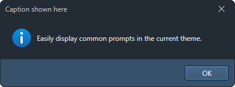

# ThemedMessageBox

The [ThemedMessageBox](xref:@ActiproUIRoot.Controls.ThemedMessageBox) class is intentionally designed to be consistent with the native WPF `MessageBox` API and can be used to quickly display the most common prompts.

@if (avalonia) {


*MessageBox dialog with optional status image*
}
@if (wpf) {


*ThemedMessageBox dialog with optional status image*
}

> [!TIP]
> See the [Builder Pattern](builder-pattern.md) topic for additional details on showing more advanced user prompts.

## Showing a ThemedMessageBox

The [ThemedMessageBox](xref:@ActiproUIRoot.Controls.ThemedMessageBox).[Show](xref:@ActiproUIRoot.Controls.ThemedMessageBox.Show*) method is used to show a basic prompt based on the arguments passed.  The only required argument is the text to be displayed, so the simplest prompt can be shown as follows:

@if (avalonia) {
```csharp
await MessageBox.Show("Operation complete.");
```
}
@if (wpf) {
```csharp
ThemedMessageBox.Show("Operation complete.");
```
}

@if (avalonia) {
There are two overloads of the [Show](xref:@ActiproUIRoot.Controls.MessageBox.Show*) method where one allows an owner  `TopLevel` (typically a `Window`) to be passed, and the other doesn't. All other arguments are identical.  The following basic arguments are available:

| Argument | Description |
|-----|-----|
| `messageBoxText` | The primary message text to be displayed. |
| `caption` | The title bar caption of the window. |
| `button` | One or more of the [MessageBoxButtons](xref:@ActiproUIRoot.Controls.MessageBoxButtons) values for each button to display. |
| `image` | One of the [MessageBoxImage](xref:@ActiproUIRoot.Controls.MessageBoxImage) values indicating a status image to display. |
| `defaultResult` | The default [MessageBoxResult](xref:@ActiproUIRoot.Controls.MessageBoxResult), which must correspond to one of the given `button` values. |

The following code demonstrates prompting the user with a question and storing the result:

```csharp
var result = await MessageBox.Show(
	"The specified file already exists. Do you want to overwrite the file?",
	"Overwrite existing file?",
	MessageBoxButtons.YesNo,
	MessageBoxImage.Question
	MessageBoxResult.No);
```
}
@if (wpf) {
There are several overloads of the [Show](xref:@ActiproUIRoot.Controls.ThemedMessageBox.Show*) method where each accepts a combination of one or more of the following basic arguments:

| Argument | Description |
|-----|-----|
| `messageBoxText` | The primary message text to be displayed. |
| `caption` | The title bar caption of the window. |
| `button` | One or more of the `MessageBoxButton` values for each button to display. |
| `icon` | One of the `MessageBoxImage` values indicating a status image to display. |
| `defaultResult` | The default `MessageBoxResult`, which must correspond to one of the given `button` values. |

The following code demonstrates prompting the user with a question and storing the result:

```csharp
result = ThemedMessageBox.Show(
	"The specified file already exists. Do you want to overwrite the file?",
	"Overwrite existing file?",
	MessageBoxButton.YesNo,
	MessageBoxImage.Question
	MessageBoxResult.No);
```
}

## Owner

@if (avalonia) {
The user prompt must have an owner `TopLevel` (typically a `Window`). One of the [MessageBox](xref:@ActiproUIRoot.Controls.MessageBox).[Show](xref:@ActiproUIRoot.Controls.MessageBox.Show*) overloads allows an owner to be specified.  If one is not specified, a default owner will be determined.  With desktop applications, the default is the currently active `Window`. On single-view applications, the default is the `TopLevel` of the current view.
}
@if (wpf) {
The user prompt must have an owner `Window`. Several of the [ThemedMessageBox](xref:@ActiproUIRoot.Controls.ThemedMessageBox).[Show](xref:@ActiproUIRoot.Controls.ThemedMessageBox.Show*) overloads allow an owner to be specified.  If one is not specified, a default owner will be determined by the currently active `Window`.
}

## Advanced Configuration

Since the [ThemedMessageBox](xref:@ActiproUIRoot.Controls.ThemedMessageBox) API is intentionally designed to be consistent with the native WPF `MessageBox` API, it only supports basic prompts.  By limiting the functionality, it makes [ThemedMessageBox](xref:@ActiproUIRoot.Controls.ThemedMessageBox) easy to use.

For more advanced configurations, it is typically best to use the [UserPromptBuilder](builder-pattern.md) instead of [ThemedMessageBox](xref:@ActiproUIRoot.Controls.ThemedMessageBox). In fact, [UserPromptBuilder](builder-pattern.md) is exactly what [ThemedMessageBox](xref:@ActiproUIRoot.Controls.ThemedMessageBox).[Show](xref:@ActiproUIRoot.Controls.ThemedMessageBox.Show*) uses to display a prompt!

If you still want to use [ThemedMessageBox](xref:@ActiproUIRoot.Controls.ThemedMessageBox) for advanced configurations, there is an optional `configure` argument to the [Show](xref:@ActiproUIRoot.Controls.ThemedMessageBox.Show*) method that allows you to define a callback that will receive the [UserPromptBuilder](builder-pattern.md) used for the [ThemedMessageBox](xref:@ActiproUIRoot.Controls.ThemedMessageBox) before it is shown.

See the [Builder Pattern](builder-pattern.md) topic for more details on configuration options, including a global configuration callback is always applied to a message box.

The following demonstrates defining a `configure` callback to add a header message:

@if (avalonia) {
```csharp
await MessageBox.Show(
	"The project was successfully compiled and deployed to the remote server."
	configure: builder => builder.WithHeaderContent("Deploy successful!")
	);
```
}
@if (wpf) {
```csharp
ThemedMessageBox.Show(
	"The project was successfully compiled and deployed to the remote server."
	configure: builder => builder.WithHeaderContent("Deploy successful!")
	);
```
}

@if (wpf) {
## Replace MessageBox with ThemedMessageBox

The native WPF `MessageBox` is a convenient and effective component for prompting the user of an application, but the lack of theme support creates an inconsistent experience. This is especially true with applications utilizing a dark theme only to have a `MessageBox` dialog appear as a bright, white box on top of an otherwise dark canvas.

[ThemedMessageBox](xref:@ActiproUIRoot.Controls.ThemedMessageBox) is a fully themed drop-in replacement for `MessageBox` that intentionally uses the same arguments for the [ThemedMessageBox](xref:@ActiproUIRoot.Controls.ThemedMessageBox).[Show](xref:@ActiproUIRoot.Controls.ThemedMessageBox.Show*) method. This allows most applications to convert to fully themed prompts by replacing `MessageBox` with `ThemedMessageBox` in their existing code.

> [!NOTE]
> The `MessageBox.Show` overloads which accept `MessageBoxOptions` are not implemented by [ThemedMessageBox](xref:@ActiproUIRoot.Controls.ThemedMessageBox) since the functionality enabled by those options is not necessary for WPF windows. When converting, exclude any arguments for `MessageBoxOptions` and test your application for expected behavior.

### Alias-based Conversion

Since the API is the same between `MessageBox` and [ThemedMessageBox](xref:@ActiproUIRoot.Controls.ThemedMessageBox), an application can easily redirect all `MessageBox` usage to [ThemedMessageBox](xref:@ActiproUIRoot.Controls.ThemedMessageBox) by using an alias.

> [!TIP]
> Using an alias to convert an application to [ThemedMessageBox](xref:@ActiproUIRoot.Controls.ThemedMessageBox) will help ensure the native `MessageBox` is not accidentally used out of habit or by unknowing contributors.

The following code demonstrates using an alias in the same file:

```csharp
using MessageBox = ActiproSoftware.Windows.Controls.ThemedMessageBox;
...
MessageBox.Show("This message will be displayed by ThemedMessageBox without any other code change.");
```

Starting with C# v10, a global alias can be used to affect all files:

```csharp
global using MessageBox = ActiproSoftware.Windows.Controls.ThemedMessageBox;
```

> [!WARNING]
> The alias will not apply to any usage of `MessageBox` written with a fully or partially qualified domain name; e.g., `System.Windows.MessageBox.Show`.

}
