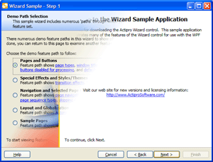
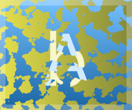

# Media Animation

The [ActiproSoftware.Windows.Media.Animation](xref:@ActiproUIRoot.Media.Animation) namespace has a number of classes that support animated transitions between two objects.  These can be anything from a simple fade to a complex wipe.  The transition classes are extensible and provide the foundation for page transitions in our [Wizard](../wizard/index.md) product.

## Using the TransitionPresenter Control

The [TransitionPresenter](xref:@ActiproUIRoot.Media.Animation.TransitionPresenter) control coordinates transitions between two contents, a "from" content and a "to" content.  The contents may be any object type and can optionally use a `DataTemplate` or a `DataTemplateSelector` to build the user interface for the objects.



*Wizard for WPF using the transition presenter with a bar wipe transition to switch between pages*

This XAML code shows how to create a [TransitionPresenter](xref:@ActiproUIRoot.Media.Animation.TransitionPresenter):

```xaml
<Window x:Class="Sample.Application.Window"
        xmlns="http://schemas.microsoft.com/winfx/2006/xaml/presentation"
        xmlns:x="http://schemas.microsoft.com/winfx/2006/xaml"
        xmlns:shared="http://schemas.actiprosoftware.com/winfx/xaml/shared"
        >
	<shared:TransitionPresenter x:Name="Presenter" />
</Window>
```

Only one content can be displayed in the transition presenter, although as new content is selected, it is transitioned in based on the transition that is currently assigned to the transition presenter.

This XAML code shows how to assign a specific [Transition](xref:@ActiproUIRoot.Media.Animation.Transition) to the transition presenter via the [TransitionPresenter](xref:@ActiproUIRoot.Media.Animation.TransitionPresenter).[Transition](xref:@ActiproUIRoot.Media.Animation.TransitionPresenter.Transition) property:

```xaml
<shared:TransitionPresenter x:Name="Presenter">
	<shared:TransitionPresenter.Transition>
		<shared:FadeTransition />
	</shared:TransitionPresenter.Transition>
</shared:TransitionPresenter>
```

That code assigned a [FadeTransition](xref:@ActiproUIRoot.Media.Animation.FadeTransition) to the transition presenter.  If you would like to use logic to pick a transition you can write a class that inherits [TransitionSelector](xref:@ActiproUIRoot.Media.Animation.TransitionSelector) and implement its [SelectTransition](xref:@ActiproUIRoot.Media.Animation.TransitionSelector.SelectTransition*) method.  When using a [TransitionSelector](xref:@ActiproUIRoot.Media.Animation.TransitionSelector), be sure that you clear the [TransitionPresenter](xref:@ActiproUIRoot.Media.Animation.TransitionPresenter).[Transition](xref:@ActiproUIRoot.Media.Animation.TransitionPresenter.Transition) property though since if that is specified, the [TransitionSelector](xref:@ActiproUIRoot.Media.Animation.TransitionSelector) will not be used.

The [DelegateTransitionSelector](xref:@ActiproUIRoot.Media.Animation.DelegateTransitionSelector) can be used to quickly implement custom transition selection logic, without the need to create additional classes. It uses a custom method or delegate, which is called when a new transition is needed.

This XAML code shows how to assign a specific [Transition](xref:@ActiproUIRoot.Media.Animation.Transition) to the transition presenter via the [TransitionPresenter](xref:@ActiproUIRoot.Media.Animation.TransitionPresenter).[Transition](xref:@ActiproUIRoot.Media.Animation.TransitionPresenter.Transition) property:

```csharp
transitionPresenter.TransitionSelector = new DelegateTransitionSelector() {
	Callback = delegate(TransitionPresenter presenter, object fromContent, object toContent) {
		// Implement custom logic that returns a Transition here
		return null;
	}
};
```

A class called [MultiTransitionSelector](xref:@ActiproUIRoot.Media.Animation.MultiTransitionSelector) is included in the Shared library.  Its [Transitions](xref:@ActiproUIRoot.Media.Animation.MultiTransitionSelector.Transitions) collection can contain one or more [Transition](xref:@ActiproUIRoot.Media.Animation.Transition) instances.  When this selector is used, it randomly picks one of the child transitions.  Additionally if the [TransitionPresenter](xref:@ActiproUIRoot.Media.Animation.TransitionPresenter).[DefaultMode](xref:@ActiproUIRoot.Media.Animation.TransitionPresenter.DefaultMode) is `Out`, then it will return an opposite variation of the picked transition (if the transition supports it).  This makes it easy to show different directions of transitions for forward and backward progress, such as in Wizard for WPF.

The currently visible content in the transition presenter is set via the [TransitionPresenter](xref:@ActiproUIRoot.Media.Animation.TransitionPresenter).`Content` property.  When a new object is set to that property, the transition presenter performs a transition from the "from" content (existing property value) to the "to" content (new property value).  You can use the `ContentTemplate` or `ContentTemplateSelector` properties to set a `DataTemplate` or a `DataTemplateSelector` for the "to" content.  Of course, you can bind all this properties in XAML too.

You can specify a default [TransitionDirection](xref:@ActiproUIRoot.Media.Animation.TransitionDirection) for transitions that support directions.  This is done via the [TransitionPresenter](xref:@ActiproUIRoot.Media.Animation.TransitionPresenter).[DefaultDirection](xref:@ActiproUIRoot.Media.Animation.TransitionPresenter.DefaultDirection) property.

You can also specify a default `Duration` for transitions that support defaultable durations.  This is done via the [TransitionPresenter](xref:@ActiproUIRoot.Media.Animation.TransitionPresenter).[DefaultDuration](xref:@ActiproUIRoot.Media.Animation.TransitionPresenter.DefaultDuration) property.

The [TransitionPresenter](xref:@ActiproUIRoot.Media.Animation.TransitionPresenter).[DefaultMode](xref:@ActiproUIRoot.Media.Animation.TransitionPresenter.DefaultMode) property is used to indicate to a [TransitionSelector](xref:@ActiproUIRoot.Media.Animation.TransitionSelector) whether selected transitions that support the mode concept should be `In` (the default) or `Out` transitions.

The [TransitionPresenter](xref:@ActiproUIRoot.Media.Animation.TransitionPresenter).[IsFirstContentTransitionEnabled](xref:@ActiproUIRoot.Media.Animation.TransitionPresenter.IsFirstContentTransitionEnabled) property indicates whether when transitioning from a null `Content` to an object, a transition is enabled.  If set to `false`, an instant display of the "to" content will occur.

The [TransitionPresenter](xref:@ActiproUIRoot.Media.Animation.TransitionPresenter).[IsPostTransitionFocusEnabled](xref:@ActiproUIRoot.Media.Animation.TransitionPresenter.IsPostTransitionFocusEnabled) property indicates whether focus will be set to the "to" content upon transition completion.

The [TransitionPresenter](xref:@ActiproUIRoot.Media.Animation.TransitionPresenter).[IsTransitioningSuspended](xref:@ActiproUIRoot.Media.Animation.TransitionPresenter.IsTransitioningSuspended) property can be used to temporarily suspend transitions. This allows several updates to the `TransitionPresenter` to be applied and batched into a single update/transition.

## Using the ToggleTransitionPresenter Control

Unlike the `TransitionPresenter`, which transitions changes to the `Content` property, the [ToggleTransitionPresenter](xref:@ActiproUIRoot.Media.Animation.ToggleTransitionPresenter) control coordinates transitions between `Content` and "alternate" content. The alternate content is specified by the [AlternateContent](xref:@ActiproUIRoot.Media.Animation.ToggleTransitionPresenter.AlternateContent) property, which is shown when [IsAlternateContentVisible](xref:@ActiproUIRoot.Media.Animation.ToggleTransitionPresenter.IsAlternateContentVisible) is set to `true`. In all other respects, the `ToggleTransitionPresenter` works identically to the `TransitionPresenter`.

## Built-In Transitions

The Shared library includes a number of built-in transitions.  Many of the built-in transitions support multiple directions and have an in/out mode concept.  This table shows the built-in transitions:

<table>
<thead>

<tr>
<th>Type</th>
<th>Description</th>
</tr>

</thead>
<tbody>

<tr>
<td>

[BarnDoorWipeTransition](xref:@ActiproUIRoot.Media.Animation.BarnDoorWipeTransition)

</td>
<td>

A wipe transition between two elements that uses two straight bars with a configurable gradient spread.  The transition supports [BeginTime](xref:@ActiproUIRoot.Media.Animation.BarnDoorWipeTransition.BeginTime), [Direction](xref:@ActiproUIRoot.Media.Animation.BarnDoorWipeTransition.Direction), [Duration](xref:@ActiproUIRoot.Media.Animation.BarnDoorWipeTransition.Duration), and [Mode](xref:@ActiproUIRoot.Media.Animation.BarnDoorWipeTransition.Mode) properties.

It also has a configurable [Spread](xref:@ActiproUIRoot.Media.Animation.BarnDoorWipeTransition.Spread) property that indicates how wide of a gradient to use for the bar.  A value of `0` means a straight line and a value of `1` means a very large gradient.  The default is `0.25`.

</td>
</tr>

<tr>
<td>

[BarWipeTransition](xref:@ActiproUIRoot.Media.Animation.BarWipeTransition)

</td>
<td>

A wipe transition between two elements that uses a straight bar with a configurable gradient spread.  The transition supports [BeginTime](xref:@ActiproUIRoot.Media.Animation.BarWipeTransition.BeginTime), [Direction](xref:@ActiproUIRoot.Media.Animation.BarWipeTransition.Direction), [Duration](xref:@ActiproUIRoot.Media.Animation.BarWipeTransition.Duration), and [Mode](xref:@ActiproUIRoot.Media.Animation.BarWipeTransition.Mode) properties.

It also has a configurable [Spread](xref:@ActiproUIRoot.Media.Animation.BarWipeTransition.Spread) property that indicates how wide of a gradient to use for the bar.  A value of `0` means a straight line and a value of `1` means a very large gradient.  The default is `0.25`.

</td>
</tr>

<tr>
<td>

[BoxWipeTransition](xref:@ActiproUIRoot.Media.Animation.BoxWipeTransition)

</td>
<td>

A wipe transition between two elements that uses a box.  The transition supports [BeginTime](xref:@ActiproUIRoot.Media.Animation.BoxWipeTransition.BeginTime), [Direction](xref:@ActiproUIRoot.Media.Animation.BoxWipeTransition.Direction), [Duration](xref:@ActiproUIRoot.Media.Animation.BoxWipeTransition.Duration), and [Mode](xref:@ActiproUIRoot.Media.Animation.BoxWipeTransition.Mode) properties.

</td>
</tr>

<tr>
<td>

[FadedZoomTransition](xref:@ActiproUIRoot.Media.Animation.FadedZoomTransition)

</td>
<td>

A crossfade transition between two elements that zooms the new content in as well.  The transition supports [BeginTime](xref:@ActiproUIRoot.Media.Animation.FadedZoomTransition.BeginTime), [Duration](xref:@ActiproUIRoot.Media.Animation.FadedZoomTransition.Duration), and [Mode](xref:@ActiproUIRoot.Media.Animation.FadedZoomTransition.Mode) properties.

It also has configurable [ZoomInPercentage](xref:@ActiproUIRoot.Media.Animation.FadedZoomTransition.ZoomInPercentage) and [ZoomOutPercentage](xref:@ActiproUIRoot.Media.Animation.FadedZoomTransition.ZoomOutPercentage) properties that indicate the percentage by which zoomed in and out content is scaled.  The default is `0.2`.  The values must be between `0` and `0.5`.

</td>
</tr>

<tr>
<td>

[FadeTransition](xref:@ActiproUIRoot.Media.Animation.FadeTransition)

</td>
<td>

A crossfade transition between two elements.  The transition supports [BeginTime](xref:@ActiproUIRoot.Media.Animation.FadeTransition.BeginTime), [Duration](xref:@ActiproUIRoot.Media.Animation.FadeTransition.Duration), and [Mode](xref:@ActiproUIRoot.Media.Animation.FadeTransition.Mode) properties.

It also has a configurable [BlurRadius](xref:@ActiproUIRoot.Media.Animation.FadeTransition.BlurRadius) property that indicates an optional radius of a blur effect to apply to the fade.  The default is `0`.  Since setting this property to non-zero uses a bitmap effect, do not set this property when used in an XBAP (due to security restrictions).

</td>
</tr>

<tr>
<td>

[FourBoxWipeTransition](xref:@ActiproUIRoot.Media.Animation.FourBoxWipeTransition)

</td>
<td>

A wipe transition between two elements that uses four boxes.  The transition supports [BeginTime](xref:@ActiproUIRoot.Media.Animation.FourBoxWipeTransition.BeginTime), [Duration](xref:@ActiproUIRoot.Media.Animation.FourBoxWipeTransition.Duration), and [Mode](xref:@ActiproUIRoot.Media.Animation.FourBoxWipeTransition.Mode) properties.

</td>
</tr>

<tr>
<td>

[SlideTransition](xref:@ActiproUIRoot.Media.Animation.SlideTransition)

</td>
<td>

A slide transition between two elements that moves one element over the other, or alternatively pushes the other.  The transition supports [BeginTime](xref:@ActiproUIRoot.Media.Animation.SlideTransition.BeginTime), [Direction](xref:@ActiproUIRoot.Media.Animation.SlideTransition.Direction), [Duration](xref:@ActiproUIRoot.Media.Animation.SlideTransition.Duration), and [Mode](xref:@ActiproUIRoot.Media.Animation.SlideTransition.Mode) properties.

It also has a [IsFromContentPushed](xref:@ActiproUIRoot.Media.Animation.SlideTransition.IsFromContentPushed) property that indicates whether the "from" content is pushed offscreen or if the "to" content simply slides over it.  The default is `false`.

</td>
</tr>

<tr>
<td>

[WedgeWipeTransition](xref:@ActiproUIRoot.Media.Animation.WedgeWipeTransition)

</td>
<td>

A wipe transition between two elements that uses a wedge shape.  The transition supports [BeginTime](xref:@ActiproUIRoot.Media.Animation.WedgeWipeTransition.BeginTime), [Direction](xref:@ActiproUIRoot.Media.Animation.WedgeWipeTransition.Direction), and [Duration](xref:@ActiproUIRoot.Media.Animation.WedgeWipeTransition.Duration), and [Mode](xref:@ActiproUIRoot.Media.Animation.WedgeWipeTransition.Mode) properties.

Although this transition supports a direction, it one works for horizontal or vertical directions.  Diagonal directions will be converted to a horizontal direction.

</td>
</tr>

</tbody>
</table>

## Creating Custom Transitions

Custom transitions can be created in multiple ways.  Any custom transition must inherit the [Transition](xref:@ActiproUIRoot.Media.Animation.Transition) class or one of its subclasses.

When inheriting [Transition](xref:@ActiproUIRoot.Media.Animation.Transition) directly, implement the [OnStarted](xref:@ActiproUIRoot.Media.Animation.Transition.OnStarted*) method to begin the transition and the [OnCompleted](xref:@ActiproUIRoot.Media.Animation.Transition.OnCompleted*) method to clean up the transition once it has ended.  The transition must call the and the [EndTransition](xref:@ActiproUIRoot.Media.Animation.Transition.EndTransition*) method when the transition is complete.  That method in turn calls [OnCompleted](xref:@ActiproUIRoot.Media.Animation.Transition.OnCompleted*) for you and also lets the transition presenter know that the transition is complete.  If your transition supports a concept of an opposite variant, you can have the [GetOppositeTransition](xref:@ActiproUIRoot.Media.Animation.Transition.GetOppositeTransition*) method return a new instance of the transition in an opposite variant.  Otherwise, have it return the current instance.

An easier way to create custom transitions is via XAML using the [StoryboardTransition](xref:@ActiproUIRoot.Media.Animation.StoryboardTransition) class.  It has four important properties: [FromContentStyle](xref:@ActiproUIRoot.Media.Animation.StoryboardTransition.FromContentStyle), [ToContentStyle](xref:@ActiproUIRoot.Media.Animation.StoryboardTransition.ToContentStyle), [FromContentStoryboard](xref:@ActiproUIRoot.Media.Animation.StoryboardTransition.FromContentStoryboard), and [ToContentStoryboard](xref:@ActiproUIRoot.Media.Animation.StoryboardTransition.ToContentStoryboard).  The two style properties optionally set a `Style` to the "from" and "to" content while a transition is occurring.  The two storyboard properties optionally set a `Storyboard` to animate properties on the "from" and "to" contents.

This XAML code shows how to create a custom transition based on a [StoryboardTransition](xref:@ActiproUIRoot.Media.Animation.StoryboardTransition) that fades in the "to" content while it spins in:

```xaml
<shared:StoryboardTransition TextSearch.Text="Custom (Spin fade in)" ClipToBounds="True">
	<shared:StoryboardTransition.ToContentStyle>
		<Style TargetType="FrameworkElement">
			<Setter Property="RenderTransform">
				<Setter.Value>
					<RotateTransform />
				</Setter.Value>
			</Setter>
		</Style>
	</shared:StoryboardTransition.ToContentStyle>
	<shared:StoryboardTransition.ToContentStoryboard>
		<Storyboard>
			<DoubleAnimation Storyboard.TargetProperty="Opacity" From="0" To="1" Duration="0:0:1" />
			<DoubleAnimation Storyboard.TargetProperty="RenderTransform.Angle" From="90" To="0" Duration="0:0:1" />
		</Storyboard>
	</shared:StoryboardTransition.ToContentStoryboard>
</shared:StoryboardTransition>
```

Many of our built-in transitions a programmatically created and inherit the [StoryboardTransitionBase](xref:@ActiproUIRoot.Media.Animation.StoryboardTransitionBase) class.  By implementing them programmatically, they support `Storyboard`-based animation but also support the more advanced concepts of multiple directions, modes, etc.

## Integrating the WPF Pixel Shader Effects Library

The WPF Pixel Shader Effects Library, [announced here (external)](https://learn.microsoft.com/en-us/archive/blogs/jaimer/announcement-wpf-pixel-shader-effects-library-on-codeplex), includes several transition effects that leverage the `UIElement.Effect` property, which is included in .NET 3.5 SP1.  These effects are written using Microsoft's High Level Shader Language (HLSL), which provide a lot of control over what is rendered.



*The TransitionPreview control using banded swirl and cloud reveal transitions*

The transitions in the WPF Pixel Shader Effects Library can be easily integrated into the [TransitionPresenter](xref:@ActiproUIRoot.Media.Animation.TransitionPresenter) and [Wizard](xref:@ActiproUIRoot.Controls.Wizard.Wizard) controls, through the use of a custom transition (described above).  The sample application includes a custom transition called `EffectTransition`, which can be used in your own applications.

This XAML code shows how to utilize the `BandedSwirlTransitionEffect` in a `TransitionPresenter` using the `EffectTransition` class from the sample application:

```xaml
xmlns:sampleCommon="clr-namespace:ActiproSoftware.Windows.ProductSamples.SharedSamples.Common"
xmlns:shared="http://schemas.actiprosoftware.com/winfx/xaml/shared"
xmlns:transitionEffects="clr-namespace:TransitionEffects;assembly=TransitionEffects"
...

<shared:TransitionPresenter ... >
	<shared:TransitionPresenter.Transition>
		<sampleCommon:EffectTransition>
			<sampleCommon:EffectTransition.Effect>
				<transitionEffects:BandedSwirlTransitionEffect />
			</sampleCommon:EffectTransition.Effect>
		</sampleCommon:EffectTransition>
	</shared:TransitionPresenter.Transition>
</shared:TransitionPresenter>
```
