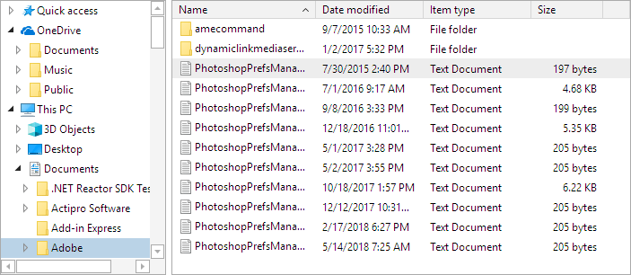

# Common Usage Scenarios

The various shell UI controls like [ShellTreeListBox](shelltreelistbox.md) and [ShellListView](shelllistview.md) can be mixed and matched to fit into many useful scenarios.

## File Explorer

A file explorer is where a [ShellTreeListBox](shelltreelistbox.md) control is on the left side of the window, and a [ShellListView](shelllistview.md) control is on the right side, often with a splitter in between them.  A path `TextBox` or breadcrumb control might also appear above both controls.

The path `TextBox`'s `Text` property is bound to the [ShellTreeListBox](xref:@ActiproUIRoot.Controls.Shell.ShellTreeListBox).[SelectedShellObjectEditingName](xref:@ActiproUIRoot.Controls.Shell.ShellTreeListBox.SelectedShellObjectEditingName) property, and the [ShellListView](xref:@ActiproUIRoot.Controls.Shell.ShellListView).[RootShellFolder](xref:@ActiproUIRoot.Controls.Shell.ShellListView.RootShellFolder) property is bound to the [ShellTreeListBox](xref:@ActiproUIRoot.Controls.Shell.ShellTreeListBox).[SelectedShellObject](xref:@ActiproUIRoot.Controls.Shell.ShellTreeListBox.SelectedShellObject) property.  A **Move Up** button's command could also be bound to the [ShellTreeListBox](xref:@ActiproUIRoot.Controls.Shell.ShellTreeListBox).[MoveUpCommand](xref:@ActiproUIRoot.Controls.Shell.ShellTreeListBox.MoveUpCommand) property.

## Browse for Folder

A **Browse for Folder** dialog generally shows a [ShellTreeListBox](shelltreelistbox.md) control with a **Make New Folder** button underneath it, alongside **OK** and **Cancel** buttons.

The [ShellTreeListBox](xref:@ActiproUIRoot.Controls.Shell.ShellTreeListBox).[IsNewFolderContextMenuItemAllowed](xref:@ActiproUIRoot.Controls.Shell.ShellTreeListBox.IsNewFolderContextMenuItemAllowed) property is usually set to `true` when there is a **Make New Folder** button available in UI.  Bind that button to the [ShellTreeListBox](xref:@ActiproUIRoot.Controls.Shell.ShellTreeListBox)'s [SelectedItem](xref:@ActiproUIRoot.Controls.Grids.TreeListBox.SelectedItem).[CreateChildFolderCommand](xref:@ActiproUIRoot.Controls.Shell.ShellObjectViewModel.CreateChildFolderCommand) property, which is defined on the selected [ShellObjectViewModel](xref:@ActiproUIRoot.Controls.Shell.ShellObjectViewModel).  Then when the **OK** button is clicked, examine the [ShellTreeListBox](xref:@ActiproUIRoot.Controls.Shell.ShellTreeListBox) selection to see what was selected.

## FTP Client

FTP clients generally have local and remote file system sides.  The local side could use a file explorer setup like what is described above.  The same thing could be configured for the remote side, with the only difference being that the remote side would have the [ShellTreeListBox](xref:@ActiproUIRoot.Controls.Shell.ShellTreeListBox).[DefaultShellService](xref:@ActiproUIRoot.Controls.Shell.ShellTreeListBox.DefaultShellService) and [ShellListView](xref:@ActiproUIRoot.Controls.Shell.ShellListView).[DefaultShellService](xref:@ActiproUIRoot.Controls.Shell.ShellListView.DefaultShellService) properties both pointing to a [custom shell service](shell-objects-framework/custom-shell-objects.md) that knows how to access and enumerate folders and files on the remote file system.

The beauty of this setup is that both sets of controls are configured the same way with only the default shell services being different to distinguish the data provided by local and remote file systems.
