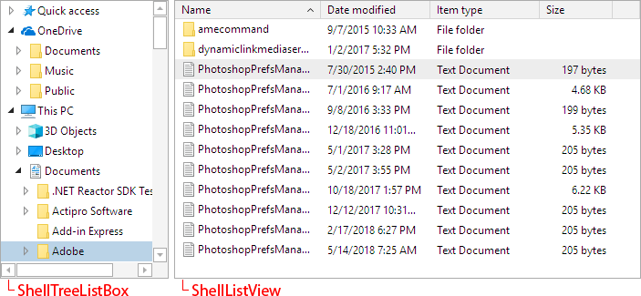

# Overview

Actipro Shell controls allow for easy folder and file browsing.  While the product comes packed with a pre-built implementation for the Windows shell that mimics Windows Explorer, the controls are fully customizable, allowing you to filter or change the folders/files presented.  Or build your own shell service to support other files systems, such the remote side for a FTP client.

The ShellTreeListBox control presents a shell folder hierarchy in a tree structure.  It is often paired with a ShellListView control, which shows the contents of a selected folder using column-based property display.  Both controls support tool tips, context menus, and renaming.

All of the UI found in the Shell controls is native WPF, even the context menus.  Unlike competitive products with interop-based user interfaces, the Actipro Shell controls don't have any airspace or focus issues, and every bit of UI can be fully-themed or even customized with XAML data templates.

## Features

### ShellTreeListBox Control

- Displays a shell object hierarchy in a tree structure, just like in Windows Explorer.
- Designed as a standalone control, so it can be used to build 'Browse for Folder' dialogs or can be paired with other shell controls to build a robust folder browser UI.
- Uses the Actipro shell objects framework with built-in mechanisms to mimic what you see in Windows Explorer, including all non-file system objects.
- Set a root folder multiple ways (including path) and optionally show the root folder node.
- Optional default root folder that mimics Windows Explorer's root with Quick Access, This PC, etc.
- Specify a special root folder (i.e., This PC, Desktop) via an easy-to-use enumeration.
- Optionally display files and links.
- Icons, overlay icons, name, and tooltip are data-driven from shell objects and can be customized.
- Filter out shell objects provided by the shell service, or even add custom ones.
- Customizable context menu that optionally auto-populates for Windows shell objects.
- In-line renaming feature that optionally renames Windows shell objects.
- Selected shell object can be data-bound directly or via a user-friendly string path.
- Use data templates to alter the appearance of nodes.
- Icons scale to use more detailed assets properly in high-DPI scenarios.
- Inherits the TreeListBox control from Actipro Grids and thus contains the vast feature set and configuration mechanisms found in that control.

### ShellListView Control

- Displays a detailed column-based flat list of shell objects within a designated folder.
- Alternatively use other layout modes that display various sized items in wrapping lists.
- Designed as a standalone control, and can be paired with other shell controls to build a robust folder browser UI.
- Uses the Actipro shell objects framework with built-in mechanisms to mimic what you see in Windows Explorer, including all non-file system objects.
- Set a root folder multiple ways, including direct shell object, path, or special folder kind enumeration.
- Each column displays properties such as name, date modified, type, size, or others that come directly from the shell.
- The customizable shell service determines which columns to show for the current root folder.
- Optionally display folders, files, and links.
- Icons, overlay icons, thumbnail images, name, and tooltip are data-driven from shell objects and can be customized.
- Filter out shell objects provided by the shell service, or even add custom ones.
- Customizable context menu that optionally auto-populates for Windows shell objects.
- In-line renaming feature that optionally renames Windows shell objects.
- Single or multiple selection modes.
- Use data templates to alter the appearance of column headers or cells.
- Icons scale to use more detailed assets properly in high-DPI scenarios.
- Inherits the TreeListView control from Actipro Grids and thus contains the vast feature set and configuration mechanisms found in that control.

### Shell Objects Framework

- A framework of objects that support shell (folder, file, and link) hierarchies.
- Includes a complete implementation of shell objects that operate directly on the Windows shell.
- Shell objects track name, kind, icons and overlays, thumbnail images, multiple path variations, tool tip, and various capabilities.
- The shell service is the primary point where the entire shell object hierarchy can be customized, allowing you to filter results or add custom shell objects.
- The shell service also manages which properties are available on the object and accesses their values.
- Create a custom shell service and shell objects to use the Actipro shell controls for browsing things like remote file systems in FTP clients, etc.
- Use the shell objects framework independent of UI controls to inspect a file system hierarchy programmatically.

*This product is written in 100% pure C#, and includes detailed documentation and samples.*
