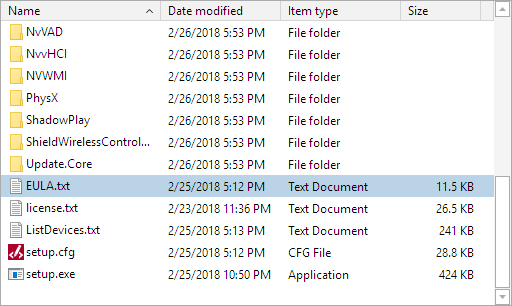
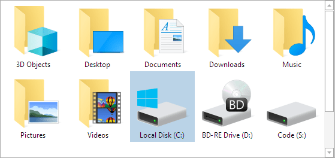

# ShellListView Control

The [ShellListView](xref:@ActiproUIRoot.Controls.Shell.ShellListView) control shows the contents of a selected folder using column-based property display, similar to what you see in the right side of Windows Explorer.



## Getting Started

First, add references to the "ActiproSoftware.Shell.@@PlatformAssemblySuffix.dll", "ActiproSoftware.Grids.@@PlatformAssemblySuffix.dll", "ActiproSoftware.Shared.@@PlatformAssemblySuffix.dll" assemblies.  All three assemblies are required for the Shell product.  They should have been installed in the GAC during the control installation process.  However they also will be located in the appropriate Program Files folders.  See the product's Readme for details on those locations.

This sample code shows how a [ShellListView](xref:@ActiproUIRoot.Controls.Shell.ShellListView) control pointing to a default root shell folder can be added to any XAML:

```xaml
xmlns:shell="http://schemas.actiprosoftware.com/winfx/xaml/shell"
...
<shell:ShellListView RootShellFolderParsingName="C:\" />
```

## Default Shell Service

The [DefaultShellService](xref:@ActiproUIRoot.Controls.Shell.ShellListView.DefaultShellService) property is set to an instance of [WindowsShellService](xref:ActiproSoftware.Shell.WindowsShellService) by default.  This allows the control to support Windows shell interaction out of the box.

> [!NOTE]
> Please see the [Memory Management](memory-management.md) topic for notes on handling shell service changes, since they sometimes use unmanaged resources.

## Root Shell Folder

A root shell folder must be set on the control so that it can display that root folder's hierarchy.  The root shell folder may be set via three different properties:

- [RootShellFolder](xref:@ActiproUIRoot.Controls.Shell.ShellListView.RootShellFolder) - A [IShellObject](xref:ActiproSoftware.Shell.IShellObject) that must be a shell folder.  Setting this property updates the [RootShellFolderParsingName](xref:@ActiproUIRoot.Controls.Shell.ShellListView.RootShellFolderParsingName) and [RootSpecialFolderKind](xref:@ActiproUIRoot.Controls.Shell.ShellListView.RootSpecialFolderKind) properties to remain in sync.

- [RootShellFolderParsingName](xref:@ActiproUIRoot.Controls.Shell.ShellListView.RootShellFolderParsingName) - A [parsing name](shell-objects-framework/shell-objects.md) (generally a file system path like "C:\\Program Files") that indicates the root shell folder.  Setting this property updates the [RootShellFolder](xref:@ActiproUIRoot.Controls.Shell.ShellListView.RootShellFolder) and [RootSpecialFolderKind](xref:@ActiproUIRoot.Controls.Shell.ShellListView.RootSpecialFolderKind) properties to remain in sync.

- [RootSpecialFolderKind](xref:@ActiproUIRoot.Controls.Shell.ShellListView.RootSpecialFolderKind) - An enum value of type [SpecialFolderKind](xref:ActiproSoftware.Shell.SpecialFolderKind) that indicates a special Windows folder kind ("Computer", "ThisPC", and so on).  Setting this property updates the [RootShellFolder](xref:@ActiproUIRoot.Controls.Shell.ShellListView.RootShellFolder) and [RootShellFolderParsingName](xref:@ActiproUIRoot.Controls.Shell.ShellListView.RootShellFolderParsingName) properties to remain in sync.

> [!NOTE]
> Please see the [Memory Management](memory-management.md) topic for notes on handling root shell folder changes, since they sometimes use unmanaged resources.

## Display Options

There are several display option properties that affect features and functionality:

- [CanIncludeFiles](xref:@ActiproUIRoot.Controls.Shell.ShellListView.CanIncludeFiles) - Whether files should be displayed.  The default value is `true`.

- [CanIncludeFolders](xref:@ActiproUIRoot.Controls.Shell.ShellListView.CanIncludeFolders) - Whether folders should be displayed.  The default value is `true`.

- [CanIncludeLinks](xref:@ActiproUIRoot.Controls.Shell.ShellListView.CanIncludeLinks) - Whether links should be displayed.  The default value is `true`.

- [IsRootItemVisible](xref:@ActiproUIRoot.Controls.Grids.TreeListBox.IsRootItemVisible) - Whether the root item is visible.  The default value is `false`, and this inherited value should NOT be changed for the [ShellListView](xref:@ActiproUIRoot.Controls.Shell.ShellListView) control.

## Selection

Since this control inherits [TreeListBox](xref:@ActiproUIRoot.Controls.Grids.TreeListBox), it also inherits that control's [SelectedItem](xref:@ActiproUIRoot.Controls.Grids.TreeListBox.SelectedItem), [SelectedItems](xref:@ActiproUIRoot.Controls.Grids.TreeListBox.SelectedItems), and [SelectionMode](xref:@ActiproUIRoot.Controls.Grids.TreeListBox.SelectionMode) properties, and the [SelectionChanged](xref:@ActiproUIRoot.Controls.Grids.TreeListBox.SelectionChanged) event.  The "items" in this shell UI control are of type [ShellObjectViewModel](xref:@ActiproUIRoot.Controls.Shell.ShellObjectViewModel), as described in the [Grids Foundation and Item Adapter](grids-foundation.md) topic, so the [SelectedItem](xref:@ActiproUIRoot.Controls.Grids.TreeListBox.SelectedItem) and [SelectedItems](xref:@ActiproUIRoot.Controls.Grids.TreeListBox.SelectedItems) properties will return a value of that type.  The [SelectionMode](xref:@ActiproUIRoot.Controls.Grids.TreeListBox.SelectionMode) property determines whether single or multi-selection modes are enabled.  For [ShellListView](xref:@ActiproUIRoot.Controls.Shell.ShellListView), this is generally left as an extended multi-selection.

## Layout Modes

The [ShellListView](xref:@ActiproUIRoot.Controls.Shell.ShellListView) control is in `Details` layout mode by default, which renders items in a vertical list with mutiple columns of data.

The [LayoutMode](xref:@ActiproUIRoot.Controls.Shell.ShellListView.LayoutMode) property can be set to another [ShellListViewLayoutMode](xref:@ActiproUIRoot.Controls.Shell.ShellListViewLayoutMode) enumeration value to change to an alternate layout mode, such as the `LargeIcons` layout mode pictured here:



Available layout modes include:

- `Details` - A detailed vertical list mode with multiple column display.
- `List` - A vertical list mode that renders a small icon and name.
- `SmallIcons` - A horizontal list mode that renders a small icon and name.
- `MediumIcons` - A horizontal list mode that renders a medium icon and name.
- `LargeIcons` - A horizontal list mode that renders a large icon and name.
- `ExtraLargeIcons` - A horizontal list mode that renders an extra large icon and name.

The `MediumIcons`, `LargeIcons`, and `ExtraLargeIcons` layout modes can optionally show thumbnail images in place of icons when they are available.  Thumbnail images provide previews of the shell object's content.  This functionality is enabled by setting the [CanUseThumbnails](xref:@ActiproUIRoot.Controls.Shell.ShellListView.CanUseThumbnails) property to `true`, which is the default.

## Item Templates

The control uses multiple `DataTemplate`-based properties to determine how to render content in various layout modes.  The proper `DataTemplate` is selected by the [ShellListViewItemTemplateSelector](xref:@ActiproUIRoot.Controls.Shell.ShellListViewItemTemplateSelector) instance that is set by default to the `ItemTemplateSelector` property.

The `DataTemplate` properties for each layout mode include:

- [DetailsLayoutModeItemTemplate](xref:@ActiproUIRoot.Controls.Shell.ShellListView.DetailsLayoutModeItemTemplate) - The `DataTemplate` to use as the `ItemTemplate` when the layout mode is `Details`.

- [ExtraLargeIconsLayoutModeItemTemplate](xref:@ActiproUIRoot.Controls.Shell.ShellListView.ExtraLargeIconsLayoutModeItemTemplate) - The `DataTemplate` to use as the `ItemTemplate` when the layout mode is `ExtraLargeIcons`.

- [LargeIconsLayoutModeItemTemplate](xref:@ActiproUIRoot.Controls.Shell.ShellListView.LargeIconsLayoutModeItemTemplate) - The `DataTemplate` to use as the `ItemTemplate` when the layout mode is `LargeIcons`.

- [ListLayoutModeItemTemplate](xref:@ActiproUIRoot.Controls.Shell.ShellListView.ListLayoutModeItemTemplate) - The `DataTemplate` to use as the `ItemTemplate` when the layout mode is `List`.

- [MediumIconsLayoutModeItemTemplate](xref:@ActiproUIRoot.Controls.Shell.ShellListView.MediumIconsLayoutModeItemTemplate) - The `DataTemplate` to use as the `ItemTemplate` when the layout mode is `MediumIcons`.

- [SmallIconsLayoutModeItemTemplate](xref:@ActiproUIRoot.Controls.Shell.ShellListView.SmallIconsLayoutModeItemTemplate) - The `DataTemplate` to use as the `ItemTemplate` when the layout mode is `SmallIcons`.

This is a sample `DataTemplate` set to the [DetailsLayoutModeItemTemplate](xref:@ActiproUIRoot.Controls.Shell.ShellListView.DetailsLayoutModeItemTemplate) property:

```xaml
<DataTemplate>
	<shared:PixelSnapper VerticalRoundMode="RoundToEven">
		<Grid Margin="2,1" Background="Transparent" ToolTip="{Binding ToolTip, Mode=OneWay, IsAsync=True}">
			<Grid.ColumnDefinitions>
				<ColumnDefinition Width="Auto" />
				<ColumnDefinition Width="*" />
			</Grid.ColumnDefinitions>

			<Image Width="16" Height="16" VerticalAlignment="Center" Source="{Binding SmallIcon, Mode=OneWay}" />
			<Image Width="16" Height="16" VerticalAlignment="Center" Source="{Binding SmallIconOverlay, Mode=OneWay}" />
			<shell:ShellEditableContentControl Grid.Column="1" Margin="2,0,0,0" Content="{Binding Name, Mode=TwoWay}" IsEditing="{Binding IsEditing, Mode=TwoWay}" />
		</Grid>
	</shared:PixelSnapper>
</DataTemplate>
```

## Navigation into Folders

The [CanNavigateIntoChildFolders](xref:@ActiproUIRoot.Controls.Shell.ShellListView.CanNavigateIntoChildFolders) property determines whether double-clicking or pressing `Enter` on an item causes the control's [RootShellFolder](xref:@ActiproUIRoot.Controls.Shell.ShellListView.RootShellFolder) to be set to the [IShellObject](xref:ActiproSoftware.Shell.IShellObject) whose view-model item triggered the event.  The default value is `true`.

When the [ShellListView](xref:@ActiproUIRoot.Controls.Shell.ShellListView).[RootShellFolder](xref:@ActiproUIRoot.Controls.Shell.ShellListView.RootShellFolder) is two-way bound to a [ShellTreeListBox](xref:@ActiproUIRoot.Controls.Shell.ShellTreeListBox).[SelectedShellObject](xref:@ActiproUIRoot.Controls.Shell.ShellTreeListBox.SelectedShellObject) property, a navigation change into a folder will also update the selection in the paired [ShellTreeListBox](xref:@ActiproUIRoot.Controls.Shell.ShellTreeListBox) control.

## Context Menus

The [IsDefaultItemContextMenuEnabled](xref:@ActiproUIRoot.Controls.Shell.ShellListView.IsDefaultItemContextMenuEnabled) property determines whether the default context menu is enabled for shell objects.  The default value is `true`.

The context menus themselves are provided by the [ShellObjectItemAdapter](xref:@ActiproUIRoot.Controls.Shell.ShellObjectItemAdapter).  Please see the [Grids Foundation and Item Adapter](grids-foundation.md) topic for more information on how to customize the context menus for both the selection view-models and for the background of the control.

## Inline Renaming

The control supports inline renaming if the [IsRenamingEnabled](xref:@ActiproUIRoot.Controls.Shell.ShellListView.IsRenamingEnabled) property is `true`, which is the default value.  Note that the shell object to be renamed must also support renaming via the [IShellObject](xref:ActiproSoftware.Shell.IShellObject).[CanRename](xref:ActiproSoftware.Shell.IShellObject.CanRename) property.

Renaming begins when single clicking on the shell object name, or by selecting an item and pressing `F2`.

## Column Header Template

The control uses this default `DataTemplate` in its [ColumnHeaderTemplate](xref:@ActiproUIRoot.Controls.Shell.ShellListView.ColumnHeaderTemplate) property:

```xaml
<DataTemplate>
	<TextBlock Text="{Binding Name}" TextTrimming="CharacterEllipsis" />
</DataTemplate>
```

Change the [ColumnHeaderTemplate](xref:@ActiproUIRoot.Controls.Shell.ShellListView.ColumnHeaderTemplate) property to use an alternate `DataTemplate`.

## Properties

The [ShellListView](xref:@ActiproUIRoot.Controls.Shell.ShellListView) control can show one or more columns, where each column represents an [IShellProperty](xref:ActiproSoftware.Shell.IShellProperty).

The [Shell Services](shell-objects-framework/shell-services.md) topic covers how a shell service provides the shell properties for the [RootShellFolder](xref:@ActiproUIRoot.Controls.Shell.ShellListView.RootShellFolder).  It also covers how the property values, that are displayed in the list view's cells, are provided.  Both of these operations can be customized.

## Sorting

Each [IShellProperty](xref:ActiproSoftware.Shell.IShellProperty) defines a default sort order.  When clicking on a [ShellListView](xref:@ActiproUIRoot.Controls.Shell.ShellListView) column header, the clicked column will be sorted by its default sort order.  Clicking on the same column will reverse the sort order.

The [Shell Services](shell-objects-framework/shell-services.md) topic talks about how property value comparisons can be made to properly sort shell objects by a shell property.

The sort order will be reset to its default whenever a new root folder is set.  This behavior can be prevented by setting the [CanResetSortOnRootShellFolderChange](xref:@ActiproUIRoot.Controls.Shell.ShellListView.CanResetSortOnRootShellFolderChange) property to `false`.

The [SortShellPropertyKey](xref:@ActiproUIRoot.Controls.Shell.ShellListView.SortShellPropertyKey) property gets or sets the [IShellProperty](xref:ActiproSoftware.Shell.IShellProperty).[Key](xref:ActiproSoftware.Shell.IShellProperty.Key) of the column to sort.  The `Name` column is sorted by default when this property is a null value.  The [TreeListViewColumn](xref:@ActiproUIRoot.Controls.Grids.TreeListViewColumn).[Header](xref:@ActiproUIRoot.Controls.Grids.TreeListViewColumn.Header) property for each column is an instance of an [IShellProperty](xref:ActiproSoftware.Shell.IShellProperty), and can be used when locating a key to use for sorting a specific column.

The [SortDirection](xref:@ActiproUIRoot.Controls.Shell.ShellListView.SortDirection) property returns a [ColumnSortDirection](xref:@ActiproUIRoot.Controls.Grids.ColumnSortDirection) that determines whether the column sorting is in ascending or descending order.
