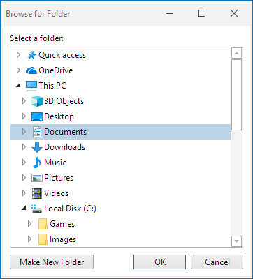

# ShellTreeListBox Control

The [ShellTreeListBox](xref:@ActiproUIRoot.Controls.Shell.ShellTreeListBox) control presents a shell folder hierarchy in a tree structure, similar to what you see in the left side of Windows Explorer.



It is designed as a standalone control, so it can be used to build 'Browse for Folder' dialogs or can be paired with other shell controls to build a robust folder browser UI.

## Getting Started

First, add references to the *ActiproSoftware.Shell.@@PlatformAssemblySuffix.dll*, *ActiproSoftware.Grids.@@PlatformAssemblySuffix.dll*, *ActiproSoftware.Shared.@@PlatformAssemblySuffix.dll* assemblies.  All three assemblies are required for the Shell product.  They should have been installed in the GAC during the control installation process.  However they also will be located in the appropriate Program Files folders.  See the product's Readme for details on those locations.

This sample code shows how a [ShellTreeListBox](xref:@ActiproUIRoot.Controls.Shell.ShellTreeListBox) control pointing to a default root shell folder can be added to any XAML:

```xaml
xmlns:shell="http://schemas.actiprosoftware.com/winfx/xaml/shell"
...
<shell:ShellTreeListBox RootSpecialFolderKind="Default" />
```

## Default Shell Service

The [DefaultShellService](xref:@ActiproUIRoot.Controls.Shell.ShellTreeListBox.DefaultShellService) property is set to an instance of [WindowsShellService](xref:ActiproSoftware.Shell.WindowsShellService) by default.  This allows the control to support Windows shell interaction out of the box.

> [!NOTE]
> Please see the [Memory Management](memory-management.md) topic for notes on handling shell service changes, since they sometimes use unmanaged resources.

## Root Shell Folder

A root shell folder must be set on the control so that it can display that root folder's hierarchy.  The root shell folder may be set via three different properties:

- [RootShellFolder](xref:@ActiproUIRoot.Controls.Shell.ShellTreeListBox.RootShellFolder) - A [IShellObject](xref:ActiproSoftware.Shell.IShellObject) that must be a shell folder.  Setting this property updates the [RootShellFolderParsingName](xref:@ActiproUIRoot.Controls.Shell.ShellTreeListBox.RootShellFolderParsingName) and [RootSpecialFolderKind](xref:@ActiproUIRoot.Controls.Shell.ShellTreeListBox.RootSpecialFolderKind) properties to remain in sync.

- [RootShellFolderParsingName](xref:@ActiproUIRoot.Controls.Shell.ShellTreeListBox.RootShellFolderParsingName) - A [parsing name](shell-objects-framework/shell-objects.md) (generally a file system path like "C:\\Program Files") that indicates the root shell folder.  Setting this property updates the [RootShellFolder](xref:@ActiproUIRoot.Controls.Shell.ShellTreeListBox.RootShellFolder) and [RootSpecialFolderKind](xref:@ActiproUIRoot.Controls.Shell.ShellTreeListBox.RootSpecialFolderKind) properties to remain in sync.

- [RootSpecialFolderKind](xref:@ActiproUIRoot.Controls.Shell.ShellTreeListBox.RootSpecialFolderKind) - An enum value of type [SpecialFolderKind](xref:ActiproSoftware.Shell.SpecialFolderKind) that indicates a special Windows folder kind ("Computer", "ThisPC", and so on).  Setting this property updates the [RootShellFolder](xref:@ActiproUIRoot.Controls.Shell.ShellTreeListBox.RootShellFolder) and [RootShellFolderParsingName](xref:@ActiproUIRoot.Controls.Shell.ShellTreeListBox.RootShellFolderParsingName) properties to remain in sync.

> [!NOTE]
> Please see the [Memory Management](memory-management.md) topic for notes on handling root shell folder changes, since they sometimes use unmanaged resources.

## Display Options

There are several display option properties that affect features and functionality:

- [CanIncludeFiles](xref:@ActiproUIRoot.Controls.Shell.ShellTreeListBox.CanIncludeFiles) - Whether files should be displayed.  The default value is `false`.  Set this to `true` to also show files in the tree.

- [CanIncludeLinks](xref:@ActiproUIRoot.Controls.Shell.ShellTreeListBox.CanIncludeLinks) - Whether links should be displayed.  The default value is `false`.

- [IsRootItemVisible](xref:@ActiproUIRoot.Controls.Grids.TreeListBox.IsRootItemVisible) - Whether the root item is visible.  The default value is `false`.

## Selection

Since this control inherits [TreeListBox](xref:@ActiproUIRoot.Controls.Grids.TreeListBox), it also inherits that control's [SelectedItem](xref:@ActiproUIRoot.Controls.Grids.TreeListBox.SelectedItem), [SelectedItems](xref:@ActiproUIRoot.Controls.Grids.TreeListBox.SelectedItems), and [SelectionMode](xref:@ActiproUIRoot.Controls.Grids.TreeListBox.SelectionMode) properties, and the [SelectionChanged](xref:@ActiproUIRoot.Controls.Grids.TreeListBox.SelectionChanged) event.  The "items" in this shell UI control are of type [ShellObjectViewModel](xref:@ActiproUIRoot.Controls.Shell.ShellObjectViewModel), as described in the [Grids Foundation and Item Adapter](grids-foundation.md) topic, so the [SelectedItem](xref:@ActiproUIRoot.Controls.Grids.TreeListBox.SelectedItem) and [SelectedItems](xref:@ActiproUIRoot.Controls.Grids.TreeListBox.SelectedItems) properties will return a value of that type.  The [SelectionMode](xref:@ActiproUIRoot.Controls.Grids.TreeListBox.SelectionMode) property determines whether single or multi-selection modes are enabled.  For [ShellTreeListBox](xref:@ActiproUIRoot.Controls.Shell.ShellTreeListBox), this is generally left as a single selection.

The [ShellTreeListBox](xref:@ActiproUIRoot.Controls.Shell.ShellTreeListBox) control also defines selection-related properties that are more specific to shell objects.

The [SelectedShellObject](xref:@ActiproUIRoot.Controls.Shell.ShellTreeListBox.SelectedShellObject) property gets or sets the [IShellObject](xref:ActiproSoftware.Shell.IShellObject) that is selected in the control.  This property is effectively the same as binding to the `SelectedItem.Model` property.  It is often bound directly to the [RootShellFolder](xref:@ActiproUIRoot.Controls.Shell.ShellListView.RootShellFolder) property of a paired [ShellListView](xref:@ActiproUIRoot.Controls.Shell.ShellListView) control so that control tracks with the selection in the tree.

The [SelectedShellObjectEditingName](xref:@ActiproUIRoot.Controls.Shell.ShellTreeListBox.SelectedShellObjectEditingName) property gets or sets the selected shell object's full user-friendly [editing name](shell-objects-framework/shell-objects.md) (commonly the same as the file system path), if known.  This property can be bound to a path `TextBox`, which allows the user to type in a file system path (i.e., "C:\\Program Files") and have the related shell object get selected in the tree.

## Item Templates

The control uses this default `DataTemplate` in its `ItemTemplate` property:

```xaml
<DataTemplate>
	<shared:PixelSnapper VerticalRoundMode="RoundToEven">
		<Grid Margin="2,1" Background="Transparent" ToolTip="{Binding ToolTip, Mode=OneWay, IsAsync=True}">
			<Grid.ColumnDefinitions>
				<ColumnDefinition Width="Auto" />
				<ColumnDefinition Width="*" />
			</Grid.ColumnDefinitions>

			<Image Width="16" Height="16" VerticalAlignment="Center" Source="{Binding SmallIcon, Mode=OneWay}" />
			<Image Width="16" Height="16" VerticalAlignment="Center" Source="{Binding SmallIconOverlay, Mode=OneWay}" />
			<shell:ShellEditableContentControl Grid.Column="1" Margin="2,0,0,0" Content="{Binding Name, Mode=TwoWay}" IsEditing="{Binding IsEditing, Mode=TwoWay}" />
		</Grid>
	</shared:PixelSnapper>
</DataTemplate>
```

Change the `ItemTemplate` property to use an alternate `DataTemplate`.  Also note that a custom `ItemTemplateSelector` can also be supplied for more programmatic selection of a view-model `DataTemplate`.

## Context Menus

These properties help determine context menu behavior:

- [IsDefaultItemContextMenuEnabled](xref:@ActiproUIRoot.Controls.Shell.ShellTreeListBox.IsDefaultItemContextMenuEnabled) - Whether the default context menu is enabled for shell objects.  The default value is `true`.

- [IsNewFolderContextMenuItemAllowed](xref:@ActiproUIRoot.Controls.Shell.ShellTreeListBox.IsNewFolderContextMenuItemAllowed) - Whether a "New / Folder" menu item can be injected into the context menu for file system folders.  The default value is `false`.

The context menus themselves are provided by the [ShellObjectItemAdapter](xref:@ActiproUIRoot.Controls.Shell.ShellObjectItemAdapter).  Please see the [Grids Foundation and Item Adapter](grids-foundation.md) topic for more information on how to customize the context menus for both the selection view-models and for the background of the control.

## Inline Renaming

The control supports inline renaming if the [IsRenamingEnabled](xref:@ActiproUIRoot.Controls.Shell.ShellTreeListBox.IsRenamingEnabled) property is `true`, which is the default value.  Note that the shell object to be renamed must also support renaming via the [IShellObject](xref:ActiproSoftware.Shell.IShellObject).[CanRename](xref:ActiproSoftware.Shell.IShellObject.CanRename) property.

Renaming begins when single clicking on the shell object name, or by selecting an item and pressing <kbd>F2</kbd>.

## Horizontal ScrollBar Visibility

The default `ScrollViewer.HorizontalScrollBarVisibility` attached property value for the control is `Auto`.  This allows the control to scroll to the right when necessary.  Set the attached property to `Disabled` to prevent scrolling and force the contents to fit within the control's width.
