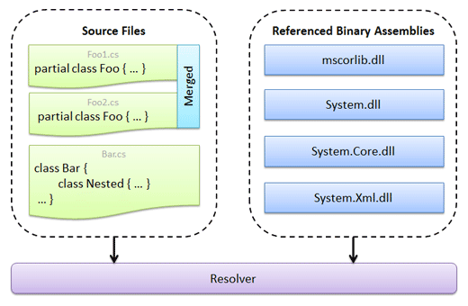

# Assemblies

Assemblies are objects implementing [IAssembly](xref:ActiproSoftware.Text.Languages.DotNet.Reflection.IAssembly) that can track reflection data from binary .NET assemblies or source code files.  This reflection data is then used by other add-on features such as the resolver and automated IntelliPrompt.  It is critical to configure assemblies correctly to use the advanced features offered by this add-on.

An ambient assembly repository can be installed to manage reuse of binary assemblies in scenarios where multiple project assemblies are active and can also cache assembly data to improve future load performance.

## What is an Assembly?

There are two main types of assemblies: project assemblies and binary assemblies.

Project assemblies are similar in concept to a Visual Studio project in that they can track reflection data for source code files and can maintain a list of other [IAssembly](xref:ActiproSoftware.Text.Languages.DotNet.Reflection.IAssembly) references related to the project.  These references can be to other project assemblies (similar to Visual Studio when a solution hosts multiple projects that are dependent upon each other) or can be to binary assemblies.

Binary assemblies store reflection data for pre-compiled binary DLL files such as *mscorlib.dll*.

Since [IAssembly](xref:ActiproSoftware.Text.Languages.DotNet.Reflection.IAssembly) and the rest of the types used for reflection in this add-on are all implemented as interfaces, it is possible to create other custom assembly types when there are special need scenarios.

All assemblies have a name, provide a flat list of namespaces defined within type, and provide access to a namespace hierarchy that is rooted at the global namespace.  Each namespace can contain other nested namespaces or types, types can contain members, and so on.  This design is described in more detail in the [Reflection](reflection.md) topic.

## Project Assemblies

Project assemblies, classes that implement [IProjectAssembly](xref:ActiproSoftware.Text.Languages.DotNet.Reflection.IProjectAssembly), can track source code files and references to other assemblies.  They also can return an [IResolver](xref:ActiproSoftware.Text.Languages.DotNet.Resolution.IResolver) class that is used to resolve expressions to a namespace, type, member, etc.

Different project assembly types are available for each language, since there are some language-specific rules that need to be followed by the resolver.  For instance, a C# resolver should ignore standard modules, while a VB resolver should handle standard modules and use case insensitive name matching.

The built-in project assembly types are:

- [CSharpProjectAssembly](xref:ActiproSoftware.Text.Languages.CSharp.Implementation.CSharpProjectAssembly) - for C# languages
- [VBProjectAssembly](xref:ActiproSoftware.Text.Languages.VB.Implementation.VBProjectAssembly) - for Visual Basic languages

This diagram shows the general structure of a project assembly:



In the diagram, there are three source files loaded: *Foo1.cs*, *Foo2.cs*, and *Bar.cs*.  The first two files contain a partial class named `Foo`, so the two class declarations are merged together in the reflection data tracked by the project assembly.  The last file contains a `Bar` class along with a nested type named `Nested`.  The diagram also shows that there are references made to other assemblies such as *mscorlib.dll*, *System.dll*, etc.  All of this data is tracked live and can be updated on-the-fly as code changes or references need to be added/removed.

When the resolver executes, it uses all of the above information along with language-specific rules to try and find the best match for a type, member, etc., even if that match is in a referenced assembly.

## Registering with a Syntax Language

Any object that implements [IProjectAssembly](xref:ActiproSoftware.Text.Languages.DotNet.Reflection.IProjectAssembly), such as the built-in [CSharpProjectAssembly](xref:ActiproSoftware.Text.Languages.CSharp.Implementation.CSharpProjectAssembly) and [VBProjectAssembly](xref:ActiproSoftware.Text.Languages.VB.Implementation.VBProjectAssembly) classes, can be associated with a syntax language by registering it as an [IProjectAssembly](xref:ActiproSoftware.Text.Languages.DotNet.Reflection.IProjectAssembly) service on the language.

> [!NOTE]
> Due to language-specific rules that project assemblies use, only register [CSharpProjectAssembly](xref:ActiproSoftware.Text.Languages.CSharp.Implementation.CSharpProjectAssembly) instances on a [CSharpSyntaxLanguage](xref:ActiproSoftware.Text.Languages.CSharp.Implementation.CSharpSyntaxLanguage), and [VBProjectAssembly](xref:ActiproSoftware.Text.Languages.VB.Implementation.VBProjectAssembly) instances on a [VBSyntaxLanguage](xref:ActiproSoftware.Text.Languages.VB.Implementation.VBSyntaxLanguage).

Appropriate default [IProjectAssembly](xref:ActiproSoftware.Text.Languages.DotNet.Reflection.IProjectAssembly) instances are pre-registered on the built-in C#/VB syntax languages but need to be configured with source files and/or assembly references to be useful.  Alternatively, you can create and configure a new project assembly instance and then register it on the language.

@if (winrt) {

This code creates a new C# project assembly and registers it with the [CSharpSyntaxLanguage](xref:ActiproSoftware.Text.Languages.CSharp.Implementation.CSharpSyntaxLanguage) that is already declared in the `language` variable:

```csharp
CSharpProjectAssembly project = new CSharpProjectAssembly("Sample");
language.RegisterProjectAssembly(project);
```

Then as the page is loaded, assembly references are added asynchronously (see following sections for more information on why),

```csharp
private async void OnLoaded(object sender, RoutedEventArgs e) {
	await project.AssemblyReferences.AddMsCorLibAsync();
	await project.AssemblyReferences.AddAsync("System");
}
```

}

@if (wpf winforms) {

This code creates a new C# project assembly, uses a `BackgroundWorker` to adds some references asynchronously (see following sections for more information on why), and registers it with the [CSharpSyntaxLanguage](xref:ActiproSoftware.Text.Languages.CSharp.Implementation.CSharpSyntaxLanguage) that is already declared in the `language` variable:

```csharp
CSharpProjectAssembly project = new CSharpProjectAssembly("Sample");
BackgroundWorker assemblyLoader = new BackgroundWorker();
assemblyLoader.DoWork += (sender, e) => {
	project.AssemblyReferences.AddMsCorLib();
	project.AssemblyReferences.Add("System");
};
assemblyLoader.RunWorkerAsync();
language.RegisterProjectAssembly(project);
```

}

> [!NOTE]
> The [DotNetSyntaxLanguageExtensions](xref:ActiproSoftware.Text.Languages.DotNet.DotNetSyntaxLanguageExtensions).[RegisterProjectAssembly](xref:ActiproSoftware.Text.Languages.DotNet.DotNetSyntaxLanguageExtensions.RegisterProjectAssembly*) method in the code snippet above is a helper extension method that gets added to [ISyntaxLanguage](xref:ActiproSoftware.Text.ISyntaxLanguage) objects when the `ActiproSoftware.Text.Languages.DotNet` namespace is imported.  See the [Service Locator Architecture](../language-creation/service-locator-architecture.md) topic for details on registering and retrieving various service object instances, both via extension methods and generically, as there are some additional requirements for using the extension methods.

## Managing Assembly References

For the resolver and automated IntelliPrompt features to work properly, the appropriate assembly references must be added to the project assembly.  At a minimum, a reference to *mscorlib.dll* should always be added since that is where native types like `Int32`, `String`, etc. are defined.  The resolver only knows about the assemblies that are referenced by the project, so if a reference is made to a type `Foo` but there is no source file or referenced assembly that defines `Foo`, the resolution of that reference will fail.

Always think about project assemblies in terms of being equivalent to Visual Studio projects.  If an assembly reference would be needed to support a type or member in code, then a reference to the assembly should be made in the project assembly.

There are numerous methods and overloads for adding a reference to a project assembly.  These methods are located on the [IProjectAssembly](xref:ActiproSoftware.Text.Languages.DotNet.Reflection.IProjectAssembly).[AssemblyReferences](xref:ActiproSoftware.Text.Languages.DotNet.Reflection.IProjectAssembly.AssemblyReferences) collection, which also allows enumeration and removal of references.

These methods can add references to a project assembly:

<table>
<thead>

<tr>
<th>Member</th>
<th>Description</th>
</tr>

</thead>
<tbody>

<tr>
<td>

[Add](xref:ActiproSoftware.Text.Languages.DotNet.Reflection.IProjectAssemblyReferenceCollection.Add*)([IAssembly](xref:ActiproSoftware.Text.Languages.DotNet.Reflection.IAssembly)) Method

</td>
<td>

Adds a new reference for the specified [IAssembly](xref:ActiproSoftware.Text.Languages.DotNet.Reflection.IAssembly), which can be an already-loaded project or binary assembly.

</td>
</tr>

<tr>
<td>

@if (winrt) {[AddAsync](xref:ActiproSoftware.Text.Languages.DotNet.Reflection.IProjectAssemblyReferenceCollection.AddAsync)(Assembly) Method}@if (wpf winforms) {[Add](xref:ActiproSoftware.Text.Languages.DotNet.Reflection.IProjectAssemblyReferenceCollection.Add*)(Assembly) Method}

</td>
<td>

Adds a new reference to an [IBinaryAssembly](xref:ActiproSoftware.Text.Languages.DotNet.Reflection.IBinaryAssembly) for the specified reflection `Assembly`.

</td>
</tr>

<tr>
<td>

@if (winrt) {[AddAsync](xref:ActiproSoftware.Text.Languages.DotNet.Reflection.IProjectAssemblyReferenceCollection.AddAsync)(Assembly, [IAssemblyName](xref:ActiproSoftware.Text.Languages.DotNet.Reflection.IAssemblyName)) Method}@if (wpf winforms) {[Add](xref:ActiproSoftware.Text.Languages.DotNet.Reflection.IProjectAssemblyReferenceCollection.Add*)(Assembly, [IAssemblyName](xref:ActiproSoftware.Text.Languages.DotNet.Reflection.IAssemblyName)) Method}

</td>
<td>

Adds a new reference to an [IBinaryAssembly](xref:ActiproSoftware.Text.Languages.DotNet.Reflection.IBinaryAssembly) for the specified reflection `Assembly`, but stores it with an alternate [IAssemblyName](xref:ActiproSoftware.Text.Languages.DotNet.Reflection.IAssemblyName), which is useful for dynamically generated assemblies.

</td>
</tr>

<tr>
<td>

@if (winrt) {[AddAsync](xref:ActiproSoftware.Text.Languages.DotNet.Reflection.IProjectAssemblyReferenceCollection.AddAsync)(string) Method}@if (wpf winforms) {[Add](xref:ActiproSoftware.Text.Languages.DotNet.Reflection.IProjectAssemblyReferenceCollection.Add*)(string) Method}

</td>
<td>

Adds a new reference to an [IBinaryAssembly](xref:ActiproSoftware.Text.Languages.DotNet.Reflection.IBinaryAssembly) for the specified assembly name.

While using the simple assembly name may work in some simple cases (such as `System`), it is highly recommended to pass the fully-qualified assembly name to this method (such as `System, Version=2.0.0.0, Culture=neutral, PublicKeyToken=b77a5c561934e089`) since the probing code will have a better chance of successfully finding it.

</td>
</tr>

@if (wpf winforms) {
<tr>
<td>

[AddFrom](xref:ActiproSoftware.Text.Languages.DotNet.Reflection.IProjectAssemblyReferenceCollection.AddFrom*)(string) Method

</td>
<td>

Adds a new reference to an [IBinaryAssembly](xref:ActiproSoftware.Text.Languages.DotNet.Reflection.IBinaryAssembly) for the assembly at the specified path.  The application must have access privileges to the path.

</td>
</tr>
}

@if (wpf winforms) {
<tr>
<td>

[AddAllInAppDomain](xref:ActiproSoftware.Text.Languages.DotNet.Reflection.IProjectAssemblyReferenceCollection.AddAllInAppDomain*)() Method

</td>
<td>

Adds new references to [IBinaryAssembly](xref:ActiproSoftware.Text.Languages.DotNet.Reflection.IBinaryAssembly) objects for all assemblies currently loaded in the `AppDomain`.

This method is only recommended for testing purposes since a properly-designed application should pick and choose which exact assembly references to have on a project assembly.

</td>
</tr>
}

<tr>
<td>

@if (winrt) {[AddMsCorLibAsync](xref:ActiproSoftware.Text.Languages.DotNet.Reflection.IProjectAssemblyReferenceCollection.AddMsCorLibAsync)() Method}@if (wpf winforms) {[AddMsCorLib](xref:ActiproSoftware.Text.Languages.DotNet.Reflection.IProjectAssemblyReferenceCollection.AddMsCorLib*)() Method}

</td>
<td>

Adds a new reference to an [IBinaryAssembly](xref:ActiproSoftware.Text.Languages.DotNet.Reflection.IBinaryAssembly) for `mscorlib`.  This should always be added.

</td>
</tr>

</tbody>
</table>

@if (winrt) {

This code shows how to add assembly references to an [IProjectAssembly](xref:ActiproSoftware.Text.Languages.DotNet.Reflection.IProjectAssembly) in the `project` variable using a variety of methods:

```csharp
// Add mscorlib (should always add at a minimum)
await project.AssemblyReferences.AddMsCorLibAsync();

// Add 'System.dll' via a direct Assembly
await project.AssemblyReferences.AddAsync(typeof(System.Uri).Assembly);

// Add 'System.Core.dll' via its full name
await project.AssemblyReferences.AddAsync("System.Core, Version=3.5.0.0, Culture=neutral, PublicKeyToken=b77a5c561934e089");

// Add another IProjectAssembly that was previously loaded elsewhere
project.AssemblyReferences.Add(anotherProject);
```

}

@if (wpf winforms) {

This code shows how to add assembly references to an [IProjectAssembly](xref:ActiproSoftware.Text.Languages.DotNet.Reflection.IProjectAssembly) in the `project` variable using a variety of methods:

```csharp
// Add mscorlib (should always add at a minimum)
project.AssemblyReferences.AddMsCorLib();

// Add 'System.dll' via a direct Assembly
project.AssemblyReferences.Add(typeof(System.Uri).Assembly);

// Add 'System.Core.dll' via its full name
project.AssemblyReferences.Add("System.Core, Version=3.5.0.0, Culture=neutral, PublicKeyToken=b77a5c561934e089");

// Add another IProjectAssembly that was previously loaded elsewhere
project.AssemblyReferences.Add(anotherProject);
```

}

@if (wpf winforms) {

This code shows a couple other ways to add assembly references to an [IProjectAssembly](xref:ActiproSoftware.Text.Languages.DotNet.Reflection.IProjectAssembly) in the `project` variable:

```csharp
// Add a custom assembly from a file path (app must have access to the path)
project.AssemblyReferences.AddFrom(@"C:\MyAssembly.dll");

// Only for testing - add all assemblies in the current AppDomain
// project.AssemblyReferences.AddAllInAppDomain();
```

}

## Assembly Reference Cleanup

When an [IProjectAssembly](xref:ActiproSoftware.Text.Languages.DotNet.Reflection.IProjectAssembly) is no longer needed in your application, it is a good idea to clear its [AssemblyReferences](xref:ActiproSoftware.Text.Languages.DotNet.Reflection.IProjectAssembly.AssemblyReferences) collection.  When an assembly repository is used (described later in this topic), it will often track the reference count of an assembly.  While that reference count remains above zero, it will track data for the assembly.  When the reference count returns to zero, it will close up any open cache files or other resources that it may have open for the assembly.

Thus, it is very important to clear the assembly references collection on a project assembly prior to the project assembly going out of scope, so that memory and resources for its referenced assemblies can be reclaimed when appropriate.

## Performance Impact of Adding References

When a new [IBinaryAssembly](xref:ActiproSoftware.Text.Languages.DotNet.Reflection.IBinaryAssembly) needs to be created using reflection on a `System.Reflection.Assembly` (regardless of if the `Assembly` is passed directly or via a full name or file path), there is processing that must take place to gather the data needed to construct the resulting [IBinaryAssembly](xref:ActiproSoftware.Text.Languages.DotNet.Reflection.IBinaryAssembly).  This processing uses .NET reflection and thus can take some time to complete.  For instance, if 20 new assembly references are being added to a project assembly, it might take several seconds to load.

This is the reason why in the sample code earlier in this topic, we used a `System.ComponentModel.BackgroundWorker` to execute the loading code.  That allows the code to execute asynchronously, thus preventing the UI from slowing down or being blocked.  .NET 4.0 and later includes other features such as tasks that can be used in a similar fashion instead.

Note that there are features built in to cache the [IBinaryAssembly](xref:ActiproSoftware.Text.Languages.DotNet.Reflection.IBinaryAssembly) data constructed from an `Assembly`.  These features are part of the "Assembly Repositories" object model described later in this topic and can help speed up assembly loading by ten times or more when properly used.

## Source Files

Source files, represented by the [ISourceFile](xref:ActiproSoftware.Text.Languages.DotNet.Reflection.ISourceFile) interface, have a string-based key and a collection of [ITypeDefinition](xref:ActiproSoftware.Text.Languages.DotNet.Reflection.ITypeDefinition) objects that are defined in the file.

Source file objects can be added to and removed from the [IProjectAssembly](xref:ActiproSoftware.Text.Languages.DotNet.Reflection.IProjectAssembly).[SourceFiles](xref:ActiproSoftware.Text.Languages.DotNet.Reflection.IProjectAssembly.SourceFiles) collection.  This is similar in concept to the adding/removing of code files to a Visual Studio project.  When a source file is included in a project, its types, members, etc. can be used by the resolver.

### Automatic Source File Creation by Documents

As long as the following conditions are met, documents will automatically update a project assembly whenever the document is altered (such as when typing is performed in a SyntaxEditor):

1. The document must have a [ITextDocument](xref:ActiproSoftware.Text.ITextDocument).[FileName](xref:ActiproSoftware.Text.ITextDocument.FileName) property value set.  The value of this property is used as the [ISourceFile](xref:ActiproSoftware.Text.Languages.DotNet.Reflection.ISourceFile).[Key](xref:ActiproSoftware.Text.Utility.IKeyedObject.Key).  No source file can be created without it as a key.

1. The document is using a .NET syntax language ([CSharpSyntaxLanguage](xref:ActiproSoftware.Text.Languages.CSharp.Implementation.CSharpSyntaxLanguage) or [VBSyntaxLanguage](xref:ActiproSoftware.Text.Languages.VB.Implementation.VBSyntaxLanguage)).

1. The .NET syntax language in use must have an [IProjectAssembly](xref:ActiproSoftware.Text.Languages.DotNet.Reflection.IProjectAssembly) service registered.  The [ISourceFile](xref:ActiproSoftware.Text.Languages.DotNet.Reflection.ISourceFile) created for the document will be added to this project assembly.

Behind the scenes, the .NET syntax languages watch any attached document for [ICodeDocument](xref:ActiproSoftware.Text.ICodeDocument).[ParseData](xref:ActiproSoftware.Text.ICodeDocument.ParseData) changes.  When they detect a change, they translate the document's AST to [ITypeDefinition](xref:ActiproSoftware.Text.Languages.DotNet.Reflection.ITypeDefinition) instances, and an [ISourceFile](xref:ActiproSoftware.Text.Languages.DotNet.Reflection.ISourceFile) instance is created to contain the type definitions with the document's [FileName](xref:ActiproSoftware.Text.ITextDocument.FileName) as its key.  The [ISourceFile](xref:ActiproSoftware.Text.Languages.DotNet.Reflection.ISourceFile) is added to the project assembly and replaces any prior source files with the same key.

### Programmatically Adding Source Files

There are several ways to programmatically append source files to a project assembly, all available from the [IProjectAssembly](xref:ActiproSoftware.Text.Languages.DotNet.Reflection.IProjectAssembly).[SourceFiles](xref:ActiproSoftware.Text.Languages.DotNet.Reflection.IProjectAssembly.SourceFiles) collection.  One way is to add an [ISourceFile](xref:ActiproSoftware.Text.Languages.DotNet.Reflection.ISourceFile) instance directly with the `Add` method.  Here are the other ways:

<table>
<thead>

<tr>
<th>Member</th>
<th>Description</th>
</tr>

</thead>
<tbody>

<tr>
<td>

[Add](xref:ActiproSoftware.Text.Languages.DotNet.Reflection.ISourceFileCollection.Add*) Method

</td>
<td>

Adds an [ISourceFile](xref:ActiproSoftware.Text.Languages.DotNet.Reflection.ISourceFile) for the specified AST [CompilationUnit](xref:ActiproSoftware.Text.Languages.DotNet.Ast.Implementation.CompilationUnit) to the collection.

This method allows the source file key to be specified, and it translates the compilation unit's contents to a set of [ITypeDefinition](xref:ActiproSoftware.Text.Languages.DotNet.Reflection.ITypeDefinition) objects.

</td>
</tr>

<tr>
<td>

[QueueCode](xref:ActiproSoftware.Text.Languages.DotNet.Reflection.ISourceFileCollection.QueueCode*) Method

</td>
<td>

Queues parsing for the specified source code using an indicated language, and adds an [ISourceFile](xref:ActiproSoftware.Text.Languages.DotNet.Reflection.ISourceFile) for the result.

The parsing operation will occur in a worker thread and will not block the calling thread as long as an [ambient parse request dispatcher](../text-parsing/parsing/parse-requests-and-dispatchers.md) is set up.

</td>
</tr>

<tr>
<td>

@if (winrt) {[QueueFileAsync](xref:ActiproSoftware.Text.Languages.DotNet.Reflection.ISourceFileCollection.QueueFileAsync) Method}@if (wpf winforms) {[QueueFile](xref:ActiproSoftware.Text.Languages.DotNet.Reflection.ISourceFileCollection.QueueFile*) Method}

</td>
<td>

Queues parsing for the specified file using an indicated language, and adds an [ISourceFile](xref:ActiproSoftware.Text.Languages.DotNet.Reflection.ISourceFile) for the result.

The parsing operation will occur in a worker thread and will not block the calling thread as long as an [ambient parse request dispatcher](../text-parsing/parsing/parse-requests-and-dispatchers.md) is set up.

</td>
</tr>

</tbody>
</table>

@if (winrt) {

This code shows how to queue up parsing to create source files for a project assembly defined in `project`:

```csharp
project.SourceFiles.QueueCode(cSharpSyntaxLanguage, "MyFile1.cs", "class Foo { public void Bar() {} }");
await project.SourceFiles.QueueFileAsync(cSharpSyntaxLanguage, @"C:\MyFile2.cs");
```

}

@if (wpf winforms) {

This code shows how to queue up parsing to create source files for a project assembly defined in `project`:

```csharp
project.SourceFiles.QueueCode(cSharpSyntaxLanguage, "MyFile1.cs", "class Foo { public void Bar() {} }");
project.SourceFiles.QueueFile(cSharpSyntaxLanguage, @"C:\MyFile2.cs");
```

}

Again, make sure an [ambient parse request dispatcher](../text-parsing/parsing/parse-requests-and-dispatchers.md) is set up so parsing occurs in a worker thread.

### Programmatic Source File Creation

The [SourceFile](xref:ActiproSoftware.Text.Languages.DotNet.Reflection.Implementation.SourceFile) class implements [ISourceFile](xref:ActiproSoftware.Text.Languages.DotNet.Reflection.ISourceFile) and can be used to programmatically add a set of [ITypeDefinition](xref:ActiproSoftware.Text.Languages.DotNet.Reflection.ITypeDefinition) objects to a project assembly.

## Binary Assemblies

Binary assemblies, represented by the [IBinaryAssembly](xref:ActiproSoftware.Text.Languages.DotNet.Reflection.IBinaryAssembly) interface, store reflection data for pre-compiled binary DLL files such as *mscorlib.dll*.  They can be created for any `System.Reflection.Assembly` instance, one in memory or one on disk.

Similar to project assemblies, binary assemblies also have their own references to other assemblies.  However, in binary assemblies, the references are more informational.

[IBinaryAssembly](xref:ActiproSoftware.Text.Languages.DotNet.Reflection.IBinaryAssembly) instances can be created for an `Assembly` using any of the methods described in the "Managing Assembly References" section earlier in this topic.  Similar loading methods are available on [IAssemblyRepository](xref:ActiproSoftware.Text.Languages.DotNet.Reflection.IAssemblyRepository) that can be used to load an [IBinaryAssembly](xref:ActiproSoftware.Text.Languages.DotNet.Reflection.IBinaryAssembly) without adding it as a reference to a project.  The assembly reference "add" methods internally call these various [IAssemblyRepository](xref:ActiproSoftware.Text.Languages.DotNet.Reflection.IAssemblyRepository) "load" methods.

@if (wpf winforms) {

### Limitations of .NET Reflection

While using .NET reflection to load binary assembly data is fast, there are some circumstances where problems can occur.  .NET reflection requires that referenced assemblies are able to be resolved and loaded.  There might be other cases where .NET reflection data for an assembly was already loaded into a binary assembly from a location, the file assembly was rebuilt, and the binary assembly data tried to reload but couldn't.  .NET reflection locks the file and only allows it to be loaded once.

In scenarios like this, it might be useful to take advantage of the optional Roslyn extensions we provide that ship in the `ActiproSoftware.Text.Addons.DotNet.Roslyn.@@PlatformAssemblySuffix` assembly.  Roslyn is a set of assemblies produced by Microsoft that can examine .NET assemblies for reflection data without many of the restrictions of using normal .NET reflection.  For instance, references don't need to be loaded and assembly files aren't locked.

}

@if (wpf winforms) {

## Loading Binary Assemblies with Roslyn Extensions

Our optional Roslyn extensions are fully capable of loading [IBinaryAssembly](xref:ActiproSoftware.Text.Languages.DotNet.Reflection.IBinaryAssembly) data for a particular file system assembly file.  This binary assembly can then be referenced by a project assembly as described in the 'Managing Assembly References' section earlier in this topic.  The only requirements are that your app uses .NET 4.6.2 or later, references our `ActiproSoftware.Text.Addons.DotNet.Roslyn.@@PlatformAssemblySuffix` assembly, and has a NuGet package reference to `Microsoft.CodeAnalysis`.

This code shows how to load a binary assembly with our Roslyn extensions and then add it as a reference to a project assembly:

```csharp
var loader = new ActiproSoftware.Text.Languages.DotNet.Reflection.Implementation.RoslynBinaryAssemblyLoader();
var binaryAssembly = loader.LoadFrom(pathToAssemblyFile);
project.AssemblyReferences.Add(binaryAssembly);
```

}

## Assembly Repositories

Assembly repositories provide a way to store loaded binary assemblies and possibly cache their data so that it can be retrieved much faster in the future.  They are represented by the [IAssemblyRepository](xref:ActiproSoftware.Text.Languages.DotNet.Reflection.IAssemblyRepository) interface and the [FileBasedAssemblyRepository](xref:ActiproSoftware.Text.Languages.DotNet.Reflection.Implementation.FileBasedAssemblyRepository) class provides the implementation used by most applications.

Assembly repositories have several @if (winrt) {[LoadAsync](xref:ActiproSoftware.Text.Languages.DotNet.Reflection.IAssemblyRepository.LoadAsync)}@if (wpf winforms) {[Load](xref:ActiproSoftware.Text.Languages.DotNet.Reflection.IAssemblyRepository.Load*)} methods for loading an [IBinaryAssembly](xref:ActiproSoftware.Text.Languages.DotNet.Reflection.IBinaryAssembly) from a reflection `Assembly`.  If the assembly repository implementation supports caching, the loaded assembly data is cached from these load method calls.  The various methods for adding references to project assemblies mentioned in previous sections call these load methods.

### Pruning the Cache

The assembly repository's cache may write to files or some other mechanism depending on the implementation.  Regardless it is important to call the @if (winrt) {[IAssemblyRepository](xref:ActiproSoftware.Text.Languages.DotNet.Reflection.IAssemblyRepository).[PruneCacheAsync](xref:ActiproSoftware.Text.Languages.DotNet.Reflection.IAssemblyRepository.PruneCacheAsync)}@if (wpf winforms) {[IAssemblyRepository](xref:ActiproSoftware.Text.Languages.DotNet.Reflection.IAssemblyRepository).[PruneCache](xref:ActiproSoftware.Text.Languages.DotNet.Reflection.IAssemblyRepository.PruneCache*)} method to prune invalid data from the cache upon application shutdown.

> [!NOTE]
> Since assemblies can change over time (when a DLL is recompiled or deleted), it is important to make sure the cache removes data that is no longer valid via a call to @if (winrt) {[IAssemblyRepository](xref:ActiproSoftware.Text.Languages.DotNet.Reflection.IAssemblyRepository).[PruneCacheAsync](xref:ActiproSoftware.Text.Languages.DotNet.Reflection.IAssemblyRepository.PruneCacheAsync)}@if (wpf winforms) {[IAssemblyRepository](xref:ActiproSoftware.Text.Languages.DotNet.Reflection.IAssemblyRepository).[PruneCache](xref:ActiproSoftware.Text.Languages.DotNet.Reflection.IAssemblyRepository.PruneCache*)} when the application is shut down.

### Reference Tracking

The default implementation of [IProjectAssembly](xref:ActiproSoftware.Text.Languages.DotNet.Reflection.IProjectAssembly) will call the [IAssemblyRepository](xref:ActiproSoftware.Text.Languages.DotNet.Reflection.IAssemblyRepository).[Add](xref:ActiproSoftware.Text.Languages.DotNet.Reflection.IAssemblyRepository.Add*) method when a binary assembly is added as a reference.  The assembly repository keeps a pointer to the binary assembly and tracks a reference count for it.  Likewise, the [IAssemblyRepository](xref:ActiproSoftware.Text.Languages.DotNet.Reflection.IAssemblyRepository).[Remove](xref:ActiproSoftware.Text.Languages.DotNet.Reflection.IAssemblyRepository.Remove*) method is called when a binary assembly is removed as a project assembly reference.  If the reference count for the binary assembly reaches zero, the assembly repository will discard its pointer to the assembly.

## The FileBasedAssemblyRepository Class

The [FileBasedAssemblyRepository](xref:ActiproSoftware.Text.Languages.DotNet.Reflection.Implementation.FileBasedAssemblyRepository) is the main [IAssemblyRepository](xref:ActiproSoftware.Text.Languages.DotNet.Reflection.IAssemblyRepository) implementation provided with the add-on.  It supports caching of assembly data out to files in a folder, as long as the application's security allows for write access to the folder specified in its cache path.  This often requires full/elevated trust by the application.  These cache files can be reloaded in the next application session, dramatically reducing binary assembly load times.

Use of this repository type as the ambient assembly repository is recommended since its caching mechanism can load its cached assembly data for an assembly about ten times faster than creating a new [IBinaryAssembly](xref:ActiproSoftware.Text.Languages.DotNet.Reflection.IBinaryAssembly) via the use of .NET reflection.

If no cache path is set on the repository, then it will not attempt to save or load any assembly data cache files.  However, it still will perform reference tracking, which significantly helps performance when multiple project assemblies are used.

## Ambient Assembly Repository

There are often scenarios where multiple project assemblies are used at the same time.  This is similar to scenarios in Visual Studio when a solution has multiple projects open.  Each one of these projects probably references some of the same binary assemblies, like `mscorlib`.

By using an ambient assembly repository, the loaded binary assembly instances are reused among the various project assemblies, thus saving on memory.  As mentioned in the previous section, assembly repositories also are capable of caching data, thus sometimes improving loading speeds by ten times or more.

> [!IMPORTANT]
> By default, no ambient [IAssemblyRepository](xref:ActiproSoftware.Text.Languages.DotNet.Reflection.IAssemblyRepository) is installed meaning that more than one project assembly will use unnecessary extra memory when referencing various binary assemblies, since those instances will not be shared among the project assemblies.  Also, no caching will occur for binary assemblies if there is no ambient assembly repository, thus affecting application performance when adding references to project assemblies.

@if (winrt) {

This code is executed at application startup and creates a [FileBasedAssemblyRepository](xref:ActiproSoftware.Text.Languages.DotNet.Reflection.Implementation.FileBasedAssemblyRepository) for use as the ambient assembly repository.  Note that it uses an application-specific data folder path that you should update as appropriate for your application.

```csharp
string appDataPath = Path.Combine(ApplicationData.Current.LocalFolder.Path, "Assembly Repository");
AmbientAssemblyRepositoryProvider.Repository = new FileBasedAssemblyRepository(appDataPath);
```

}

@if (wpf winforms) {

This code is executed at application startup and creates a [FileBasedAssemblyRepository](xref:ActiproSoftware.Text.Languages.DotNet.Reflection.Implementation.FileBasedAssemblyRepository) for use as the ambient assembly repository.  Note that it uses an application-specific data folder path that you should update as appropriate for your application.

```csharp
string appDataPath = Path.Combine(Environment.GetFolderPath(Environment.SpecialFolder.LocalApplicationData),
	@"YourCompanyName\YourApplicationName\Assembly Repository");
AmbientAssemblyRepositoryProvider.Repository = new FileBasedAssemblyRepository(appDataPath);
```

}

@if (winrt) {

At application shutdown, this code can be used to prune cache data that is no longer valid.

```csharp
var repository = AmbientAssemblyRepositoryProvider.Repository;
if (repository != null)
	await repository.PruneCacheAsync();
```

}

@if (wpf winforms) {

At application shutdown, this code can be used to prune cache data that is no longer valid.

```csharp
var repository = AmbientAssemblyRepositoryProvider.Repository;
if (repository != null)
	repository.PruneCache();
```

}

@if (winrt wpf) {

## Loading Pre-Defined Binary Assembly Cache Data

Many of the add reference methods described above in the "Managing Assembly References" section will load the assemblies for the current platform version.  Say that your application is a .NET Core application and you call the @if (winrt) {[IProjectAssemblyReferenceCollection](xref:ActiproSoftware.Text.Languages.DotNet.Reflection.IProjectAssemblyReferenceCollection).[AddMsCorLibAsync](xref:ActiproSoftware.Text.Languages.DotNet.Reflection.IProjectAssemblyReferenceCollection.AddMsCorLibAsync)}@if (wpf winforms) {[IProjectAssemblyReferenceCollection](xref:ActiproSoftware.Text.Languages.DotNet.Reflection.IProjectAssemblyReferenceCollection).[AddMsCorLib](xref:ActiproSoftware.Text.Languages.DotNet.Reflection.IProjectAssemblyReferenceCollection.AddMsCorLib*)} method.  In this case, the .NET Core `MsCorLib` assembly will be added.

But what if you are developing a .NET Core application that is for a .NET Framework-based development IDE?  First, .NET Core's `MsCorLib` has slightly different API than .NET Framework's `MsCorLib` does.  Second, you can't load .NET Framework assemblies into .NET Core applications for reflection.  Luckily the .NET Languages Add-on has a mechanism to support this scenario.

When using the [FileBasedAssemblyRepository](xref:ActiproSoftware.Text.Languages.DotNet.Reflection.Implementation.FileBasedAssemblyRepository) as the ambient assembly repository, as described in previous sections, you can set a cache path.  After loading the appropriate assembly once, you can go to this cache folder and find the related cache file for the assembly.

The following code is a snippet you can paste in a new Visual Studio WPF application project (we'll assume it's called "WpfApplication1").  In the application project, add references to the .NET Languages Add-on and SyntaxEditor assemblies.  The WPF version of these Actipro assemblies can be found in the Language Designer tool's folder, since it uses them.  Then paste this code in your application startup section:

```csharp
var appPath = Directory.GetCurrentDirectory();
var cachePath = Path.Combine(appPath, "Cache");
AmbientAssemblyRepositoryProvider.Repository = new FileBasedAssemblyRepository(cachePath);
var project = new CSharpProjectAssembly("Loader");

// Customize these based on which .NET assemblies you wish to load
project.AssemblyReferences.AddMsCorLib();
project.AssemblyReferences.AddFrom(Path.Combine(appPath, "WpfApplication1.exe"));
```

After running the application, in the `bin/Debug` folder there should now be a `Cache` folder.  That folder will contain files named something like *mscorlib-v2.0-d7ffa534.Reflection.dat*.  Each *\*.Reflection.dat* file is the reflection data file for an assembly.

If you copy a *\*.Reflection.dat* file to your application and make it accessible as a `Stream` (perhaps by making it an Embedded Resource), it can be loaded to create an [IBinaryAssembly](xref:ActiproSoftware.Text.Languages.DotNet.Reflection.IBinaryAssembly) instance, even if it was created on a completely different platform or framework (WPF vs. WinForms, .NET vs. .NET Framework etc.).

This code creates a [BinaryAssemblySerializer](xref:ActiproSoftware.Text.Languages.DotNet.Reflection.Implementation.BinaryAssemblySerializer) and loads an [IBinaryAssembly](xref:ActiproSoftware.Text.Languages.DotNet.Reflection.IBinaryAssembly) from a `Stream` located in the `resourceStreamName` resource path.

```csharp
var serializer = new BinaryAssemblySerializer();
using (var stream = Assembly.GetExecutingAssembly().GetManifestResourceStream(resourceStreamName)) {
	var assembly = serializer.LoadFromStream(null, stream);
	if (assembly != null)
		project.AssemblyReferences.Add(assembly);
}
```

> [!NOTE]
> Assembly cache files all contain version numbers.  While these version numbers generally remain constant, they are incremented when there are additions/changes made to the serialized data so that it can be properly loaded.  Trying to load a cache file with an older version into a newer [BinaryAssemblySerializer](xref:ActiproSoftware.Text.Languages.DotNet.Reflection.Implementation.BinaryAssemblySerializer) will result in no [IBinaryAssembly](xref:ActiproSoftware.Text.Languages.DotNet.Reflection.IBinaryAssembly) being created.  The Language Designer's .NET Languages Add-on assemblies should always be in sync with this version in regards to codebases.  So, for WinForms and UWP controls, it is best to use the Language Designer's WPF assemblies to generate the reflection data files.

}
