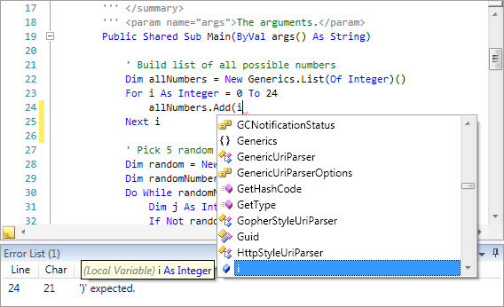

# Overview

The .NET Languages Add-on is an optional premium extra for SyntaxEditor customers that includes advanced implementations of C# and Visual Basic syntax languages.

The add-on has been built from the ground up by Actipro to take advantage of best practices for syntax language design.  While it is already packed with innovative features, the design is completely extensible and can be enhanced or modified as much as you like.

> [!NOTE]
> Be sure to read through each language's "Getting Started" topics and follow each step in them exactly to ensure that the add-on's features will operate properly.  While it only takes several lines of code to get up and running, those lines are very important and may prevent the add-on from working correctly if they are not present.

Although the add-on is distributed and demoed with the WPF controls, it is sold separately.

## Assemblies

Assemblies are objects implementing [IAssembly](xref:ActiproSoftware.Text.Languages.DotNet.Reflection.IAssembly) that can track reflection data from binary .NET assemblies or source code files.  This reflection data is then used by other add-on features such as the resolver and automated IntelliPrompt.  It is critical to configure assemblies correctly to use the advanced features offered by this add-on.

See the [Assemblies](assemblies.md) topic for more information.

## Reflection Data

A large object model is included in the add-on for managing reflection data for both .NET assemblies as well as source code files.  All of this data, which consists of everything from namespaces down to member parameters, is stored in a common set of interfaces so that it may easily be queried and used by features like the resolver, thus helping to populate automated IntelliPrompt.

See the [Reflection Data](reflection.md) topic for more information.

## Assembly Documentation

Each [IAssembly](xref:ActiproSoftware.Text.Languages.DotNet.Reflection.IAssembly) is able to provide documentation for the types and members that it contains.  This documentation generally originates from XML documentation comments.

See the [Assembly Documentation](documentation.md) topic for more information.

## Resolver

The resolver is an object that examines an expression and its containing contextual information.  It uses language-specific rules to investigate what is returned by the expression, such as a namespace, type, member, variable, etc.  This information is often passed to automated IntelliPrompt for display.

See the [Resolver](resolver.md) topic for more information.

## C# Language

The advanced [C# syntax language](csharp/index.md) implementation in the SyntaxEditor .NET Languages Add-on includes everything from automated IntelliPrompt and code outlining to syntax error reporting.

See the [C# Language](csharp/index.md) topics for more information.

## Visual Basic Language

The advanced [Visual Basic syntax language](vb/index.md) implementation in the SyntaxEditor .NET Languages Add-on includes everything from automated IntelliPrompt and code outlining to syntax error reporting.

See the [Visual Basic Language](vb/index.md) topics for more information.

## Troubleshooting

This topic provides answers to common questions and problems related to the add-on.

See the [Troubleshooting](troubleshooting.md) topics for more information.
