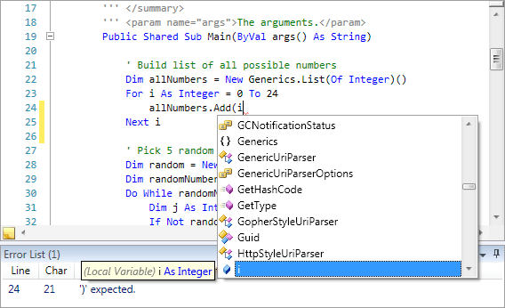

# Overview

The advanced Visual Basic syntax language implementation in the SyntaxEditor .NET Languages Add-on includes everything from automated IntelliPrompt and code outlining to syntax error reporting.

> [!NOTE]
> The syntax language and its parser supports Visual Basic 15.8 syntax.

## Features

The Visual Basic language is packed with features, including:

- Automated IntelliPrompt completion list, parameter info, and quick info.
- Syntax highlighting.
- Abstract syntax tree (AST) generation.
- Over 130 distinct AST node classes.
- Automatic code outlining based on AST structure.
- Reporting and automatic squiggle display of errors for invalid syntax.
- Mouse hover quick info for syntax errors.
- Stub documentation comment auto-generation.
- Code snippet support.
- Line commenting.
- Smart indent.
- Text formatting.
- Code block selection.
- Delimiter (bracket) highlighting and auto-completion.
- Code fragment editing with full IntelliPrompt, such as editing a method body.
- Optionally change the parser to parse expressions, statements, etc. instead of compilation units.
- Project assemblies that manage a project's code files and external references to other assemblies.
- Assembly repository that stores and caches reflection information for binary .NET assemblies.
- Support for navigable symbol selector (type/member drop-downs).

## Licensing

Even though the .NET Languages Add-on is distributed and demoed with the @@PlatformName controls, it is optional and is sold separately from SyntaxEditor and any containing bundles.  The pricing on the add-on is very cheap and licenses are all Enterprise licenses, meaning they cover your entire organization.

See the [Assemblies and Add-on Licensing](../../assemblies.md) topic for more information.

## Getting Started

This topic covers how to get started using the Visual Basic language from the .NET Languages Add-on, implemented by the [VBSyntaxLanguage](xref:ActiproSoftware.Text.Languages.VB.Implementation.VBSyntaxLanguage) class, and lists its requirements for supporting advanced features like parsing and automated IntelliPrompt.

It is very important to follow the steps in this topic to configure the language correctly so that its advanced features operate as expected.

See the [Getting Started](getting-started.md) topic for more information.

## Parsing and Parse Data

The Visual Basic language uses an advanced parser that has been constructed using the Actipro [LL(*) Parser Framework](../../ll-parser-framework/index.md), and provides functionality for building ASTs, reporting parse errors, and more.

The [ILLParseData](xref:ActiproSoftware.Text.Parsing.LLParser.ILLParseData) results returned by this parser are consumed by multiple other features of the language, such as code outlining, parse error display, etc.

See the [Parsing and Parse Data](parsing.md) topic for more information.

## Indent Provider

An indent provider enables support for smart indent features when pressing ENTER.

See the [Indent Provider](indent-provider.md) topic for more information.

## Text Formatter

The built-in text formatter can adjust whitespace between code elements to make code more readable.

See the [Text Formatter](text-formatter.md) topic for more information.

## Context

The Visual Basic language can return detailed context information about any offset in a document.  The context includes data such as containing AST node, target expression, and more.  This sort of information is essential in passing to the resolver to determine what to display in automated IntelliPrompt.

See the [Context](context.md) topic for more information.

## Automated IntelliPrompt

The Visual Basic language has built-in automated IntelliPrompt completion list, parameter info, quick info, and code snippet features that greatly enhance the end user's editing experience.

See the [Automated IntelliPrompt](intelliprompt.md) topic for more information.

## Documentation Comment Auto-Completer

A documentation comment auto-completer is an object that can attempt to auto-generate stub documentation comments for a type or member when `'''` is typed by the end user, can auto-complete end tags, and can insert continuation delimiters when pressing `Enter` in a documentation comment.

See the [Documentation Comment Auto-Completer](doc-comment-auto-completer.md) topic for more information.
