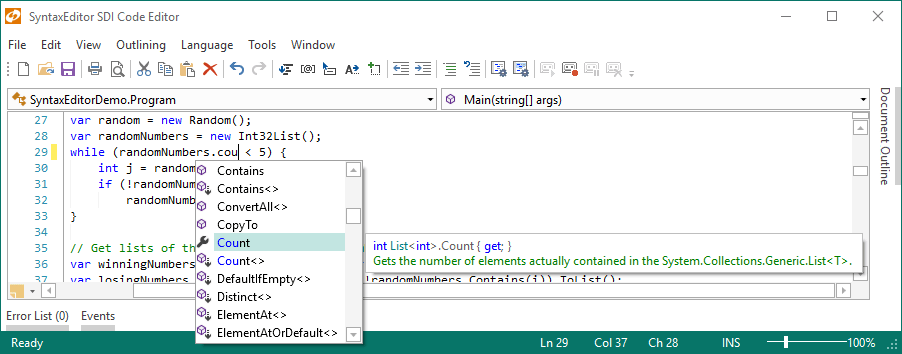

# Overview

SyntaxEditor is a powerful text editing control that is packed with features for efficient code editing, including syntax highlighting, code outlining, parsing, line numbers, block selection, IntelliPrompt UI, split views, adornments, bi-directional support, and much more.  It has many of the same code editing features found in the Visual Studio code editor.

@if (winrt) {

*The SyntaxEditor control editing a Javascript file with outlining enabled*

}

@if (wpf) {

*The SyntaxEditor control in the SDI Code Editor demo with a custom theme loaded*

}

SyntaxEditor is built on top of our next-generation extensible text/parsing framework.  While over 20 sample languages are available to get you started (such as C#, VB, XML, and more), custom language definitions can be developed and distributed with your applications as well.  SyntaxEditor is designed for use in IDE (integrated development environment) applications, however there are many other applications out there than can take advantage of such a control.

## Features

### Editing Features

- Unlimited undo/redo with ability to batch replace operations.
- Multiple carets/selections supported, allowing for typing and edits to occur in several places within a document at the same time.
- Block indent/outdent.
- Automated line modification tracking.
- Block (rectangular) selection and ability to prevent certain selection methods.
- Edit multiple lines at the same time with block selection.
- Line selection in the selection margin.
- Clipboard operations and drag/drop natively supported (cut, copy, paste), with support for any `DataObject`.
- Complete extended Unicode character@if (wpf winforms) {, IME (Input Method Editor)}, and bi-directional editing support.
- Over 100 edit actions including everything found in Visual Studio such as caret movement, selection, indenting, tabification, transposition, and more.
- Block, none, and customizable smart auto-indent modes when pressing <kbd>Enter</kbd>.
- Current line and delimiter (bracket) highlighting.
- Delimiter (bracket) auto-completion.
- Auto-case correct.
- Code block selection (expansion/contraction).
- Scrolling accelerates the longer scrollbar buttons are held down.

### Appearance Features

- Syntax highlighting of code based on classification mechanism, with ability to override lexer-based classifications.
- Word wrap.
- Whitespace display.
- Optional line number, selection, outlining, ruler, and word wrap glyph margins.
- Indicators (bookmarks, breakpoints, current statement, etc.).
- Ability to create custom margins and place them anywhere in the editor view.
- Ability to inject any custom adornment elements into the text area surface, or even inline between characters or view lines.
@if (wpf winrt) {
- Fully compatible with XAML styles/templates.
}
- Multiple font support.
- Horizontal split views.
- Scrollbar visibility options, including an auto mode.
@if (wpf winrt) {
- Customizable scrollbar tray areas that allow for embedding of custom controls next to scrollbars.
}
@if (wpf winrt) {
- Animated zoom in and out, via keyboard, mouse wheel, or pinch.
}
- Smooth inertia-based touch scrolling.
- Mouse wheel vertical scrolling, with horizontal scrolling supported when holding <kbd>Shift</kbd>.
- Squiggle lines for marking errors and spelling mistakes.
- Complete support for both automatic and manual code outlining (folding), with customizable outlining node options.
- Collapse (hide) regions of text independently of the outlining feature.
- Indentation guides.
- Single-line editing mode.

### Text/Parsing Framework Features

- Complete separation of the document model from the user interface.
- Documents keep track of text via thread-safe versioned snapshots.
- Snapshots are immutable and can be examined without fear of them changing.
- Text offsets can be translated between snapshots.
- Text changes support batching of replace operations.
- Powerful snapshot text scanning classes that allow scanning by character, text, token, etc.
- Load and save files, track modified flag.
- Language definitions that can wrap all editor and parsing functionality for a specific language.
- Ability to create custom language definitions using the feature-rich Language Designer application.
- Free sample language definitions for common languages like Assembly, Batch files, C, C#, C++, CSS, HTML, INI files, Java, JavaScript, Lua, Markdown, MSIL, Pascal, Perl, PHP, PowerShell, Python, RTF, Ruby, SQL, VB.NET, VBScript, and XML.
- Lexing of text into tokens, via a "dynamic" regex pattern-based lexer, "programmatic" hand-coded lexers, or other custom options.
- Multi-threaded parsing capabilities.
- Code fragment editing with full IntelliPrompt, such as editing a method body, when using advanced languages.
- Categorization of text ranges into classifications (used to drive features like syntax highlighting).
- Tagging mechanism that allows for marking of text ranges with custom data.
- Line commenting with line and range options.
- Text formatting capabilities.
- Export to HTML and RTF.

### IntelliPrompt Features

- Session-based IntelliPrompt object model.
- Completion lists that improve editing productivity and support complete word functionality.
- Completion lists support filters (tabs/buttons), multiple matching algorithm options, ability to create custom matching algorithms, matched text highlights, description tips, and much more.
- Quick info tips that can show detailed information about what is under the mouse, with automated mouse hover tracking.
- Parameter info tips that can show multiple signature overloads and track the current parameter.
- Code snippets that allow pre-defined text fragments to be inserted into the editor, and declared fields edited.
- Lazy load images and content used in IntelliPrompt popups.
- Optional mini-HTML markup supported for popup content.
- NavigableSymbolSelector control that provides functionality similar to the Visual Studio type/member drop-downs.
@if (wpf winrt) {
- Vector-based images for clarity in high DPI monitors.
}

### Printing Features

- WYSIWYG printing @if (wpf) {and print preview} with print-specific format settings.
- Optional document title, line number, word wrap glyph, and page number margins.
- Ability to create custom margins and place them anywhere in a printed page.
@if (wpf) {
- Easy export to XPS.
}

### Searching (Find/Replace) Features

- All standard options available including match case, match whole word, search up, search in selection, etc.
- Search pattern options include normal, regular expression, wildcard, acronym, and shorthand.
- Regular expression searches support captures/substitutions.
- Custom search patterns can be created.
- Incremental search mode that automatically searches the entire document as characters are typed.
- In-line search result highlights.
- Search overlay pane integrated on the editor surface that responds to <kbd>Ctrl</kbd>+<kbd>F</kbd>, <kbd>Ctrl</kbd>+<kbd>H</kbd>, and <kbd>F3</kbd> key variations.
@if (wpf winrt) {
- `EditorSearchView` control that provides an implementation of a Visual Studio-like search dialog with animations.
}

### Other Features

- Designed to perform well with very large documents.
- Support for read-only documents and specific text ranges within documents.
- Macro recording and playback.
- Text statistics that calculate statistics such as line, word, character counts as well as readability scores.
- Custom input processing handlers that can intercept and handle key and mouse events.
- Ability to easily create a highlighting styles Options dialog.
- A `TextStylePreview` control that can be used to display highlighting styles on an Options dialog.
- Abstracted and extensible object model design.

### Free Add-ons

- Actipro's advanced [LL(*) Parser Framework](ll-parser-framework/index.md) can be used to build custom grammar-based parsers written in C#/VB using EBNF-like notation, customizable AST construction, advanced error handling/reporting, easy code injection, a complete debugger UI, and much more.
@if (wpf) {
- Integration with [ANTLR](antlr-addon/index.md)-based DSL parsers, which can perform syntax/semantic parsing and AST building.
}
@if (wpf) {
- Integration with [Irony](irony-addon/index.md)-based DSL parsers, which can perform syntax/semantic parsing, AST building, and error reporting.
}

### Optional Premium Add-ons

- [.NET Languages Add-on](dotnet-languages-addon/index.md) that provides automated IntelliPrompt, code outlining, parsing, AST construction, syntax error reporting, and more for C# and Visual Basic documents.
- [Python Language Add-on](python-language-addon/index.md) that provides automated IntelliPrompt, code outlining, parsing, AST construction, syntax error reporting, and more for Python documents.
- [Web Languages Add-on](web-languages-addon/index.md) that provides automated IntelliPrompt, code outlining, validation, formatting, and more for XML documents, driven using XML schemas.
- [Web Languages Add-on](web-languages-addon/index.md) also provides automated IntelliPrompt, code outlining, parsing, syntax error reporting, formatting, and more for JavaScript documents.
- [Web Languages Add-on](web-languages-addon/index.md) also provides code outlining, parsing, syntax error reporting, formatting, and more for JSON documents.

*Premium add-ons are sold separately from SyntaxEditor and its containing bundles.*

*This product is written in 100% pure C#, and includes detailed documentation and samples.*
