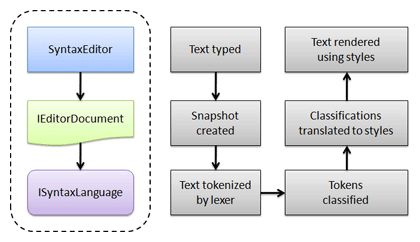

# Overview

This guide walks through the steps needed to build and use your own syntax languages with SyntaxEditor.  Syntax languages are a key part of the SyntaxEditor control product because they are part of the flow that enables syntax highlighting and other features in SyntaxEditor.

To better illustrate, lets examine the flow that occurs when text is typed into a SyntaxEditor to see how a language is involved in determining how the typed text gets rendered.

*A diagram that illustrates the general flow of logic from input through to display*

A [SyntaxEditor](xref:@ActiproUIRoot.Controls.SyntaxEditor.SyntaxEditor) control is a code editor that accept input.  When typing occurs, it creates a [text change](../text-parsing/core-text/text-changes.md) and applies it on the attached [IEditorDocument](xref:ActiproSoftware.Text.IEditorDocument).  This creates a new immutable [snapshot](../text-parsing/core-text/documents-snapshots-versions.md).  The snapshot text is analyzed by a [lexer](../text-parsing/lexing/index.md) and [tokens](../text-parsing/lexing/tokens.md) are generated.  These tokens are "tagged" by a [token tagger](../text-parsing/tagging/taggers.md) and back in the UI layer, the classifications are translated to related [highlighting styles](../user-interface/styles/highlighting-styles.md) via a [highlighting style registry](../user-interface/styles/highlighting-style-registries.md).  These highlighting styles are then used to tell SyntaxEditor how to render text.

## Step-by-Step Walkthrough

Don't know where to get started building a custom syntax language?  This walkthrough is the perfect place to go because it gives the steps that should be followed, along with links to many other helpful topics in this documentation.

See the [Step-by-Step Walkthrough](walkthrough.md) topic for more information.

## Creating an ISyntaxLanguage

The first step in building a language is the creation of a class that implements [ISyntaxLanguage](xref:ActiproSoftware.Text.ISyntaxLanguage).

See the [Creating an ISyntaxLanguage](creating-language.md) topic for more information.

## Loading a Language Definition (.langdef File)

The [Language Designer](../language-designer-tool/index.md) application can be used to optionally create files with *.langdef* file extensions, which are language definitions.  These language definition files can be distributed with your application, often in file form or as an embedded resource.  They contain information about a language and can be loaded at run-time to automatically create and initialize a language.

See the [Loading a Language Definition (.langdef File)](loading-lang-def.md) topic for details on how to load one of these files at run-time.

## Service Locator Architecture

Syntax languages are architected using the Service Locator design pattern, which keeps the [ISyntaxLanguage](xref:ActiproSoftware.Text.ISyntaxLanguage) interface small while still allowing for powerful extensibility of features.

Language features such as lexing, token tagger providers, line commenters, etc. can be registered as services on each language instance.  Certain service types are well known and extension methods provide easy access to the built-in feature services.  Any sort of custom service can be registered with a language and retrieved later as well.

See the [Service Locator Architecture](service-locator-architecture.md) topic for more information.

## Feature Services

Syntax languages have a wide array of optional features that can be implemented to enhance their capabilities when used with SyntaxEditor.

See the [Feature Services](feature-services/index.md) topic for more information.

## Provider Services

Syntax languages can register multiple instances of service objects implementing provider interfaces.  These provider interfaces can help drive features like tagging, adornments, and IntelliPrompt.

See the [Provider Services](provider-services/index.md) topic for more information.

## Event Sink Services

Event sinks are interfaces that allow a language to be notified of events that occur to a [SyntaxEditor](xref:@ActiproUIRoot.Controls.SyntaxEditor.SyntaxEditor) or [IEditorDocument](xref:ActiproSoftware.Text.IEditorDocument).  This could be anything from input events to text change events.  The language can choose to process these events and optionally block editor views from receiving them.

See the [Event Sinks](event-sinks.md) topic for more information.

## Using a Language

Once your syntax language has been configured properly, it's ready for use.

See the [Using a Language](using-language.md) topic for more information.
