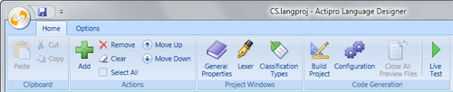

# Getting Started

This topic covers essential information about using the application, such as how to start it, what is a language project, how to open/save language projects, use the ribbon user interface and Properties tool window, and get started defining the general properties for a language.

## Running the Application

Go to your Windows' Programs menu group for the @@PlatformName controls and click the **Run SyntaxEditor Language Designer** menu item.  This will run the application.  If the application previously had a language project open, it will be reopened.  Otherwise a Start Actions task pane will be visible with several options for creating a new language project or opening an existing one.

> [!NOTE]
> If you do not see the menu item to run the application, ensure that you kept the option to install it checked during the @@PlatformName controls setup process.

## Language Projects vs. Language Definitions

It is important to understand the difference between language project files (*.langproj*) and language definition files (*.langdef*).  Language project files are what can be loaded and edited by the Language Designer application.  The language project stores a lot of information about your language such as lexer configuration, classification types, etc.  Based on the information about your language stored in a language project, you are able to generate language-related code that can be included in your application's project.  Language projects themselves are not intended to be distributed with your application, only the code generated by them is.

Language definitions on the other hand are one output option when performing code generation, the other option being the generation of pure C#/VB language-related code.  Language definitions are essentially a subset of the data stored in the language project and are can be distributed with an application and loaded at run-time to instantly configure a language.  Again, language definitions are just one option for working with a language at run-time with your code.  They are nice because they are portable and can easily be shared or tweaked.  More information on language definitions and the difference between them and pure C#/VB code generation is given in the [Code Generation](code-generation.md) topic.

## Language Project File Operations

The Language Designer supports all the basic file operations for working with language projects.  These file operations are always available on the ribbon's application menu, and also on the Start Actions task pane when no project is currently open.

The New action (Ctrl+N) creates a new language project and opens the General Properties configuration pane.  The Open action (Ctrl+O) opens an existing language project that you have already created.  The Save action (Ctrl+S) saves the currently-open language project.  The Save As action saves the currently-open language project, but as a different file.  The Close action closes the currently-open language project.

A list of recently-opened projects is also available.  Click on a recently-opened project to reopen it.

Whenever an action is taken that will close a currently-open language project, you will be prompted as to whether you wish to save the project or not before continuing.

## Importing a SyntaxEditor 4.0 for WinForms Dynamic Language XML Definition

To help aid in the transition of some of our WinForms customers to newer platforms, we have added a feature that allows you to import a SyntaxEditor 4.0 for WinForms dynamic language XML definition.  Most of the data in the definition will be converted over and imported into a new language project.

To access this feature, choose the Import SE4 Definition action.

## The Ribbon User Interface

The ribbon user interface in the Language Designer provides access to all of the application's features.

*The Language Designer's ribbon user interface*

The Actions group contains numerous actions that can be used whenever lists are presented in a configuration pane.  Certain actions enable/disable based on the selection within the list.

The Project Windows group contains actions that when clicked will open up the various configuration panes used to store data about your language.

The Code Generation group has actions that are related to building your project (error checking), performing code generation, and doing a live test.

## The Properties Tool Window

The Properties tool window is used throughout the application.  It will auto-populate when focus enters many of the configuration panes.  In the scenario where configuration panes contain a list, it will often show the properties of the selected list item.  Most lists support multi-selection, and in this case you can see/change the properties of more than one object at a time.

## General Properties Configuration Pane

The General Properties configuration pane can be opened by clicking **General Properties** on the ribbon.  This configuration pane allows you to set some high-level properties for your language.  All language projects should set this data first.

The **language key** is the name of the language that will be used in type names, etc.  So it must conform to identifier naming requirements for C# and VB.  This means that say we were making a language project for C#, we would set the language key to be **CSharp**.

The **language description** is only used in comments so if we were developing a C# language, here is where we would put **C#**.

The **creator** indicates the name of the company that created the language project.  The **copyright** is a place to put a copyright line for the language project data.  Both of these items, if included, are output during the code generation phase and help protect your intellectual property.

The **example text** is where you can paste in a code snippet for the language that is used in the Language Designer application when performing a Live Test.  It can also be loaded nad used at run-time if desired for previewing how a language is syntax highlighted.
