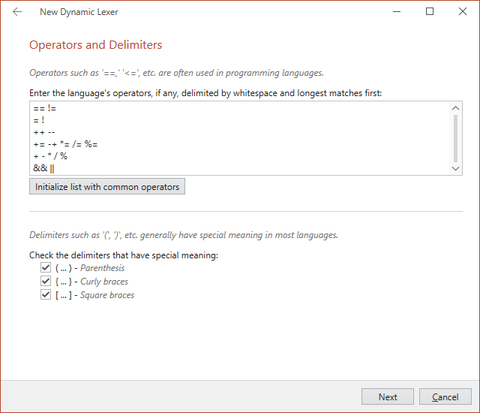
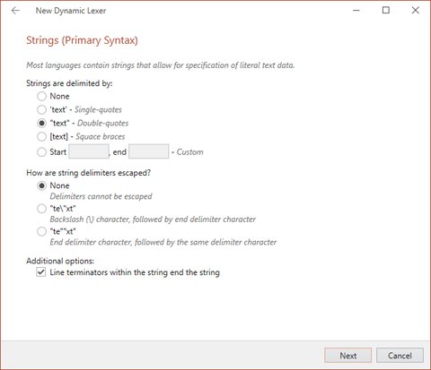
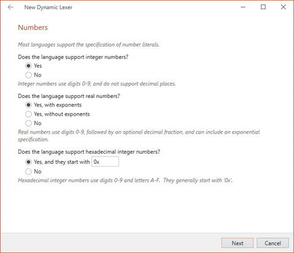
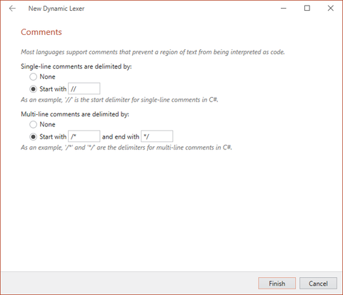

# Lexer Configuration Pane

The lexer for a language is very important since it is a building block for supporting many language features such as tokenization, syntax highlighting, and more.

The Lexer configuration pane can be opened by clicking **Lexer** on the ribbon.  This configuration pane allows you to define the lexer used by the language.

## Choosing a Lexer Type

Although any sort of lexer is supported by SyntaxEditor via the [ILexer](xref:ActiproSoftware.Text.Lexing.ILexer) interface, the Language Designer directly supports these types of lexers:

- **None** - No lexer is used with the language.
- **Dynamic** - A [dynamic lexer](../text-parsing/lexing/dynamic-lexers.md) is used with the language.  This lexer type is mergable and is the fastest way to get going.  It uses regular expression patterns to define how text is tokenized.
- **Programmatic (mergable)** - A [mergable programmatic lexer](../text-parsing/lexing/programmatic-lexers.md) is used with the language.  This lexer type is mergable and uses a handwritten code-based lexer to tokenize text.  It is faster than a dynamic lexer.
- **Programmatic (non-mergable)** - A [non-mergable programmatic lexer](../text-parsing/lexing/programmatic-lexers.md) is used with the language.  This lexer type is not mergable and uses a handwritten code-based lexer to tokenize text.  It provides the fastest performance.

*The Language Designer allowing a lexer type to be chosen*

To select a new lexer type, choose the lexer type in the radio button list and click the **Change Lexer Type** button below the list.  In some cases the lexer type will change instantly and in other cases, you may be presented with a wizard.

## The New Dynamic Lexer Wizard

The New Dynamic Lexer Wizard appears when you choose to use a dynamic lexer.  The first page provides you with two options.  The first option allows you to continue using the wizard, which will subsequently ask you a number of questions about the lexical structure of your language and then will automatically configure a number of states and pattern groups to get you started.  The second option allows you to quit the wizard and start with a blank dynamic lexer.

*The New Dynamic Lexer Wizard asking whether to help you create the basics for a code oriented language*

The first option is best for code-oriented languages like C#, Java, VB, etc.  It asks you series of questions about your language's lexical structure such as the keywords, operators, comment, number, and string syntax, etc.

The New Dynamic Lexer Wizard asks for you to define whether line terminators are significant in your langauge. The Python language would be an example of a language where line terminators are significant. It also asks for you to select one of 3 options that define the characters that are allowed in an identifier.

*The New Dynamic Lexer Wizard allowing for configuration of line terminators and identifiers*

After configuring line terminators and identifiers, you will be prompted to define the language's keywords and whether they are case-sensitive. Note that if you are creating this Dynamic language for use with the [LL(*) Parser Framework](../ll-parser-framework/index.md), keywords will each need to be defined as separate tokens. This is discussed in the [Lexer Preparation](../ll-parser-framework/lexer-preparation.md) topic.

*The New Dynamic Lexer Wizard allowing for configuration of language keywords*

After configuring keywords, you will be prompted to configure the language's operators and delimiters.  Many languages share a similar set of operators. You have the option to initialize the list with the most common operators, then edit it to your liking.

*The New Dynamic Lexer Wizard allowing for configuration of operators and delimiters*

Many languages support defining string literals in more than one way. For this reason, the wizard will prompt you for a primary and an alternate string syntax. If you only need to define one type of string, leave the first radio button group selection on "None" when you are presented with the alternate syntax configuration. If your langauge does not support strings at all, use the "None" selection on the primary and alternate syntax pages.

*The New Dynamic Lexer Wizard allowing for configuration of strings*

The next wizard screen will allow you to configure number tokens for your language. You can allow for exponent notation and hexadecimal notation, both of which are supported in many, but not all, languages.

*The New Dynamic Lexer Wizard allowing for configuration of numbers*

The last wizard screen allows you to configure comments in your language. You can configure it to support single line comments, multiline comments, neither, or both. You can also customize the comment delimiters.

*The New Dynamic Lexer Wizard allowing for configuration of comments*

Upon wizard completion, a dynamic lexer is created for you that is prepopulated with states and patterns.  For many languages, this wizard can help to get you up and running in minutes.

## Modifying a Dynamic Lexer

Once a dynamic lexer has been created, it can be modified via the Lexer configuration pane.  The treeview on the left of the application has nodes for accessing the lexical macro list, lexical state list, and for each state, the scopes, child states, and pattern groups.  Click on a treeview node to view its related pane.

### Dynamic Lexical Macros

Lexical macros are optional regular expression patterns that can be defined for reuse elsewhere within the lexer.  For instance, if you have a pattern snippet that appears in many patterns, define it here and reuse it in other regular expression patterns via `{LexicalMacroKey}` syntax.

To add macros, click the **Add** button in the ribbon.  A dialog will appear asking you for the keys of the new macros.  Enter one key per line, where each key conforms to standard identifier syntax since they will be used in code generation.  A new macro is created for each key that you enter.

Once added, use the **Properties** tool window to update the pattern for each macro.  Macros can be removed, cleared, and reordered via the ribbon.

### Dynamic Lexical States

Lexical states specify the patterns that can be recognized to tokenize text when the state is active.

To add states, click the **Add** button in the ribbon.  A dialog will appear asking you for the keys of the new states.  Enter one key per line, where each key conforms to standard identifier syntax since they will be used in code generation.  A new state is created for each key that you enter.

Once added, use the **Properties** tool window to update the properties for each state.  States can be removed, cleared, and reordered via the ribbon.

A state description can be set, which is a more verbose name for the state.  Also an ID value can be assigned to the state, which is ideal for best performance when scanning through text at run-time.  A number of default properties that apply to the pattern groups in the state (such as case sensitivity) are available to be set.

### Dynamic Lexical Scopes

Lexical scopes contain a start and end pattern group and determine how a state is entered and exited via a parent state that references it.

To add a scope, click the **Add** button in the ribbon.  A new scope is created.

Once added, use the **Properties** tool window to update the properties for the scope.  Scopes can be removed and cleared via the ribbon.

Each scope should have a start and end pattern group defined.  See the Dynamic Lexical Pattern Groups sub-section below for more information on defining pattern groups.

### Dynamic Child Lexical States

Child lexical states provide the list of states that can be transitioned into from a state.  When a child state's start scope pattern group is recognized, a transition into that state will be made.

To add a child state reference, click the **Add** button in the ribbon.  A dialog will appear asking you for the keys of the new child states.  Enter one key per line, where each key conforms to standard identifier syntax since they will be used in code generation.  A child state reference is created for each key that you enter.

Once added, use the **Properties** tool window to update the properties for each child state reference.  Child state references can be removed, cleared, and reordered via the ribbon.

### Dynamic Lexical Pattern Groups

Pattern groups define one or more patterns that are used to tokenize text.  Patterns can be explicit or can use regular expressions.

To add a pattern group, click the **Add** button in the ribbon.  A new pattern group is created.

Once added, use the **Properties** tool window to update the properties for each pattern group.  Pattern groups can be removed, cleared, and reordered via the ribbon.

Pattern groups can be assigned a pattern type (explicit or regular expression), various case sensitivity settings, a token ID (for optimal performance when scanning tokenized text), and a token key (which must conform to standard identifier syntax).  A classification type key indicates the key of the classification type to use for tokens created using this pattern group.

Pattern groups have a collection of patterns.  Patterns can be entered by clicking the ellipses button in the property grid or by right-clicking on the pattern group in the list.  Enter one pattern per line on the dialog that appears.  A pattern group look-behind and look-ahead pattern can also be defined.  These patterns, if specified, must evaluation to true for any of the patterns in the group to match successfully.

## Modifying a Programmatic Lexer

This type of lexer is handwritten via code but a couple helpful classes can be generated to help.

### Lexical States

Lexical states specify a mdoe in which patterns can be recognized to tokenize text when the state is active.  Since lexers often have multiple lexical states, it is useful to have a lexical state ID class that provides constants for all the possible lexical state IDs used by the lexer.  This lexical state ID class can be code generated by the Language Designer.

To add states, click the **Add** button in the ribbon.  A dialog will appear asking you for the keys of the new states.  Enter one key per line, where each key conforms to standard identifier syntax since they will be used in code generation.  A new state is created for each key that you enter.

Once added, use the **Properties** tool window to update the properties for each state.  States can be removed, cleared, and reordered via the ribbon.

A state description can be set, which is a more verbose name for the state.  Also an ID value can be assigned to the state, but it is recommended to leave it empty so that it can be auto-generated.

> [!TIP]
> If you plan on eventually merging the lexer with another lexer it is a good idea to ensure that the lexical state IDs for the two lexers don't overlap.  By setting a base ID value on the first lexical state and leaving the rest of the IDs empty, the code generator will auto-generate the remaining IDs to 1-up after the base ID.  Thus you could specify ID `1000` on the first lexical state.  The code generator will make the next lexical state with an empty ID value have an ID of `1001`, and so on.

### Token Declarations

The output of lexers is tokenized text.  Each token needs to have an ID value to identify it.  It is useful to have a token ID class that provides constants for all the possible token IDs used by the lexer.  This token ID class can be code generated by the Language Designer.

To add token declarations, click the **Add** button in the ribbon.  A dialog will appear asking you for the keys of the new token declarations.  Enter one key per line, where each key conforms to standard identifier syntax since they will be used in code generation.  A new token declaration is created for each key that you enter.

Once added, use the **Properties** tool window to update the properties for each token declaration.  States can be removed, cleared, and reordered via the ribbon.

A token declaration description can be set, which is a more verbose name for the token declaration.  Also an ID value can be assigned to the token declaration, but it is recommended to leave it empty so that it can be auto-generated.

> [!TIP]
> If you plan on eventually merging the lexer with another lexer it is a good idea to ensure that the token declaration IDs for the two lexers don't overlap.  By setting a base ID value on the first token declaration and leaving the rest of the IDs empty, the code generator will auto-generate the remaining IDs to 1-up after the base ID.  Thus you could specify ID `1000` on the first token declaration.  The code generator will make the next token declaration with an empty ID value have an ID of `1001`, and so on.

A classification type key can be set on the token declaration, indicating the classification type with which the token should be associated.  When one is specified, a method is generated on the token ID class that returns whether a specified token ID uses the classification type.
