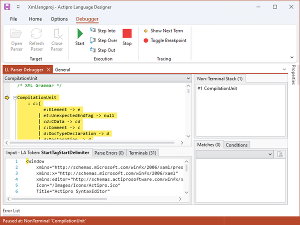
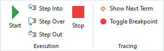

# LL Parser Debugger

The LL Parser Debugger allows you to load an assembly which contains a non-abstract [ILLParser](xref:ActiproSoftware.Text.Parsing.LLParser.ILLParser) implementation class and debug the grammar.

Opening the LL Parser Debugger pane shows a new contextual tab group on the ribbon.

@if (winrt winforms) {

## Important Platform Assembly Notes

Before digging into the debugger UI, there are some important things to know about its ability to load various assemblies.  Since the Language Designer is written in WPF and has its own set of WPF SyntaxEditor assemblies, it is unable to load @@PlatformTitle assemblies for debugging in the LL Parser Debugger.

When you wish to debug a @@PlatformTitle-based language parser written using the [LL(*) Parser Framework](../ll-parser-framework/index.md), you must clone the classes to a .NET class library that uses the related WPF SyntaxEditor .dll files as references, and compile a .dll of them.  Then load that assembly instead of the @@PlatformTitle-based one.

This allows you to debug the grammar since you are no longer trying to load @@PlatformTitle assemblies into the WPF-based application.  The @@PlatformTitle version's LL(*) Parser Framework is object model compatible with the WPF version of SyntaxEditor, thus making this possible.

Follow these steps to create a WPF class library containing your parser that can be debugged:

- Create a new .NET class library project.
- Reference the *ActiproSoftware.Text.Wpf.dll* and *ActiproSoftware.Text.LLParser.Wpf.dll* assemblies, which are WPF versions.  They are shipped in the same folder as the Language Designer application.
- Add the classes you need for your LL(*) Parser Framework parser to run, such as lexer, token ID classes, token reader, grammar, parser, etc.
- Compile the project to ensure an assembly is produced.
- Use that assembly with the LL Parser Debugger.

}

## Debugger Layout

The debugger comes with a number of panels that contain useful information about your grammar. Some of them are only used when stepping through the process of parsing the example text.

*The LL Parser Debugger*

### EBNF Rules Pane

The main part of the debugger window is taken up by the EBNF representation of your grammar. Each production that you defined in your grammar class should show up in this window, expressed in standard EBNF notation.

If you find that you are having trouble with one of your productions, this window is a good place to look to see if the production is being interpreted as you expected.

### Input Tab

At the bottom of the debugger pane, there is an Input tab. This tab is populated with the example code from the Language Project that [Language Designer](index.md) currently has loaded.

The text entered in this tab is used as input for the parser for debugging.

You can edit the text in this input if you want to test something specific, but changes to the contents of this box are not preserved for future debugging sessions.

### Parse Errors Tab

The Parse Errors tab will report any parsing errors encountered while debugging.

If an error is reported while debugging, either the example input text is incorrectly formed, or the grammar is not correct.

### Terminals Tab

The Terminals tab reports all the terminals that are defined in the [Grammar](xref:ActiproSoftware.Text.Parsing.LLParser.Implementation.Grammar).

### Non-Terminal Stack Tab

The Non-Terminal Stack tab reports the stack from the parser, as you are single-stepping through a parse operation.

### Matches Tab

The Matches tool reports the matched results from each production as you are stepping through a parse operation. This can be very helpful in debugging a grammar as you can see the immediate results from a specific production as it completes.

### Conditions Tab

The Conditions tool lists all the possible next tokens that are valid for the current production.  This information is used to determine whether the parser can attempt a match within a production by comparing the list with the look-ahead token.

## Opening a Parser

Clicking the Open Parser button launches a file browser dialog. Navigate to and select an assembly that contains a non-abstract [ILLParser](xref:ActiproSoftware.Text.Parsing.LLParser.ILLParser) implementation.  Note that the parser implementation class must have a parameterless constructor.

If there are two or more non-abstract [ILLParser](xref:ActiproSoftware.Text.Parsing.LLParser.ILLParser) implementations in the same assembly, the LL Parser Debugger will prompt and ask which parser it should load.

There are a number of grammar-related exceptions that can occur when loading an assembly for debugging.  The exception message should be helpful in solving the issue that is causing the exception, and the issue(s) must be resolved before the debugger can load the exception and debug the grammar.

Once the parser is loaded, you should see the main area of the debugger populate with EBNF rules that represent your grammar. This will be described in further detail below.

## Debugging

*The LL Parser Debugger controls*

If you would like to see the complete results of parsing the example text without stepping through, you can simply click the Start button. The Parse Errors tab will populate with any generated error messages. The Matches tool will populate with the AST result of the parsing operation.

If there is an issue in the complete parse tree that you would like to debug, it can be very informative to step through the grammar. You can begin this by pressing the Step Into button instead of the Start button. Each time you click Step Into, you will drill deeper into the production rules, following the parser's path. If you want to skip over a production rule that you are not interested in, you can click Step Over. Or, if you would like to leave a production rule that you no longer need additional information about, you can click Step Out, and the debugger will continue from the next element of the parent production.

If you know the exact production you would like to debug, you can place a breakpoint on that production by clicking within the production and clickin the Toggle Breakpoint button. You can then press Start and the debugger will run until it hits that breakpoint.

You can stop the debugger at any time by clicking the Stop button.

If you would like to see the next Term that the debugger will evaluate, click the Show Next Term button.  The next term is usually in view already by default, but if you scrolled the view away from that location, the Show Next Term button provides a convenient way to relocate the debugger's position in the grammar.

## Hotkeys

The LL Parser Debugger supports the same main debugging hotkeys as Visual Studio.

| Hotkey Combination | Action |
|-----|-----|
| <kbd>F5</kbd> | Start Debugging |
| <kbd>Shift</kbd>+<kbd>F5</kbd> | Stop Debugging |
| <kbd>F11</kbd> | Step Into |
| <kbd>F10</kbd> | Step Over |
| <kbd>Shift</kbd>+<kbd>F11</kbd> | Step Out |
| <kbd>F9</kbd> | Toggle Breakpoint |
