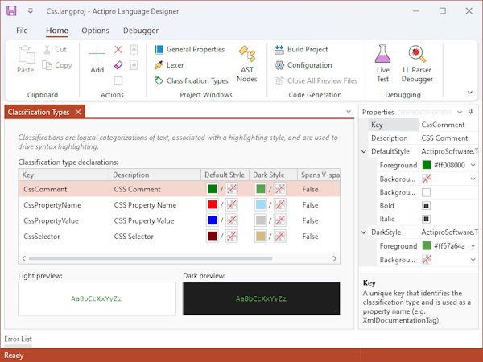

# Other Configuration Panes

The **Language Designe**r has several other configuration panes that are described in this topic.

## General Properties

The **General Properties** configuration pane is where several high-level language properties are defined.

Please see the [Getting Started](getting-started.md) topic for details, as this configuration pane is described in that topic.

## Classification Types

The **Classification Types** configuration pane can be opened by clicking **Classification Types** on the ribbon.  This configuration pane allows you to set which classification types are used by the language.

Classifications provide the foundation for syntax highlighting.  Ranges in text are classified with various logical classification types.  These classification types are mapped to highlighting styles, which SyntaxEditor uses to determine how to highlight code.  The end user can customize the styles for each classification type too.

*The Language Designer showing classification types being edited*

Classification types are used in conjunction with a lexer.  Be sure to [define a Lexer](../language-creation/feature-services/lexer.md) as well since classifications are assigned to the various tokens generated by the lexer.

Common classification types are:

- Comment
- Delimiter
- Identifier
- Keyword
- Number
- Operator
- String

### Adding Classification Types

To add classification types, click the **Add** button in the ribbon.  A dialog will appear asking you for the keys of the new classification types.  Enter one key per line, where each key conforms to standard identifier syntax since they will be used in code generation.  A new classification type is created for each key that you enter.

### Updating Classification Types

Select one or more classification types in the list and use the **Properties** tool window to modify their properties.  You can double-click a classification type in the list to open the **Properties** tool window.

A **Description** is a verbose way of describing the classification type that is displayed in user interfaces (such as options dialogs).  If no description is provided, the **Key** is used instead.  In most scenarios, keys will look fine in UI.  However, consider something like a C# `"XmlDocumentationTag"`.  In this case, we'd want to assign a description like `"XML Doc Tag"`, since that will look better in UI.

The **DefaultStyle** indicates the default highlighting style that should be used for syntax highlighting any text in SyntaxEditor that is classified with the classification type.  Any `null` values for the style attributes will inherit whatever the default editor text style is.  These style attributes can be edited:

- `Foreground` - The foreground brush of the highlighting style.
- `Background` - The background brush of the highlighting style.
- `Bold` - Whether the highlighting style uses boldface.
- `Italic` - Whether the highlighting style uses italics.
- `BackgroundSpansVirtualSpace` - Whether the background should span virtual space when the styled range includes a line terminator.

### Previewing Classification Types

The **Preview** box below the list shows a preview of the classification type and its default style.

### Removing Classification Types

Classification types can be removed by either selecting the items in the list and clicking the ribbon's **Remove** button, or by clicking the ribbon's **Clear** button, which will remove all of them.
