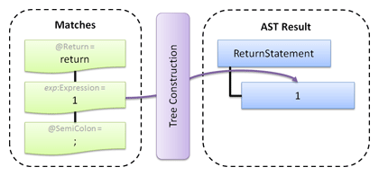
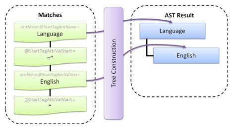
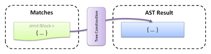
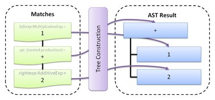
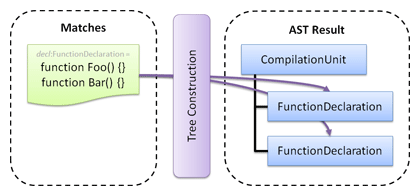
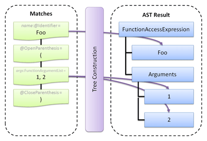
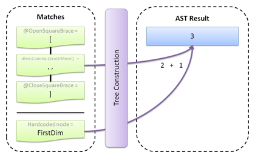
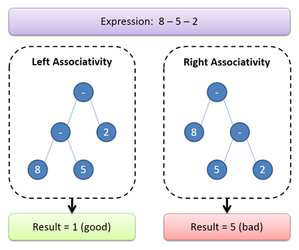

# Tree Constructors

Non-terminal productions will by default produce a very verbose AST that generally contains much more information than is useful for later consumption.  The LL(*) Parser Framework has an extremely powerful tree construction mechanism with numerous built-in helper methods to do common tree construction tasks.  You also have the ability to create completely custom tree construction nodes via C#/VB code if you like.

In the [previous walkthrough topic](walkthrough-symbols-and-terms.md), we stepped through how to create a grammar for the Simple language (which is similar to a Javascript subset).  We showed how easy it was to write the grammar using EBNF-like notation but completely from within your native C#/VB code.  We also showed how the grammar automatically generates an AST of the parsed document for you.

This topic will show how to completely customize the AST output so that it focuses only on the information we care about.

## Default Tree Construction

The default tree constructors will output nearly everything that is parsed.  Each AST node that is generated automatically contains the offset range of the text that created it.

AST nodes generated by the default tree constructors implement [IAstNode](xref:ActiproSoftware.Text.Parsing.IAstNode) and are of type [DefaultAstNode](xref:ActiproSoftware.Text.Parsing.Implementation.DefaultAstNode).

### Productions

Any EBNF production will create a scope and will output a new hierarchy level node in an AST.  The AST node that is created can have zero to many children, depending on what was matched within the production.

If the production is the root production for a non-terminal, then the AST node that is output for the production will have a value that is the non-terminal’s key.  Note that productions can be used within other productions.  In that case, the nested productions generate an AST node that has children but no value.

### Terminals

Terminals, which match tokens, will output an AST node with no children that has a value of the text that was read.

### Quantifiers

“Optional” quantifiers will output the tree construction results for the quantifier’s child term if the term matched successfully.  Otherwise an empty structural AST node will be output.

For any other quantifier (“zero-or-more”, “one-or-more”, etc.), a new scope  is created within the quantifier.  The quantifier will output a new hierarchy level node in the AST.  The AST node that is created can have zero to many children, depending on what was matched in the quantifier.

## Scopes and Labels

A couple places in the previous section mentioned where scopes are created.  Namely, scopes occur in productions and in quantifiers (ones other than "optional" quantifiers).

Any EBNF term, other than [EbnfConcatenation](xref:ActiproSoftware.Text.Parsing.LLParser.Implementation.EbnfConcatenation), can be assigned a label.  A label is a way for a tree constructor to identify something that was matched in its scope.  Labels are only useful when creating custom tree constructors.

Terminals and non-terminals, represented by the [Terminal](xref:ActiproSoftware.Text.Parsing.LLParser.Implementation.Terminal) and [NonTerminal](xref:ActiproSoftware.Text.Parsing.LLParser.Implementation.NonTerminal) classes can be auto-converted to their EBNF term equivalents ([EbnfTerminal](xref:ActiproSoftware.Text.Parsing.LLParser.Implementation.EbnfTerminal) and [EbnfNonTerminal](xref:ActiproSoftware.Text.Parsing.LLParser.Implementation.EbnfNonTerminal)) by calling their indexer and passing the label as a string parameter.

So say we have a terminal within a production for an identifier and we want to apply a `name` label to it.  We can do so like this:

```csharp
@identifier["name"]
```

For any object that is [EbnfTerm](xref:ActiproSoftware.Text.Parsing.LLParser.Implementation.EbnfTerm)-based, there is a [SetLabel](xref:ActiproSoftware.Text.Parsing.LLParser.Implementation.EbnfTerm.SetLabel*) method you can call instead like:

```csharp
statement.ZeroOrMore().SetLabel("stmt")
```

In that example, statement is a [NonTerminal](xref:ActiproSoftware.Text.Parsing.LLParser.Implementation.NonTerminal), its [ZeroOrMore](xref:ActiproSoftware.Text.Parsing.LLParser.Implementation.Symbol.ZeroOrMore*) method call converted it to an [EbnfNonTerminal](xref:ActiproSoftware.Text.Parsing.LLParser.Implementation.EbnfNonTerminal) and wrapped it with an [EbnfQuantifier](xref:ActiproSoftware.Text.Parsing.LLParser.Implementation.EbnfQuantifier).  Finally we set the label stmt on the quantifier via the [SetLabel](xref:ActiproSoftware.Text.Parsing.LLParser.Implementation.EbnfQuantifier.SetLabel*) method.

> [!NOTE]
> Labels cannot be set on [EbnfConcatenation](xref:ActiproSoftware.Text.Parsing.LLParser.Implementation.EbnfConcatenation) objects, but can be set on any other [EbnfTerm](xref:ActiproSoftware.Text.Parsing.LLParser.Implementation.EbnfTerm)-based object.

## Customizing Tree Constructors

Adding tree constructors to a production is easy.  So far we’ve only seen how to indicate the EBNF pattern expression for a production.  A tree constructor can be added to this by using the > operator followed by an [ITreeConstructionNode](xref:ActiproSoftware.Text.Parsing.LLParser.ITreeConstructionNode) instance like this:

```csharp
expression.Production = equalityExpression["exp"] > AstFrom("exp");
```

In the above sample code, a production was created for an `Expression` non-terminal, which simply calls into an `EqualityExpression` non-terminal.  It applies a label to that non-terminal’s results so that the tree constructor can work with them.  The [AstFrom](xref:ActiproSoftware.Text.Parsing.LLParser.Implementation.Grammar.AstFrom*) tree constructor simply looks for a match with the specified label and returns its value.

Thus the result of a match with this production is the result of the `EqualityExpression` non-terminal.  If we didn’t include the tree constructor portion of the above production, the result would be an `Expression` AST node whose child was the result of the `EqualityExpression` non-terminal.

## Tree Construction Type Summary and Comparison

There are numerous built-in tree construction node types that should handle nearly all your tree construction needs.  In extreme cases where the built-in functionality isn't enough, it is possible to create your own custom tree construction nodes.

> [!NOTE]
> Sections below discuss [DefaultAstNode](xref:ActiproSoftware.Text.Parsing.Implementation.DefaultAstNode) and type-specific AST nodes.  For more information on the difference between these types of AST nodes, see the [AST Nodes](../text-parsing/parsing/ast-nodes.md) topic.  The [Language Designer](../language-designer-tool/ast-nodes-config-pane.md) also has features that allow you to code generate classes for type-specific AST nodes.

### Type Summary

There are several types of tree construction:

<table>
<thead>

<tr>
<th>Type</th>
<th>Description</th>
</tr>


</thead>
<tbody>

<tr>
<td>Default (built-in)</td>
<td>

Automatically used when no tree constructors are specified in a production and output nearly everything that is parsed using [DefaultAstNode](xref:ActiproSoftware.Text.Parsing.Implementation.DefaultAstNode) instances.

The default tree constructors are good to use when first writing a grammar's EBNF productions since they give you immediate feedback on what is parsed without having to take time to write tree constructors.  However they are certainly not idea for production use since they include much more information than what is desired or needed.

</td>
</tr>

<tr>
<td>Core (built-in)</td>
<td>

Manually added to the tree constructor portion of productions via the use of the various non-generic `AstXX` methods found on the [Grammar](xref:ActiproSoftware.Text.Parsing.LLParser.Implementation.Grammar) class.

AST nodes created using these methods are [DefaultAstNode](xref:ActiproSoftware.Text.Parsing.Implementation.DefaultAstNode) instances.  These nodes are fine to use in production since they should be optimized to contain only meaningful data based on how how you specified the tree constructor portion of the productions.

</td>
</tr>

<tr>
<td>Type-Specific (built-in)</td>
<td>

Manually added to the tree constructor portion of productions via the use of the various generic `AstXX` methods found on the [Grammar](xref:ActiproSoftware.Text.Parsing.LLParser.Implementation.Grammar) class.

AST nodes created using these methods are of the type passed into the method as a generic argument, and can have various properties on the type set.  Since the AST nodes used are dedicated .NET partial classes, they can easily be extended with helper methods.  These nodes are the most ideal for production, since they have a more efficient AST structure.  As an example, for simple cases where the AST needs to store a string value, a string property on the AST node can be set, as opposed to how [DefaultAstNode](xref:ActiproSoftware.Text.Parsing.Implementation.DefaultAstNode) would need to create an AST node to store the value and likely wrap it with another contextual AST node.

The downside of type-specific nodes is that they require a bit more work since many new classes need to be created, one for each AST node type.  That being said, the [Language Designer](../language-designer-tool/ast-nodes-config-pane.md) has features that can code generate the classes for you based on some quick configuration settings.

</td>
</tr>

<tr>
<td>Custom</td>
<td>

Manually added to the tree construction portion of productions via the instantiation of the custom class used to implement the tree construction node.

Custom nodes are used in scenarios where there is custom processing needed to properly handle matches made in a production, that the built-in tree construction nodes can't handle.

</td>
</tr>

</tbody>
</table>

### Comparison

To best illustrate the differences between the various built-in node types, let's make a production for a C# if-statement.  Its EBNF is stated as:

```
if-statement:
"if" "(" boolean-expression ")" embedded-statement
"if" "(" boolean-expression ")" embedded-statement "else" embedded-statement
```

For these samples, we'll use the same input code:

```
if (isTrue) return 1 else return 0;
```

This comparison is just an introduction to the various built-in node types.  Details on how to work with each is included in other sections below.

First is the default tree constructors, where no tree constructor is specified in a production:

```csharp
ifStatement.Production = @keywordIf + @openParenthesis + booleanExpression + 
	@closeParenthesis + embeddedStatement + (@keywordElse + embeddedStatement).Optional();
```

The output from the default tree constructors would be similar to this, which includes nodes for everything, even the punctuation:

```
IfStatement[
	"If",
	"(",
	SimpleName[
		"isTrue"
	],
	")"
	ReturnStatement[
		LiteralExpression[
			"1"
		]
	],
	"Else",
	ReturnStatement[
		LiteralExpression[
			"0"
		]
	]
]
```

Now let's use the core tree construction nodes:

```csharp
ifStatement.Production = @keywordIf + @openParenthesis +
	booleanExpression["conditionexp"].OnErrorContinue() + 
	@closeParenthesis.OnErrorContinue() + embeddedStatement["truestmt"].OnErrorContinue() + 
	(@keywordElse + embeddedStatement["falsestmt"].OnErrorContinue()).Optional()
	> Ast("IfStatement", 
		Ast("ConditionExpression", AstFrom("conditionexp")), 
		Ast("TrueStatement", AstFrom("truestmt")), 
		Ast("FalseStatement", AstFrom("falsestmt")));
```

The output from the core tree constructors would be similar to this, which is much more concise than the default tree constructors:

```
IfStatement[
	ConditionExpression [
		SimpleName[
			"isTrue"
		]
	],
	TrueStatement[
		ReturnStatement[
			LiteralExpression[
				"1"
			]
		]
	],
	FalseExpression[
		ReturnStatement[
			LiteralExpression[
				"0"
			]
		]
	]
]
```

For the final comparison, we'll use type-specific tree constructors:

```csharp
ifStatement.Production = @keywordIf + @openParenthesis + 
	booleanExpression["conditionexp"].OnErrorContinue() + 
	@closeParenthesis.OnErrorContinue() +
	embeddedStatement["truestmt"].OnErrorContinue() + 
	(@keywordElse + embeddedStatement["falsestmt"].OnErrorContinue()).Optional()
	> Ast<IfStatement>()
		.SetProperty(s => s.ConditionExpression, AstFrom("conditionexp"))
		.SetProperty(s => s.TrueStatement, AstFrom("truestmt"))
		.SetProperty(s => s.FalseStatement, AstFrom("falsestmt"));
```

The output from this is an instance of the `IfStatement` class, along with various other classes that represent each type of AST node.

```
new IfStatement {
	ConditionExpression = new SimpleName { 
		Text = "isTrue" 
	},
	TrueStatement = new ReturnStatement { 
		Expression = new LiteralExpression() {
			Value = 1
		}
	},
	FalseStatement = new ReturnStatement { 
		Expression = new LiteralExpression() {
			Value = 0
		}
	}
}
```

From this comparison, it's easy to see how either the core or type-specific tree construction types are good for production use.  The type-specific tree construction type takes a bit more work simply because classes need to be created for each AST node type, but in the end you get a nicer and more flexible AST model.

## Core Built-in Tree Construction Nodes

There are a number of core built-in tree construction nodes that should handle nearly all your tree construction needs.  These nodes are created by method calls on the [Grammar](xref:ActiproSoftware.Text.Parsing.LLParser.Implementation.Grammar) class.

### Ast(string value, params ITreeConstructionNode[] childNodes)

The [ITreeConstructionNode](xref:ActiproSoftware.Text.Parsing.LLParser.ITreeConstructionNode) generated by the [Ast](xref:ActiproSoftware.Text.Parsing.LLParser.Implementation.Grammar.Ast*) method will create a [DefaultAstNode](xref:ActiproSoftware.Text.Parsing.Implementation.DefaultAstNode) with the specified value and optional child nodes.

This tree construction node is the most basic building block used in tree construction, as it allows you to wrap other AST nodes with an AST node that has a specific value, generally the name of the containing non-terminal.

This example creates an AST node with value `ReturnStatement` that has a child node resulting from an EBNF term match whose `label` is `exp`:

```csharp
returnStatement.Production = @return + expression["exp"] + @semiColon
	> Ast("ReturnStatement", AstFrom("exp"));
```

When parsing the following input, the result is shown in the diagram below:

```
return 1;
```



The first parameter passed to [Ast](xref:ActiproSoftware.Text.Parsing.LLParser.Implementation.Grammar.Ast*) method, `ReturnStatement`, becomes the value of the root AST node returned by the tree constructor.  The result of the `Expression` match, in this case `1`, is returned directly as a child of the `ReturnStatement` node via the [AstFrom](xref:ActiproSoftware.Text.Parsing.LLParser.Implementation.Grammar.AstFrom*) method.  Note that the `Return` and `SemiColon` terminals are discarded since they are not important for our AST.

### AstValueOf(ITreeConstructionNode valueOfNode, params ITreeConstructionNode[] childNodes)

The [ITreeConstructionNode](xref:ActiproSoftware.Text.Parsing.LLParser.ITreeConstructionNode) generated by the [AstValueOf](xref:ActiproSoftware.Text.Parsing.LLParser.Implementation.Grammar.AstValueOf*) method works the same way as [Ast](xref:ActiproSoftware.Text.Parsing.LLParser.Implementation.Grammar.Ast*) except that the root node created will have the value of the `valueOfNode` tree construction node result’s value.

This tree construction node is used when your resulting AST node's value is based on some match's value, instead of a fixed value such as what is provided to the [Ast](xref:ActiproSoftware.Text.Parsing.LLParser.Implementation.Grammar.Ast*) method.

This example for an XML attribute name and value shows how a parent AST node can be created whose value is the attribute name and the child AST node will be the attribute value:

```csharp
xmlAttribute.Production = @startTagAttrName["attrName"] + @startTagAttrValStart + @startTagAttrValText["attrValue"] + @startTagAttrValEnd
	> AstValueOf(AstFrom("attrName"), AstFrom("attrValue"))
```

When parsing the following input, the result is shown in the diagram below:

```
Language="English"
```



Note how the the root AST node's value is the value of a match, in this case `Language`.

### AstFrom(string label)

The [ITreeConstructionNode](xref:ActiproSoftware.Text.Parsing.LLParser.ITreeConstructionNode) generated by the [AstFrom](xref:ActiproSoftware.Text.Parsing.LLParser.Implementation.Grammar.AstFrom*) method will create an AST node from an EBNF term match with the specified label.

This tree construction node is useful when merging resulting AST nodes within another container AST node, such as one generated by a call to the [Ast](xref:ActiproSoftware.Text.Parsing.LLParser.Implementation.Grammar.Ast*) method.  See the [Ast](xref:ActiproSoftware.Text.Parsing.LLParser.Implementation.Grammar.Ast*) method example above for a sample showing one typical use of the [AstFrom](xref:ActiproSoftware.Text.Parsing.LLParser.Implementation.Grammar.AstFrom*) method.

Another common use of this tree construction node is to "promote" a child match node up without wrapping it by another node.  This example shows how a generalized `Statement` production can match a certain kind of statement (a `Block`) and have the `BlockStatement` result bubble up without it being wrapped by a `Statement` node.  For a real language, normally there would be other similar statement types in an alternation with the `Block` term.

```csharp
statement.Production = block["stmt"]
	> AstFrom("stmt")
```

When parsing the following input, the result is shown in the diagram below:

```
{ ... }
```



Note how the results of the `Block` term are directly returned without being wrapped by another AST node.

### AstChildFrom(string label)

The [ITreeConstructionNode](xref:ActiproSoftware.Text.Parsing.LLParser.ITreeConstructionNode) generated by the [AstChildFrom](xref:ActiproSoftware.Text.Parsing.LLParser.Implementation.Grammar.AstChildFrom*) method will create an AST node from the first child of an EBNF term match with the specified label.

This tree construction node is similar to [AstFrom](xref:ActiproSoftware.Text.Parsing.LLParser.Implementation.Grammar.AstFrom*) however instead of returning the resulting AST node of the specified match, it is returning the first child AST node within that resulting AST node, thus skipping a level.

> [!NOTE]
> An overload of this method allows for specification of a particular child node index.  The default child index is `0`, meaning the first child.

This example for a binary operator expression shows how the operator used will be the value of the root node created, but only if the `leftexp` and `rightexp` returned matches.  If only one match occurred (no operator was used), then that match will be directly passed up.  The operator portion of this production is actually a nested child production, thus its result is wrapped by an AST node with no value by default.  The use of [AstChildFrom](xref:ActiproSoftware.Text.Parsing.LLParser.Implementation.Grammar.AstChildFrom*) allows us to retrieve the matched operator value, while discarding the wrapper AST node.

```csharp
additiveExp.Production = multiplicativeExp["leftexp"] + ((@addition | @subtraction).SetLabel("op") + additiveExp["rightexp"]).Optional()
	> AstValueOfConditional(AstChildFrom("op"), AstFrom("leftexp"), AstFrom("rightexp"));
```

When parsing the following input, the result is shown in the diagram below:

```
1 + 2
```



This production uses the powerful [AstValueOfConditional](xref:ActiproSoftware.Text.Parsing.LLParser.Implementation.Grammar.AstValueOfConditional*) method, which contains conditional logic.  The value of the operator nested production becomes the value of the root AST node and the values of the left and right expressions become the values of child AST nodes.

In an alternate scenario if the input was just `1` then [AstValueOfConditional](xref:ActiproSoftware.Text.Parsing.LLParser.Implementation.Grammar.AstValueOfConditional*) would just promote the left expression AST node with value `1` up without wrapping it by an operator AST node.

### AstChildrenFrom(string label)

The [ITreeConstructionNode](xref:ActiproSoftware.Text.Parsing.LLParser.ITreeConstructionNode) generated by the [AstChildrenFrom](xref:ActiproSoftware.Text.Parsing.LLParser.Implementation.Grammar.AstChildrenFrom*) method will create an AST node from the children of an EBNF term match with the specified label.

Since the result of this particular tree construction node is a list, it can never be used as the root return value of a production.

This example creates an AST node with value `CompilationUnit` that contains the children of an EBNF term match whose label is `decl`:

```csharp
compilationUnit.Production = functionDeclaration.ZeroOrMore().SetLabel("decl")
    > Ast("CompilationUnit", AstChildrenFrom("decl"));
```

When parsing the following input, the result is shown in the diagram below:

```
function Foo() {} 
function Bar() {}
```



The root AST node returned has value `CompilationUnit`, and has child AST nodes that represent the AST node results of the `FunctionDeclaration` non-terminal calls.

An overload of [AstChildrenFrom](xref:ActiproSoftware.Text.Parsing.LLParser.Implementation.Grammar.AstChildrenFrom*) accepts a nesting level parameter, which allows for retrieval of nodes two or more levels deep.  A value of `0` passed to this overload means take the direct children, same as the functionality described above.  A value of `1` passed as the nesting level means return grandchildren nodes instead.  This functionality is helpful in scenarios where the desired list of results are wrapped by another AST node.

### AstConditionalFrom(string value, string label)

The [ITreeConstructionNode](xref:ActiproSoftware.Text.Parsing.LLParser.ITreeConstructionNode) generated by the [AstConditionalFrom](xref:ActiproSoftware.Text.Parsing.LLParser.Implementation.Grammar.AstConditionalFrom*) method will create a [DefaultAstNode](xref:ActiproSoftware.Text.Parsing.Implementation.DefaultAstNode) with the specified value whose child nodes come from the children of the specified labeled EBNF term match, but only if at least one child node is available.  If no child nodes are available, nothing is created.

This tree construction node is very handy when there are things such as optional parameter or argument lists in a grammar and you don’t want to clutter up the resulting AST when a particular member doesn’t have parameters or arguments.

This example creates a `FunctionAccessExpression` AST node whose first child comes from an EBNF term match with label `name`.  The next child will be an `Arguments` node but only if there was at least one child within an EBNF term match with label `args`.

```csharp
functionAccessExp.Production = @identifier["name"] + @openParenthesis + functionArgumentList["args"].Optional() + @closeParenthesis
    > Ast("FunctionAccessExpression", AstFrom("name"), AstConditionalFrom("Arguments", "args"));
```

When parsing the following input, the result is shown in the diagram below:

```
Foo(1, 2)
```



The root `FunctionAccessExpression` AST node's first child node has the value of the `name` match, in this case `Foo`.  Since there was more than one argument passed, [AstConditionalFrom](xref:ActiproSoftware.Text.Parsing.LLParser.Implementation.Grammar.AstConditionalFrom*) injects a second child node called `Arguments`, whose children are the argument AST nodes.

Alternatively if the input was `Foo()`, the `Arguments` node and its children would not have been in the result.

### AstConditional(string value, params ITreeConstructionNode[] childNodes)

The [ITreeConstructionNode](xref:ActiproSoftware.Text.Parsing.LLParser.ITreeConstructionNode) generated by the [AstConditional](xref:ActiproSoftware.Text.Parsing.LLParser.Implementation.Grammar.AstConditional*) method will create a [DefaultAstNode](xref:ActiproSoftware.Text.Parsing.Implementation.DefaultAstNode) with the specified value and optional child nodes, but only if there is more than one child available.  If one child is available, it is directly returned.

This behavior is very similar to the logic for the [AstConditionalFrom](xref:ActiproSoftware.Text.Parsing.LLParser.Implementation.Grammar.AstConditionalFrom*) method, except that the arguments to [AstConditional](xref:ActiproSoftware.Text.Parsing.LLParser.Implementation.Grammar.AstConditional*) can be individual tree constructors or the special [AstChildrenFrom](xref:ActiproSoftware.Text.Parsing.LLParser.Implementation.Grammar.AstChildrenFrom*) tree constructor that can return zero to many results.

This example creates an AST node with value `Parameters` that has child nodes from the union of the children of EBNF term matches `params1` and `params2`:

```csharp
functionParameters.Production = AstConditional("Parameters", AstChildrenFrom("params1"), AstChildrenFrom("params2"))
```

Note that if only one result came from the union of `params1` and `params2` children, that single result would be returned and would not be wrapped by a `Parameters` node.

### AstValueOfConditional(ITreeConstructionNode valueOfNode, params ITreeConstructionNode[] childNodes)

The [ITreeConstructionNode](xref:ActiproSoftware.Text.Parsing.LLParser.ITreeConstructionNode) generated by the [AstValueOfConditional](xref:ActiproSoftware.Text.Parsing.LLParser.Implementation.Grammar.AstValueOfConditional*) method works the same way as [AstConditional](xref:ActiproSoftware.Text.Parsing.LLParser.Implementation.Grammar.AstConditional*) except that the root node created when there is more than one child available will have the value of the `valueOfNode` tree construction node result’s value.

A sample usage for this tree construction node is included in the [AstChildFrom](xref:ActiproSoftware.Text.Parsing.LLParser.Implementation.Grammar.AstChildFrom*) sample above.

### AstCount(params ITreeConstructionNode[] childNodes)

The [ITreeConstructionNode](xref:ActiproSoftware.Text.Parsing.LLParser.ITreeConstructionNode) generated by the [AstCount](xref:ActiproSoftware.Text.Parsing.LLParser.Implementation.Grammar.AstCount*) method will create an AST node whose value is the count of [IAstNode](xref:ActiproSoftware.Text.Parsing.IAstNode) objects generated by contained nodes.

This tree construction node is useful in scenarios where you need a count of matched objects.

This example counts the number of dimensions in an array rank specifier.  Note that since it counts commas, an additional result is included to make the result one-based instead of zero-based:

```csharp
rankSpecifier.Production = @openSquareBrace + @comma.ZeroOrMore().SetLabel("dims") + @closeSquareBrace.OnErrorContinue()
	> AstCount(Ast("FirstDim"), AstChildrenFrom("dims"));
```

When parsing the following input, the result is shown in the diagram below:

```
[,,]
```



The resulting AST node has a value of `3`, which is `1` (from the hardcoded node) added to `2` (the number of commas).

## Type-Specific Built-in Tree Construction Nodes

Type-specific tree construction nodes can be used when you have [type-specific AST nodes](../text-parsing/parsing/ast-nodes.md), which can easily be code generated by the [Language Designer](../language-designer-tool/ast-nodes-config-pane.md).

There are several type-specific built-in tree construction nodes which are similar to their non-generic core counterparts.  These nodes are created by generic method calls on the [Grammar](xref:ActiproSoftware.Text.Parsing.LLParser.Implementation.Grammar) class.

Each of the type-specific tree construction nodes implement the [ITypedTreeConstructionNode<T>](xref:ActiproSoftware.Text.Parsing.LLParser.ITypedTreeConstructionNode`1) interface, which has methods on it that allow for altering of properties on the type.  These properties are described in more detail below.

### Type-Specific Tree Construction Nodes

The following generic methods are available on the [Grammar](xref:ActiproSoftware.Text.Parsing.LLParser.Implementation.Grammar) class to create type-specific tree construction nodes.  In each case, the generic type argument passed to the method indicates the `Type` of AST node to create.  Since they work similarly to their core non-generic counterparts, please see the documentation above for more details on how and when to use them.

| Method | Description |
|-----|-----|
| [Ast](xref:ActiproSoftware.Text.Parsing.LLParser.Implementation.Grammar.Ast*)<T>() | This node works similarly to the core non-generic [Ast](xref:ActiproSoftware.Text.Parsing.LLParser.Implementation.Grammar.Ast*) method in that it creates a new instance of an AST node.  However instead of a [DefaultAstNode](xref:ActiproSoftware.Text.Parsing.Implementation.DefaultAstNode) being created with a certain value, the AST node instance created is of the type passed as a generic type argument, and properties can be set on it. |
| [AstFrom](xref:ActiproSoftware.Text.Parsing.LLParser.Implementation.Grammar.AstFrom*)<T>(string label) | This node works exactly the same as the core non-generic [AstFrom](xref:ActiproSoftware.Text.Parsing.LLParser.Implementation.Grammar.AstFrom*) method in that it returns the node that was matched using the specified label.  The only difference is that the node instance is cast to the type passed as a generic type argument and properties can be set on the instance. |
| [AstConditional](xref:ActiproSoftware.Text.Parsing.LLParser.Implementation.Grammar.AstConditional*)<T>(params ITreeConstructionNode\[] childNodes) | This node works similarly to the core non-generic [AstConditional](xref:ActiproSoftware.Text.Parsing.LLParser.Implementation.Grammar.AstConditional*) method in that it creates a new AST node instance only if two or more child AST nodes are passed in.  The type created in this instance is the type passed as a generic type argument, and properties can be set on the created isntance.  If instead only one child AST node is passed in, it is directly returned and no new AST node is created or properties assigned. |
| [AstLeftAssociativity](xref:ActiproSoftware.Text.Parsing.LLParser.Implementation.Grammar.AstLeftAssociativity*)<T, U>(ITreeConstructionNode childNode, ...) | This node provides special advanced functionality to update the AST tree such that left associativity is supported when appropriate.  See the section below on Left Associativity for more information on what it means. |

### Modifying AST Node Properties

All of the three tree constructor generic methods described above return an [ITypedTreeConstructionNode<T>](xref:ActiproSoftware.Text.Parsing.LLParser.ITypedTreeConstructionNode`1) instance, which has several methods on it for describing how to update properties on the related type-specific AST node.

Note that all of these methods use one or more lambda expressions that indicate the property to update.  This enables type checking and validation by the C#/VB compiler.

### SetProperty

The [SetProperty](xref:ActiproSoftware.Text.Parsing.LLParser.ITypedTreeConstructionNode`1.SetProperty*) method is the most-used mechanism to update properties.  It calls a setter for the specified property to set it to a new value.  Depending on the property’s return type, different logic is used for how to obtain its value.  Strings, integers, booleans, enums, flags enums, and AST node properties are supported.

Multiple instances of these values can be passed to the method for a single property too, which is especially useful for things like type modifiers.  Generally there are zero or more type modifiers allowed on a type.  So we end up with a list of them.  But say our type-specific AST node for type declarations has a `Modifiers` property where the `Modifiers` enum value is a flags enum.  In this case [SetProperty](xref:ActiproSoftware.Text.Parsing.LLParser.ITypedTreeConstructionNode`1.SetProperty*) will automatically OR all the flags found together and set the resulting value to the property.

Similar logic is available for strings (which get concatenated), ints (which get added together), and bools (which get OR’ed together).  Generally though, only a single AST node result is passed to [SetProperty](xref:ActiproSoftware.Text.Parsing.LLParser.ITypedTreeConstructionNode`1.SetProperty*) for examination.

This sample shows the use of [SetProperty](xref:ActiproSoftware.Text.Parsing.LLParser.ITypedTreeConstructionNode`1.SetProperty*).  Note that even though a type-specific AST node is being created, we can still use core tree construction node to obtain property values.

```csharp
constantDeclarator.Production = simpleNameWithoutTypeArguments["name"] + 
	@operatorAssignment.OnErrorContinue() + constantExpression["exp"].OnErrorContinue()
	> Ast<VariableDeclarator>()
		.SetProperty(d => d.Name, AstFrom("name"))
		.SetProperty(d => d.Initializer, AstFrom("exp"))
		.SetProperty(d => d.Kind, VariableDeclaratorKind.Constant);
```

Another overload of [SetProperty](xref:ActiproSoftware.Text.Parsing.LLParser.ITypedTreeConstructionNode`1.SetProperty*) allows a literal value to be assigned as the value like the above production where a constant declarator should always have its `Kind` property set to a specific enumeration value.

### AppendToProperty

The [AppendToProperty](xref:ActiproSoftware.Text.Parsing.LLParser.ITypedTreeConstructionNode`1.AppendToProperty*) method works the same as [SetProperty](xref:ActiproSoftware.Text.Parsing.LLParser.ITypedTreeConstructionNode`1.SetProperty*).  The only difference is that instead of wiping out any previous property value, the previous value is included in the OR/concatenation/addition logic described above for [SetProperty](xref:ActiproSoftware.Text.Parsing.LLParser.ITypedTreeConstructionNode`1.SetProperty*) when multiple AST node values are passed.

This sample shows the use of [AppendToProperty](xref:ActiproSoftware.Text.Parsing.LLParser.ITypedTreeConstructionNode`1.AppendToProperty*).

```csharp
typeDeclaration.Production = attributeSection.OnErrorContinue().ZeroOrMore().SetLabel("attrs") + 
	modifier.OnErrorContinue().ZeroOrMore().SetLabel("modifiers") + typeDeclarationCore["decl"]
	> AstFrom<IDecoratedMember>("decl")
		.AddToCollectionProperty(d => d.AttributeSections, AstChildrenFrom("attrs"))
		.AppendToProperty(d => d.Modifiers, AstChildrenFrom("modifiers"));
```

The above production shows usage of [AppendToProperty](xref:ActiproSoftware.Text.Parsing.LLParser.ITypedTreeConstructionNode`1.AppendToProperty*) and how it will not wipe out any existing modifiers values that came in from the declaration AST node returned in label `decl`.  Instead it will take the existing property value and OR in any matched modifiers.  The result is set as the new `Modifiers` property value.

### AddToCollectionProperty

The [AddToCollectionProperty](xref:ActiproSoftware.Text.Parsing.LLParser.ITypedTreeConstructionNode`1.AddToCollectionProperty*) method appends one or more AST node result values to a collection property.  In the production above, any attribute section AST nodes that are matched are added to the the `AttributeSections` list property.

### SetCollectionItemProperties

The [SetCollectionItemProperties](xref:ActiproSoftware.Text.Parsing.LLParser.ITypedTreeConstructionNode`1.SetCollectionItemProperties*) method works just like [SetProperty](xref:ActiproSoftware.Text.Parsing.LLParser.ITypedTreeConstructionNode`1.SetProperty*) except that instead of setting the property value on the target AST node, it sets the properties of all items in a collection property on the target AST node.

This sample shows the use of [SetCollectionItemProperties](xref:ActiproSoftware.Text.Parsing.LLParser.ITypedTreeConstructionNode`1.SetCollectionItemProperties*).

```csharp
constantDeclaration.Production = @keywordConst + type["type"] + constantDeclarator["decl"].OnErrorContinue() + 
	(@comma + constantDeclarator["decl"] > AstFrom("decl")).OnErrorContinue().ZeroOrMore().SetLabel("moredecls") + @semiColon.OnErrorContinue()
	> Ast<FieldDeclaration>()
		.AddToCollectionProperty(d => d.Declarators, AstFrom("decl"), AstChildrenFrom("moredecls"))
		.SetCollectionItemProperties(d => d.Declarators, v => v.Type, AstFrom("type"));
```

Take the above production as an example.  First a `FieldDeclaration` AST node is created and any declarators that were matched are added to its `Declarators` property.  Then since in C# the type is defined before the declarators, we need a way to push the type down to each `VariableDeclarator` instance in the `Declarators` collection.  This is where [SetCollectionItemProperties](xref:ActiproSoftware.Text.Parsing.LLParser.ITypedTreeConstructionNode`1.SetCollectionItemProperties*) comes in to save the day.

## Creating Custom Tree Construction Nodes

The built-in tree construction nodes should handle nearly all the tree construction scenarios you have.  But what if there is something that requires some additional programmatic logic?  No problem, you can simply create a class that implements [ITreeConstructionNode](xref:ActiproSoftware.Text.Parsing.LLParser.ITreeConstructionNode) and inject it anywhere just like you do with the results of the above methods.

The abstract [TreeConstructionNodeBase](xref:ActiproSoftware.Text.Parsing.LLParser.Implementation.TreeConstructionNodeBase) class implements [ITreeConstructionNode](xref:ActiproSoftware.Text.Parsing.LLParser.ITreeConstructionNode) and is provided to be used as base class for any custom tree construction nodes that do not have any child tree construction nodes.  The abstract [ParentTreeConstructionNodeBase](xref:ActiproSoftware.Text.Parsing.LLParser.Implementation.ParentTreeConstructionNodeBase) class, which inherits [TreeConstructionNodeBase](xref:ActiproSoftware.Text.Parsing.LLParser.Implementation.TreeConstructionNodeBase), is provided to be used as a base class for any custom tree construction nodes that do have other child tree construction nodes.

To better illustrate how this works, let's consider a scenario with the C# language grammar we encountered when working on the [.NET Languages Add-on](../dotnet-languages-addon/index.md).  When building a C# type name, it is possible to have a namespace alias at the start. `global::` is a special one, meaning start at the root empty namespace.  Normally we capture the alias before the double colons in an `Alias` property of our `QualifiedName` class.  However if the alias `global` was used, we wanted to clear that and mark a special flag instead.  To do this, we made a custom tree constructor like this:

```csharp
/// <summary>
/// Implements a tree constructor for the <c>QualifiedName</c> non-terminal.
/// </summary>
/// <remarks>
/// Converts a "global::" from an alias to an <c>IsGlobal</c> flag.
/// </remarks>
private class QualifiedNameTreeConstructionNode : ParentTreeConstructionNodeBase {
			
	/////////////////////////////////////////////////////////////////////////////////////////////////////
	// OBJECT
	/////////////////////////////////////////////////////////////////////////////////////////////////////
		
	/// <summary>
	/// Initializes a new instance of the <c>QualifiedNameTreeConstructionNode</c> class.
	/// </summary>
	/// <param name="childNode">The child node containing the declaration.</param>
	public QualifiedNameTreeConstructionNode(ITreeConstructionNode childNode) : base(childNode) {}

	/////////////////////////////////////////////////////////////////////////////////////////////////////
	// PUBLIC PROCEDURES
	/////////////////////////////////////////////////////////////////////////////////////////////////////
		
	/// <summary>
	/// Returns the <see cref="IAstNode"/> that is created for this tree construction node.
	/// </summary>
	/// <param name="matches">The collection of matched <see cref="IAstNode"/> objects within the current <see cref="IAstNodeBuilder"/> scope.</param>
	/// <returns>The <see cref="IAstNode"/> that is created for this tree construction node.</returns>
	public override IAstNode CreateNode(IAstNodeMatchCollection matches) {
		var childNode = this.Children.FirstOrDefault();
		if (childNode != null) {
			var qualifiedNameAstNode = childNode.CreateNode(matches) as QualifiedName;
			if (qualifiedNameAstNode != null) {
				if (qualifiedNameAstNode.Alias == "global") {
					// Switch access type
					qualifiedNameAstNode.IsGlobal = true;
					qualifiedNameAstNode.Alias = null;
				}

				return qualifiedNameAstNode;
			}
		}

		return null;
	}
			
}
```

This code shows how it can be used from within a grammar:

```csharp
qualifiedAliasMember.Production = identifierOrContextualKeyword["lefti"] + @namespaceAliasQualifier + simpleName["righti"].OnErrorContinue()
	> new QualifiedNameTreeConstructionNode(
		Ast<QualifiedName>()
			.SetProperty(qn => qn.Alias, AstFrom("lefti"))
			.AddToCollectionProperty(qn => qn.Identifiers, AstFrom("righti"))
		);
```

## Left Associativity

Most languages have left associativity within them, in the form of binary operators.  This is best explained in an example with a diagram.  Assume we have normal math expressions such as subtraction in a language, and in the code we write `8 - 5 - 2`.



The left side shows how an AST is constructed for that expression with left associativity.  The right side shows how an AST is constructed for that expression with right associativity (how the LL(*) parser works).  When reading through AST nodes later, you can see how a different result can be obtained from one way or the other.

Note that the correct result can be reached if the AST consumer recognizes this kind of AST scenario where binary operator nodes recurse off to the right and in those cases treats all the nodes as being at the same level, and interprets the leaf nodes in sequence, left-to-right.  Most languages also feature some form of parenthesized expression node, which also can be used to identify points where the code really did want right associativity.

Since the Actipro grammar is LL(*) based and doesn't allow left recursion, left associativity is not normally an option in tree constructors.  There are three solutions available to make a left associative result.

### 1: Don't Use Binary Operators

Instead of having a binary operator expression node that only takes two children, use an operator expression node that supports any number of child expressions.  Then populate it with child expression nodes at the same level that use operators of a similar precedence level.  This way when your AST consumer reaches the operator node, it just reads through all the children left-to-right.

### 2: Use a Custom Tree Constructor to Alter the AST Results

For grammars using default generic tree constructors, a custom tree construction node can be written per information in the section above to watch for this scenario and alter the AST results approprately.

### 3: Use the AstLeftAssociativity Method

For grammars using default type-specific tree constructors, there is a built-in [Grammar](xref:ActiproSoftware.Text.Parsing.LLParser.Implementation.Grammar).[AstLeftAssociativity](xref:ActiproSoftware.Text.Parsing.LLParser.Implementation.Grammar.AstLeftAssociativity*) method that does all the heavy lifting of altering the AST tree for you.  Say a language has a `BinaryOperatorExpression` AST node type which inherits an `Expression` node type.  The `BinaryOperatorExpression` has `LeftExpression`, `RightExpression`, and `Operator` properties, where the operator property uses an `OperatorKind` enumeration.

This code shows how it can be used from within a grammar:

```csharp
additiveExpression.Production = multiplicativeExpression["leftexp"] + (
		(
			@operatorAddition > Ast(OperatorKind.Addition.ToString()) 
			| @operatorSubtraction > Ast(OperatorKind.Subtraction.ToString())
		).SetLabel("op") + additiveExpression["rightexp"]).Optional()
	> AstLeftAssociativity<Expression, BinaryOperatorExpression>(
		AstConditional<BinaryOperatorExpression>(AstFrom("leftexp"), AstFrom("rightexp"))
			.SetProperty(e => e.Operator, AstFrom("op"))
			.SetProperty(e => e.LeftExpression, AstFrom("leftexp"))
			.SetProperty(e => e.RightExpression, AstFrom("rightexp")),
		n => n.LeftExpression,
		n => n.RightExpression, 
		(n1, n2) => BinaryOperatorKindCheck(n1, n2, OperatorKind.Addition, OperatorKind.Subtraction));
```

There are two generic type arguments to the method.  The first is the more generic type that we know is being bubbled up.  The second is the derived type that can optionally be created by the production, in this case `BinaryOperatorExpression`

For method arguments, the first is the other tree constructor whose AST node result will be examined.  The second and third arguments specify how to access the left and right side properties on a `BinaryOperatorExpression`.  The final parameter is an optional condition predicate that returns `true` if the associativity should be changed.

The `BinaryOperatorKindCheck` method used in the predicate is a simple method that looks at the `Operator` property of each node and ensures that it is one of the supplied values.  This ensures that operator precedence is properly maintained, since other higher-precedence operators like division should not be affected by the `AstLeftAssociativity` tree constructor for this particular additive expression production.

```csharp
private bool BinaryOperatorKindCheck(BinaryOperatorExpression expr1, BinaryOperatorExpression expr2, params OperatorKind[] operators) {
	if ((expr1 != null) && (expr2 != null) && (operators != null)) {
		// Ensure the expressions both contain one of the desired operators (to ensure proper operator precedence)
		return ((operators.Contains(expr1.Operator)) && (operators.Contains(expr2.Operator)));
	}
	return false;
}
```
