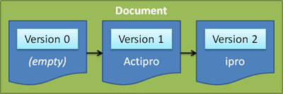

# Documents, Snapshots, and Versions

Documents, snapshots, and versions are used to store text data.  Documents allow for text updates, while a snapshot provides an immutable view of text within a document for a certain version that can be read.

## Looking at a Document's Current Text Data

The [ITextDocument](xref:ActiproSoftware.Text.ITextDocument) interface has a [CurrentSnapshot](xref:ActiproSoftware.Text.ITextDocument.CurrentSnapshot) property that returns the "current" [ITextSnapshot](xref:ActiproSoftware.Text.ITextSnapshot) for the document.

Think of [ITextSnapshot](xref:ActiproSoftware.Text.ITextSnapshot) objects like .NET strings.  They are immutable, meaning their contents cannot be changed, and they can be used across threads.  Therefore, you are able to examine and parse a snapshot without fear of its contents changing from some other operations in a separate thread.

There are multiple ways to examine text in a snapshot, some of the most common are described below.

## Object Relationships

[ITextDocument](xref:ActiproSoftware.Text.ITextDocument) objects only store a reference to the "current" [ITextSnapshot](xref:ActiproSoftware.Text.ITextSnapshot), meaning the snapshot the specifies the text contents of the document at this point in time.

Each snapshot is related to a single version.  Therefore, each [ITextSnapshot](xref:ActiproSoftware.Text.ITextSnapshot) has a [Version](xref:ActiproSoftware.Text.ITextSnapshot.Version) property that returns a reference to its [ITextVersion](xref:ActiproSoftware.Text.ITextVersion).  The [ITextVersion](xref:ActiproSoftware.Text.ITextVersion) has a version number.

*A sequence of text changes made, showing how new snapshots and versions are created*

As changes are made to a document, new snapshots and related versions are created.  For instance, a blank document would have a current snapshot with version `0`.  If the text `"Actipro"` was appended to the document, it would now have a current snapshot with version `1`.  If the first three characters were removed, the document would now have a current snapshot with version `2`.  And so on.

Essentially, the version increments with any change and provides the data needed for [snapshot translation](snapshot-translation.md).  Each snapshot references a single version, and the snapshot contains a complete immutable copy of the text that is related to the version.

## Memory Usage and Performance

After reading above that every change creates a completely new immutable copy of the document text in a snapshot, it would be conceivable to think that memory usage would be enormous and performance would suffer, especially for large documents.

Actually, this is not the case at all.  Snapshots are designed to share data as much as possible that is not different between consecutive snapshots.  Besides that, once a snapshot is no longer referenced by your code, it and its contents drop out of memory.  Therefore, there really isn't much of a memory impact by adding the great features provided by snapshots.

It's also important to mention that snapshots and their creation are designed to be very fast.  There is no performance decrease by using them.

## Reading Text, Use Snapshots

Whenever you need to read or examine the contents of a document, get the [ITextDocument](xref:ActiproSoftware.Text.ITextDocument).[CurrentSnapshot](xref:ActiproSoftware.Text.ITextDocument.CurrentSnapshot) and use the snapshot's various properties and methods.

These members on [ITextSnapshot](xref:ActiproSoftware.Text.ITextSnapshot) are related to reading text:

| Member | Description |
|-----|-----|
| [GetReader](xref:ActiproSoftware.Text.ITextSnapshot.GetReader*) Method | Returns an [ITextSnapshotReader](xref:ActiproSoftware.Text.ITextSnapshotReader) that can be used to navigate through the text and token contents of the snapshot. |
| [GetSubstring](xref:ActiproSoftware.Text.ITextSnapshot.GetSubstring*) Method | Returns a substring from the snapshot text using the specified [LineTerminator](xref:ActiproSoftware.Text.LineTerminator) for line ends. |
| [GetText](xref:ActiproSoftware.Text.ITextSnapshot.GetText*) Method | Returns the entire text of the snapshot using the specified [LineTerminator](xref:ActiproSoftware.Text.LineTerminator) for line ends. |
| [GetWordText](xref:ActiproSoftware.Text.ITextSnapshot.GetWordText*) Method | Gets the text of the word at the specified offset. |
| [Length](xref:ActiproSoftware.Text.ITextSnapshot.Length) Property | Gets the number of characters in the snapshot, excluding any carriage-returns but including newlines. |
| [Lines](xref:ActiproSoftware.Text.ITextSnapshot.Lines) Property | Gets the collection of [ITextSnapshotLine](xref:ActiproSoftware.Text.ITextSnapshotLine) objects, each of which represents a line in the snapshot. |
| [Text](xref:ActiproSoftware.Text.ITextSnapshot.Text) Property | Gets the entire text of the snapshot using `LineTerminator.CarriageReturnNewline` for line ends, which is not intended to be used for parsing for classification reasons. |

## Writing Text, Use Document

Whenever making text changes to a document, thereby creating a new snapshot, use methods on the [ITextDocument](xref:ActiproSoftware.Text.ITextDocument) interface.

The [Text Changes and Operations](text-changes.md) topic talks about making text changes in details.  See that topic for information on modifying a document.

## Multiple Snapshots and Snapshot Translation

As displayed by the diagram above, multiple snapshots can be active for a document at any given time.  Sometimes it's useful to store an offset range of text that was parsed from a particular snapshot and at some later arbitrary time, see where the same range is in the "current" snapshot for a document.

This can easily be done and is really a neat feature provided by the snapshot/version design.

See the [Snapshot Translation](snapshot-translation.md) topic for more information on doing this.
