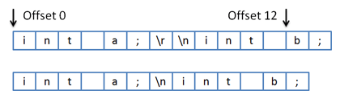

# Line Terminators

While the text framework can load text using any sort of standard line terminator character sequence, the framework internally tracks all line terminators as a single line feed character.  Text can easily be exported back out with any line terminator.

## Standard Line Terminators

The standard line terminators are:

- Carriage return followed immediately by a newline (CR/LF)
- Carriage return only (CR)
- Newline only (LF)

Standard line terminators can be specified by the [LineTerminator](xref:ActiproSoftware.Text.LineTerminator) enumeration.

## Why Does the Framework Only Track Line Feeds?

As mentioned above, it is important to know that when text added to an [ITextDocument](xref:ActiproSoftware.Text.ITextDocument), it is converted so that the internal buffer stores the text using a single line feed character for denoting line terminators, regardless of what sort of line terminator was originally used.

The main reason for doing this is for performance when parsing.  If we didn't store line terminators this way, any parsing code would require more complicated and time consuming procedures to be looking for carriage return characters, line feed characters, or potentially both at each line terminator.  Using a single LF character makes it easy for parsing to perform quickly and efficiently since we know which specific single character denotes the end of a line.

> [!NOTE]
> Since text is tracked internally using only line feeds, see the following sections for information on how to retrieve text back out of the text framework with specific line terminators.

## Impact on Offsets

An offset is the zero-based index of a character within text.  Sometimes you may have scanned some text that has CR/LF endings and saved a character range.  Then you passed the text into a document and tried to get the substring of the range.  What you'd find is that the returned text is not what you expected.

A simple diagram will illustrate why.  Say your text string was:

```
int a;
int b;
```

In a string with a CR/LF line terminator, the `b` character would be located at offset `12` like in the diagram below.



*The top character sequence showing original text, the bottom showing how it is stored in documents*

The bottom part of the diagram shows how an [ITextDocument](xref:ActiproSoftware.Text.ITextDocument) would convert the text to LF line terminators.  You can see how offset `12` now points to the semi-colon character instead.

To work around this issue, use the text framework to determine your offsets once it's in a document.

> [!NOTE]
> If you will be doing any external parsing, use the [GetText](xref:ActiproSoftware.Text.ITextSnapshot.GetText*) method (described below) to retrieve the text with LF-only format so the offsets remain in sync.

## The ITextSnapshot.Text and GetSubstring Members

The [ITextSnapshot](xref:ActiproSoftware.Text.ITextSnapshot).[Text](xref:ActiproSoftware.Text.ITextSnapshot.Text) property and [GetSubstring](xref:ActiproSoftware.Text.ITextSnapshot.GetSubstring*) method both return text back out with CR/LF format.

Since those properties are generally accessed when getting text and using it in other places within your application, they return the Windows default line terminator, which is CR/LF.

## Getting Text and Substrings with a Specific Line Terminator

Since the two members above return text using CR/LF, sometimes you need to get the text with LF-only or CR-only.  To do this, you can use the [GetText](xref:ActiproSoftware.Text.ITextSnapshot.GetText*) method and the [GetSubstring](xref:ActiproSoftware.Text.ITextSnapshot.GetSubstring*) method overload that accepts a [LineTerminator](xref:ActiproSoftware.Text.LineTerminator) parameter.

Both of those methods allow you to obtain the text with any line terminator that you specify.
