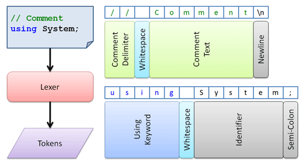

# Basic Concepts

There are various types of lexers and ways to go in terms of implementing them.  This topic walks through how a lexer works and the benefits/drawbacks of various implementations.

## What Does a Lexer Do?

A lexer scans text and tokenizes it, meaning that a series of [tokens](tokens.md) are assigned to text ranges that identifies in detail what the text represents.

The concept is best illustrated with a diagram:



In this diagram, we have two lines of C# code.  Each line is tokenized using a C# lexer.  Note how a token spans one to many characters.  For instance, the text `using` is contained by a single token that indicates it is a `using` keyword.

## Key Components of a Lexer

### Lexer

The root interface for a lexer in the parsing framework is [ILexer](xref:ActiproSoftware.Text.Lexing.ILexer).  This interface is very simple.  It has a `String`-based `Key` property that identifies the lexer, a [Parse](xref:ActiproSoftware.Text.Lexing.ILexer.Parse*) method that performs a parsing operation, and an optional [TokenIdProvider](xref:ActiproSoftware.Text.Lexing.ILexer.TokenIdProvider) property, which returns an [ITokenIdProvider](xref:ActiproSoftware.Text.Lexing.ITokenIdProvider) instance.

### Token ID Provider

An [ITokenIdProvider](xref:ActiproSoftware.Text.Lexing.ITokenIdProvider) is simply a utility class related to the lexer that has integer constants indicating the token ID values used by the lexer.  It has a [GetKey](xref:ActiproSoftware.Text.IIdProvider.GetKey*) method that returns the `String`-based `Key` for a particular ID and has properties that return the minimum and maximum ID values associated with the provider.

### Lexical States

A lexical state, represented by the [ILexicalState](xref:ActiproSoftware.Text.Lexing.ILexicalState) interface, is a context in which certain text can be parsed into a set of tokens.

For instance, all lexers must have a default lexical state, but then languages such as C# may have another lexical state for XML documentation comments.  As you know, XML documentation comment tags are not valid in normal code.  The code must have a `///` delimiter on a line (thereby entering the XML documentation comment lexical state) and then tags are valid.  While in this state, keywords such as `void` are not recognized and all text other than tags is treated as comment text.  The lexical state ends at the line terminator and flips back to its parent default lexical state where again, keywords like `void` are recognized.

### Lexical Scopes

A lexical scope, represented by the [ILexicalScope](xref:ActiproSoftware.Text.Lexing.ILexicalScope) interface, defines how a parent lexical state can transition to another child lexical state and back.

Again using the C# XML documentation comment example, the start scope for the XML documentation comment lexical state recognizes the text `///` as its start scope and when found, transitions to the lexical state.  Once in the lexical state, it looks for a line terminator, which is the end lexical scope for the lexical state.  When that is found, it exits the lexical state and pops back to the parent default state.

## Registering with a Syntax Language

An [ILexer](xref:ActiproSoftware.Text.Lexing.ILexer) can be associated with an [ISyntaxLanguage](xref:ActiproSoftware.Text.ISyntaxLanguage) by registering it with the language:

```csharp
language.RegisterService<ILexer>(myLexer);
```

Once the lexer is registered with a language, it can be used by other objects such as [token taggers](../tagging/taggers.md) or other higher-level syntax or semantic parsers.

## Mergable vs. Non-Mergable Lexers

Some languages can perform transitions to other languages, such as in the case of HTML where it can transition to CSS, Javascript, etc.  These transitions are made when one lexer determines it should transition to another language's lexer.  This feature is only supported by mergable lexers.  Although language transitions are a great feature, non-mergable lexers will offer slightly better performance.

### Making a Lexer Mergable

Any [ILexer](xref:ActiproSoftware.Text.Lexing.ILexer) that implements [IMergableLexer](xref:ActiproSoftware.Text.Lexing.IMergableLexer) is a mergable lexer and thus supports language transition features.

The [IMergableLexer](xref:ActiproSoftware.Text.Lexing.IMergableLexer) interface can be easily implemented by creating a lexer that inherits [MergableLexerBase](xref:ActiproSoftware.Text.Lexing.Implementation.MergableLexerBase).  With this abstract base class, the only member that is required to be implemented is [GetNextToken](xref:ActiproSoftware.Text.Lexing.Implementation.MergableLexerBase.GetNextToken*).  That method is passed an [ITextBufferReader](xref:ActiproSoftware.Text.ITextBufferReader) and the current [ILexicalState](xref:ActiproSoftware.Text.Lexing.ILexicalState), and returns a [MergableLexerResult](xref:ActiproSoftware.Text.Lexing.MergableLexerResult) object.

The [MergableLexerResult](xref:ActiproSoftware.Text.Lexing.MergableLexerResult) class has two properties.  The [MatchType](xref:ActiproSoftware.Text.Lexing.MergableLexerResult.MatchType) property is an enumeration indicating whether there was a match, and if so, if the match was exact or loose (such as a case insensitive match).  The [LexerData](xref:ActiproSoftware.Text.Lexing.MergableLexerResult.LexerData) property is an [IMergableTokenLexerData](xref:ActiproSoftware.Text.Lexing.IMergableTokenLexerData) instance.  It provides data about what was parsed.  Programmatic lexers can use the built-in [LexicalStateTokenData](xref:ActiproSoftware.Text.Lexing.Implementation.LexicalStateTokenData) and [LexicalScopeTokenData](xref:ActiproSoftware.Text.Lexing.Implementation.LexicalScopeTokenData) classes as property values.

If no match is made, return the static [MergableLexerResult](xref:ActiproSoftware.Text.Lexing.MergableLexerResult).[NoMatch](xref:ActiproSoftware.Text.Lexing.MergableLexerResult.NoMatch) property value.

### Tokens

Mergable lexers must generate tokens that implement [IMergableToken](xref:ActiproSoftware.Text.Lexing.IMergableToken).  Non-mergable lexers, on the other hand, may generate simpler tokens that only implement [IToken](xref:ActiproSoftware.Text.Lexing.IToken).

### Performance Considerations

A common question is, should I make my language's lexer mergable or not?  The two things to weigh are whether your language needs to support transitions to other languages, or would you like maximum parsing speed and minimal memory usage.

Mergable lexers require more overhead, both in the actual parsing operation and in how data ends up being tracked in tokens.  This translates into slightly slower overall lexing and some increased memory usage.

Non-mergable lexers, since they don't support language transitions, only need to process the information needed to support the core [IToken](xref:ActiproSoftware.Text.Lexing.IToken) interface.  Therefore they can run faster and use less overall memory.

## Changing Mergable Lexers

Mergable lexers sometimes cache data about themselves.  Therefore if they are ever to be altered after their initial creation, they need to be notified that something within them has changed.

As an example, this scenario can occur if you load two independent languages and then wish to merge them together, such as HTML with CSS.  In this scenario you'd load two [ISyntaxLanguage](xref:ActiproSoftware.Text.ISyntaxLanguage) instances, one for HTML and one for CSS.  Then you'd create a lexical state that contains a scope transition to CSS.  See the Language Transitions QuickStart for a related full sample.

Before you change the HTML language's lexer to add the transitioning state, you need to wrap the change with a `using` statement executed on the result of the [IMergableLexer](xref:ActiproSoftware.Text.Lexing.IMergableLexer).[CreateChangeBatch](xref:ActiproSoftware.Text.Lexing.IMergableLexer.CreateChangeBatch*) method.

This code shows how to wrap changes:

```csharp
using (IDisposable batch = parentLexer.CreateChangeBatch()) {
	// Update lexical states, patterns, etc. on parent lexer here
}
```

Another scenario you may need to do this in is if you are dynamically adding/removing lexical patterns to a lexical state after it has already been used.

## Dynamic, Programmatic, and Other Lexers

### High-Level Comparison

[Dynamic lexers](dynamic-lexers.md) use regular expression patterns to tokenize text.  The [DynamicLexer](xref:ActiproSoftware.Text.Lexing.Implementation.DynamicLexer) class inherits [MergableLexerBase](xref:ActiproSoftware.Text.Lexing.Implementation.MergableLexerBase), meaning that all dynamic lexers are mergable and capable of transitioning to other languages.  Dynamic lexers are generic and can support the parsing of nearly any language.

[Programmatic lexers](programmatic-lexers.md) are written by hand and optimized to parse a specific language's code.  This almost always results in faster parsing performance than dynamic lexers can achieve.  Programmatic lexers can optionally be made mergable by implementing [IMergableLexer](xref:ActiproSoftware.Text.Lexing.IMergableLexer) or inheriting [MergableLexerBase](xref:ActiproSoftware.Text.Lexing.Implementation.MergableLexerBase).

### Which to Choose?

When building a new syntax language and making a new lexer, you must choose whether to create a dynamic or programmatic lexer.

It's often best to start out making a dynamic lexer.  The reason is that these can be created extremely fast and will get you up and running quicker, especially when using the [Language Designer](../../language-designer-tool/index.md) to create your language and lexer.

If at a later time you decide to squeeze some more performance out of your lexer, then create a programmatic lexer instead.  Programmatic lexers take more time to write and are really for more advanced developers.

Since any class that implements [ILexer](xref:ActiproSoftware.Text.Lexing.ILexer) can be used by an [ISyntaxLanguage](xref:ActiproSoftware.Text.ISyntaxLanguage), it is important to note that even if you start initially with a dynamic lexer, you can easily swap in a programmatic lexer for your language at a later time.
