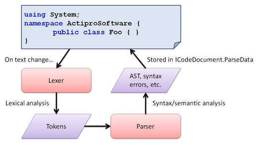

# Parsers

Parsers are objects that take in a parser request and output some sort of parse data.  They are generally called via worker threads to prevent the blocking of the main UI thread.

The parse data returned by a parser is a result of performing syntax and/or semantic analysis on some text indicated by a parse request.  Parsers can optionally be implemented to call into other parsing frameworks @if (wpf) {(Irony, ANTLR, etc.)} and return their results.

## What Does a Parser Do?

A parser is an object that can perform syntax and/or semantic analysis on text.

### Processing Diagram

The concept is best illustrated with the following diagram, which shows the sequence of events that occur when a text change occurs in a code document.  Near the end of the cycle, parsing kicks in and returns the parse data result back to the document.



Note that generally an [IParseRequestDispatcher](xref:ActiproSoftware.Text.Parsing.IParseRequestDispatcher) is used to queue [parse requests](parse-requests-and-dispatchers.md) and execute them on worker threads, meaning that parsing most often occurs asynchronously.

### Syntax and Semantic Analysis

Syntax analysis is the process of iterating the [tokens](../lexing/tokens.md) returned by a [lexer](../lexing/index.md), and converting that input into some structured representation.  Put quite simply, it is the process of determining the structure of the code.  The output from this sort of analysis is generally some sort of parse or syntax tree.

Semantic analysis is more concerned with examining the code to determine its meaning, rather than its syntax, although the output from syntax analysis is often used as input to the semantic analysis phase.  Semantic checks may include type-checking, scope rules, or any other requirements described by a language specification.

The output of most parsers is some sort of abstract syntax tree (AST) with the root node being called a compilation unit.  It may include symbol table data and/or a list of the syntax/semantic errors that were located during the parsing operation, if there were any.  Any data can be returned, as long as it implements the [IParseData](xref:ActiproSoftware.Text.Parsing.IParseData) interface.

Although the syntax and semantic analysis methodology described above is the formal definition of what generally takes place in parsing, parsing really can be any sort of processing that is performed as a result of text scanning.

## The IParser Interface

The [IParser](xref:ActiproSoftware.Text.Parsing.IParser) interface is very simple and only has a single [Parse](xref:ActiproSoftware.Text.Parsing.IParser.Parse*) method defined.  The [Parse](xref:ActiproSoftware.Text.Parsing.IParser.Parse*) method takes in an [IParseRequest](xref:ActiproSoftware.Text.Parsing.IParseRequest) and returns an [IParseData](xref:ActiproSoftware.Text.Parsing.IParseData) object.

> [!NOTE]
> See the [Parse Requests and Dispatchers](parse-requests-and-dispatchers.md) topic for more information on parse requests.

What does a parser actually do?  Well, it's entirely up to you.  Generally, it calls some sort of external parser @if (wpf) {such as Irony, ANTLR, etc.} to examine the text in the request and return some sort of result.

However, the parser could be implemented to simply execute your own custom code instead.  Maybe you don't need to run a complicated parser that builds an AST and you simply want to build a list of variables defined and where they are defined.  Anything is possible by scanning the text.

The only requirement for whatever the parser does is that it returns its results in the form of an [IParseData](xref:ActiproSoftware.Text.Parsing.IParseData) object.  This object then gets placed in the calling [ICodeDocument](xref:ActiproSoftware.Text.ICodeDocument)'s [ParseData](xref:ActiproSoftware.Text.ICodeDocument.ParseData) property.

## The Abstract ParserBase Class

An abstract base class called [ParserBase](xref:ActiproSoftware.Text.Parsing.Implementation.ParserBase) that implements [IParser](xref:ActiproSoftware.Text.Parsing.IParser) is included with the parsing framework.

A parser can be implemented like this:

```csharp
public class MyParser : ParserBase {

	public MyParser() : base("MyParser") {}

	public override IParseData Parse(IParseRequest request) {
		IParseData parseData = null;

		// Perform some sort of parsing here and place the result in parseData

		return parseData;
	}

}
```

Once you have a parser class defined, you should register it with your language.

## Registering with a Syntax Language

An [IParser](xref:ActiproSoftware.Text.Parsing.IParser) can be associated with an [ISyntaxLanguage](xref:ActiproSoftware.Text.ISyntaxLanguage) by registering it with the language:

```csharp
language.RegisterService<IParser>(new MyParser());
```

Once the parser is registered with a language, it will be called automatically if any code documents that use the language are modified.  See the [Parse Requests and Dispatchers](parse-requests-and-dispatchers.md) topic for more information.

When no [IParser](xref:ActiproSoftware.Text.Parsing.IParser) is registered with a language that is being used by a code document, then no parsing will occur when changes are made to that document.

## The IParseData Interface

The [IParseData](xref:ActiproSoftware.Text.Parsing.IParseData) interface defines the base requirements for an object that is returned as the result of a parsing operation.

There are not currently any default implementations of this interface so you must ensure that any object that is returned by an [IParser](xref:ActiproSoftware.Text.Parsing.IParser) implements the interface.

## Document Parse Data

The [ICodeDocument](xref:ActiproSoftware.Text.ICodeDocument).[ParseData](xref:ActiproSoftware.Text.ICodeDocument.ParseData) property is used to store the last parse result received for the document by an [IParser](xref:ActiproSoftware.Text.Parsing.IParser).

When an [IParser](xref:ActiproSoftware.Text.Parsing.IParser) completes a parse operation, the [IParseData](xref:ActiproSoftware.Text.Parsing.IParseData) that is returned is placed in the calling [ICodeDocument](xref:ActiproSoftware.Text.ICodeDocument)'s [ParseData](xref:ActiproSoftware.Text.ICodeDocument.ParseData) property.  This generally happens asynchronously if a [Parse Request Dispatcher](parse-requests-and-dispatchers.md) is used.

At that time, the [ICodeDocument](xref:ActiproSoftware.Text.ICodeDocument).[ParseDataChanged](xref:ActiproSoftware.Text.ICodeDocument.ParseDataChanged) event is raised, allowing you to update the user interface or take other action as appropriate.

## Quickly Parsing a Text String

In some cases, it is desirable to load an [ISyntaxLanguage](xref:ActiproSoftware.Text.ISyntaxLanguage) and use its parser to parse a text string.  There is an extension method called [SyntaxLanguageParsingExtensions](xref:ActiproSoftware.Text.Parsing.SyntaxLanguageParsingExtensions).[Parse](xref:ActiproSoftware.Text.Parsing.SyntaxLanguageParsingExtensions.Parse*) that is available when the [ActiproSoftware.Text.Parsing](xref:ActiproSoftware.Text.Parsing) namespace is referenced.  This makes it simple to obtain the [IParseData](xref:ActiproSoftware.Text.Parsing.IParseData) result of a parsing operation executed on the specified text.

The parsing operation executes within the calling thread, meaning the thread will block until the resulting parse data is obtained.

This sample code shows how to parse a string containing a C# code snippet, by using the [CSharpSyntaxLanguage](xref:ActiproSoftware.Text.Languages.CSharp.Implementation.CSharpSyntaxLanguage) found in the [.NET Languages Add-on](../../dotnet-languages-addon/index.md):

```csharp
ISyntaxLanguage language = new CSharpSyntaxLanguage();
IParseData parseData = language.Parse("class Foo {}");
```

The resulting [IParseData](xref:ActiproSoftware.Text.Parsing.IParseData) object can be cast to the appropriate type that can provide AST and parse error results.
