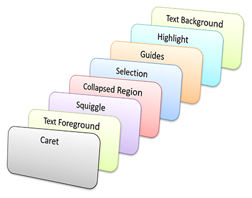

# Adornment Layers

Adornment layers are panels that are stacked within a view's text area.  Each layer can be ordered to appear before or after other specified layers.  Layers can contain any sort of adornment element.

## Adornment Layers and Definitions

Adornment layers, represented by the [IAdornmentLayer](xref:@ActiproUIRoot.Controls.SyntaxEditor.Adornments.IAdornmentLayer) interface, are panels that can contain adornment elements.  Typically, related adornment elements are grouped into a single adornment layer.  For instance, squiggle lines are in one adornment layer, however selection is rendered in a separate layer.

### Adornment Layer Definitions

An adornment layer is retrieved by using an adornment layer definition.  This definition, represented by the [AdornmentLayerDefinition](xref:@ActiproUIRoot.Controls.SyntaxEditor.Adornments.AdornmentLayerDefinition) class, holds the string-based key used to identify the layer, along with information about how the layer should be ordered relative to other layers.

### Ordering

Each [AdornmentLayerDefinition](xref:@ActiproUIRoot.Controls.SyntaxEditor.Adornments.AdornmentLayerDefinition) can be passed an optional set of [Ordering](xref:ActiproSoftware.Text.Utility.Ordering) objects.  Each [Ordering](xref:ActiproSoftware.Text.Utility.Ordering) object allows you to indicate a string-based target layer key along with whether this layer should appear before or after the target layer.

Therefore, you could easily indicate that a custom layer should appear before the text foreground layer, etc.

> [!IMPORTANT]
> Always be sure to use unique keys for each of your adornment layers, unique even from the built-in adornment layer names.  If layers don't have unique keys, the item with a duplicate key may not sort correctly.

This code shows how to create an adornment layer definition that renders adornments in front of the text foreground layer:

```csharp
AdornmentLayerDefinition def = new AdornmentLayerDefinition("CustomLayer",
	new Ordering(AdornmentLayerDefinitions.TextForeground, OrderPlacement.Before));
```

@if (winrt wpf) {

### Element-Based and Draw-Based Adornments

Adornments can be rendered via UI elements or by drawing themselves.  Most of our pre-defined adornments use the draw-based mechanism where they render themselves in the rendering pipeline instead of using UI elements to render themselves.  It's important to note that element-based adornments will always render "on top" of draw-based adornments since the elements are stacked on top of the drawing canvas element.  Adornments like alternating row highlights should be draw-based so that they stack appropriately with other pre-defined adornment layers.  Adornments like intra-line controls can be element-based since they generally appear on top of other view content anyhow.

}

### Using a Definition to Retrieve a Layer

The [ITextView](xref:@ActiproUIRoot.Controls.SyntaxEditor.ITextView) implementations manage the available adornment layers.  This means that you can have custom adornment layers in both editor views and printer views, or even just one of those types.

The [ITextView](xref:@ActiproUIRoot.Controls.SyntaxEditor.ITextView).[GetAdornmentLayer](xref:@ActiproUIRoot.Controls.SyntaxEditor.ITextView.GetAdornmentLayer*) method can be called to return an adornment layer.  It is passed an [AdornmentLayerDefinition](xref:@ActiproUIRoot.Controls.SyntaxEditor.Adornments.AdornmentLayerDefinition) instance (see previous sub-section) and uses that to see if an adornment layer with the specified key has already been created.  If not, it creates a layer with the key and uses the ordering information to reorder the layers.

This code gets an adornment layer using the definition created above:

```csharp
IAdornmentLayer layer = view.GetAdornmentLayer(def);
```

@if (winrt wpf) {

### Adornment Layer Opacity

The [IAdornmentLayer](xref:@ActiproUIRoot.Controls.SyntaxEditor.Adornments.IAdornmentLayer).[Opacity](xref:@ActiproUIRoot.Controls.SyntaxEditor.Adornments.IAdornmentLayer.Opacity) property allows you to alter the opacity for adornments displayed within a certain layer.

}

## Built-In Adornment Layers

SyntaxEditor includes a number of built-in adornment layers.  Each of these built-in adornment layers has their definitions available via static properties on the [AdornmentLayerDefinitions](xref:@ActiproUIRoot.Controls.SyntaxEditor.Adornments.AdornmentLayerDefinitions) class.

Custom adornments should not be added to the built-in adornment layers.  Instead, add your own adornment layer and put custom adornments in there.  You can use the [AdornmentLayerDefinitions](xref:@ActiproUIRoot.Controls.SyntaxEditor.Adornments.AdornmentLayerDefinitions) class to help with the keys used when ordering your adornment layer.



*The stack of built-in adornments layers*

This table shows the built-in adornment layers, listed in order by which the layers are stacked (top to bottom):

| Adornment Layer | Description |
|-----|-----|
| Caret | Renders the blinking caret. |
| Text Foreground | Renders the [syntax-highlighted document text](syntax-highlighting.md) and built-in decorations such as underlines. |
| Squiggle | Renders any [squiggle lines](squiggle-lines.md). |
| Collapsed Region | Renders any collapsed region indicators. |
| Selection | Renders the selection. |
| Guides | Renders any background guide lines, such as [indentation guides](../editor-view/indentation-guides.md). |
| Highlight | Renders any background highlights, such as current line highlights or when mouse hovering over expanded outlining nodes in the outlining margin. |
| Text Background | Renders the [syntax highlighting background](syntax-highlighting.md) for any text highlighting styles that have a background set. |

@if (winrt wpf) {

> [!IMPORTANT]
> Element-based adornments will always render "on top" of draw-based adornments since the drawing canvas is an element itself.  Most of the pre-defined adornments are draw-based, so use draw-based adornments if you wish to inject adornments within those layers.

}

## Working With the Adornments on a Layer

### Adding Adornments

Adornments, represented by the [IAdornment](xref:@ActiproUIRoot.Controls.SyntaxEditor.Adornments.IAdornment) interface, are created by calling the [IAdornmentLayer](xref:@ActiproUIRoot.Controls.SyntaxEditor.Adornments.IAdornmentLayer).[AddAdornment](xref:@ActiproUIRoot.Controls.SyntaxEditor.Adornments.IAdornmentLayer.AddAdornment*) method.  There are two sets of overloads for this method where each set has an element-based variation and a draw-based variation.  One set takes information for more general adornments and the other has a couple extra parameters that allow the adornment to be tied with a [TextSnapshotRange](xref:ActiproSoftware.Text.TextSnapshotRange), which is useful for adornments like text decorations.

Both methods have the following common parameters:

- `reason` - An [AdornmentChangeReason](xref:@ActiproUIRoot.Controls.SyntaxEditor.Adornments.AdornmentChangeReason) indicating the add reason.
- `visualElement` - For element-based adornments, the actual `UIElement` used to visually render the adornment.  It is commonly a shape but could be any element type.
- `drawCallback` - For draw-based adornments, a [DrawAdornmentCallback](xref:@ActiproUIRoot.Controls.SyntaxEditor.Adornments.DrawAdornmentCallback) method that is invoked to draw the adornment.
- `location` - The initial location of the adornment, in text area-relative coordinates.  Methods like [ITextView](xref:@ActiproUIRoot.Controls.SyntaxEditor.ITextView).[TransformToTextArea](xref:@ActiproUIRoot.Controls.SyntaxEditor.ITextView.TransformToTextArea*) can be used to transform coordinates from view-relative to text area-relative.
- `tag` - An object that contains user-defined data about the adornment.  The tag can optionally later be used to find specific adornments that have been created.
- `removedCallback` - The callback method that is invoked when the adornment is removed from its parent [IAdornmentLayer](xref:@ActiproUIRoot.Controls.SyntaxEditor.Adornments.IAdornmentLayer).

If the adornment should be tracked with text, it will automatically be removed when the related text range is scrolled out of the view.  These parameters apply to this [AddAdornment](xref:@ActiproUIRoot.Controls.SyntaxEditor.Adornments.IAdornmentLayer.AddAdornment*) overload:

- `viewLine` - The [ITextViewLine](xref:@ActiproUIRoot.Controls.SyntaxEditor.ITextViewLine) with which the adornment is associated, if any.
- `snapshotRange` - The [TextSnapshotRange](xref:ActiproSoftware.Text.TextSnapshotRange) that indicates the range of the adornment.
- `trackingModes` - A [TextRangeTrackingModes](xref:ActiproSoftware.Text.TextRangeTrackingModes) indicating the tracking modes to use.

### Finding Existing Adornments

The [IAdornmentLayer](xref:@ActiproUIRoot.Controls.SyntaxEditor.Adornments.IAdornmentLayer).[Adornments](xref:@ActiproUIRoot.Controls.SyntaxEditor.Adornments.IAdornmentLayer.Adornments) property is a read-only collection of all the adornments in the layer.

A number of methods are also available that make it easy to find certain adornments.  The [FindAdornment](xref:@ActiproUIRoot.Controls.SyntaxEditor.Adornments.IAdornmentLayer.FindAdornment*) method returns the adornment with the specified visual element.  The overloaded [FindAdornments](xref:@ActiproUIRoot.Controls.SyntaxEditor.Adornments.IAdornmentLayer.FindAdornments*) methods return the adornments that match criteria, including:

- Intersection with a certain snapshot range
- An object that is stored in the adornment's [Tag](xref:@ActiproUIRoot.Controls.SyntaxEditor.Adornments.IAdornment.Tag) property
- A predicate that allows for custom matching

### Removing Adornments

The [IAdornmentLayer](xref:@ActiproUIRoot.Controls.SyntaxEditor.Adornments.IAdornmentLayer).[RemoveAdornment](xref:@ActiproUIRoot.Controls.SyntaxEditor.Adornments.IAdornmentLayer.RemoveAdornment*) method removes a specific [IAdornment](xref:@ActiproUIRoot.Controls.SyntaxEditor.Adornments.IAdornment) instance from the layer.

The [RemoveAdornments](xref:@ActiproUIRoot.Controls.SyntaxEditor.Adornments.IAdornmentLayer.RemoveAdornments*) method removes an enumerable list of [IAdornment](xref:@ActiproUIRoot.Controls.SyntaxEditor.Adornments.IAdornment) instances from the layer.  The enumerable is generally constructed using the results of the various "find" methods described above.

All adornments in a layer can be removed by a call to the [RemoveAllAdornments](xref:@ActiproUIRoot.Controls.SyntaxEditor.Adornments.IAdornmentLayer.RemoveAllAdornments*) method.

## Tagging Interaction

The text/parsing framework's [tagging](../../text-parsing/tagging/index.md) mechanism is usually integrated with adornments, especially in scenarios where the adornments are based on document text.  In these scenarios, taggers are responsible for logically marking the ranges of text that require adornments, most often with some sort of custom [ITag](xref:ActiproSoftware.Text.Tagging.ITag) class.  Then an adornment manager (see below) monitors tags of that type and adds/removes adornments as appropriate.

Tagging can also be used to drive some of the built in adornment layers such as [customized syntax highlighting](syntax-highlighting.md) and [squiggle lines](squiggle-lines.md).

## Adornment Managers

Adornment managers are objects that manage the adornments placed on a certain adornment layer.  When the adornments are based on document text, the [tagging](../../text-parsing/tagging/index.md) mechanism is leveraged.

There are two base classes that can be used for adornment managers: [AdornmentManagerBase<T>](xref:@ActiproUIRoot.Controls.SyntaxEditor.Adornments.Implementation.AdornmentManagerBase`1) and [DecorationAdornmentManagerBase<T, U>](xref:@ActiproUIRoot.Controls.SyntaxEditor.Adornments.Implementation.DecorationAdornmentManagerBase`2).

### The AdornmentManagerBase<T> Class

The [AdornmentManagerBase<T>](xref:@ActiproUIRoot.Controls.SyntaxEditor.Adornments.Implementation.AdornmentManagerBase`1) class is the lowest-level class that should be used for adornment managers.  It automatically retrieves an appropriate adornment layer, auto-closes when the attached view is closed, and supports an "active" state concept.

The type parameter for the class indicates the type of view to support.  To support editor views only, use [IEditorView](xref:@ActiproUIRoot.Controls.SyntaxEditor.IEditorView).  To support printer views only, use [IPrinterView](xref:@ActiproUIRoot.Controls.SyntaxEditor.IPrinterView).  To support both types of views, use [ITextView](xref:@ActiproUIRoot.Controls.SyntaxEditor.ITextView).

The constructor accepts up to three parameters:

- `view` - The view to which the manager will be attached.
- `layerDefinition` - The [AdornmentLayerDefinition](xref:@ActiproUIRoot.Controls.SyntaxEditor.Adornments.AdornmentLayerDefinition) that indicates the definition for the adornment layer to use.  The layer is available via the [AdornmentLayer](xref:@ActiproUIRoot.Controls.SyntaxEditor.Adornments.Implementation.AdornmentManagerBase`1.AdornmentLayer) property.
- `isForLanguage` - (Optional) When `true`, indicates that the manager is something installed by a syntax language and that if the view's document or its language are changed, the managers should auto-close themselves.  Otherwise the manager will not close unless the view is closed or it is closed explicitly via the [Close](xref:@ActiproUIRoot.Controls.SyntaxEditor.Adornments.Implementation.AdornmentManagerBase`1.Close*) method.

The [View](xref:@ActiproUIRoot.Controls.SyntaxEditor.Adornments.Implementation.AdornmentManagerBase`1.View) property provides access to the view that contains the adornment layer.  The [AdornmentLayer](xref:@ActiproUIRoot.Controls.SyntaxEditor.Adornments.Implementation.AdornmentManagerBase`1.AdornmentLayer) property specifies the [IAdornmentLayer](xref:@ActiproUIRoot.Controls.SyntaxEditor.Adornments.IAdornmentLayer) that is used by this manager.

The [Close](xref:@ActiproUIRoot.Controls.SyntaxEditor.Adornments.Implementation.AdornmentManagerBase`1.Close*) method can be called to detach the manager from the view.  Whenever the manager is closed, the [OnClosed](xref:@ActiproUIRoot.Controls.SyntaxEditor.Adornments.Implementation.AdornmentManagerBase`1.OnClosed*) method is called.  Inherited classes can override this method to clean up any event handlers created in the constructor.

The [IsActive](xref:@ActiproUIRoot.Controls.SyntaxEditor.Adornments.Implementation.AdornmentManagerBase`1.IsActive) property is optionally used but provides a handy way to indicate whether the manager's adornments should be displayed or not.  When its value changes, the [OnIsActiveChanged](xref:@ActiproUIRoot.Controls.SyntaxEditor.Adornments.Implementation.AdornmentManagerBase`1.OnIsActiveChanged*) method is called.  Inherited classes can override this method to add/update/remove adornments as appropriate.

Adornment managers typically link up to various document and view events in their constructor and detach from the events when the manager is closed.  While open, when the events occur, adornments are added to and removed from the managed adornment layer.  A common event that is attached to is the [ITextView](xref:@ActiproUIRoot.Controls.SyntaxEditor.ITextView).[TextAreaLayout](xref:@ActiproUIRoot.Controls.SyntaxEditor.ITextView.TextAreaLayout) event.  This event's arguments pass the list of view lines that are added/updated/removed/translated in the layout, if any.  Thus, you can adjust your adornments appropriately using the add/remove methods of the [IAdornmentLayer](xref:@ActiproUIRoot.Controls.SyntaxEditor.Adornments.IAdornmentLayer). [IAdornment](xref:@ActiproUIRoot.Controls.SyntaxEditor.Adornments.IAdornment) instances also have [Location](xref:@ActiproUIRoot.Controls.SyntaxEditor.Adornments.IAdornment.Location) properties that can be set to move them.  If you wish to move an adornment by a certain delta amount, it can use the [Translate](xref:@ActiproUIRoot.Controls.SyntaxEditor.Adornments.IAdornment.Translate*) event instead.

### The DecorationAdornmentManagerBase<T,U> Class

The [DecorationAdornmentManagerBase<T, U>](xref:@ActiproUIRoot.Controls.SyntaxEditor.Adornments.Implementation.DecorationAdornmentManagerBase`2) class inherits [AdornmentManagerBase<T>](xref:@ActiproUIRoot.Controls.SyntaxEditor.Adornments.Implementation.AdornmentManagerBase`1) and provides extensive additional functionality for managing adornments that are related to [tagged text ranges](../../text-parsing/tagging/index.md).  Specifically, this base class creates a [tag aggregator](../../text-parsing/tagging/tag-aggregators.md) for the tag type indicated as the second type parameter to the class.

The base class is notified whenever tags are changed or when the text area layout occurs.  It automatically determines when to add and remove tags based on what is currently visible in the editor.

Whenever a new adornment needs to be created for a tagged range, the abstract [AddAdornment](xref:@ActiproUIRoot.Controls.SyntaxEditor.Adornments.Implementation.DecorationAdornmentManagerBase`2.AddAdornment*) method is called.  This method has these parameters:

- `reason` - An [AdornmentChangeReason](xref:@ActiproUIRoot.Controls.SyntaxEditor.Adornments.AdornmentChangeReason) indicating the add reason.
- `viewLine` - The [ITextViewLine](xref:@ActiproUIRoot.Controls.SyntaxEditor.ITextViewLine) upon which the adornment will be placed.
- `tagRange` - A [TagSnapshotRange<T>](xref:ActiproSoftware.Text.Tagging.TagSnapshotRange`1) indicating the tag and snapshot range for which an adornment is needed on this line.  Note that the tag range could extend outside of the view line's range if the tag covers more than one view line.
- `bounds` - The text bounds in which to render the adornment.

Inheritors of this class should override the [AddAdornment](xref:@ActiproUIRoot.Controls.SyntaxEditor.Adornments.Implementation.DecorationAdornmentManagerBase`2.AddAdornment*) method and in there, have it create a visual element (such as a shape) that will be rendered, then call the [IAdornmentLayer](xref:@ActiproUIRoot.Controls.SyntaxEditor.Adornments.IAdornmentLayer).[AddAdornment](xref:@ActiproUIRoot.Controls.SyntaxEditor.Adornments.IAdornmentLayer.AddAdornment*) method to add the element into the adornment layer and create an [IAdornment](xref:@ActiproUIRoot.Controls.SyntaxEditor.Adornments.IAdornment).

This base class makes it very easy to add adornments to text ranges via the use of a tagger.

## Adornment Manager Providers

Adornment manager providers, represented by the [IAdornmentManagerProvider](xref:@ActiproUIRoot.Controls.SyntaxEditor.Adornments.IAdornmentManagerProvider) interface, are objects that can create/retrieve adornment managers for a particular view.  Adornment manager providers are called on-demand when a view is created, or the view's document/language are changed.

The [IAdornmentManagerProvider](xref:@ActiproUIRoot.Controls.SyntaxEditor.Adornments.IAdornmentManagerProvider) interface has a [GetAdornmentManager](xref:@ActiproUIRoot.Controls.SyntaxEditor.Adornments.IAdornmentManagerProvider.GetAdornmentManager*) method that returns an adornment manager instance to use for the specified view.

The [AdornmentManagerProvider<T>](xref:@ActiproUIRoot.Controls.SyntaxEditor.Adornments.Implementation.AdornmentManagerProvider`1) class is an implementation of the [IAdornmentManagerProvider](xref:@ActiproUIRoot.Controls.SyntaxEditor.Adornments.IAdornmentManagerProvider) interface that makes it easy to return instances of the adornment manager type indicated as a type parameter.

A constructor overload accepts a "singleton" object key that can be used to persist any created adornment manager into the [ITextView](xref:@ActiproUIRoot.Controls.SyntaxEditor.ITextView).[Properties](xref:@ActiproUIRoot.Controls.SyntaxEditor.ITextView.Properties) dictionary using the key.  In this case, if the view's document or the document's language changes, the adornment manager is automatically closed and removed from the properties dictionary.  The adornment manager associated with the view can be retrieved via the properties dictionary while it is open.

If no "singleton" object is passed to the adornment manager provider, a new adornment manager class instance will be created each time the provider used.

## Registering with a Syntax Language

As described above, [AdornmentManagerProvider<T>](xref:@ActiproUIRoot.Controls.SyntaxEditor.Adornments.Implementation.AdornmentManagerProvider`1) objects can be used as language services to provide adornment managers to any text views that request them.

This code shows how to register an adornment manager provider language service that returns `AlternatingRowsAdornmentManager` objects (defined in a QuickStart to provide alternating row highlights).  for views that use the language.  Note that we are also passing a "singleton" key so that the adornment manager that is created for any view using the language is persisted in the views's [Properties](xref:@ActiproUIRoot.Controls.SyntaxEditor.ITextView.Properties) dictionary while it is active.

```csharp
language.RegisterService(new AdornmentManagerProvider<AlternatingRowsAdornmentManager>(typeof(AlternatingRowsAdornmentManager)));
```
