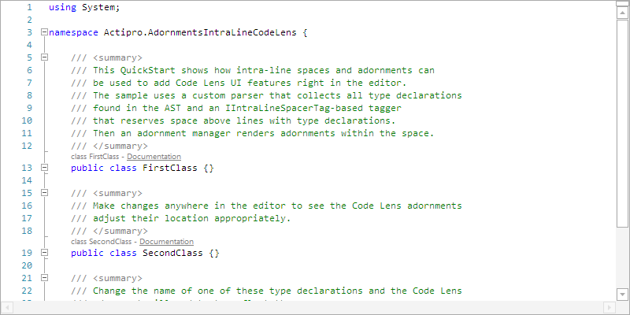
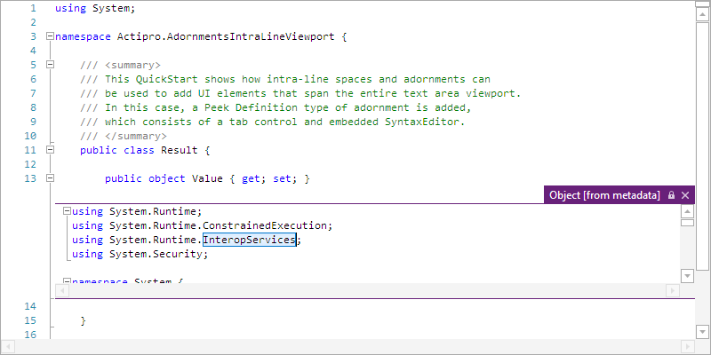

# Intra-Line Adornments

SyntaxEditor supports the ability to insert intra-line spacers, or margin space around view lines, and have adornments render within the space that was created.

This feature can be used to insert any sort of UI element in-line with a view line, and is different than normal adornments in that normal adornments don't alter text positioning.  This feature allows for functionality similar to Code Lens and Peek Definition within the Visual Studio code editor.

*Code lens adornments with hyperlinks added above view lines*

There are two things that must be done to create intra-line adornments.

- First, an intra-line spacer must be created, which tells the text formatting engine to reserve extra space between two view lines.
- Second, adornments must be added within the space that was created so that they are visible to the end user.

## Tagging Intra-Line Spacers

Intra-line spacers can be created via the [tagging mechanism](../../text-parsing/tagging/index.md) that is used throughout the product.  The [IIntraLineSpacerTag](xref:ActiproSoftware.Text.Tagging.IIntraLineSpacerTag) is a dedicated tag type that the SyntaxEditor text formatting engine aggregates.  As it formats lines, it watches for tags of this type that intersect the line's offset range, and when found knows to insert an appropriate amount of top and/or bottom margin space around the view line.

The [IIntraLineSpacerTag](xref:ActiproSoftware.Text.Tagging.IIntraLineSpacerTag) has these members:

| Member | Description |
|-----|-----|
| [BottomMargin](xref:ActiproSoftware.Text.Tagging.IIntraLineSpacerTag.BottomMargin) | Gets the baseline of the spacer, which the amount of additional vertical space needed below the view line. |
| [Key](xref:ActiproSoftware.Text.Tagging.IIntraLineSpacerTag.Key) | Gets an object that can be used to uniquely identify the spacer, so that an adornment can be rendered within its bounds. |
| [TopMargin](xref:ActiproSoftware.Text.Tagging.IIntraLineSpacerTag.TopMargin) | Gets the top margin of the spacer, which the amount of additional vertical space needed above the view line. |

Therefore to reserve space around view lines, all you need to do is create a [tagger](../../text-parsing/tagging/taggers.md) for the [IIntraLineSpacerTag](xref:ActiproSoftware.Text.Tagging.IIntraLineSpacerTag) type and return appropriate tag ranges when requested.  You can create a custom class that implements [IIntraLineSpacerTag](xref:ActiproSoftware.Text.Tagging.IIntraLineSpacerTag) and use that in your tagger results.  The tagger can in installed by your language via a [tagger provider](../../text-parsing/tagging/taggers.md) service.

At this point if your tagger is in use by your language, you should see extra whitespace around view lines with any tagged offsets, with the top and/or bottom margin designated by your tag.

## Getting Data About Intra-Line Spacers

There is a member that can be useful for working with intra-line spacers, although it is generally only used internally:

| Member | Description |
|-----|-----|
| [GetIntraLineSpacerTags](xref:@ActiproUIRoot.Controls.SyntaxEditor.ITextViewLine.GetIntraLineSpacerTags*) | Returns a collection of intra-line spacer tag ranges on the line that are of the specified type. |

## Creating an Intra-Line Adornment Manager

Now that intra-line spacers have been created, it's time to fill their space with adornments.  SyntaxEditor includes a handy base class called [IntraLineAdornmentManagerBase<T, U>](xref:@ActiproUIRoot.Controls.SyntaxEditor.Adornments.Implementation.IntraLineAdornmentManagerBase`2) that makes it very easy to fill your pre-defined intra-line spacers with adornments.

> [!NOTE]
> It is important to understand the core concepts for adornments and adornment layers described in the [Adornment Layers](adornment-layers.md) topic, since many of them apply here.

To make an intra-line adornment manager, create a new class that inherits [IntraLineAdornmentManagerBase<T, U>](xref:@ActiproUIRoot.Controls.SyntaxEditor.Adornments.Implementation.IntraLineAdornmentManagerBase`2).  The first type parameter you pass the base class is the type of view to support, such as [IEditorView](xref:@ActiproUIRoot.Controls.SyntaxEditor.IEditorView).  The second type parameter you pass the base class is the type of tag to aggregate.  For instance if your intra-line spacer tagger returns a `CodeLensTag`, which for this discussion we will assume that `CodeLensTag` implements [IIntraLineSpacerTag](xref:ActiproSoftware.Text.Tagging.IIntraLineSpacerTag), you would pass the `CodeLensTag` type to the base class.

Next, have the intra-line adornment manager class constructor pass the target view instance and [AdornmentLayerDefinition](xref:@ActiproUIRoot.Controls.SyntaxEditor.Adornments.AdornmentLayerDefinition) to use to the base class constructor.

Then override the base class' [AddAdornment](xref:@ActiproUIRoot.Controls.SyntaxEditor.Adornments.Implementation.IntraLineAdornmentManagerBase`2.AddAdornment*) method.  That method passes the view line being examined, and the tag and its range for which to create an adornment.  Your implementation of the method should create the appropriate adornment, whether it be a hyperlink or other shape/control.  Then add it to the adornment layer via the layer's [AddAdornment](xref:@ActiproUIRoot.Controls.SyntaxEditor.Adornments.IAdornmentLayer.AddAdornment*) method, being sure to pass the [IIntraLineSpacerTag](xref:ActiproSoftware.Text.Tagging.IIntraLineSpacerTag).[Key](xref:ActiproSoftware.Text.Tagging.IIntraLineSpacerTag.Key) value in the "tag" argument to that method.  The adornment layer can be retrieved using the [AdornmentLayer](xref:@ActiproUIRoot.Controls.SyntaxEditor.Adornments.Implementation.AdornmentManagerBase`1.AdornmentLayer) property on the base class.

Finally register an adornment manager provider (described in the [Adornment Layers](adornment-layers.md) topic) as a language service.  Your views should now be rendering adornments in your intra-line spacers.

## Usage Tips

Due to the nature of how editor views' scrollbars work (where each scroll notch is a line), it is generally recommended to try and keep the height of intra-line adornments as short as possible to ensure the smoothest scrolling experience.

*A viewport adornment containing another SyntaxEditor instance, added below a line*

In some cases, such as in the screenshot above where another SyntaxEditor instance is embedded as an adornment within the view, instead of using a fixed height editor, it is recommended to scale the editor instance no larger than roughly 1/3 the height of the text area in which it is contained, with a minimum height also applied.  The viewport adornment sample demonstrates how view size change events can be monitored to dynamically adjust the height of the tag's margin, and thus the adornment.

Since intra-line adornments tend to have interactive elements (especially in the viewport sample where a full embedded editor control is added), it is sometimes ideal to cache the UI element added in the adornment when the adornment gets removed from the view.  If the adornment is removed from the view due to scrolling, then this allows the same UI element and its full state to be reused later on as the view line is scrolled back into view.  If the adornment is removed due to its tag being removed, then it no longer needs to be cached.  The viewport adornment sample demonstrates one way of performing UI element caching.
