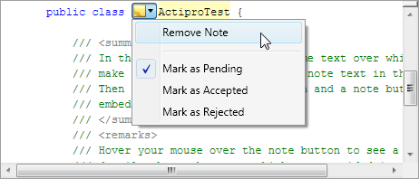

# Intra-Text Adornments

SyntaxEditor supports the ability to insert intra-text spacers, or space between text characters, and have adornments render within the space that was created.

This feature can be used to insert any sort of UI element in-line with the text of a view, and is different than normal adornments in that normal adornments don't alter text positioning.  This feature allows for inserting in-line images, in-line buttons that can be used to take action on nearby document text, etc.

*A popup button adornment added into an intra-text spacer*

There are two things that must be done to create intra-text adornments.

- First, an intra-text spacer must be created, which tells the text formatting engine to reserve extra space between two characters.
- Second, adornments must be added within the space that was created so that they are visible to the end user.

## Tagging Intra-Text Spacers

Intra-text spacers can be created via the [tagging mechanism](../../text-parsing/tagging/index.md) that is used throughout the product.  The [IIntraTextSpacerTag](xref:ActiproSoftware.Text.Tagging.IIntraTextSpacerTag) is a dedicated tag type that the SyntaxEditor text formatting engine aggregates.  As it formats lines, it watches for tags of this type that intersect the line's offset range, and when found knows to insert an appropriate amount of space at the tag's start offset location.

The [IIntraTextSpacerTag](xref:ActiproSoftware.Text.Tagging.IIntraTextSpacerTag) has these members:

| Member | Description |
|-----|-----|
| [Baseline](xref:ActiproSoftware.Text.Tagging.IIntraTextSpacerTag.Baseline) | Gets the baseline of the spacer, which is the distance from the top of the spacer to the text baseline.  This property can return the height of the spacer to sit the spacer on top of the text baseline. |
| [Key](xref:ActiproSoftware.Text.Tagging.IIntraTextSpacerTag.Key) | Gets an object that can be used to uniquely identify the spacer, so that an adornment can be rendered within its bounds. |
| [Size](xref:ActiproSoftware.Text.Tagging.IIntraTextSpacerTag.Size) | Gets the size of the spacer.  This must be a fixed size. |

Therefore to reserve space within text characters, all you need to do is create a [tagger](../../text-parsing/tagging/taggers.md) for the [IIntraTextSpacerTag](xref:ActiproSoftware.Text.Tagging.IIntraTextSpacerTag) type and return appropriate tag ranges when requested.  You can create a custom class that implements [IIntraTextSpacerTag](xref:ActiproSoftware.Text.Tagging.IIntraTextSpacerTag) and use that in your tagger results.  The tagger can in installed by your language via a [tagger provider](../../text-parsing/tagging/taggers.md) service.

At this point if your tagger is in use by your language, you should see extra whitespace at any tagged offsets, with the width and height designated by your tag.

## Getting Data About Intra-Text Spacers

There are several members that can be useful for working with intra-text spacers, although they are generally only used internally:

<table>
<thead>

<tr>
<th>Member</th>
<th>Description</th>
</tr>

</thead>
<tbody>

<tr>
<td>

[GetIntraTextSpacerBounds](xref:@ActiproUIRoot.Controls.SyntaxEditor.ITextViewLine.GetIntraTextSpacerBounds*)

</td>
<td>

Returns a [TextBounds](xref:@ActiproUIRoot.Controls.SyntaxEditor.TextBounds) representing the bounds of the specified intra-text spacer.

The object passed as an argument is the value of the desired tag's [Key](xref:ActiproSoftware.Text.Tagging.IIntraTextSpacerTag.Key) property.

</td>
</tr>

<tr>
<td>

[GetIntraTextSpacerTag](xref:@ActiproUIRoot.Controls.SyntaxEditor.ITextViewLine.GetIntraTextSpacerTag*)

</td>
<td>

Returns the intra-text spacer tag range on the line at the specified character, if the character represents an intra-text spacer.

Spacer characters are embedded in between other real text characters.  While spacer characters do take up a character index, they do not have a corresponding real character in a document.

</td>
</tr>

<tr>
<td>

[GetIntraTextSpacerTags](xref:@ActiproUIRoot.Controls.SyntaxEditor.ITextViewLine.GetIntraTextSpacerTags*)

</td>
<td>Returns a collection of intra-text spacer tag ranges on the line that are of the specified type.</td>
</tr>

</tbody>
</table>

## Creating an Intra-Text Adornment Manager

Now that intra-text spacers have been created, it's time to fill their space with adornments.  SyntaxEditor includes a handy base class called [IntraTextAdornmentManagerBase<T, U>](xref:@ActiproUIRoot.Controls.SyntaxEditor.Adornments.Implementation.IntraTextAdornmentManagerBase`2) that makes it very easy to fill your pre-defined intra-text spacers with adornments.

> [!NOTE]
> It is important to understand the core concepts for adornments and adornment layers described in the [Adornment Layers](adornment-layers.md) topic, since many of them apply here.

To make an intra-text adornment manager, create a new class that inherits [IntraTextAdornmentManagerBase<T, U>](xref:@ActiproUIRoot.Controls.SyntaxEditor.Adornments.Implementation.IntraTextAdornmentManagerBase`2).  The first type parameter you pass the base class is the type of view to support, such as [IEditorView](xref:@ActiproUIRoot.Controls.SyntaxEditor.IEditorView).  The second type parameter you pass the base class is the type of tag to aggregate.  For instance if your intra-text spacer tagger returns an `IconTag`, which for this discussion we will assume that `IconTag` implements [IIntraTextSpacerTag](xref:ActiproSoftware.Text.Tagging.IIntraTextSpacerTag), you would pass the `IconTag` type to the base class.

Next, have the intra-text adornment manager class constructor pass the target view instance and [AdornmentLayerDefinition](xref:@ActiproUIRoot.Controls.SyntaxEditor.Adornments.AdornmentLayerDefinition) to use to the base class constructor.

Then override the base class' [AddAdornment](xref:@ActiproUIRoot.Controls.SyntaxEditor.Adornments.Implementation.IntraTextAdornmentManagerBase`2.AddAdornment*) method.  That method passes the view line being examined, the tag and its range for which to create an adornment, and the bounds in which a related intra-text spacer has been placed.  Your implementation of the method should create the appropriate adornment, whether it be an image or other shape/control.  Then add it to the adornment layer via the layer's [AddAdornment](xref:@ActiproUIRoot.Controls.SyntaxEditor.Adornments.IAdornmentLayer.AddAdornment*) method, being sure to pass the [IIntraTextSpacerTag](xref:ActiproSoftware.Text.Tagging.IIntraTextSpacerTag).[Key](xref:ActiproSoftware.Text.Tagging.IIntraTextSpacerTag.Key) value in the "tag" argument to that method.  The adornment layer can be retrieved using the [AdornmentLayer](xref:@ActiproUIRoot.Controls.SyntaxEditor.Adornments.Implementation.AdornmentManagerBase`1.AdornmentLayer) property on the base class.

Finally register an adornment manager provider (described in the [Adornment Layers](adornment-layers.md) topic) as a language service.  Your views should now be rendering adornments in your intra-text spacers.
