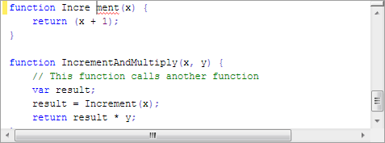

# Squiggle Lines

There is a built-in adornment layer that can render squiggle lines.  Squiggle lines are generally displayed under parse errors or spelling mistakes.

A built-in tagger can also be installed to watch for errors in the parse data returned by a parser, and automatically render squiggle lines based on those ranges.

## Squiggle Lines Adornment Layer

The built-in squiggle lines [adornment layer](adornment-layers.md) uses a [tag aggregator](../../text-parsing/tagging/tag-aggregators.md) for the [ISquiggleTag](xref:ActiproSoftware.Text.Tagging.ISquiggleTag) type.  When a [tagger](../../text-parsing/tagging/taggers.md) is applied to a document via a [tagger provider language service](../../language-creation/provider-services/tagger-provider.md), the [ISquiggleTag](xref:ActiproSoftware.Text.Tagging.ISquiggleTag) ranges that it returns are rendered as squiggle lines in text views.

*Squiggle lines showing a syntax error*

The [ISquiggleTag](xref:ActiproSoftware.Text.Tagging.ISquiggleTag) interface has a [ClassificationType](xref:ActiproSoftware.Text.Tagging.ISquiggleTag.ClassificationType) property that allows an [IClassificationType](xref:ActiproSoftware.Text.IClassificationType) to be set.  When left null, the squiggle line will be rendered in red.  If the classification type has a [highlighting style](../styles/highlighting-styles.md) mapped to it via the ambient [highlighting style registry](../styles/highlighting-style-registries.md), the foreground of the style will be used to render the squiggle line.

## Automated Squiggle Lines for Parse Errors

If you are using a [parser](../../text-parsing/parsing/index.md) your language, it will return resulting parse data to the [ICodeDocument](xref:ActiproSoftware.Text.ICodeDocument).[ParseData](xref:ActiproSoftware.Text.ICodeDocument.ParseData) property.  If the parse data object implements the [IParseErrorProvider](xref:ActiproSoftware.Text.Parsing.IParseErrorProvider) interface then parse errors can be retrieved from it.

There is a built-in tagger called [ParseErrorTagger](xref:ActiproSoftware.Text.Tagging.Implementation.ParseErrorTagger) that can be attached to a document via a document-oriented tagger provider service.  See the [Tagger Provider](../../language-creation/provider-services/tagger-provider.md) topic for details on making tagger provider services.

When this parse error tagger is attached to a document, it will monitor the document's parse data for changes.  If the parse data is updated, it will automatically get the list of parse errors from it (assuming the parse data implements [IParseErrorProvider](xref:ActiproSoftware.Text.Parsing.IParseErrorProvider)) and will return [ISquiggleTag](xref:ActiproSoftware.Text.Tagging.ISquiggleTag) tags for each one.  This automatically drives the squiggle line display when used in an editor.
