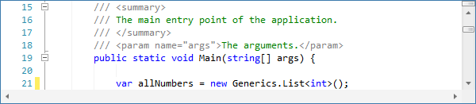

# Indentation Guides

Indentation guides are subtle vertical lines that render at each tab stop on lines prior to the first non-whitespace character.  Whitespace-only lines render indentation guides based on the tab stop level of surrounding text.

## Activating Indentation Guides

The [SyntaxEditor](xref:@ActiproUIRoot.Controls.SyntaxEditor.SyntaxEditor).[AreIndentationGuidesVisible](xref:@ActiproUIRoot.Controls.SyntaxEditor.SyntaxEditor.AreIndentationGuidesVisible) property can be set to `true` to activate indentation guides.  Guides are not visible by default.

## Changing the Indentation Guide Brush

The brush used to render the indentation guides can be adjusted by the end user since it is exposed via a special classification type's style in the highlighting style registry.

See the "Special Classification Types" section in the [Highlighting Style Registries](../styles/highlighting-style-registries.md) topic for more information on how to modify the style.
